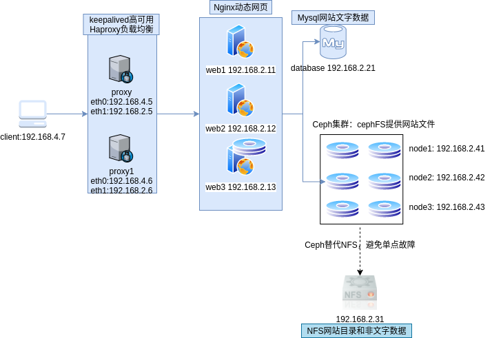

# Ceph



[toc]

## 环境准备

1. 准备ceph的yum相关软件源，用于yum安装。包含OSD，MON ，Tools
2. 关闭系统的selinux和防火墙
3. 选择部署节点，该节点支持SSH免密操作其他主机(之后会安装ceph-deploy工具)

```shell
# 修改/etc/hosts，拷贝到集群其他主机
IP	主机名

# 生成ssh密钥对
ssh-keygen -f /root/.ssh/id_rsa -N ''
# 拷贝密钥到其他设备
]# for i in {41..43}
> do
> ssh-copy-id 192.168.2.$i
> done
```

4. 在集群节点安装软件包

```shell
yum install -y ceph-mon ceph-osd ceph-mds ceph-radosgw
```

5. 时间同步

```shell
# ntp服务和客户端均要安装chrony软件
# ntp服务器端配置
]# vim /etc/chrony.conf 
allow 192.168.2.0/24    # 授权192.168.2.0/24可以时钟同步
local stratum 10   # 即使没有从一个源同步时钟，也为其他主机提供时间

# ntp客户端配置
]# vim /etc/chrony.conf  # 只改第7行
server 192.168.2.41 iburst   # 替换gateway

# 验证
]# chronyc sources -v
... ...
^* node1                      10   6    17    40  -4385ns[-1241us] +/-  162us
```

## ceph-deploy部署集群

### 集群初始化

```shell
# 安装ceph-deploy部署工具
]# yum install -y ceph-deploy

# 创建ceph-deploy工作目录
]# mkdir ceph-cluster

# 创建一个新的集群
]# ceph-deploy new node{1..3}
]# ls
ceph.conf  ceph-deploy-ceph.log  ceph.mon.keyring
]# tree .
.
├── ceph.conf               # 集群配置文件
├── ceph-deploy-ceph.log    # 日志文件
└── ceph.mon.keyring        # 共享密钥

# 开启COW分层快照功能。COW：Copy On Write写时复制
]# vim ceph.conf   # 尾部追加一行如下
rbd_default_features = 1
```

### 初始化MON

```shell
]# ceph-deploy mon create-initial

# 客户端检查mon服务状态
]# systemctl status ceph-mon*
# 注意：这些服务在30分钟之内只能启动3次，超过报错。
```

### 创建OSD

```shell
# 初始化各主机的硬盘。vmware应该是sdb和sdc
]# cepy-deploy disk zap node1:vd{b,c}
...
# 创建存储空间。ceph会硬盘分为两个分区，第一个分区大小为5GB，用于保存ceph的内部资源；另一个分区是剩余全部空间
]# cepy-deploy osd create node1:vd{b,c}
...
# 将会出现2个osd进程，因为有两块硬盘用于ceph
]# systemctl status ceph-osd*
```

### ceph-fs

#### 启用mds

```shell
# 配置MDS,可部署所有机器
]# cepy-deploy mds create 主机名
]# systemctl status ceph-osd*

# 1. 新建一个名为data1的存储池，目的是存储数据，有100个PG
]# cepy osd pool create data1 100
# 2. 新建一个名为matadata1的存储池，目的是存储元数据
]# ceph osd pool create metadata1 100
# 3. 创建名为myfs1的cephfs，数据保存到data1中，元数据保存到metadata1中
]# ceph fs new myfs1 metadata1 data1

# 查看存储池
]# ceph osd lspools 
0 rbd,1 data1,2 metadata1,
]# ceph df
GLOBAL:
    SIZE       AVAIL      RAW USED     %RAW USED 
    92093M     91574M         519M          0.56 
POOLS:
    NAME          ID     USED       %USED     MAX AVAIL     OBJECTS 
    rbd           0      86469k      0.28        30488M        2606 
    data1         1           0         0        30488M           0 
    metadata1     2        2068         0        30488M          20
    
# 30G最大可用空间是因为本例中最大磁盘空间90G，ceph默认三副本，所以最大可用为30G   
```

#### 挂载ceph fs

```shell
# 1. 配置各web服务器的yum，安装ceph客户端软件
]# yum install -y ceph-common libcephfs1

# 2. 部署端查看连接ceph的用户名和密码
]# cat /etc/ceph/ceph.client.admin.keyring 
[client.admin]
	key = AQAah95hfWQFOhAAg3hcQ2FtFuCYB1lRKJMCLQ==
	
# 3. 挂载ceph fs
手动挂载格式如下：
]# mount -t ceph 192.168.2.41:6789,192.168.2.42:6789,192.168.2.43:6789:/ 
/usr/local/nginx/html -o name=admin,secret=AQAah95hfWQFOhAAg3hcQ2FtFuCYB1lRKJMCLQ==

开机自动挂载格式如下：
]# vim /etc/fstab   # 注意以下是一行
192.168.2.41:6789,192.168.2.42:6789,192.168.2.43:6789:/ /usr/local/nginx/html  ceph   defaults,_netdev,name=admin,secret=AQAah95hfWQFOhAAg3hcQ2FtFuCYB1lRKJMCLQ==  0  0
]# mount -a
]# df -h
```

