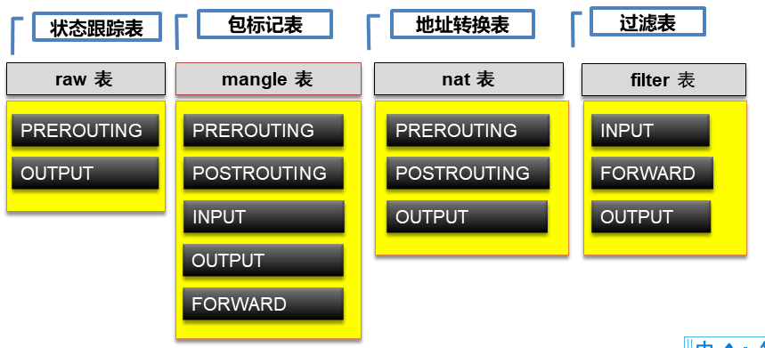
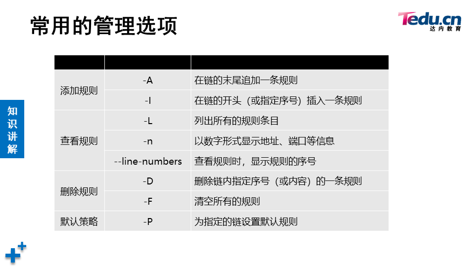
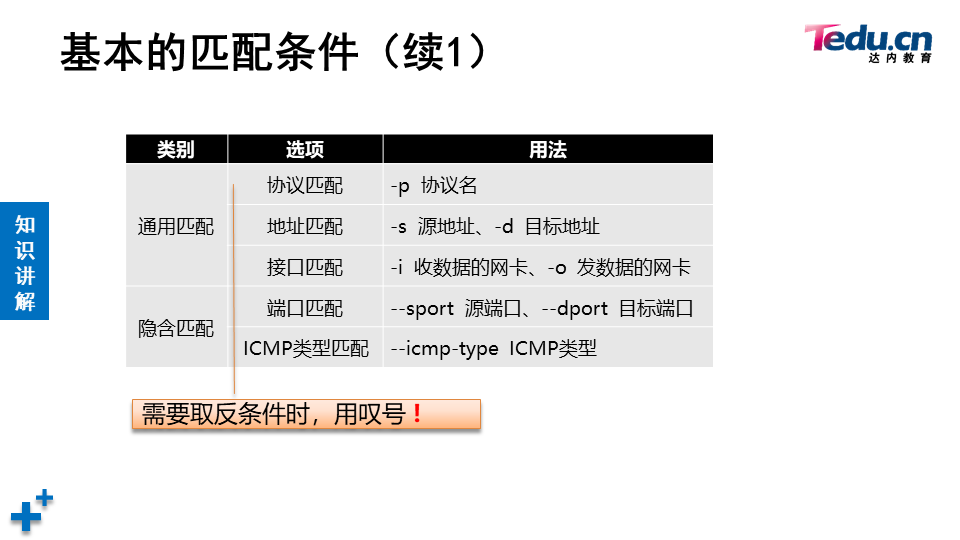
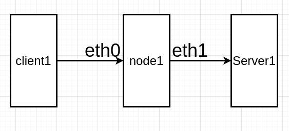
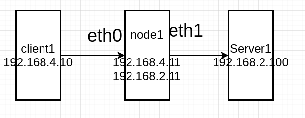
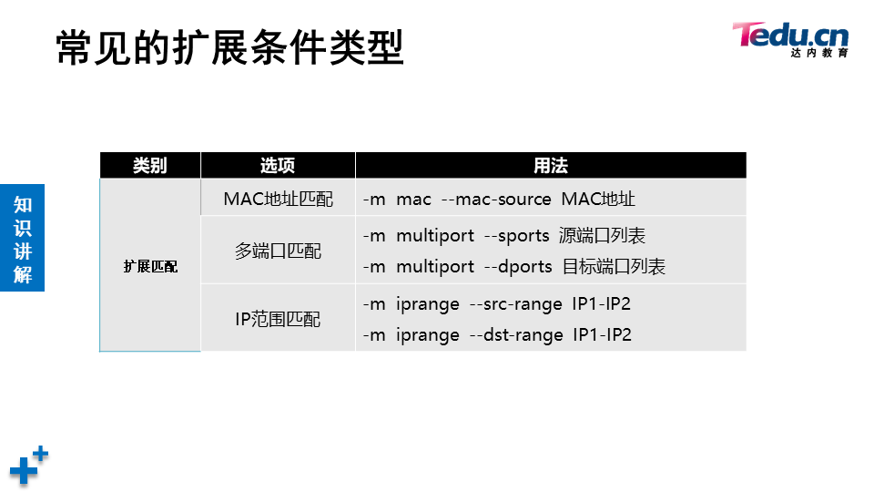
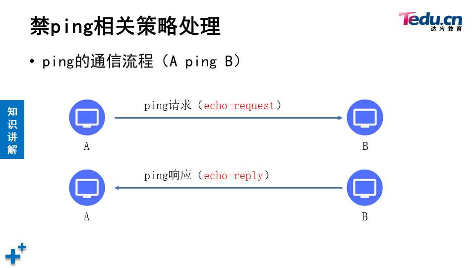
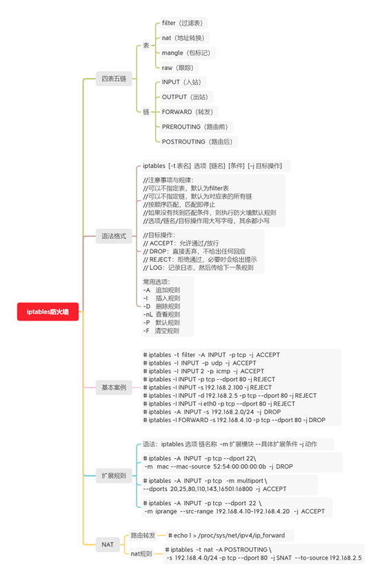

# IPTABLES

- 四表五链



重点关注nat表和filter表。filter表是默认的表，它实现防火墙，也就是包过滤的功能。nat表实现网络地址转换。

[TOC]


## 装包

```shell
# 关闭firewalld
]# systemctl stop firewalld
]# systemctl disable firewalld

# 安装iptables
]# yum install -y iptables-services.x86_64
```

## Filter表

- 配置iptables时，不指定表，就是使用filter表
- 配置时不指定规则链，则配置所有链
- 可以向规则链中加入很多规则，数据包进入该链时，从上向下匹配，一旦匹配就停止，开始应用规则。如果全都不匹配，则应用默认规则
- 命令选项、链名、目标操作使用大写字母，其他小写
- filter中的三条链
  - INPUT：数据包的目标地址是自己，则进入INPUT链
  - OUTPUT:数据包的源地址是自己，则进入OUTPUT链
  - FORWARD：数据包穿过自己，则进入FORWARD链

## iptables操作

```shell
# 查看filter表中的规则。-t指定表名
[root@node1 ~]# iptables -t filter -L   # 所有规则链都是空的
Chain INPUT (policy ACCEPT)   # INPUT链默认规则是接受
target     prot opt source               destination         

Chain FORWARD (policy ACCEPT)   # FORWARD链默认规则是接受
target     prot opt source               destination         

Chain OUTPUT (policy ACCEPT)   # OUTPUT链默认规则是接受
target     prot opt source               destination         

[root@node1 ~]# iptables -L   # 不指定表名，默认操作filter表
Chain INPUT (policy ACCEPT)
target     prot opt source               destination         

Chain FORWARD (policy ACCEPT)
target     prot opt source               destination         

Chain OUTPUT (policy ACCEPT)
target     prot opt source               destination 


# 起动服务时，iptables将会出现一些默认规则
[root@node1 ~]# systemctl start iptables.service 
[root@node1 ~]# iptables -L

# 默认规则往往不合我们的要求，可以先将所有的规则清空
[root@node1 ~]# iptables -F
```

### iptables的语法

```shell
iptables [-t 表名] 选项 [链名] [条件] [-j 满足条件的操作]
```





### 示例



- client1：eth0 -> 192.168.4.10/24 网关：192.168.4.11
- node1：eth0 -> 192.168.4.11/24，eth1 -> 192.168.2.11/24
- server1：eth1 -> 192.168.2.100/24 网关：192.168.2.11

```shell
1. 修改默认规则
# 将INPUT链的默认规则改为DROP丢弃。-P设置默认规则
node1 ~]# iptables -P INPUT DROP
# 注意：该设置后，node1机器无法远程。因为所有入站信息均会DROP。建议先执行下面这条命令
2. 追加规则
# 向INPUT链追加规则，192.168.4.254发来的包全部接受
node1 ~]# iptables -A INPUT -s 192.168.4.254 -j ACCEPT
# 允许192.168.4.0网络的主机ssh连接node1
node1 ~]# iptables -I INPUT 1 -s 192.168.4.0/24 -p tcp --dport 22 -j ACCEPT
# -I是插入到INPUT链的第1个位置(-I不指定位置，默认插到最上面)。-p指定协议，--dport指定目标端口号。-j是执行的操作
3. 查看规则
node1 ~]# iptables -nL INPUT --line-numbers 
# n是指用数字来表示端口号、主机等
# --line-numbers 查看规则的行号
4. 删除规则
node1 ~]# iptables -D INPUT 4
# 删除第4条规则
5. 保存规则
node1 ~]# service iptables save

```

### FORWARD链



```shell
1. 中间node1节点开启路由转发功能
]# sysctl -a | grep ip_forward
net.ipv4.ip_forward = 1
net.ipv4.ip_forward_use_pmtu = 0
sysctl: reading key "net.ipv6.conf.all.stable_secret"
sysctl: reading key "net.ipv6.conf.default.stable_secret"
sysctl: reading key "net.ipv6.conf.eth0.stable_secret"
sysctl: reading key "net.ipv6.conf.eth1.stable_secret"
sysctl: reading key "net.ipv6.conf.eth2.stable_secret"
sysctl: reading key "net.ipv6.conf.eth3.stable_secret"
sysctl: reading key "net.ipv6.conf.lo.stable_secret"
]# echo 'net.ipv4.ip_forward = 1' >> /etc/sysctl.conf
]# sysctl -p
# client和server已经可以通信
[root@client1 ~]# ping -c2 192.168.2.100
# 默认拒绝所有数据包通过，此时client1和server1完全不通
[root@node1 ~]# iptables -P FORWARD DROP

# 源地址是192.168.2.0/24，目标地址是192.168.4.0/24的包，放行
[root@node1 ~]# iptables -A FORWARD -s 192.168.2.0/24 -d 192.168.4.0/24 -j ACCEPT

# 从client1到server1，允许icmp
[root@node1 ~]# iptables -A FORWARD -s 192.168.4.0/24 -d 192.168.2.0/24 -p icmp -j ACCEPT

# client1和server1已经可以ping通了
[root@client1 ~]# ping -c2 192.168.2.100
```

### 扩展模块



```shell
-m 扩展模块 --扩展条件 条件值
1. multiport多端口
]# iptables -A FORWARD -p tcp -m multiport --dports 22,80,443,100:120 -s 192.168.4.0/24 -j ACCEPT

2. iprange地址范围
]# iptables -I FORWARD -m iprange --src-range 192.168.4.10-192.168.4.20 --dst-range 192.168.2.50-192.168.2.150 -j REJECT

3. mac地址
]# iptables  -A  INPUT  -p tcp --dport 22 -m   mac --mac-source  52:54:00:00:00:0b  -j  DROP

```

### 禁ping策略



```shell
# 禁止其他主机ping本机，允许本机ping其他主机
]# iptables  -A  INPUT  -p icmp --icmp-type echo-request  -j  DROP
#仅禁止入站的ping请求，不拒绝入站的ping回应包

# 查看关于ICMP的类型
]# iptables -p icmp --help
```


### NAT

- NAT：网络地址翻译、网络地址转换
- NAT技术产生，主要是解决IPV4地址不够用。
- NAT一般用于将私有地址转成全球唯一的公有地址。
- 私有地址：
  - A类：10.x.x.x
  - B类：172.16.x.x-172.31.x.x
  - C类：192.168.x.x
- 私有地址，如果需要访问互联网中的公有地址，进行上网，可以通过NAT技术，将私有地址转成公有地址，再访问外界
- 互联网环境下，运营商不允许私有地址出现在互联网上，发现有这样的数据，就直接丢弃。所以，私有地址发往互联网时，需要用NAT转换成公有地址，也叫合法地址。

#### SNAT

Source Network Address Translation，修改数据包的源地址，仅用于nat表的POSTROUTING链

```shell
# 确保路由主机开启了路由转发功能
]# iptables  -t  nat  -A POSTROUTING -s  192.168.4.0/24 -p tcp --dport 80  -j SNAT  --to-source 192.168.2.5

# 对于路由主机外网IP不固定的情况可以执行下面的地址伪装，动态伪装IP
]# iptables -t nat -A POSTROUTING -s 192.168.4.0/24 -j MASQUERADE
# 在我们的练习环境下，在node1上配置NAT，当client1访问server1时，将client1的地址转换成server1的192.168.2.x再发给server1。因为数据包的源地址改变了，所以叫SNAT，S即Source。
```

