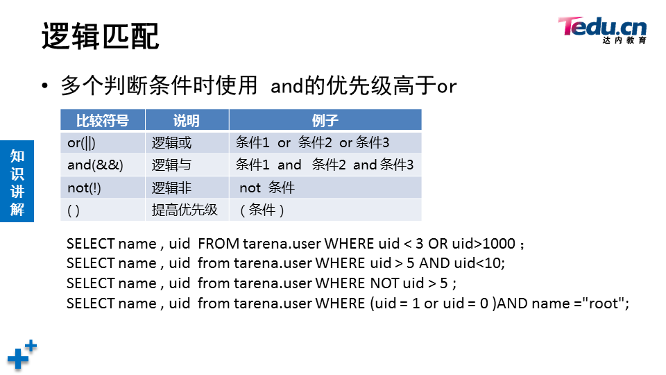

# 数据库

[toc]


## 介绍


**mysql是关系型数据库系统**

## 安装&初始化MYSQL

```shell
[root@localhost ~]# systemctl start mysqld
[root@localhost ~]# ls /var/lib/mysql   	# 数据库目录
auto.cnf         ib_buffer_pool  mysql               public_key.pem
ca-key.pem       ibdata1         mysql.sock          server-cert.pem
ca.pem           ib_logfile0     mysql.sock.lock     server-key.pem
client-cert.pem  ib_logfile1     performance_schema  sys
client-key.pem   ibtmp1          private_key.pem
[root@localhost ~]# systemctl enable mysqld
[root@localhost ~]# netstat -antpu | grep mysql
tcp6       0      0 :::3306                 :::*                    LISTEN      1491/mysqld
[root@localhost ~]# ls /var/log/mysqld.log  # 数据库日志
/var/log/mysqld.log
[root@localhost ~]# grep -i "password" /var/log/mysqld.log  	# 初始密码
2022-02-07T02:15:50.241310Z 1 [Note] A temporary password is generated for root@localhost: rzqi-qti8qR3
[root@localhost ~]# mysql -hlocalhost -uroot -p'rzqi-qti8qR3'	# 使用初始密码登录
```

```mysql
# 首次使用必须reset密码
mysql> show databases;
ERROR 1820 (HY000): You must reset your password using ALTER USER statement before executing this statement.
# alter user是在登录mysql后修改
mysql> alter user root@"localhost" identified by "123qqq...A";
Query OK, 0 rows affected (0.00 sec)
[root@localhost ~]# mysql -hlocalhost -uroot -p123qqq...A	# 访问本机数据库时-h可以省略

```

```mysql
mysql> select version();
+-----------+
| version() |
+-----------+
| 5.7.17    |
+-----------+
1 row in set (0.00 sec)

mysql> select user();
+----------------+
| user()         |
+----------------+
| root@localhost |
+----------------+
1 row in set (0.00 sec)

mysql> select database();
+------------+
| database() |
+------------+
| sys        |
+------------+
1 row in set (0.00 sec)

mysql> use mysql
Reading table information for completion of table and column names
You can turn off this feature to get a quicker startup with -A

Database changed
mysql> select database();
+------------+
| database() |
+------------+
| mysql      |
+------------+
1 row in set (0.00 sec)

mysql> show tables;
+---------------------------+
| Tables_in_mysql           |
+---------------------------+
| columns_priv              |
| db                        |
| engine_cost               |
...
```


## 修改密码策略&重置密码


```mysql
mysql> show variables like "%password%";
+---------------------------------------+--------+
| Variable_name                         | Value  |
+---------------------------------------+--------+
| default_password_lifetime             | 0      |
| disconnect_on_expired_password        | ON     |
| log_builtin_as_identified_by_password | OFF    |
| mysql_native_password_proxy_users     | OFF    |
| old_passwords                         | 0      |
| report_password                       |        |
| sha256_password_proxy_users           | OFF    |
| validate_password_check_user_name     | OFF    |
| validate_password_dictionary_file     |        |
| validate_password_length              | 8      |
| validate_password_mixed_case_count    | 1      |
| validate_password_number_count        | 1      |
| validate_password_policy              | MEDIUM |
| validate_password_special_char_count  | 1      |
+---------------------------------------+--------+
14 rows in set (0.00 sec)

mysql> set global validate_password_policy=0;
Query OK, 0 rows affected (0.00 sec)

mysql> show variables like "%password%";
+---------------------------------------+-------+
| Variable_name                         | Value |
+---------------------------------------+-------+
| default_password_lifetime             | 0     |
| disconnect_on_expired_password        | ON    |
| log_builtin_as_identified_by_password | OFF   |
| mysql_native_password_proxy_users     | OFF   |
| old_passwords                         | 0     |
| report_password                       |       |
| sha256_password_proxy_users           | OFF   |
| validate_password_check_user_name     | OFF   |
| validate_password_dictionary_file     |       |
| validate_password_length              | 8     |
| validate_password_mixed_case_count    | 1     |
| validate_password_number_count        | 1     |
| validate_password_policy              | LOW   |
| validate_password_special_char_count  | 1     |
+---------------------------------------+-------+
14 rows in set (0.00 sec)

mysql> set global validate_password_length=6;
Query OK, 0 rows affected (0.00 sec)

mysql> show variables like "%password%"
    -> ;
+---------------------------------------+-------+
| Variable_name                         | Value |
+---------------------------------------+-------+
| default_password_lifetime             | 0     |
| disconnect_on_expired_password        | ON    |
| log_builtin_as_identified_by_password | OFF   |
| mysql_native_password_proxy_users     | OFF   |
| old_passwords                         | 0     |
| report_password                       |       |
| sha256_password_proxy_users           | OFF   |
| validate_password_check_user_name     | OFF   |
| validate_password_dictionary_file     |       |
| validate_password_length              | 6     |
| validate_password_mixed_case_count    | 1     |
| validate_password_number_count        | 1     |
| validate_password_policy              | LOW   |
| validate_password_special_char_count  | 1     |
+---------------------------------------+-------+
14 rows in set (0.00 sec)

mysql> alter user root@"localhost" identified by "123456";
Query OK, 0 rows affected (0.00 sec)

```

```shell
# 永久配置
[root@50mysql ~]# vim /etc/my.cnf
[mysqld]
validate_password_length=6
validate_password_policy=0

[root@50mysql ~]# systemctl restart mysqld
[root@50mysql ~]# mysql -uroot -p123456
```

## 破解密码

1. 需要重启数据库，适合线下数据库服务器

```shell
[root@50mysql ~]# vim /etc/my.cnf
[mysqld]
skip-grant-tables	# 跳过授权库MySQL库启动服务 作用连接服务不需要输入密码
#validate_password_length=6
#validate_password_policy=0
[root@50mysql ~]# systemctl restart mysqld
[root@50mysql ~]# mysql  # 不输入密码就可以登陆
mysql> update  mysql.user set authentication_string=password("123qqq...A") 
where user="root" and host="localhost";  修改管理员root 本机登陆密码为  123qqq...A
mysql> flush privileges; 确保修改生效
mysql> exit; 断开连接
[root@50mysql ~]# vim /etc/my.cnf  还原修改
[mysqld]
validate_password_policy=0
validate_password_length=6
#skip-grant-tables
:wq
[root@50mysql ~]# systemctl  restart mysqld 重启服务 
[root@50mysql ~]# mysql -hlocalhost -uroot -p123qqq...A 使用恢复的密码登陆
```

2. 破解线上数据库服务器管理员root 密码

```shell
# 因为/var/lib/mysql/mysql库存放的是 数据库服务器的用户和密码，所以可以拷贝其他数据库服务器的mysql库，覆盖本机的mysql库
[root@50mysql ~]# scp -r 192.168.4.51:/var/lib/mysql/mysql /var/lib/mysql
# 查看mysql服务 父进程的pid
[root@50mysql ~]# pstree -p | grep mysqld | head -1
           |-mysqld(2711)-+-{mysqld}(2712)
# 给mysql服务的父进程发送 SIGHUP信息 (作用重新加载数据库目录下的文件 ，可以重新识别 mysql库里的用户和密码)
[root@50mysql ~]# kill -SIGHUP 2711
```

3. 修改root密码

```shell
# 1.使用alter user 修改 ：数据库管理员连接服务后 修改自己的登陆密码
# 2.mysqladmin修改 （操作系统管理员 修改本机数据库服务的登陆密码）
[root@50mysql ~]# mysqladmin -uroot -pNSD2110...a password "tarena"
# 隐藏旧密码和新密码,根据提示输入密码
[root@50mysql ~]# mysqladmin -uroot -p password
Enter password: 
New password: 
Confirm new password: 
Warning: Since password will be sent to server in plain text, use ssl connection to ensure password safety.
```

## 图形化界面

> phpmyadmin

```shell
1. [root@50mysql ~]# yum -y install httpd php php-mysql
2. 解压拷贝phpmyadmin软件到/var/www/html目录
3. # 创建修改主配置文件
   [root@50mysql phpmyadmin]# cp config.sample.inc.php config.inc.php
   [root@50mysql phpmyadmin]# vim +17 config.inc.php  # 在''号里添加plj123
4. 浏览器打开http://192.168.4.50/phpmyadmin页面
```

## 语法规范


## SQL语句分类

SQL 中文意思  结构化查询语言


### 基础查询

- ### 查询命令格式

  1. select  字段名列表  from  库名.表名； #查看表里的所有行
  2. select  字段名列表  from  库名.表名  where   查询条件 ； #只查看与条件匹配的行

```mysql
mysql> select 5;	# 查看常量
+---+
| 5 |
+---+
| 5 |
+---+
1 row in set (0.00 sec)

mysql> select @@version;	# 查看mysql环境变量
+-----------+
| @@version |
+-----------+
| 5.7.17    |
+-----------+
1 row in set (0.00 sec)

mysql> select 3+2;	# 查看计算结果
+-----+
| 3+2 |
+-----+
|   5 |
+-----+
1 row in set (0.00 sec)

mysql> select count(*) from mysql.user;	# 查询时使用函数
+----------+
| count(*) |
+----------+
|        2 |
+----------+
1 row in set (0.00 sec)

mysql> select 5*5 as 计算结果; # 对查询结果定义表头
+--------------+
| 计算结果     |
+--------------+
|           25 |
+--------------+
1 row in set (0.00 sec)

mysql> select "里斯" as 姓名;
+--------+
| 姓名   |
+--------+
| 里斯   |
+--------+
1 row in set (0.00 sec)
```

```shell
导入数据库
[root@50mysql ~]# mysql -uroot -ptarena < tarena.sql
```

- 查询条件

| command    | descritpion | example                                                      |
| :--------- | :---------- | :----------------------------------------------------------- |
| as 或 空格 | 别名        | select name 用户名, homedir as 家目录 from tarena.user;      |
| concat()   | 拼接        | select concat(id,"*",name,"-",homedir,"--",shell) from tarena.user;<br />**任意字段为NULL返回值为NULL** |
| distinct   | 去重        | select distinct gid from tarena.user;                        |

- 数值比较

  **符号两边必须是数据类型**

| 比较符号 | 说明       |
| -------- | ---------- |
| =        | 相等       |
| >        | 大于       |
| >=       | 大于或等于 |
| <        | 小于       |
| <=       | 小于或等于 |
| !=       | 不相等     |

select * from tarena.user where uid >3;





### 建库

#### 语法

> **仅可以使用数字、字母、下划线、不能纯数字**

> **区分字母大小写**

> **具有唯一性，不可使用指令关键字、特殊字符**

```mysql
CREATE DATABASE IF NOT EXISTS GAME;
DROP DATABASE IF EXISTS GAME;
```


### 建表

#### 语法

```mysql
create  table  库名.表名(
表头名1  数据类型, 
表头名2  数据类型，
表头名3  数据类型，
表头名4  数据类型
);

CREATE TABLE studb.stuinfo(id int,name char(10),age int,grade char(10));
INSERT INTO studb.stuinfo VALUES (1,"Tim",18,"dayi"),(2,"Jarry",25,"dayi"),(3,"Tom",33,"shuoshi"),(4,"Lily",6,"xiaoxue");
```


### 修改表

#### 语法

**mysql> ALTER TABLE 库.表 操作命令；**

| command | description                                                  |
| ------- | ------------------------------------------------------------ |
| ADD     | 添加新的表头，同时添加多个使用逗号分隔，FIRST/AFTER用于指定添加的位置 |
| MODIFY  | 修改表头的类型和约束条件，也可以修改表头的位置               |
| DROP    | 删除指定的表头，同时删除多个使用逗号分隔                     |
| CHANGE  | 修改表头名，也可以同时修改表头类型和约束条件                 |
| RENAME  | 修改表名                                                     |

```mysql
命令格式： alter  table  库名.表名   操作命令；

ALTER TABLE studb.stuinfo ADD class char(7), ADD mail char(20);
ALTER TABLE studb.stuinfo ADD 学号 int FIRST;
ALTER TABLE studb.stuinfo ADD 住址 char(50) AFTER name;
ALTER TABLE studb.stuinfo DROP grade;
ALTER TABLE studb.stuinfo modify id char(10);
# not Null Default "tim@tedu.cn" 属于约束条件的修改
ALTER TABLE studb.stuinfo MODIFY mail varchar(20) not Null Default "tim@tedu.cn";SELECT name CASE
WHEN dept_name in ("开发部","测试部","运维部") THEN "技术部"
WHEN dept_name is null THEN "未设置"
ELSE "非技术部"
END AS "部门类型"
FROM tarena.departments;
# 调整表头的位置
ALTER TABLE studb.stuinfo MODIFY age int  AFTER name;
# 修改表头名为中文
ALTER TABLE studb.stuinfo CHANGE name 姓名 char(10);
# 修改表头名，同时修改约束条件
ALTER TABLE studb.stuinfo CHANGE 姓名 name char(20) not Null Default "Big hammer";
# 修改表名
ALTER TABLE studb.stuinfo RENAME studb.holyshit;
```

```mysql
# 表头和数据复制都复制，但原表的key不会复制给新表
# 命令格式	CREATE	TABLE 库.表 SELECT 列名 FROM 库.表 [WHERE 条件];
mysql> CREATE TABLE studb.部门表 SELECT * FROM tarena.departments;
# 仅仅复制表头，同时原表的key也会复制给新表
# 命令格式  CREATE  TABLE 库.表   LIKE  库.表;SELECT e.employee_id,name,basic,date,grade FROM employees AS e
INNER JOIN salary AS s ON e.employee_id=s.employee_id
INNER JOIN wage_grade AS g
ON low<basic<high
WHERE YEAR(date)=2018 AND MONTH(date)=12
mysql> CREATE TABLE studb.部门表2 like tarena.departments;
```


### 管理表记录

表头的标准术语：字段

对表中存储的行做管理 ，操作包括  **查看select   插入 insert into   更新 update  删除 delete**

#### 插入表记录

1. INSERT INTO 库名.表名 VALUES (值列表); //插入一行

   INSERT INTO 库名.表名 VALUES (值列表),(值列表); //插入多行

```mysql
mysql> INSERT INTO tarena.user VALUES(25,"tim","x",666,666,"test user","/home/tim","/bin/bash");
# 值的顺序必须和表中列的顺序一致，且数据类型要匹配
```

2. INSERT   INTO  库名.表名(列名列表)  VALUES (值列表);  //只插入1条记录

   NSERT   INTO  库名.表名(列名列表)  VALUES (值列表),(值列表);  //插入多条记录

```mysql
mysql> INSERT INTO tarena.user(name,uid) VALUES("john",888);
# 列和值的顺序要一致 ; 列名先后顺序不重要 ；没有赋值的列使用默认值、自增长结果赋值
```

3. 使用select 查询结果插入数据  

```mysql
mysql> INSERT INTO tarena.user (name) (SELECT name FROM tarena.user WHERE shell="/sbin/halt");
mysql> INSERT INTO tarena.user(name,password) (SELECT name,password FROM tarena.user WHERE id in (1,3));
# 注意：值的顺序必须和表中列的顺序一致，且数据类型要匹配
```

4. 使用SET命令赋值

   格式： mysql> insert into 库.表 set  字段名=值 , 字段名=值 , 字段名=值 ;

```mysql
mysql> INSERT INTO tarena.user SET name="techuichui",uid=668;
```


#### 删除表记录

1. DELETE FROM 库名.表名  WHERE 条件;  **仅删除与条件匹配的行**

```mysql
mysql> SELECT * FROM tarena.user WHERE shell is null;
mysql> DELETE FROM tarena.user WHERE shell is null;
```

2. DELETE FROM 库.表;	**清空表记录**
3. TRUNCAT TABLE 库.表； **清空表记录**

truncate 与 delete  删除记录的区别！！！

```
- TRUNCATE不支持WHERE条件
- 自增长列，TRUNCATE后从1开始；DELETE继续编号
- TRUNCATE不能回滚，DELETE可以
- 效率略高于DELETE
```


#### 更新表记录

1. UPDATE 库名.表名 SET 字段=值，字段=值 WHERE 条件;

   **仅修改与条件匹配的**

```mysql
mysql> UPDATE tarena.user SET comment="admin count", password="1" WHERE name="root";
mysql> UPDATE tarena.user SET password="x" WHERE name="xixi" or name="haha";
```

2. UPDATE 库名.表名 SET 字段=值，字段=值

   **批量修改**

```mysql
mysql> UPDATE tarena.user SET password="F";
```

## 查看修改库字符集

SHOW CREATE TABLE 库.表 \G

ALTER TABLE 库.表 DEFAULT CHARSET=字符集;

```mysql
mysql> SHOW CREATE TABLE studb.stuinfo\G
*************************** 1. row ***************************
       Table: stuinfo
Create Table: CREATE TABLE `stuinfo` (
  `学号` int(11) DEFAULT NULL,
  `name` char(20) DEFAULT NULL,
  `math` float DEFAULT NULL,
  `age` int(11) DEFAULT NULL,
  `address` char(50) DEFAULT NULL,
  `class` char(7) DEFAULT NULL,
  `mail` char(20) DEFAULT 'tim@qq.com'
) ENGINE=InnoDB DEFAULT CHARSET=latin1
1 row in set (0.00 sec)

mysql> ALTER TABLE studb.stuinfo DEFAULT CHARSET=utf8;
Query OK, 0 rows affected (0.03 sec)
Records: 0  Duplicates: 0  Warnings: 0

mysql> SHOW CREATE TABLE studb.stuinfo\G
*************************** 1. row ***************************
       Table: stuinfo
Create Table: CREATE TABLE `stuinfo` (
  `学号` int(11) DEFAULT NULL,
  `name` char(20) CHARACTER SET latin1 DEFAULT NULL,
  `math` float DEFAULT NULL,
  `age` int(11) DEFAULT NULL,
  `address` char(50) CHARACTER SET latin1 DEFAULT NULL,
  `class` char(7) CHARACTER SET latin1 DEFAULT NULL,
  `mail` char(20) CHARACTER SET latin1 DEFAULT 'tim@qq.com'
) ENGINE=InnoDB DEFAULT CHARSET=utf8
1 row in set (0.00 sec)

# 对于已经建好的表，即便修改了字符集，可能该字符也无法支持
```

```mysql
# 在创建表的时候，就指定好字符集
mysql> CREATE TABLE studb.stuinfo2(姓名 char(10),住址 char(20),职业 char(5)) DEFAULT CHARSET utf8;
```

## 数据类型

### 数值类型

一般用于计算的数据才需要设置为数值类型，比如电话号码就不需要设置为数值类型

#### 整型类型


#### 浮点类型


```mysql
mysql> CREATE TABLE studb.t3(姓名 char(10),年龄 tinyint unsigned,工资 float,圆周率 double,游戏级别 smallint);;
Query OK, 0 rows affected (0.41 sec)

mysql> DESC studb.t3;
+--------------+---------------------+------+-----+---------+-------+
| Field        | Type                | Null | Key | Default | Extra |
+--------------+---------------------+------+-----+---------+-------+
| 姓名         | char(10)            | YES  |     | NULL    |       |
| 年龄         | tinyint(3) unsigned | YES  |     | NULL    |       |
| 工资         | float               | YES  |     | NULL    |       |
| 圆周率       | double              | YES  |     | NULL    |       |
| 游戏级别     | smallint(6)         | YES  |     | NULL    |       |
+--------------+---------------------+------+-----+---------+-------+

mysql> INSERT INTO studb.t3(姓名,年龄,工资) VALUES("tom",20.5,88888);
Query OK, 1 row affected (0.04 sec)
# 整型字段存入小数会四舍五入，浮点型字段可以直接存入整型数据
mysql> SELECT * FROM studb.t3 WHERE 姓名="tom";
+--------+--------+--------+-----------+--------------+
| 姓名   | 年龄   | 工资   | 圆周率    | 游戏级别     |
+--------+--------+--------+-----------+--------------+
| tom    |     21 |  88888 |      NULL |         NULL |
+--------+--------+--------+-----------+--------------+

```


### 字符串类型

#### 枚举类型

 ENUM('*value1*','*value2*',...)

枚举类型。只能有一个值的字符串，从值列'*value1*'，'*value2*'，...，NULL中或特殊 ''错误值中选出。ENUM列最多可以有65,535个截然不同的值。ENUM值在内部用整数表示。

SET('*value1*','*value2*',...)

一个设置。字符串对象可以有零个或多个值，每个值必须来自列值'*value1*'，'*value2*'，...SET列最多可以有64个成员。SET值在内部用整数表示。

```mysql
mysql> CREATE TABLE studb.stuinfo3(姓名 char(20),爱好 SET("倒塔","篮球","游戏"),性别 ENUM("男","女")) DEFAULT CHARSET utf8;
Query OK, 0 rows affected (0.29 sec)

mysql> DESC studb.stuinfo3;
+--------+---------------------------------+------+-----+---------+-------+
| Field  | Type                            | Null | Key | Default | Extra |
+--------+---------------------------------+------+-----+---------+-------+
| 姓名   | char(20)                        | YES  |     | NULL    |       |
| 爱好   | set('倒塔','篮球','游戏')       | YES  |     | NULL    |       |
| 性别   | enum('男','女')                 | YES  |     | NULL    |       |
+--------+---------------------------------+------+-----+---------+-------+
3 rows in set (0.00 sec)

mysql> INSERT INTO studb.stuinfo3 VALUES("里斯","篮球,游戏","男");
mysql> SELECT * FROM studb.stuinfo3;
+--------+---------------+--------+
| 姓名   | 爱好          | 性别   |
+--------+---------------+--------+
| 里斯   | 篮球,游戏     | 男     |
+--------+---------------+--------+
1 row in set (0.00 sec)

mysql> INSERT INTO studb.stuinfo3 VALUES("芭比口","","女");
Query OK, 1 row affected (0.04 sec)
mysql> SELECT * FROM studb.stuinfo3;
+-----------+---------------+--------+
| 姓名      | 爱好          | 性别   |
+-----------+---------------+--------+
| 里斯      | 篮球,游戏     | 男     |
| 芭比口    |               | 女     |
+-----------+---------------+--------+
2 rows in set (0.00 sec)

```


#### 字符类型

##### 常用字符类型

| 类型              | 名称     | 说明                                                         |
| ----------------- | -------- | ------------------------------------------------------------ |
| char(字符个数)    | 定长类型 | 最多255个字符<br />不够指定字符个数时在右边用空格补全字符个数，超出时无法写入数据 |
| varchar(字符个数) | 变长类型 | 最多65532个字符<br />按数据实际大小分配存储空间，字符个数超出时无法写入数据 |

**注意：此处是以字符个数为单位，一个字母或者汉字都算作一个字符**

```mysql
mysql> CREATE TABLE studb.t4(姓名 varchar(10),班级 char(7),电话 char(11),邮箱 varchar(30))DEFAULT CHARSET utf8;
mysql> INSERT INTO studb.t4 VALUES("邓肯","高中","13408764523","duncan@tedu.cn");
Query OK, 1 row affected (0.04 sec)

mysql> SELECT * FROM studb.t4;
+--------+--------+-------------+----------------+
| 姓名   | 班级   | 电话        | 邮箱           |
+--------+--------+-------------+----------------+
| 邓肯   | 高中   | 13408764523 | duncan@tedu.cn |
+--------+--------+-------------+----------------+

```


##### 其他字符类型


### 日期时间类型

| 类型      | 名称     | 范围                                    | 赋值格式       |
| --------- | -------- | --------------------------------------- | -------------- |
| year      | 年       | 1901~2155                               | YYYY           |
| date      | 日期     | 0001-01-01~9999-12-31                   | YYYYMMDD       |
| time      | 时间     | 01:00:00-23:59:59                       | HHMMSS         |
| datetime  | 日期时间 | 0001-01-01 00:00:00~9999-12-31 23:59:59 | YYYYMMDDHHMMSS |
| timestamp | 日期时间 | 1970-01-01 00:00:00~2038-01-19 00:00:00 | YYYYMMDDHHMMSS |

- 当未给timestamp字段赋值时，**自动以当前系统时间赋值**。而datetime值为NULL
- datetime,timestamp存储范围不一样 （datetime存储范围大  timestamp范围小）
- 使用2位数给year的表头赋值也是可以的  但会自动补全4位数
  - 01-69  之间的数字使用20补全4位数的年 2001~2069
  - 0-99  之间的数字使用19补全4位数的年 1970~1999
- 可以使用时间函数给日期时间类型的字段赋值

```mysql
mysql> CREATE TABLE studb.t1(
    -> name char(10),s_year year,birthday date,work time,party datetime);
mysql> INSERT INTO studb.t1 VALUES( "tim",1998,19980807,090000,20220209093000);
mysql> SELECT * FROM studb.t1;
+------+--------+------------+----------+---------------------+
| name | s_year | birthday   | work     | party               |
+------+--------+------------+----------+---------------------+
| tim  |   1998 | 1998-08-07 | 09:00:00 | 2022-02-09 09:30:00 |
+------+--------+------------+----------+---------------------+

# 存入year类型数据超范围报错
mysql> INSERT INTO studb.t1(name,s_year) VALUES("xixi",1637);
ERROR 1264 (22003): Out of range value for column 's_year' at row 1

# year字段使用2位数赋值时：
mysql> INSERT INTO studb.t1(name,s_year) VALUES("haha",88),("dachui",05);
mysql> SELECT * FROM studb.t1 WHERE name in ("haha","dachui");
+--------+--------+----------+------+-------+
| name   | s_year | birthday | work | party |
+--------+--------+----------+------+-------+
| haha   |   1988 | NULL     | NULL | NULL  |
| dachui |   2005 | NULL     | NULL | NULL  |
+--------+--------+----------+------+-------+


mysql> CREATE TABLE studb.t2(meeting datetime, party timestamp);
mysql> INSERT INTO studb.t2 VALUES(20220209183000,20220210123000);
mysql> INSERT INTO studb.t2(meeting) VALUES(20180128175036);
mysql> INSERT INTO studb.t2(party) VALUES(20190211183000);
mysql> SELECT * FROM studb.t2;;
+---------------------+---------------------+
| meeting             | party               |
+---------------------+---------------------+
| 2022-02-09 18:30:00 | 2022-02-10 12:30:00 |  
| 2018-01-28 17:50:36 | 2022-02-09 10:13:23 |	# timstamp字段自动赋值当前时间
| NULL                | 2019-02-11 18:30:00 |	# datetime字段未赋值显示NULL
+---------------------+---------------------+


```

## 数据批量处理

### 搜索目录

```mysql
# 默认设置
mysql> SHOW VARIABLES LIKE "%file%";
...
| secure_file_priv                      | /var/lib/mysql-files/           |
...

# 修改搜索目录
# 1. 修改/etc/my.cnf 
	[mysqld]
	secure_file_priv="目录路径"
# 2. mkdir创建该路径，并且调整目录的所有者和所属组 chown mysql:mysql 目录路径
# 3. systemctl restart mysqld
```


### 数据导入

语法：

**mysql> LOAD DATA INFILE “/目录名/文件名” INTO TABLE 库.表 FIELDS TERMINATED BY "分隔符" LINES TERMINATED BY "\n";**

步骤：

1. 创建存储数据库（如果没有的话)
2. 建表 (根据导入文件的内容 创建 表头名  表头个数  表头数据类型  根据文件内容定义)
3. 把系统文件拷贝到检索目录下
4. 数据库管理执行导入数据的命令
5. 查看数据

```mysql
mysql> CREATE DATABASE IF NOT EXISTS studb;
mysql> CREATE TABLE studb.user(name char(50),password char(1),uid int,gid int,comment varchar(150),homedir varchar(100),shell char(30));
mysql> DESC studb.user;
+----------+--------------+------+-----+---------+-------+
| Field    | Type         | Null | Key | Default | Extra |
+----------+--------------+------+-----+---------+-------+
| name     | char(50)     | YES  |     | NULL    |       |
| password | char(1)      | YES  |     | NULL    |       |
| uid      | int(11)      | YES  |     | NULL    |       |
| gid      | int(11)      | YES  |     | NULL    |       |
| comment  | varchar(150) | YES  |     | NULL    |       |
| homedir  | varchar(100) | YES  |     | NULL    |       |
| shell    | char(30)     | YES  |     | NULL    |       |
+----------+--------------+------+-----+---------+-------+
mysql> system cp /passwd /myload/passwd	# mysql登录状态下执行系统命令
mysql> LOAD DATA INFILE "/myload/passwd" INTO TABLE studb.user FIELDS TERMINATED BY ":" LINES TERMINATED BY "\n";
```


### 数据导出

数据导出:根据**SELECT**命令的查询结果，把数据库表里的数据保存到系统文件里,注意导出的数据**不包括表头名，只有表里行**。存放导出数据的文件名，不需要事先创建,且具有唯一(**不能有同名文件存在**)

语法：

1. SELECT 字段名列表 FROM 库.表 WHERE 条件 INTO OUTFILE "/检索目录/文件名" ;
2. SELECT 字段名列表 FROM 库.表 WHERE 条件 INTO OUTFILE "/检索目录/文件名" FIELDS TERMINATED BY "符号" ;
3. SELECT 字段名列表 FROM 库.表 WHERE 条件 INTO OUTFILE "/检索目录/文件名" FIELDS TERMINATED BY "符号" LINES TERMINATED BY "符号" ;

```mysql
mysql> SELECT * FROM studb.user INTO OUTFILE "/myload/a.txt";
```

## 字段约束

### 约束分类

​	约束是一种限制，设置在字段上，用于控制字段的赋值

```
+----------+--------------+------+-----+---------+-------+
| Field    | Type         | Null | Key | Default | Extra |
+----------+--------------+------+-----+---------+-------+
```

	1. PRIMARY KEY 主键，用于保证该字段的值具有唯一性并且**非空**
	2. NOT NULL **非空**，用于保证该字段的值不能为空
	3. DEFAULT 默认值，用于保证该字段有默认值
	4. UNIQUE 唯一索引，用于保证该字段的值具有唯一性，**可以为空**
	5. FOREIGN KEY 外键，用于限制两个表的关系，用于保证该字段的值必须来自于主表的关联列的值，在从表添加外键约束，用于引用主表中某些的值

### 查看约束

```mysql
mysql> DESC studb.user;
```


### 基本约束

```mysql
# 1. NOT NUll
mysql> CREATE TABLE studb.t5(name char(10) not null, class char(20));
Query OK, 0 rows affected (0.38 sec)

mysql> DESC studb.t5;
+-------+----------+------+-----+---------+-------+
| Field | Type     | Null | Key | Default | Extra |
+-------+----------+------+-----+---------+-------+
| name  | char(10) | NO   |     | NULL    |       |
| class | char(20) | YES  |     | NULL    |       |
+-------+----------+------+-----+---------+-------+
2 rows in set (0.00 sec)

mysql> INSERT INTO studb.t5 VALUES(null,null);
ERROR 1048 (23000): Column 'name' cannot be null # name字段不可以为空
mysql> INSERT INTO studb.t5 VALUES("lisi",null);
Query OK, 1 row affected (0.04 sec)

mysql> SELECT * FROM studb.t5;
+------+-------+
| name | class |
+------+-------+
| lisi | NULL  |
+------+-------+
1 row in set (0.00 sec)

mysql> CREATE TABLE studb.t6(name char(10) not null,class char(7) DEFAULT "nsd2110",sex ENUM("M","W") not null DEFAULT "M");
Query OK, 0 rows affected (0.33 sec)
=============================================================================================
# 2. DEFAULT
mysql> DESC studb.t6;
+-------+---------------+------+-----+---------+-------+
| Field | Type          | Null | Key | Default | Extra |
+-------+---------------+------+-----+---------+-------+
| name  | char(10)      | NO   |     | NULL    |       |
| class | char(7)       | YES  |     | nsd2110 |       |
| sex   | enum('M','W') | NO   |     | M       |       |
+-------+---------------+------+-----+---------+-------+
3 rows in set (0.00 sec)

mysql> INSERT INTO studb.t6(name) VALUES("tim"); # class和sex使用DEFAULT默认值
Query OK, 1 row affected (0.06 sec)

mysql> SELECT * FROM studb.t6;
+------+---------+-----+
| name | class   | sex |
+------+---------+-----+
| tim  | nsd2110 | M   |
+------+---------+-----+
1 row in set (0.00 sec)

mysql> INSERT INTO studb.t6(name,class,sex) VALUES("xixi","2115","W");
# class和sex使用自定义的赋值
Query OK, 1 row affected (0.04 sec)

mysql> SELECT * FROM studb.t6;
+------+---------+-----+
| name | class   | sex |
+------+---------+-----+
| tim  | nsd2110 | M   |
| xixi | 2115    | W   |
+------+---------+-----+
2 rows in set (0.00 sec)

# 3. UNIQUE
mysql> CREATE TABLE studb.t7(id char(9) UNIQUE,name char(10),age tinyint UNSIGNED DEFAULT 21);
Query OK, 0 rows affected (0.30 sec)

mysql> DESC studb.t7;
+-------+---------------------+------+-----+---------+-------+
| Field | Type                | Null | Key | Default | Extra |
+-------+---------------------+------+-----+---------+-------+
| id    | char(9)             | YES  | UNI | NULL    |       |
| name  | char(10)            | YES  |     | NULL    |       |
| age   | tinyint(3) unsigned | YES  |     | 21      |       |
+-------+---------------------+------+-----+---------+-------+
3 rows in set (0.00 sec)

mysql> INSERT INTO studb.t7 VALUES("1","tim",29);
Query OK, 1 row affected (0.06 sec)

mysql> INSERT INTO studb.t7 VALUES("1","xixi",18);
ERROR 1062 (23000): Duplicate entry '1' for key 'id'
mysql> INSERT INTO studb.t7 VALUES("2","xixi",18);
Query OK, 1 row affected (0.03 sec)

mysql> INSERT INTO studb.t7(name,age) VALUES("haha",20);
Query OK, 1 row affected (0.03 sec)

mysql> SELECT * FROM studb.t7;
+------+------+------+
| id   | name | age  |
+------+------+------+
| 1    | tim  |   29 |
| 2    | xixi |   18 |
| NULL | haha |   20 |
+------+------+------+


```


### 主键

1. 字段值不允许重复，且不允许赋NULL值
2. 一个表中只能有一个primary  key字段
3. 多个字段都作为主键，称为复合主键，必须一起创建
4. 主键字段的标志是PRI
5. 主键通常与auto_increment  连用
6. 通常把表中唯一标识记录的字段设置为主键[记录编号字段]

- 创建主键

  1. CREATE TABLE 库.表(字段名列表,primary key(字段名));

  ```mysql
  mysql> CREATE TABLE studb.t8(id char(18),name char(10),PRIMARY KEY(id));
  Query OK, 0 rows affected (0.32 sec)
  
  mysql> DESC studb.t8;
  +-------+----------+------+-----+---------+-------+
  | Field | Type     | Null | Key | Default | Extra |
  +-------+----------+------+-----+---------+-------+
  | id    | char(18) | NO   | PRI | NULL    |       |
  | name  | char(10) | YES  |     | NULL    |       |
  +-------+----------+------+-----+---------+-------+
  2 rows in set (0.00 sec)
  
  mysql> INSERT INTO studb.t8 VALUES("123456","tim"),("123456","xixi");
  ERROR 1062 (23000): Duplicate entry '123456' for key 'PRIMARY'
  mysql> INSERT INTO studb.t8 VALUES("123456","tim"),("123456","xixi"),(null,"haha");
  ERROR 1062 (23000): Duplicate entry '123456' for key 'PRIMARY'
  mysql> INSERT INTO studb.t8 VALUES("123456","tim"),("1234567","xixi"),("12345678","haha");
  Query OK, 3 rows affected (0.02 sec)
  Records: 3  Duplicates: 0  Warnings: 0
  
  mysql> SELECT * FROM studb.t8;
  +----------+------+
  | id       | name |
  +----------+------+
  | 123456   | tim  |
  | 1234567  | xixi |
  | 12345678 | haha |
  +----------+------+
  ```

  

  2. dfdfd
  3. fdfdf

- 删除&添加

  语法

  > 删除：**ALTER TABLE 库.表 DROP PRIMARY KEY;**

  > 添加：**ALTER TABLE 库.表 ADD PRIMARY KEY(字段名列表);**

```mysql
mysql> ALTER TABLE studb.t8 DROP PRIMARY KEY;
mysql> DESC studb.t8;
+-------+----------+------+-----+---------+-------+
| Field | Type     | Null | Key | Default | Extra |
+-------+----------+------+-----+---------+-------+
| id    | char(18) | NO   |     | NULL    |       |
| name  | char(10) | YES  |     | NULL    |       |
+-------+----------+------+-----+---------+-------+

mysql> INSERT INTO studb.t8 VALUES("123456","lili");
Query OK, 1 row affected (0.07 sec)

mysql> SELECT * FROM studb.t8;
+----------+------+
| id       | name |
+----------+------+
| 123456   | tim  |
| 1234567  | xixi |
| 12345678 | haha |
| 123456   | lili |
+----------+------+

mysql> ALTER TABLE studb.t8 ADD PRIMARY KEY(id);
ERROR 1062 (23000): Duplicate entry '123456' for key 'PRIMARY'
mysql> UPDATE studb.t8 SET id="123456789" WHERE name="lili";
Query OK, 1 row affected (0.04 sec)
Rows matched: 1  Changed: 1  Warnings: 0

mysql> SELECT * FROM studb.t8;
+-----------+------+
| id        | name |
+-----------+------+
| 123456    | tim  |
| 1234567   | xixi |
| 12345678  | haha |
| 123456789 | lili |
+-----------+------+
4 rows in set (0.00 sec)

mysql> ALTER TABLE studb.t8 ADD PRIMARY KEY(id);
Query OK, 0 rows affected (0.49 sec)
Records: 0  Duplicates: 0  Warnings: 0

mysql> DESC studb.t8;
+-------+----------+------+-----+---------+-------+
| Field | Type     | Null | Key | Default | Extra |
+-------+----------+------+-----+---------+-------+
| id    | char(18) | NO   | PRI | NULL    |       |
| name  | char(10) | YES  |     | NULL    |       |
+-------+----------+------+-----+---------+-------+
2 rows in set (0.00 sec)

# 添加主键时，对应的字段需要满足PRIMARY KEY的条件(没有null空值，且值没有重复的)
```

- 创建复合主键

  - 多个字段一起做主键
  - 复合主键的值只要不同时重复即可

  ```mysql
  mysql> CREATE TABLE studb.t9(ip char(12),port char(5),status enum("deny","allow"),PRIMARY KEY(ip,port));
  Query OK, 0 rows affected (0.15 sec)
  
  mysql> DESC studb.t9;
  +--------+----------------------+------+-----+---------+-------+
  | Field  | Type                 | Null | Key | Default | Extra |
  +--------+----------------------+------+-----+---------+-------+
  | ip     | char(12)             | NO   | PRI | NULL    |       |
  | port   | char(5)              | NO   | PRI | NULL    |       |
  | status | enum('deny','allow') | YES  |     | NULL    |       |
  +--------+----------------------+------+-----+---------+-------+
  # 复合主键的添加、删除方法与单个主键的一致
  mysql> ALTER TABLE studb.t9 DROP PRIMARY KEY;
  mysql> ALTER TABLE studb.t9 ADD PRIMARY KEY(ip,port);
  ```

- 主键与auto_increment连用

  > 表头的数值类型必须是数据类型，且必须是主键

  ```mysql
  mysql> CREATE TABLE studb.t10(id int auto_increment,name char(10),age int,class char(7),score float,PRIMARY KEY(id));
  Query OK, 0 rows affected (0.99 sec)
  
  mysql> DESC studb.t10;;
  +-------+----------+------+-----+---------+----------------+
  | Field | Type     | Null | Key | Default | Extra          |
  +-------+----------+------+-----+---------+----------------+
  | id    | int(11)  | NO   | PRI | NULL    | auto_increment |
  | name  | char(10) | YES  |     | NULL    |                |
  | age   | int(11)  | YES  |     | NULL    |                |
  | class | char(7)  | YES  |     | NULL    |                |
  | score | float    | YES  |     | NULL    |                |
  +-------+----------+------+-----+---------+----------------+
  
  # 插入数据时没有给id赋值，实现id数值自增1
  mysql> INSERT INTO studb.t10(name,age,class,score) VALUES("tim",10,"nsd2110",99.9);
  Query OK, 1 row affected (0.03 sec)
  
  mysql> SELECT * FROM studb.t10;
  +----+------+------+---------+-------+
  | id | name | age  | class   | score |
  +----+------+------+---------+-------+
  |  1 | tim  |   10 | nsd2110 |  99.9 |
  +----+------+------+---------+-------+
  1 row in set (0.00 sec)
  
  ```

  

### 外键

- 作用：插入记录时，字段值在另一个表字段值范围内选择

- 规则：

  1. 表存储引擎必须是innodb
  2. 字段类型要一致
  3. 被参照字段必须要是索引类型的一种(通常是 primary key)

- 创建外键语法：

  ```mysql
  CREATE TABLE 库.表(字段列表, 
  FOREIGN KEY(字段名)   #指定外键
  REFERENCES 库.表(字段名)   #指定参考的表头名
  ON UPDATE CASCADE   #同步更新
  ON DELETE CASCADE  	#同步删除
  )ENGINE=INNODB;		#指定存储引擎
  
  # 1. 创建被REFERENCES的表
  mysql> CREATE TABLE studb.yg_tab(yg_id int PRIMARY KEY AUTO_INCREMENT,name char(10))ENGINE=INNODB;
  mysql> DESC studb.yg_tab;
  +-------+----------+------+-----+---------+----------------+
  | Field | Type     | Null | Key | Default | Extra          |
  +-------+----------+------+-----+---------+----------------+
  | yg_id | int(11)  | NO   | PRI | NULL    | auto_increment |
  | name  | char(10) | YES  |     | NULL    |                |
  +-------+----------+------+-----+---------+----------------+
  
  mysql> INSERT INTO studb.yg_tab(name) VALUES("tim"),("lili");
  mysql> SELECT * FROM studb.yg_tab;
  +-------+------+
  | yg_id | name |
  +-------+------+
  |     1 | tim  |
  |     2 | lili |
  +-------+------+
  
  # 2. 创建使用外键的表
  mysql> CREATE TABLE studb.gz_tab(gz_id int,pay int,FOREIGN KEY(gz_id) REFERENCES studb.yg_tab(yg_id) ON UPDATE CASCADE ON DELETE CASCADE )ENGINE=INNODB;
  
  # 3. 表中插入数据报错，因为插入的字段值不在REFERENCES的字段值中
  mysql> INSERT INTO studb.gz_tab VALUES(3,30000);
  ERROR 1452 (23000): Cannot add or update a child row: a foreign key constraint fails (`studb`.`gz_tab`, CONSTRAINT `gz_tab_ibfk_1` FOREIGN KEY (`gz_id`) REFERENCES `yg_tab` (`yg_id`) ON DELETE CASCADE ON UPDATE CASCADE)
  
  # 4. 验证同步更新--->必须更新REFERENCES的表字段值
  mysql> INSERT INTO studb.gz_tab VALUES(2,30000);
  mysql> INSERT INTO studb.yg_tab(name) VALUES("bob");
  mysql> INSERT INTO studb.gz_tab VALUES(3,100);
  mysql> UPDATE studb.yg_tab SET yg_id=10 WHERE name="lili";
  mysql> SELECT * FROM studb.yg_tab;
  +-------+------+
  | yg_id | name |
  +-------+------+
  |     1 | tim  |
  |     3 | bob  |
  |    10 | lili |
  +-------+------+
  3 rows in set (0.00 sec)
  
  mysql> SELECT * FROM studb.gz_tab;
  +-------+-------+
  | gz_id | pay   |
  +-------+-------+
  |    10 | 30000 |
  |     3 |   100 |
  +-------+-------+
  2 rows in set (0.00 sec)
  
  # 5. 验证同步删除--->必须删除REFERENCES的表字段值
  mysql> DELETE FROM studb.yg_tab WHERE name="lili";
  Query OK, 1 row affected (0.03 sec)
  
  mysql> SELECT * FROM studb.yg_tab;
  +-------+------+
  | yg_id | name |
  +-------+------+
  |     1 | tim  |
  |     3 | bob  |
  +-------+------+
  2 rows in set (0.00 sec)
  
  mysql> SELECT * FROM studb.gz_tab;
  +-------+------+
  | gz_id | pay  |
  +-------+------+
  |     3 |  100 |
  +-------+------+
  1 row in set (0.00 sec)
  
  # 6. 扩展--->在该示例的studb.gz_tab表中，gz_id字段可以重复赋值或者为空NULL，所以需要将gz_id设置为主键，保证字段值的唯一性
  mysql> INSERT INTO studb.gz_tab VALUES(3,2000);
  Query OK, 1 row affected (0.04 sec)
  
  mysql> INSERT INTO studb.gz_tab VALUES(NULL,999);
  Query OK, 1 row affected (0.03 sec)
  
  mysql> SELECT * FROM studb.gz_tab;
  +-------+------+
  | gz_id | pay  |
  +-------+------+
  |     3 |  100 |
  |     3 | 2000 |
  |  NULL |  999 |
  +-------+------+
  
  ```

- 查看外键

  ```mysql
  SHOW CREATE TABLE 库.表 \G
  ```

- 删除外键

  ```mysql
  ALTER TABLE 库.表 DROP FOREIGN KEY 外键名;
  ```

- 添加外键

  ```mysql
  ALTER TABLE 库.表 ADD FOREIGN KEY(字段名) REFERENCES 库.表(字段名) ON UPDATE CASCADE ON DELETE CASCADE;
  ```

  

## MYSQL索引

### 基本概念


### 优缺点

- 优点

  

- 缺点

  

### 索引分类

- 普通索引

  > 不应用任何限制条件的索引，该索引可以在任何数据类型中创建。字段本身的约束条件可以判断其值是否为空或唯一。创建该类型索引后，用户在查询时，便可以通过索引进行查询。

- 唯一索引和主键

  > 使用UNIQUE参数可以设置唯一索引。创建该索引时，索引的值必须唯一。通过唯一索引，用户可以快速定位某条记录。主键是一种特殊唯一索引。

- 全文索引

  > 使用FULLTEXT参数可以设置索引为全文索引。全文索引只能创建在CHAR、VARCHAR或者TEXT类型的字段上。查询数据量较大的字符串类型的字段时，使用全文索引可以提高查询速度。在默认情况下，应用全文搜索大小写不敏感。如果索引的列使用二进制排序后，可以执行大小写敏感的全文索引。

- 单列索引

  > 单列索引即只对应一个字段的索引。应用该索引的条件只需要保证该索引值对应一个字段即可。可以包括普通、唯一、全文索引。

- 多列索引

  > 多列索引是在表的多个字段上创建一个索引。该索引指向创建时对应的多个字段，用户可以通过这几个字段进行查询。要想应用该索引，用户必须使用这些字段中的第一个字段。

### 普通索引

- 使用规则

  **一个表中可以有多个index，字段的值可以重复，且可以赋值为null，通常在where条件中的字段上配置Index，index索引字段的标志为MUL**

  通常把查询条件的表头 添加索引标记 可以加快查询数据的速度

- 查看字段是否有索引

  ```mysql
  DESC 库.表;
  
  mysql> DESC tarena.employees;
  +--------------+-------------+------+-----+---------+----------------+
  | Field        | Type        | Null | Key | Default | Extra          |
  +--------------+-------------+------+-----+---------+----------------+
  ...
  | dept_id      | int(4)      | YES  | MUL | NULL    |                |
  +--------------+-------------+------+-----+---------+----------------+
  # 保存的信息中Key列的值是MUL则代表该字段有创建索引
  ```

- 查看索引详细信息

  ```mysql
  SHOW INDEX FROM 库.表 \G
  ```

- 创建索引

  ```mysql
  CREATE TABLE 库.表(字段列表,INDEX(字段名),INDEX(字段名));
  
  mysql> CREATE TABLE studb.t11(
      -> name char(10),class char(10),addr char(20),
      -> age int,index(name),index(addr)
      -> );
  Query OK, 0 rows affected (0.25 sec)
  
  mysql> DESC studb.t11;
  +-------+----------+------+-----+---------+-------+
  | Field | Type     | Null | Key | Default | Extra |
  +-------+----------+------+-----+---------+-------+
  | name  | char(10) | YES  | MUL | NULL    |       |
  | class | char(10) | YES  |     | NULL    |       |
  | addr  | char(20) | YES  | MUL | NULL    |       |
  | age   | int(11)  | YES  |     | NULL    |       |
  +-------+----------+------+-----+---------+-------+
  4 rows in set (0.00 sec)
  
  mysql> SHOW INDEX FROM studb.t11 \G
  *************************** 1. row ***************************
          Table: t11		# 表名
     Non_unique: 1
       Key_name: name		# 索引名
   Seq_in_index: 1
    Column_name: name		# 字段名
      Collation: A
    Cardinality: 0
       Sub_part: NULL
         Packed: NULL
           Null: YES
     Index_type: BTREE	# 索引算法
        Comment: 
  Index_comment: 
  *************************** 2. row ***************************
          Table: t11
     Non_unique: 1
       Key_name: addr
   Seq_in_index: 1
    Column_name: addr
      Collation: A
    Cardinality: 0
       Sub_part: NULL
         Packed: NULL
           Null: YES
     Index_type: BTREE
        Comment: 
  Index_comment: 
  2 rows in set (0.00 sec)
  ```

- 删除索引

  ```mysql
  DROP INDEX 索引名 ON 库.表;
  
  mysql> DROP INDEX name ON studb.t11;
  ysql> DESC studb.t11;
  +-------+----------+------+-----+---------+-------+
  | Field | Type     | Null | Key | Default | Extra |
  +-------+----------+------+-----+---------+-------+
  | name  | char(10) | YES  |     | NULL    |       |
  | class | char(10) | YES  |     | NULL    |       |
  | addr  | char(20) | YES  | MUL | NULL    |       |
  | age   | int(11)  | YES  |     | NULL    |       |
  +-------+----------+------+-----+---------+-------+
  ```

- 添加索引

  ```mysql
  CREATE INDEX 索引名 ON 库.表(字段名);
  
  mysql> CREATE INDEX  xxx ON studb.t11(name);
  Query OK, 0 rows affected (0.10 sec)
  Records: 0  Duplicates: 0  Warnings: 0
  
  mysql> CREATE INDEX  age ON studb.t11(age);
  Query OK, 0 rows affected (0.15 sec)
  Records: 0  Duplicates: 0  Warnings: 0
  
  mysql> DESC studb.t11;
  +-------+----------+------+-----+---------+-------+
  | Field | Type     | Null | Key | Default | Extra |
  +-------+----------+------+-----+---------+-------+
  | name  | char(10) | YES  | MUL | NULL    |       |
  | class | char(10) | YES  |     | NULL    |       |
  | addr  | char(20) | YES  | MUL | NULL    |       |
  | age   | int(11)  | YES  | MUL | NULL    |       |
  +-------+----------+------+-----+---------+-------+
  4 rows in set (0.00 sec)
  
  mysql> SHOW INDEX FROM studb.t11;
  +-------+------------+----------+--------------+-------------+-----------+-------------+----------+--------+------+------------+---------+---------------+
  | Table | Non_unique | Key_name | Seq_in_index | Column_name | Collation | Cardinality | Sub_part | Packed | Null | Index_type | Comment | Index_comment |
  +-------+------------+----------+--------------+-------------+-----------+-------------+----------+--------+------+------------+---------+---------------+
  | t11   |          1 | addr     |            1 | addr        | A         |           0 |     NULL | NULL   | YES  | BTREE      |         |               |
  | t11   |          1 | xxx      |            1 | name        | A         |           0 |     NULL | NULL   | YES  | BTREE      |         |               |
  | t11   |          1 | age      |            1 | age         | A         |           0 |     NULL | NULL   | YES  | BTREE      |         |               |
  +-------+------------+----------+--------------+-------------+-----------+-------------+----------+--------+------+------------+---------+---------------+
  
  ```

- 查询是否使用索引

  ```mysql
  EXPLAIN SELECT查询语句
  
  # 为添加索引前 rows=88，且key=NULL
  mysql> EXPLAIN SELECT * FROM studb.user WHERE name="halt";
  +----+-------------+-------+------------+------+---------------+------+---------+------+------+----------+-------------+
  | id | select_type | table | partitions | type | possible_keys | key  | key_len | ref  | rows | filtered | Extra       |
  +----+-------------+-------+------------+------+---------------+------+---------+------+------+----------+-------------+
  |  1 | SIMPLE      | user  | NULL       | ALL  | NULL          | NULL | NULL    | NULL |   88 |    10.00 | Using where |
  +----+-------------+-------+------------+------+---------------+------+---------+------+------+----------+-------------+
  
  # 添加索引后 rows=4，且Key=name
  mysql> EXPLAIN SELECT * FROM studb.user WHERE name="halt";
  +----+-------------+-------+------------+------+---------------+------+---------+-------+------+----------+-------+
  | id | select_type | table | partitions | type | possible_keys | key  | key_len | ref   | rows | filtered | Extra |
  +----+-------------+-------+------------+------+---------------+------+---------+-------+------+----------+-------+
  |  1 | SIMPLE      | user  | NULL       | ref  | name          | name | 51      | const |    4 |   100.00 | NULL  |
  +----+-------------+-------+------------+------+---------------+------+---------+-------+------+----------+-------+
  
  ```

  

## MYSQL用户管理

### 用户授权

> 授权就是：数据库管理员root用户连接数据库服务后，添加普通用户、设置用户权限和 用户密码
>
> 默认情况，只允许数据管理员root 在本机访问数据服务。不允许其他客户端访问服务  也不能使用其他用户在本机连接数据库服务

#### 语法

```mysql
# 1. 添加新用户
mysql>CREATE USER 用户名@"客户端地址" IDENTIFIED BY "密码";

# 2. 使用新建用户登录mysql后，查看权限
mysql> SHOW GRANTS;

# 3. 给添加的用户设置权限
mysql> GRANT 权限列表 ON 数据库名 TO 用户名@"客户端地址";

# 4. 还可以创建用户同时设置权限
mysql> GRANT 权限列表 ON 数据库名 TO 用户名@"客户端地址" IDENTIFIED BY "密码" WITH GRANT OPTION;
```

#### 参数说明

- 权限表示方式：就是添加的用户对指定的库名具有的访问权限表示方式(就是学过的sql命令)

  ```mysql
  ALL      表示所有权限（表示所有命令）
  USAGE    表示无权限（除了查看之外啥权限都没有,看的命令show desc ）
  SELECT,UPDATE,INSERT        表示只有个别权限
  SELECT, UPDATE (字段1,字段N) 表示权限仅对指定字段有访问权限
  ```

- 库名：添加的使用户对服务器上的那些库有访问权限 可以表示的方式有

  ```mysql
  *.*       表示 所有库所有表  第1个表示所有库名  第2个 表示所有表名
  库名.* 	 表示一个库下的所有表   例如 tarena.*
  库名.表名	表是一张表   例如  tarena.user
  ```

- 用户名：添加用户时自定义即可，  存储在mysql库下user 表的user字段下

- 客户端地址：表示网络中的哪些主机可以使用添加的用户连接数据库服务

  ```
  %  	         	     表示网络中的所有主机
  192.168.4.%    	 表示 192.168.4网段内的所有主机
  192.168.4.1     	 表示仅仅是192.168.4.1   一台主机
  localhost          表示数据库服务器本机
  ```

- 密码：添加的用户连接数据服务时使用的密码 ，要符合数据库服务的密码策略

- WITH GRANT OPTION ：  让添加的用户也可以使用grant命令再添加用户，但用户本身要对mysql库有insert的权限

#### 查看权限

```mysql
SHOW GRANTS							# 查看当前用户权限
SHOW GRANTS FOR 用户名@"客户端地址"		# 查看指定用户权限
```

#### 追加权限

```mysql
# 给已有追加权限（库名 用户名 客户端地址都不变就是追加权限）
mysql> GRANT INSERT ON 权限列表 TO 用户名@"客户端地址";
```

#### 修改用户密码

```mysql
SET PASSWORD FOR 用户名@"客户段地址"=password("新密码");
# 密码存储在mysql.user表的authentication_string字段
# 也可使用ALTER USER来修改用户密码
ALTER USER 用户名@"客户端地址" IDENTIFIED BY "密码";
```


#### 示例

```mysql
mysql> CREATE USER tim@"%" IDENTIFIED BY "123456";

# 查看当前用户的权限
mysql> SHOW GRANTS;
+---------------------------------+
| Grants for tim@%                |
+---------------------------------+
| GRANT USAGE ON *.* TO 'tim'@'%' |		# USAGE 表示无权限
+---------------------------------+

# 查看指定用户的权限
mysql> SHOW GRANTS FOR tim@"%";
+------------------------------------------------------------+
| Grants for tim@%                                           |
+------------------------------------------------------------+
| GRANT ALL PRIVILEGES ON *.* TO 'tim'@'%' WITH GRANT OPTION |
| GRANT SELECT ON `tarena`.`user` TO 'tim'@'%'               |
+------------------------------------------------------------+


mysql> GRANT SELECT ON tarena.user to tim@"%";

mysql> SHOW GRANTS;
+----------------------------------------------+
| Grants for tim@%                             |
+----------------------------------------------+
| GRANT USAGE ON *.* TO 'tim'@'%'              |
| GRANT SELECT ON `tarena`.`user` TO 'tim'@'%' |
+----------------------------------------------+

```


### 权限撤销

> 删除已有授权用户的权限
>
> **库名必须和授权时的表示方式一样**

- 语法

  ```mysql
  REVOKE 权限列表 ON 数据库名 FROM 用户名@"客户端地址";
  ```

  ```mysql
  # 示例
  # 1. 查看用户
  mysql> SELECT host,user FROM mysql.user;
  +-------------+-----------+
  | host        | user      |
  +-------------+-----------+
  | %           | admin     |
  | %           | jing2     |
  | %           | root      |
  | %           | tim       |
  | 192.168.4.% | jay       |
  | 192.168.4.% | jing      |
  | localhost   | mysql.sys |
  | localhost   | root      |
  | localhost   | yaya99    |
  +-------------+-----------+
  9 rows in set (0.00 sec)
  
  # 2. 查看指定用户权限
  mysql> SHOW GRANTS FOR root@"%";
  +-------------------------------------------------------------+
  | Grants for root@%                                           |
  +-------------------------------------------------------------+
  | GRANT ALL PRIVILEGES ON *.* TO 'root'@'%' WITH GRANT OPTION |
  +-------------------------------------------------------------+
  1 row in set (0.00 sec)
  
  # 3. 撤销指定权限GRANT OPTION
  mysql> REVOKE GRANT OPTION ON *.* FROM root@"%";
  Query OK, 0 rows affected (0.00 sec)
  
  mysql> SHOW GRANTS FOR root@"%"
      -> ;
  +-------------------------------------------+
  | Grants for root@%                         |
  +-------------------------------------------+
  | GRANT ALL PRIVILEGES ON *.* TO 'root'@'%' |
  +-------------------------------------------+
  1 row in set (0.00 sec)
  
  # 4. 撤销指定单个权限DELETE，因为之前权限是ALL，此处删除DELETE后，会展示剩余的其它权限
  mysql> REVOKE DELETE ON *.* FROM root@"%";
  Query OK, 0 rows affected (0.00 sec)
  
  mysql> SHOW GRANTS FOR root@"%";
  +------------------------------------------------------------------------------------------------------------------------------------------------------------------------------------------------------------------------------------------------------------------------------------------------------------------------------------------------+
  | Grants for root@%                                                                                                                                                                                                                                                                                                                              |
  +------------------------------------------------------------------------------------------------------------------------------------------------------------------------------------------------------------------------------------------------------------------------------------------------------------------------------------------------+
  | GRANT SELECT, INSERT, UPDATE, CREATE, DROP, RELOAD, SHUTDOWN, PROCESS, FILE, REFERENCES, INDEX, ALTER, SHOW DATABASES, SUPER, CREATE TEMPORARY TABLES, LOCK TABLES, EXECUTE, REPLICATION SLAVE, REPLICATION CLIENT, CREATE VIEW, SHOW VIEW, CREATE ROUTINE, ALTER ROUTINE, CREATE USER, EVENT, TRIGGER, CREATE TABLESPACE ON *.* TO 'root'@'%' |
  +------------------------------------------------------------------------------------------------------------------------------------------------------------------------------------------------------------------------------------------------------------------------------------------------------------------------------------------------+
  1 row in set (0.00 sec)
  
  # 5. 撤销指定多个权限
  mysql> REVOKE SELECT,INSERT,UPDATE ON *.* FROM root@"%";
  
  # 6. 撤销所有权限
  mysql> REVOKE ALL ON *.* FROM root@"%";
  Query OK, 0 rows affected (0.00 sec)
  
  mysql> SHOW GRANTS FOR root@"%";
  +----------------------------------+
  | Grants for root@%                |
  +----------------------------------+
  | GRANT USAGE ON *.* TO 'root'@'%' |	# 此处变为USAGE了
  +----------------------------------+
  1 row in set (0.00 sec)
  
  ```

### 删除用户

```mysql
DROP USER 用户名@"客户端地址";
```

### MYSQL授权库

> 存储用户权限信息的表
>
> user表					\#记录已有的授权**用户**及权限
>
> db表						\#记录已有授权用户对**数据库**的访问权限
>
> tables_priv表			\#记录已有授权用户对**表**的访问权限
>
> columns_priv表		\#记录已有授权用户对**字段**的访问权限
>
> 可以通过查看表记录获取已有授权用户的访问权限 ；也可以修改表记录来修改授权用户的访问权限，修改后需要使用命令**FLUSH PRIVILEGES**使修改权限生效

## 基础查询进阶

### 常用函数

- 函数介绍

  

  ```mysql
  # 格式：
  SELECT  函数(字段名)  FROM  库名.表名；
  SELECT  函数(字段名)  FROM  库名.表名 where  条件 ；
  SELECT  函数() ;
  SELECT  函数(数据) ;
  ```

  

- 字符函数

  > ```mysql
  > 作用:处理字符或字符类型的字段
  > LENGTH(str)	     	返字符串长度，以字节为单位
  > CHAR_LENGTH(str)		返回字符串长度，以字符为单位
  > UPPER(str)和UCASE(str)  将字符串中的字母全部转换成大写
  > LOWER(str)和LCASE(str)	将str中的字母全部转换成小写
  > SUBSTR(s, start,end) 	从s的start位置开始取出到end长度的子串
  > INSTR(str,str1)		返回str1参数，在str参数内的位置
  > TRIM(s)			返回字符串s删除了两边空格之后的字符串
  > ```

  ```mysql
  mysql> SELECT CHAR_LENGTH(name) FROM tarena.user WHERE name="root";
  +-------------------+
  | CHAR_LENGTH(name) |
  +-------------------+
  |                 4 |
  |                 4 |
  +-------------------+
  ```

  

- 数学函数

  > ```mysql
  > 作用:处理数据或数值类型的字段
  > ABS(x)	返回x的绝对值
  > PI()		返回圆周率π，默认显示6位小数
  > MOD(x,y)	返回x被y除后的余数 
  > CEIL(x)、CEILING(x)	返回不小于x的最小整数 (x 是小数)
  > FLOOR(x）			返回不大于x的最大整数 (x 是小数)
  > ROUND(x)			返回最接近于x的整数，即对x进行四舍五入 (x 是小数)
  > ROUND(x,y) 		返回最接近x的数，其值保留到小数点后面y位，若y为负				值，则将保留到x到小数点左边y位 (x 是小数)
  > ```

  ```mysql
  mysql> SELECT PI();
  +----------+
  | PI()     |
  +----------+
  | 3.141593 |
  +----------+
  1 row in set (0.00 sec)
  
  mysql> SELECT ABS(-10);
  +----------+
  | ABS(-10) |
  +----------+
  |       10 |
  +----------+
  1 row in set (0.00 sec)
  
  # 取出tarena.user表中的偶数行
  mysql> SELECT id,name FROM tarena.user WHERE mod(id,2)=0;
  +----+-----------------+
  | id | name            |
  +----+-----------------+
  |  2 | bin             |
  |  4 | adm             |
  |  6 | sync            |
  |  8 | halt            |
  | 10 | operator        |
  | 12 | ftp             |
  | 14 | systemd-network |
  | 16 | polkitd         |
  | 18 | postfix         |
  | 20 | rpc             |
  | 22 | nfsnobody       |
  | 24 | xixi            |
  | 34 | dachui          |
  | 36 | john            |
  | 38 | root            |
  +----+-----------------+
  15 rows in set (0.00 sec)
  
  ```

  

- 聚集函数

  > ```mysql
  > 作用：数据统计命令 ，的返回值只有1个
  > avg(字段名)			//计算平均值
  > sum(字段名) 			//求和
  > min(字段名) 			//获取最小值
  > max(字段名) 			//获取最大值
  > count(字段名) 			//统计字段值个数
  > ```

  ```mysql
  mysql> SELECT count(name)  FROM tarena.user WHERE shell="/bin/bash";
  +-------------+
  | count(name) |
  +-------------+
  |           2 |
  +-------------+
  ```

  

- 数学计算

  > 数学计算的使用  +   -     *   /     %
  >
  > 符号两边的 字段的是数值类型的 

  ```mysql
  mysql> SELECT employee_id,date,basic,bonus,basic+bonus as total FROM tarena.salary WHERE employee_id="9" limit 3;
  +-------------+------------+-------+-------+-------+
  | employee_id | date       | basic | bonus | total |
  +-------------+------------+-------+-------+-------+
  |           9 | 2016-06-10 | 11550 |  8000 | 19550 |
  |           9 | 2016-07-10 | 11550 |  2000 | 13550 |
  |           9 | 2016-08-10 | 11550 |  3000 | 14550 |
  +-------------+------------+-------+-------+-------+
  3 rows in set (0.00 sec)
  
  mysql> SELECT * FROM tarena.salary WHERE employee_id=9 and date="2020-03-10";
  +------+------------+-------------+-------+-------+
  | id   | date       | employee_id | basic | bonus |
  +------+------------+-------------+-------+-------+
  | 8255 | 2020-03-10 |           9 | 14037 |  9000 |
  +------+------------+-------------+-------+-------+
  1 row in set (0.00 sec)
  
  mysql> UPDATE tarena.salary SET bonus=bonus-5000 WHERE employee_id=9 and date="2020-03-10";
  Query OK, 1 row affected (0.03 sec)
  Rows matched: 1  Changed: 1  Warnings: 0
  
  mysql> SELECT * FROM tarena.salary WHERE employee_id=9 and date="2020-03-10";
  +------+------------+-------------+-------+-------+
  | id   | date       | employee_id | basic | bonus |
  +------+------------+-------------+-------+-------+
  | 8255 | 2020-03-10 |           9 | 14037 |  4000 |
  +------+------------+-------------+-------+-------+
  1 row in set (0.00 sec)
  
  ```

  

- 日期函数

  

  ```mysql
  mysql> SELECT employee_id,hire_date,month(birth_date) FROM employees WHERE employee_id=9;
  +-------------+------------+-------------------+
  | employee_id | hire_date  | month(birth_date) |
  +-------------+------------+-------------------+
  |           9 | 2016-06-04 |                11 |
  +-------------+------------+-------------------+
  
  mysql> SELECT employee_id,hire_date,year(birth_date) FROM employees WHERE employee_id=9;
  +-------------+------------+------------------+
  | employee_id | hire_date  | year(birth_date) |
  +-------------+------------+------------------+
  |           9 | 2016-06-04 |             1971 |
  +-------------+------------+------------------+
  
  mysql> SELECT 2022-year(birth_date) as 年龄 FROM employees WHERE employee_id=9;
  +--------+
  | 年龄   |
  +--------+
  |     51 |
  +--------+
  1 row in set (0.00 sec)
  
  # 函数嵌套
  mysql> SELECT year(now());
  +-------------+
  | year(now()) |
  +-------------+
  |        2022 |
  +-------------+
  1 row in set (0.00 sec)
  ```

  

### 流程控制函数

- if函数

  > if(条件,v1,v2) 如果条件是TRUE则返回v1，否则返回v2
  >
  > ifnull(v1,v2)  如果v1不为NULL，则返回v1，否则返回v2

  ```mysql
  mysql> SELECT IF(1 = 2,"a","b");
  +-------------------+
  | IF(1 = 2,"a","b") |
  +-------------------+
  | b                 |
  +-------------------+
  
  mysql> SELECT employee_id,if(basic+bonus > 20000,"有钱人","穷碧") as 贫富判断 FROM salary WHERE YEAR(date)=2020 and MONTH(date)=12 limit 5;
  +-------------+--------------+
  | employee_id | 贫富判断     |
  +-------------+--------------+
  |           1 | 有钱人       |
  |           2 | 有钱人       |
  |           3 | 穷碧         |
  |           4 | 有钱人       |
  |           5 | 有钱人       |
  +-------------+--------------+
  5 rows in set (0.01 sec)
  
  mysql> SELECT IFNULL(NULL,"ABC");
  +--------------------+
  | IFNULL(NULL,"ABC") |
  +--------------------+
  | ABC                |
  +--------------------+
  1 row in set (0.00 sec)
  
  mysql> SELECT IFNULL("DEF","ABC");
  +---------------------+
  | IFNULL("DEF","ABC") |
  +---------------------+
  | DEF                 |
  +---------------------+
  1 row in set (0.00 sec)
  
  mysql> SELECT name,IFNULL(shell,"NOSHELL") as "shell判断" FROM tarena.user;
  +-----------------+----------------+
  | name            | shell判断      |
  +-----------------+----------------+
  | root            | /bin/bash      |
   haproxy         | /sbin/nologin  |
  | xixi            | NOSHELL        |
  | tim             | /bin/bash      |
  | dachui          | NOSHELL        |
  ```

  

- case函数

  > 如果字段名等于某个值，则返回对应位置then后面的结果，如果与所有值都不相等，则返回else后面的结果

  ```mysql
  语法格式1
  CASE 字段名              
  WHEN 值1 THEN 结果 
  WHEN 值2 THEN 结果  
  WHEN 值3 THEN 结果 
  ELSE 结果  
  END 
   
  语法格式2
  CASE              
  WHEN  判断条件 THEN 结果 
  WHEN  判断条件  THEN 结果  
  WHEN  判断条件 THEN 结果 
  ELSE 结果  
  END  
  ```

  ```mysql
  mysql> SELECT * FROM departments;
  +---------+-----------+
  | dept_id | dept_name |
  +---------+-----------+
  |       1 | 人事部    |
  |       2 | 财务部    |
  |       3 | 运维部    |
  |       4 | 开发部    |
  |       5 | 测试部    |
  |       6 | 市场部    |
  |       7 | 销售部    |
  |       8 | 法务部    |
  +---------+-----------+
  8 rows in set (0.00 sec)
  
  mysql> SELECT dept_id, CASE dept_name                                                          -> when "开发部" THEN "技术部" 
      -> when "测试部" THEN "技术部" 
      -> when "运维部" THEN "技术部" 
      -> WHEN null THEN "未设置"
      -> ELSE "非技术部" 
      -> END AS 部门类型
      -> FROM tarena.departments;
  +---------+--------------+
  | dept_id | 部门类型     |
  +---------+--------------+
  |       1 | 非技术部     |
  |       2 | 非技术部     |
  |       3 | 技术部       |
  |       4 | 技术部       |
  |       5 | 技术部       |
  |       6 | 非技术部     |
  |       7 | 非技术部     |
  |       8 | 非技术部     |
  +---------+--------------+
  8 rows in set (0.00 sec)
  
  mysql> SELECT dept_id,dept_name,CASE
      -> WHEN dept_name in ("开发部","测试部","运维部") THEN "技术部"
      -> WHEN dept_name is null THEN "未设置"
      -> ELSE "非技术部"
      -> END AS "部门类型"
      -> FROM tarena.departments;
  +---------+-----------+--------------+
  | dept_id | dept_name | 部门类型     |
  +---------+-----------+--------------+
  |       1 | 人事部    | 非技术部     |
  |       2 | 财务部    | 非技术部     |
  |       3 | 运维部    | 技术部       |
  |       4 | 开发部    | 技术部       |
  |       5 | 测试部    | 技术部       |
  |       6 | 市场部    | 非技术部     |
  |       7 | 销售部    | 非技术部     |
  |       8 | 法务部    | 非技术部     |
  +---------+-----------+--------------+
  ```
  
  

### 查询结果处理

- 概念

  > 对select语句查找的数据再做处理

  语法：

  ```mysql
  SELECT 字段名列表 FROM 库.表 [WHERE条件] 分组|排序|过滤|分页;
  ```

  

- 分组

  语法：

  ```
  SELECT 字段名1(要求出现在group by后面),分组函数()... FROM 表名 WHERE 条件 GROUP BY 字段名1,字段名2;
  # 1. 查询列表必须是分组函数和出现在GROUP BY后面的字段
  # 2. 字段中值相同的为一组
  # 3. 分组后的数据筛选放在having字句中，分组前使用where
  ```

- 排序

  语法：

  ```mysql
  SELECT 语句 ORDER BY 字段名 [ASC|DESC];
  ASC 升序(默认)
  DESC 降序
  字段名 通常为数值类型字段
  ```

  ```mysql
  mysql> SELECT id,employee_id,date,basic,bonus FROM tarena.salary WHERE employee_id="9" and year(date)=2020 ORDER BY bonus DESC;
  +------+-------------+------------+-------+-------+
  | id   | employee_id | date       | basic | bonus |
  +------+-------------+------------+-------+-------+
  | 7989 |           9 | 2020-01-10 | 14037 | 11000 |
  | 8654 |           9 | 2020-06-10 | 14037 | 10000 |
  | 9452 |           9 | 2020-12-10 | 14738 |  9000 |
  | 8521 |           9 | 2020-05-10 | 14037 |  8000 |
  | 8920 |           9 | 2020-08-10 | 14037 |  8000 |
  | 9186 |           9 | 2020-10-10 | 14037 |  7000 |
  | 9319 |           9 | 2020-11-10 | 14037 |  7000 |
  | 9053 |           9 | 2020-09-10 | 14037 |  6000 |
  | 8122 |           9 | 2020-02-10 | 14037 |  5000 |
  | 8255 |           9 | 2020-03-10 | 28074 |  4000 |
  | 8388 |           9 | 2020-04-10 | 14037 |  3000 |
  | 8787 |           9 | 2020-07-10 | 14037 |  3000 |
  +------+-------------+------------+-------+-------+
  
  mysql> SELECT id,employee_id,date,basic+bonus as total FROM tarena.salary WHERE employee_id="9" and year(date)=2020 ORDER BY total DESC;
  +------+-------------+------------+-------+
  | id   | employee_id | date       | total |
  +------+-------------+------------+-------+
  | 8255 |           9 | 2020-03-10 | 32074 |
  | 7989 |           9 | 2020-01-10 | 25037 |
  | 8654 |           9 | 2020-06-10 | 24037 |
  | 9452 |           9 | 2020-12-10 | 23738 |
  | 8521 |           9 | 2020-05-10 | 22037 |
  | 8920 |           9 | 2020-08-10 | 22037 |
  | 9186 |           9 | 2020-10-10 | 21037 |
  | 9319 |           9 | 2020-11-10 | 21037 |
  | 9053 |           9 | 2020-09-10 | 20037 |
  | 8122 |           9 | 2020-02-10 | 19037 |
  | 8388 |           9 | 2020-04-10 | 17037 |
  | 8787 |           9 | 2020-07-10 | 17037 |
  +------+-------------+------------+-------+
  12 rows in set (0.00 sec)
  
  ```

  

- 过滤

  语法：

  ```mysql
  # 对查询到的数据作筛选
  SQL语句 having 条件;
  ```

  ```mysql
  mysql> SELECT COUNT(name),shell FROM tarena.user GROUP BY shell WHERE COUNT(name)>1;
  ERROR 1064 (42000): You have an error in your SQL syntax; check the manual that corresponds to your MySQL server version for the right syntax to use near 'WHERE COUNT(name)>1' at line 1
  # 仔细理解“对查询到的数据做筛选”，所以上述语句会报错
  mysql> SELECT COUNT(name),shell FROM tarena.user GROUP BY shell HAVING COUNT(name)>1;
  +-------------+---------------+
  | COUNT(name) | shell         |
  +-------------+---------------+
  |           8 | NULL          |
  |           2 | /bin/bash     |
  |          19 | /sbin/nologin |
  +-------------+---------------+
  3 rows in set (0.00 sec)
  ```

  

- 分页

  > 作用：限制查询结果显示行数(默认显示全部的查询结果)

  语法：

  ```mysql
  SELECT 语句 LIMIT 数字;	//显示查询结果前多少条记录
  SELECT 语句 LIMIT 数字1,数字2;	//显示指定范围内的查询记录
  # 数字1	起始行(0表示第一行)
  # 数字2	总行数
  ```

  ```mysql
  mysql> SELECT name,uid  FROM tarena.user WHERE uid between 10 and 100 ORDER BY uid DESC LIMIT 1;
  +--------+------+
  | name   | uid  |
  +--------+------+
  | nobody |   99 |
  +--------+------+
  ```

  

## 连接查询

### 概念

> 也叫**多表查询**，常用于查询字段来自于多张表
>
> 通过不同连接方式把多张表临时重新组成一张新表对数据做处理
>
> 如果直接查询两张表，将会得到笛卡尔积，通过添加有效的条件可以进行查询结果的限定

```mysql
mysql> SELECT * FROM t1
    -> ;
+------+------+
| name | uid  |
+------+------+
| root |    0 |
| bin  |    1 |
+------+------+

mysql> SELECT * FROM t2;
+--------+------+---------------+
| name   | uid  | shell         |
+--------+------+---------------+
| root   |    0 | /bin/bash     |
| bin    |    1 | /sbin/nologin |
| daemon |    2 | /sbin/nologin |
| adm    |    3 | /sbin/nologin |
+--------+------+---------------+

# 未进行查询结果限定时的结果：
mysql> SELECT * FROM t1,t2;
+------+------+--------+------+---------------+
| name | uid  | name   | uid  | shell         |
+------+------+--------+------+---------------+
| root |    0 | root   |    0 | /bin/bash     |
| bin  |    1 | root   |    0 | /bin/bash     |
| root |    0 | bin    |    1 | /sbin/nologin |
| bin  |    1 | bin    |    1 | /sbin/nologin |
| root |    0 | daemon |    2 | /sbin/nologin |
| bin  |    1 | daemon |    2 | /sbin/nologin |
| root |    0 | adm    |    3 | /sbin/nologin |
| bin  |    1 | adm    |    3 | /sbin/nologin |
+------+------+--------+------+---------------+
8 rows in set (0.00 sec)

# 进行查询结果限定后的结果
mysql> SELECT * FROM t1,t2 WHERE t1.uid = t2.uid;
+------+------+------+------+---------------+
| name | uid  | name | uid  | shell         |
+------+------+------+------+---------------+
| root |    0 | root |    0 | /bin/bash     |
| bin  |    1 | bin  |    1 | /sbin/nologin |
+------+------+------+------+---------------+
2 rows in set (0.00 sec)

```


### 分类

#### 内连接

> 1. 等值连接：使用相等判断做连接条件
> 2. 非等值连接：连接条件不是相等判断
> 3. 自连接：自己连接自己，把1张表当做2张表（需要给表定义别名）

语法：

```mysql
SELECT  字段列表
FROM  表1  别名
INNER JOIN  表2  别名  ON 连接条件
INNER JOIN  表3  别名  ON 连接条件
[WHERE 筛选条件]
[GROUP BY 分组]
[HAVING 分组后筛选]
[ORDER BY 排序列表]

# 如果SELECT查询的字段名在两张表中均有且名字一样，必须使用别名，否则SELECT时会报错

# 一个HAVING子句必须位于GROUP BY子句之后，并位于ORDER BY子句之前。
```


```mysql
mysql> SELECT name,SUM(basic+bonus) as total FROM employees
    -> INNER JOIN salary
    -> ON employees.employee_id=salary.employee_id
    -> WHERE YEAR(salary.date)=2018
    -> GROUP BY name
    -> ORDER BY total DESC
    -> LIMIT 1;
+--------+--------+
| name   | total  |
+--------+--------+
| 和林   | 374923 |
+--------+--------+
1 row in set (0.00 sec)

mysql> SELECT name,employee_id,dept_name FROM tarena.employees INNER JOIN tarena.departments ON tarena.employees.dept_id=tarena.departments.dept_id WHERE employee_id=8;
+--------+-------------+-----------+
| name   | employee_id | dept_name |
+--------+-------------+-----------+
| 汪云   |           8 | 人事部    |
+--------+-------------+-----------+
1 row in set (0.00 sec)

mysql> SELECT e.dept_id,employee_id,name,d.dept_name FROM employees AS e
    -> INNER JOIN departments AS d
    -> ON e.dept_id=d.dept_id
    -> LIMIT 3;
+---------+-------------+-----------+-----------+
| dept_id | employee_id | name      | dept_name |
+---------+-------------+-----------+-----------+
|       1 |           1 | 梁伟      | 人事部    |
|       1 |           2 | 郭岩      | 人事部    |
|       1 |           3 | 李玉英    | 人事部    |
+---------+-------------+-----------+-----------+
3 rows in set (0.00 sec)

# 等值连接-查询2018年，员工号为11号的员工每个月的工资
mysql> SELECT name,s.basic+s.bonus AS total,CONCAT(YEAR(s.date),"-",MONTH(s.date)) AS 日期 FROM employees AS e
    -> INNER JOIN salary AS s
    -> ON e.employee_id=s.employee_id
    -> WHERE e.employee_id=11 AND year(s.date)=2018;
+-----------+-------+---------+
| name      | total | 日期    |
+-----------+-------+---------+
| 郭兰英    | 18206 | 2018-1  |
| 郭兰英    | 19206 | 2018-2  |
| 郭兰英    | 18206 | 2018-3  |
| 郭兰英    | 19206 | 2018-4  |
| 郭兰英    | 18206 | 2018-5  |
| 郭兰英    | 19206 | 2018-6  |
| 郭兰英    | 27206 | 2018-7  |
| 郭兰英    | 27206 | 2018-8  |
| 郭兰英    | 19206 | 2018-9  |
| 郭兰英    | 21206 | 2018-10 |
| 郭兰英    | 22206 | 2018-11 |
| 郭兰英    | 25016 | 2018-12 |
+-----------+-------+---------+

# 等值连接-查询2018年总工资排名前三的员工
mysql> SELECT e.employee_id,name,SUM(s.basic+s.bonus) AS total FROM employees AS e
    -> INNER JOIN salary AS s
    -> ON e.employee_id=s.employee_id
    -> WHERE year(s.date)=2018
    -> GROUP BY e.employee_id
    -> ORDER BY total DESC
    -> LIMIT 3;
+-------------+-----------+--------+
| employee_id | name      | total  |
+-------------+-----------+--------+
|          31 | 刘海燕    | 374923 |
|         117 | 和林      | 374923 |
|          37 | 朱淑兰    | 362981 |
+-------------+-----------+--------+
3 rows in set (0.00 sec)

SELECT e.employee_id,name,SUM(s.basic+s.bonus) AS total FROM employees AS e
INNER JOIN salary AS s
ON e.employee_id=s.employee_id
WHERE year(s.date)=2018
GROUP BY e.employee_id
HAVING total > 300000
ORDER BY total DESC;

# 非等值连接-查询2018年12月员工基本工资的级别
mysql> CREATE TABLE wage_grade(
    -> id int primary key auto_increment,
    -> grade char(1),low int,high int);
Query OK, 0 rows affected (0.26 sec)
mysql> INSERT INTO wage_grade(grade,low,high) VALUES ("A",5000,8000), ("B",8001,10000), ("C",10001,15000), ("D",15001,20000), ("E",20001,1000000);
Query OK, 5 rows affected (0.03 sec)
Records: 5  Duplicates: 0  Warnings: 0

mysql> SELECT * FROM wage_grade;
+----+-------+-------+---------+
| id | grade | low   | high    |
+----+-------+-------+---------+
|  1 | A     |  5000 |    8000 |
|  2 | B     |  8001 |   10000 |
|  3 | C     | 10001 |   15000 |
|  4 | D     | 15001 |   20000 |
|  5 | E     | 20001 | 1000000 |
+----+-------+-------+---------+
5 rows in set (0.00 sec)

mysql> SELECT employee_id,basic,grade,low,high,date FROM salary
    -> INNER JOIN wage_grade
    -> ON basic between low and high
    -> WHERE YEAR(date)=2018 and MONTH(date)=12;
+-------------+-------+-------+-------+---------+------------+
| employee_id | basic | grade | low   | high    | date       |
+-------------+-------+-------+-------+---------+------------+
|           1 | 17016 | D     | 15001 |   20000 | 2018-12-10 |
|           2 | 20662 | E     | 20001 | 1000000 | 2018-12-10 |
|           3 |  9724 | B     |  8001 |   10000 | 2018-12-10 |
|           4 | 17016 | D     | 15001 |   20000 | 2018-12-10 |
...
|         133 |  6076 | A     |  5000 |    8000 | 2018-12-10 |
+-------------+-------+-------+-------+---------+------------+

# 非等值连接-统计2018年12月的每个工资级别中的人数
mysql> SELECT COUNT(employee_id),grade FROM salary INNER JOIN wage_grade ON basic between low and high WHERE YEAR(date)=2018 and MONTH(date)=12 GROUP BY grade;
+--------------------+-------+
| COUNT(employee_id) | grade |
+--------------------+-------+
|                 13 | A     |
|                 12 | B     |
|                 30 | C     |
|                 32 | D     |
|                 33 | E     |
+--------------------+-------+
5 rows in set (0.00 sec)

# 自连接查询的使用示例：
mysql> SELECT e1.employee_id,e1.name,e2.hire_date,e2.birth_date FROM employees AS e1
    -> INNER JOIN employees AS e2
    -> ON MONTH(e1.hire_date) = MONTH(e2.birth_date)
    -> AND e1.employee_id = e2.employee_id;
+-------------+-----------+------------+------------+
| employee_id | name      | hire_date  | birth_date |
+-------------+-----------+------------+------------+
|           3 | 李玉英    | 2012-01-19 | 1974-01-25 |
|           5 | 郑静      | 2018-02-03 | 1997-02-14 |
|          62 | 林刚      | 2007-09-19 | 1990-09-23 |
|          76 | 刘桂兰    | 2003-10-14 | 1982-10-11 |
|         102 | 张亮      | 2015-08-10 | 1996-08-25 |
|         123 | 许欣      | 2011-09-09 | 1982-09-25 |
|         131 | 王荣      | 2019-11-14 | 1999-11-22 |
+-------------+-----------+------------+------------+

SELECT e1.employee_id,e1.name,e2.hire_date,e2.birth_date FROM employees AS e1
INNER JOIN employees AS e2
ON MONTH(e1.hire_date) = MONTH(e2.birth_date)
AND e1.employee_id = e2.employee_id
```


#### 外连接

> 分类：
>
> 1. 左外连接 LEFT JOIN
>
> 2. 右外连接 RIGHT JOIN
>
> 3. 全外连接（mysql不支持，可以使用UNION实现相同的效果）
>
>    **常用于查询一个表中有，而另一个表中没有的记录，用来比较两张表数据的不同**

##### 左连接

> 左边表的记录全都显示出来 
>
> 右边的表只显示与条件匹配记录，右边表比左边表少的记录使用NULL匹配

```mysql
# 1. 部门表添加三个部门
mysql> INSERT INTO tarena.departments(dept_name) VALUES("行政部"),("公关部"),("小卖部");
Query OK, 3 rows affected (0.03 sec)
Records: 3  Duplicates: 0  Warnings: 0

mysql> DESC departments;
+-----------+-------------+------+-----+---------+----------------+
| Field     | Type        | Null | Key | Default | Extra          |
+-----------+-------------+------+-----+---------+----------------+
| dept_id   | int(4)      | NO   | PRI | NULL    | auto_increment |
| dept_name | varchar(10) | YES  |     | NULL    |                |
+-----------+-------------+------+-----+---------+----------------+
2 rows in set (0.00 sec)

# 2. 员工表中添加三名员工
mysql> INSERT INTO employees(name) VALUES("bob"),("tom"),("lili");
Query OK, 3 rows affected (0.03 sec)

# 3. 查询没有人员的部门并显示
mysql> SELECT d.dept_name FROM departments AS d LEFT JOIN employees AS e ON e.dept_id = d.dept_id WHERE e.name is null;
+-----------+
| dept_name |
+-----------+
| 行政部    |
| 公关部    |
| 小卖部    |
+-----------+
```


##### 右连接

> 右边表的记录全都显示出来 
>
> 左边的表只显示与条件匹配记录，左表比右边表少的记录使用NULL 匹配

##### 全连接

#### 联合查询

#### 子查询

#### 多表更新&删除


