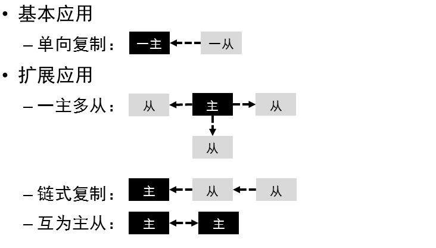
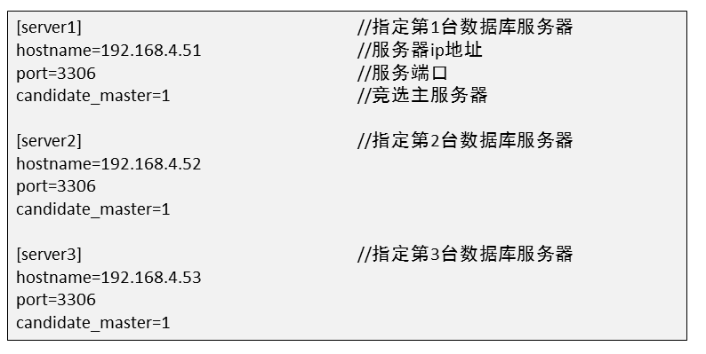

# 数据库

[toc]


## 介绍


**mysql是关系型数据库系统**

## 安装&初始化MYSQL

```shell
[root@localhost ~]# systemctl start mysqld
[root@localhost ~]# ls /var/lib/mysql   	# 数据库目录
auto.cnf         ib_buffer_pool  mysql               public_key.pem
ca-key.pem       ibdata1         mysql.sock          server-cert.pem
ca.pem           ib_logfile0     mysql.sock.lock     server-key.pem
client-cert.pem  ib_logfile1     performance_schema  sys
client-key.pem   ibtmp1          private_key.pem
[root@localhost ~]# systemctl enable mysqld
[root@localhost ~]# netstat -antpu | grep mysql
tcp6       0      0 :::3306                 :::*                    LISTEN      1491/mysqld
[root@localhost ~]# ls /var/log/mysqld.log  # 数据库日志
/var/log/mysqld.log
[root@localhost ~]# grep -i "password" /var/log/mysqld.log  	# 初始密码
2022-02-07T02:15:50.241310Z 1 [Note] A temporary password is generated for root@localhost: rzqi-qti8qR3
[root@localhost ~]# mysql -hlocalhost -uroot -p'rzqi-qti8qR3'	# 使用初始密码登录
```

```mysql
# 首次使用必须reset密码
mysql> show databases;
ERROR 1820 (HY000): You must reset your password using ALTER USER statement before executing this statement.
# alter user是在登录mysql后修改
mysql> alter user root@"localhost" identified by "123qqq...A";
Query OK, 0 rows affected (0.00 sec)
[root@localhost ~]# mysql -hlocalhost -uroot -p123qqq...A	# 访问本机数据库时-h可以省略

```

```mysql
mysql> select version();
+-----------+
| version() |
+-----------+
| 5.7.17    |
+-----------+
1 row in set (0.00 sec)

mysql> select user();
+----------------+
| user()         |
+----------------+
| root@localhost |
+----------------+
1 row in set (0.00 sec)

mysql> select database();
+------------+
| database() |
+------------+
| sys        |
+------------+
1 row in set (0.00 sec)

mysql> use mysql
Reading table information for completion of table and column names
You can turn off this feature to get a quicker startup with -A

Database changed
mysql> select database();
+------------+
| database() |
+------------+
| mysql      |
+------------+
1 row in set (0.00 sec)

mysql> show tables;
+---------------------------+
| Tables_in_mysql           |
+---------------------------+
| columns_priv              |
| db                        |
| engine_cost               |
...
```


## 修改密码策略&重置密码


```mysql
mysql> show variables like "%password%";
+---------------------------------------+--------+
| Variable_name                         | Value  |
+---------------------------------------+--------+
| default_password_lifetime             | 0      |
| disconnect_on_expired_password        | ON     |
| log_builtin_as_identified_by_password | OFF    |
| mysql_native_password_proxy_users     | OFF    |
| old_passwords                         | 0      |
| report_password                       |        |
| sha256_password_proxy_users           | OFF    |
| validate_password_check_user_name     | OFF    |
| validate_password_dictionary_file     |        |
| validate_password_length              | 8      |
| validate_password_mixed_case_count    | 1      |
| validate_password_number_count        | 1      |
| validate_password_policy              | MEDIUM |
| validate_password_special_char_count  | 1      |
+---------------------------------------+--------+
14 rows in set (0.00 sec)

mysql> set global validate_password_policy=0;
Query OK, 0 rows affected (0.00 sec)

mysql> show variables like "%password%";
+---------------------------------------+-------+
| Variable_name                         | Value |
+---------------------------------------+-------+
| default_password_lifetime             | 0     |
| disconnect_on_expired_password        | ON    |
| log_builtin_as_identified_by_password | OFF   |
| mysql_native_password_proxy_users     | OFF   |
| old_passwords                         | 0     |
| report_password                       |       |
| sha256_password_proxy_users           | OFF   |
| validate_password_check_user_name     | OFF   |
| validate_password_dictionary_file     |       |
| validate_password_length              | 8     |
| validate_password_mixed_case_count    | 1     |
| validate_password_number_count        | 1     |
| validate_password_policy              | LOW   |
| validate_password_special_char_count  | 1     |
+---------------------------------------+-------+
14 rows in set (0.00 sec)

mysql> set global validate_password_length=6;
Query OK, 0 rows affected (0.00 sec)

mysql> show variables like "%password%"
    -> ;
+---------------------------------------+-------+
| Variable_name                         | Value |
+---------------------------------------+-------+
| default_password_lifetime             | 0     |
| disconnect_on_expired_password        | ON    |
| log_builtin_as_identified_by_password | OFF   |
| mysql_native_password_proxy_users     | OFF   |
| old_passwords                         | 0     |
| report_password                       |       |
| sha256_password_proxy_users           | OFF   |
| validate_password_check_user_name     | OFF   |
| validate_password_dictionary_file     |       |
| validate_password_length              | 6     |
| validate_password_mixed_case_count    | 1     |
| validate_password_number_count        | 1     |
| validate_password_policy              | LOW   |
| validate_password_special_char_count  | 1     |
+---------------------------------------+-------+
14 rows in set (0.00 sec)

mysql> alter user root@"localhost" identified by "123456";
Query OK, 0 rows affected (0.00 sec)

```

```shell
# 永久配置
[root@50mysql ~]# vim /etc/my.cnf
[mysqld]
validate_password_length=6
validate_password_policy=0

[root@50mysql ~]# systemctl restart mysqld
[root@50mysql ~]# mysql -uroot -p123456
```

## 破解密码

1. 需要重启数据库，适合线下数据库服务器

```shell
[root@50mysql ~]# vim /etc/my.cnf
[mysqld]
skip-grant-tables	# 跳过授权库MySQL库启动服务 作用连接服务不需要输入密码
#validate_password_length=6
#validate_password_policy=0
[root@50mysql ~]# systemctl restart mysqld
[root@50mysql ~]# mysql  # 不输入密码就可以登陆
mysql> update  mysql.user set authentication_string=password("123qqq...A") 
where user="root" and host="localhost";  修改管理员root 本机登陆密码为  123qqq...A
mysql> flush privileges; 确保修改生效
mysql> exit; 断开连接
[root@50mysql ~]# vim /etc/my.cnf  还原修改
[mysqld]
validate_password_policy=0
validate_password_length=6
#skip-grant-tables
:wq
[root@50mysql ~]# systemctl  restart mysqld 重启服务 
[root@50mysql ~]# mysql -hlocalhost -uroot -p123qqq...A 使用恢复的密码登陆
```

2. 破解线上数据库服务器管理员root 密码

```shell
# 因为/var/lib/mysql/mysql库存放的是 数据库服务器的用户和密码，所以可以拷贝其他数据库服务器的mysql库，覆盖本机的mysql库
[root@50mysql ~]# scp -r 192.168.4.51:/var/lib/mysql/mysql /var/lib/mysql
# 查看mysql服务 父进程的pid
[root@50mysql ~]# pstree -p | grep mysqld | head -1
           |-mysqld(2711)-+-{mysqld}(2712)
# 给mysql服务的父进程发送 SIGHUP信息 (作用重新加载数据库目录下的文件 ，可以重新识别 mysql库里的用户和密码)
[root@50mysql ~]# kill -SIGHUP 2711
```

3. 修改root密码

```shell
# 1.使用alter user 修改 ：数据库管理员连接服务后 修改自己的登陆密码
# 2.mysqladmin修改 （操作系统管理员 修改本机数据库服务的登陆密码）
[root@50mysql ~]# mysqladmin -uroot -pNSD2110...a password "tarena"
# 隐藏旧密码和新密码,根据提示输入密码
[root@50mysql ~]# mysqladmin -uroot -p password
Enter password: 
New password: 
Confirm new password: 
Warning: Since password will be sent to server in plain text, use ssl connection to ensure password safety.
```

## 图形化界面

> phpmyadmin

```shell
1. [root@50mysql ~]# yum -y install httpd php php-mysql
2. 解压拷贝phpmyadmin软件到/var/www/html目录
3. # 创建修改主配置文件
   [root@50mysql phpmyadmin]# cp config.sample.inc.php config.inc.php
   [root@50mysql phpmyadmin]# vim +17 config.inc.php  # 在''号里添加plj123
4. 浏览器打开http://192.168.4.50/phpmyadmin页面
```

## 语法规范


## SQL语句分类

SQL 中文意思  结构化查询语言


### 基础查询

- ### 查询命令格式

  1. select  字段名列表  from  库名.表名； #查看表里的所有行
  2. select  字段名列表  from  库名.表名  where   查询条件 ； #只查看与条件匹配的行

```mysql
mysql> select 5;	# 查看常量
+---+
| 5 |
+---+
| 5 |
+---+
1 row in set (0.00 sec)

mysql> select @@version;	# 查看mysql环境变量
+-----------+
| @@version |
+-----------+
| 5.7.17    |
+-----------+
1 row in set (0.00 sec)

mysql> select 3+2;	# 查看计算结果
+-----+
| 3+2 |
+-----+
|   5 |
+-----+
1 row in set (0.00 sec)

mysql> select count(*) from mysql.user;	# 查询时使用函数
+----------+
| count(*) |
+----------+
|        2 |
+----------+
1 row in set (0.00 sec)

mysql> select 5*5 as 计算结果; # 对查询结果定义表头
+--------------+
| 计算结果     |
+--------------+
|           25 |
+--------------+
1 row in set (0.00 sec)

mysql> select "里斯" as 姓名;
+--------+
| 姓名   |
+--------+
| 里斯   |
+--------+
1 row in set (0.00 sec)
```

```shell
导入数据库
[root@50mysql ~]# mysql -uroot -ptarena < tarena.sql
```

- 查询条件

| command    | descritpion | example                                                      |
| :--------- | :---------- | :----------------------------------------------------------- |
| as 或 空格 | 别名        | select name 用户名, homedir as 家目录 from tarena.user;      |
| concat()   | 拼接        | select concat(id,"*",name,"-",homedir,"--",shell) from tarena.user;<br />**任意字段为NULL返回值为NULL** |
| distinct   | 去重        | select distinct gid from tarena.user;                        |

- 数值比较

  **符号两边必须是数据类型**

| 比较符号 | 说明       |
| -------- | ---------- |
| =        | 相等       |
| >        | 大于       |
| >=       | 大于或等于 |
| <        | 小于       |
| <=       | 小于或等于 |
| !=       | 不相等     |

select * from tarena.user where uid >3;


### 建库

#### 语法

> **仅可以使用数字、字母、下划线、不能纯数字**

> **区分字母大小写**

> **具有唯一性，不可使用指令关键字、特殊字符**

```mysql
CREATE DATABASE IF NOT EXISTS GAME;
DROP DATABASE IF EXISTS GAME;
```


### 建表

#### 语法

```mysql
create  table  库名.表名(
表头名1  数据类型, 
表头名2  数据类型，
表头名3  数据类型，
表头名4  数据类型
);

CREATE TABLE studb.stuinfo(id int,name char(10),age int,grade char(10));
INSERT INTO studb.stuinfo VALUES (1,"Tim",18,"dayi"),(2,"Jarry",25,"dayi"),(3,"Tom",33,"shuoshi"),(4,"Lily",6,"xiaoxue");
```


### 修改表

#### 语法

**mysql> ALTER TABLE 库.表 操作命令；**

| command | description                                                  |
| ------- | ------------------------------------------------------------ |
| ADD     | 添加新的表头，同时添加多个使用逗号分隔，FIRST/AFTER用于指定添加的位置 |
| MODIFY  | 修改表头的类型和约束条件，也可以修改表头的位置               |
| DROP    | 删除指定的表头，同时删除多个使用逗号分隔                     |
| CHANGE  | 修改表头名，也可以同时修改表头类型和约束条件                 |
| RENAME  | 修改表名                                                     |

```mysql
命令格式： alter  table  库名.表名   操作命令；

ALTER TABLE studb.stuinfo ADD class char(7), ADD mail char(20);
ALTER TABLE studb.stuinfo ADD 学号 int FIRST;
ALTER TABLE studb.stuinfo ADD 住址 char(50) AFTER name;
ALTER TABLE studb.stuinfo DROP grade;
ALTER TABLE studb.stuinfo modify id char(10);
# not Null Default "tim@tedu.cn" 属于约束条件的修改
ALTER TABLE studb.stuinfo MODIFY mail varchar(20) not Null Default "tim@tedu.cn";SELECT name CASE
WHEN dept_name in ("开发部","测试部","运维部") THEN "技术部"
WHEN dept_name is null THEN "未设置"
ELSE "非技术部"
END AS "部门类型"
FROM tarena.departments;
# 调整表头的位置
ALTER TABLE studb.stuinfo MODIFY age int  AFTER name;
# 修改表头名为中文
ALTER TABLE studb.stuinfo CHANGE name 姓名 char(10);
# 修改表头名，同时修改约束条件
ALTER TABLE studb.stuinfo CHANGE 姓名 name char(20) not Null Default "Big hammer";
# 修改表名
ALTER TABLE studb.stuinfo RENAME studb.holyshit;
```

```mysql
# 表头和数据复制都复制，但原表的key不会复制给新表
# 命令格式	CREATE	TABLE 库.表 SELECT 列名 FROM 库.表 [WHERE 条件];
mysql> CREATE TABLE studb.部门表 SELECT * FROM tarena.departments;
# 仅仅复制表头，同时原表的key也会复制给新表
# 命令格式  CREATE  TABLE 库.表   LIKE  库.表;SELECT e.employee_id,name,basic,date,grade FROM employees AS e
INNER JOIN salary AS s ON e.employee_id=s.employee_id
INNER JOIN wage_grade AS g
ON low<basic<high
WHERE YEAR(date)=2018 AND MONTH(date)=12
mysql> CREATE TABLE studb.部门表2 like tarena.departments;
```


### 管理表记录

表头的标准术语：字段

对表中存储的行做管理 ，操作包括  **查看select   插入 insert into   更新 update  删除 delete**

#### 插入表记录

1. INSERT INTO 库名.表名 VALUES (值列表); //插入一行

   INSERT INTO 库名.表名 VALUES (值列表),(值列表); //插入多行

```mysql
mysql> INSERT INTO tarena.user VALUES(25,"tim","x",666,666,"test user","/home/tim","/bin/bash");
# 值的顺序必须和表中列的顺序一致，且数据类型要匹配
```

2. INSERT   INTO  库名.表名(列名列表)  VALUES (值列表);  //只插入1条记录

   NSERT   INTO  库名.表名(列名列表)  VALUES (值列表),(值列表);  //插入多条记录

```mysql
mysql> INSERT INTO tarena.user(name,uid) VALUES("john",888);
# 列和值的顺序要一致 ; 列名先后顺序不重要 ；没有赋值的列使用默认值、自增长结果赋值
```

3. 使用select 查询结果插入数据  

```mysql
mysql> INSERT INTO tarena.user (name) (SELECT name FROM tarena.user WHERE shell="/sbin/halt");
mysql> INSERT INTO tarena.user(name,password) (SELECT name,password FROM tarena.user WHERE id in (1,3));
# 注意：值的顺序必须和表中列的顺序一致，且数据类型要匹配
```

4. 使用SET命令赋值

   格式： mysql> insert into 库.表 set  字段名=值 , 字段名=值 , 字段名=值 ;

```mysql
mysql> INSERT INTO tarena.user SET name="techuichui",uid=668;
```


#### 删除表记录

1. DELETE FROM 库名.表名  WHERE 条件;  **仅删除与条件匹配的行**

```mysql
mysql> SELECT * FROM tarena.user WHERE shell is null;
mysql> DELETE FROM tarena.user WHERE shell is null;
```

2. DELETE FROM 库.表;	**清空表记录**
3. TRUNCAT TABLE 库.表； **清空表记录**

truncate 与 delete  删除记录的区别！！！

```
- TRUNCATE不支持WHERE条件
- 自增长列，TRUNCATE后从1开始；DELETE继续编号
- TRUNCATE不能回滚，DELETE可以
- 效率略高于DELETE
```


#### 更新表记录

1. UPDATE 库名.表名 SET 字段=值，字段=值 WHERE 条件;

   **仅修改与条件匹配的**

```mysql
mysql> UPDATE tarena.user SET comment="admin count", password="1" WHERE name="root";
mysql> UPDATE tarena.user SET password="x" WHERE name="xixi" or name="haha";
```

2. UPDATE 库名.表名 SET 字段=值，字段=值

   **批量修改**

```mysql
mysql> UPDATE tarena.user SET password="F";
```

## 查看修改库字符集

SHOW CREATE TABLE 库.表 \G

ALTER TABLE 库.表 DEFAULT CHARSET=字符集;

```mysql
mysql> SHOW CREATE TABLE studb.stuinfo\G
*************************** 1. row ***************************
       Table: stuinfo
Create Table: CREATE TABLE `stuinfo` (
  `学号` int(11) DEFAULT NULL,
  `name` char(20) DEFAULT NULL,
  `math` float DEFAULT NULL,
  `age` int(11) DEFAULT NULL,
  `address` char(50) DEFAULT NULL,
  `class` char(7) DEFAULT NULL,
  `mail` char(20) DEFAULT 'tim@qq.com'
) ENGINE=InnoDB DEFAULT CHARSET=latin1
1 row in set (0.00 sec)

mysql> ALTER TABLE studb.stuinfo DEFAULT CHARSET=utf8;
Query OK, 0 rows affected (0.03 sec)
Records: 0  Duplicates: 0  Warnings: 0

mysql> SHOW CREATE TABLE studb.stuinfo\G
*************************** 1. row ***************************
       Table: stuinfo
Create Table: CREATE TABLE `stuinfo` (
  `学号` int(11) DEFAULT NULL,
  `name` char(20) CHARACTER SET latin1 DEFAULT NULL,
  `math` float DEFAULT NULL,
  `age` int(11) DEFAULT NULL,
  `address` char(50) CHARACTER SET latin1 DEFAULT NULL,
  `class` char(7) CHARACTER SET latin1 DEFAULT NULL,
  `mail` char(20) CHARACTER SET latin1 DEFAULT 'tim@qq.com'
) ENGINE=InnoDB DEFAULT CHARSET=utf8
1 row in set (0.00 sec)

# 对于已经建好的表，即便修改了字符集，可能该字符也无法支持
```

```mysql
# 在创建表的时候，就指定好字符集
mysql> CREATE TABLE studb.stuinfo2(姓名 char(10),住址 char(20),职业 char(5)) DEFAULT CHARSET utf8;
```

## 数据类型

### 数值类型

一般用于计算的数据才需要设置为数值类型，比如电话号码就不需要设置为数值类型

#### 整型类型


#### 浮点类型


```mysql
mysql> CREATE TABLE studb.t3(姓名 char(10),年龄 tinyint unsigned,工资 float,圆周率 double,游戏级别 smallint);;
Query OK, 0 rows affected (0.41 sec)

mysql> DESC studb.t3;
+--------------+---------------------+------+-----+---------+-------+
| Field        | Type                | Null | Key | Default | Extra |
+--------------+---------------------+------+-----+---------+-------+
| 姓名         | char(10)            | YES  |     | NULL    |       |
| 年龄         | tinyint(3) unsigned | YES  |     | NULL    |       |
| 工资         | float               | YES  |     | NULL    |       |
| 圆周率       | double              | YES  |     | NULL    |       |
| 游戏级别     | smallint(6)         | YES  |     | NULL    |       |
+--------------+---------------------+------+-----+---------+-------+

mysql> INSERT INTO studb.t3(姓名,年龄,工资) VALUES("tom",20.5,88888);
Query OK, 1 row affected (0.04 sec)
# 整型字段存入小数会四舍五入，浮点型字段可以直接存入整型数据
mysql> SELECT * FROM studb.t3 WHERE 姓名="tom";
+--------+--------+--------+-----------+--------------+
| 姓名   | 年龄   | 工资   | 圆周率    | 游戏级别     |
+--------+--------+--------+-----------+--------------+
| tom    |     21 |  88888 |      NULL |         NULL |
+--------+--------+--------+-----------+--------------+

```


### 字符串类型

#### 枚举类型

 ENUM('*value1*','*value2*',...)

枚举类型。只能有一个值的字符串，从值列'*value1*'，'*value2*'，...，NULL中或特殊 ''错误值中选出。ENUM列最多可以有65,535个截然不同的值。ENUM值在内部用整数表示。

SET('*value1*','*value2*',...)

一个设置。字符串对象可以有零个或多个值，每个值必须来自列值'*value1*'，'*value2*'，...SET列最多可以有64个成员。SET值在内部用整数表示。

```mysql
mysql> CREATE TABLE studb.stuinfo3(姓名 char(20),爱好 SET("倒塔","篮球","游戏"),性别 ENUM("男","女")) DEFAULT CHARSET utf8;
Query OK, 0 rows affected (0.29 sec)

mysql> DESC studb.stuinfo3;
+--------+---------------------------------+------+-----+---------+-------+
| Field  | Type                            | Null | Key | Default | Extra |
+--------+---------------------------------+------+-----+---------+-------+
| 姓名   | char(20)                        | YES  |     | NULL    |       |
| 爱好   | set('倒塔','篮球','游戏')       | YES  |     | NULL    |       |
| 性别   | enum('男','女')                 | YES  |     | NULL    |       |
+--------+---------------------------------+------+-----+---------+-------+
3 rows in set (0.00 sec)

mysql> INSERT INTO studb.stuinfo3 VALUES("里斯","篮球,游戏","男");
mysql> SELECT * FROM studb.stuinfo3;
+--------+---------------+--------+
| 姓名   | 爱好          | 性别   |
+--------+---------------+--------+
| 里斯   | 篮球,游戏     | 男     |
+--------+---------------+--------+
1 row in set (0.00 sec)

mysql> INSERT INTO studb.stuinfo3 VALUES("芭比口","","女");
Query OK, 1 row affected (0.04 sec)
mysql> SELECT * FROM studb.stuinfo3;
+-----------+---------------+--------+
| 姓名      | 爱好          | 性别   |
+-----------+---------------+--------+
| 里斯      | 篮球,游戏     | 男     |
| 芭比口    |               | 女     |
+-----------+---------------+--------+
2 rows in set (0.00 sec)

```


#### 字符类型

##### 常用字符类型

| 类型              | 名称     | 说明                                                         |
| ----------------- | -------- | ------------------------------------------------------------ |
| char(字符个数)    | 定长类型 | 最多255个字符<br />不够指定字符个数时在右边用空格补全字符个数，超出时无法写入数据 |
| varchar(字符个数) | 变长类型 | 最多65532个字符<br />按数据实际大小分配存储空间，字符个数超出时无法写入数据 |

**注意：此处是以字符个数为单位，一个字母或者汉字都算作一个字符**

```mysql
mysql> CREATE TABLE studb.t4(姓名 varchar(10),班级 char(7),电话 char(11),邮箱 varchar(30))DEFAULT CHARSET utf8;
mysql> INSERT INTO studb.t4 VALUES("邓肯","高中","13408764523","duncan@tedu.cn");
Query OK, 1 row affected (0.04 sec)

mysql> SELECT * FROM studb.t4;
+--------+--------+-------------+----------------+
| 姓名   | 班级   | 电话        | 邮箱           |
+--------+--------+-------------+----------------+
| 邓肯   | 高中   | 13408764523 | duncan@tedu.cn |
+--------+--------+-------------+----------------+

```


##### 其他字符类型


### 日期时间类型

| 类型      | 名称     | 范围                                    | 赋值格式       |
| --------- | -------- | --------------------------------------- | -------------- |
| year      | 年       | 1901~2155                               | YYYY           |
| date      | 日期     | 0001-01-01~9999-12-31                   | YYYYMMDD       |
| time      | 时间     | 01:00:00-23:59:59                       | HHMMSS         |
| datetime  | 日期时间 | 0001-01-01 00:00:00~9999-12-31 23:59:59 | YYYYMMDDHHMMSS |
| timestamp | 日期时间 | 1970-01-01 00:00:00~2038-01-19 00:00:00 | YYYYMMDDHHMMSS |

- 当未给timestamp字段赋值时，**自动以当前系统时间赋值**。而datetime值为NULL
- datetime,timestamp存储范围不一样 （datetime存储范围大  timestamp范围小）
- 使用2位数给year的表头赋值也是可以的  但会自动补全4位数
  - 01-69  之间的数字使用20补全4位数的年 2001~2069
  - 0-99  之间的数字使用19补全4位数的年 1970~1999
- 可以使用时间函数给日期时间类型的字段赋值

```mysql
mysql> CREATE TABLE studb.t1(
    -> name char(10),s_year year,birthday date,work time,party datetime);
mysql> INSERT INTO studb.t1 VALUES( "tim",1998,19980807,090000,20220209093000);
mysql> SELECT * FROM studb.t1;
+------+--------+------------+----------+---------------------+
| name | s_year | birthday   | work     | party               |
+------+--------+------------+----------+---------------------+
| tim  |   1998 | 1998-08-07 | 09:00:00 | 2022-02-09 09:30:00 |
+------+--------+------------+----------+---------------------+

# 存入year类型数据超范围报错
mysql> INSERT INTO studb.t1(name,s_year) VALUES("xixi",1637);
ERROR 1264 (22003): Out of range value for column 's_year' at row 1

# year字段使用2位数赋值时：
mysql> INSERT INTO studb.t1(name,s_year) VALUES("haha",88),("dachui",05);
mysql> SELECT * FROM studb.t1 WHERE name in ("haha","dachui");
+--------+--------+----------+------+-------+
| name   | s_year | birthday | work | party |
+--------+--------+----------+------+-------+
| haha   |   1988 | NULL     | NULL | NULL  |
| dachui |   2005 | NULL     | NULL | NULL  |
+--------+--------+----------+------+-------+


mysql> CREATE TABLE studb.t2(meeting datetime, party timestamp);
mysql> INSERT INTO studb.t2 VALUES(20220209183000,20220210123000);
mysql> INSERT INTO studb.t2(meeting) VALUES(20180128175036);
mysql> INSERT INTO studb.t2(party) VALUES(20190211183000);
mysql> SELECT * FROM studb.t2;;
+---------------------+---------------------+
| meeting             | party               |
+---------------------+---------------------+
| 2022-02-09 18:30:00 | 2022-02-10 12:30:00 |  
| 2018-01-28 17:50:36 | 2022-02-09 10:13:23 |	# timstamp字段自动赋值当前时间
| NULL                | 2019-02-11 18:30:00 |	# datetime字段未赋值显示NULL
+---------------------+---------------------+


```

## 数据批量处理

### 搜索目录

```mysql
# 默认设置
mysql> SHOW VARIABLES LIKE "%file%";
...
| secure_file_priv                      | /var/lib/mysql-files/           |
...

# 修改搜索目录
# 1. 修改/etc/my.cnf 
	[mysqld]
	secure_file_priv="目录路径"
# 2. mkdir创建该路径，并且调整目录的所有者和所属组 chown mysql:mysql 目录路径
# 3. systemctl restart mysqld
```


### 数据导入

语法：

**mysql> LOAD DATA INFILE “/目录名/文件名” INTO TABLE 库.表 FIELDS TERMINATED BY "分隔符" LINES TERMINATED BY "\n";**

步骤：

1. 创建存储数据库（如果没有的话)
2. 建表 (根据导入文件的内容 创建 表头名  表头个数  表头数据类型  根据文件内容定义)
3. 把系统文件拷贝到检索目录下
4. 数据库管理执行导入数据的命令
5. 查看数据

```mysql
mysql> CREATE DATABASE IF NOT EXISTS studb;
mysql> CREATE TABLE studb.user(name char(50),password char(1),uid int,gid int,comment varchar(150),homedir varchar(100),shell char(30));
mysql> DESC studb.user;
+----------+--------------+------+-----+---------+-------+
| Field    | Type         | Null | Key | Default | Extra |
+----------+--------------+------+-----+---------+-------+
| name     | char(50)     | YES  |     | NULL    |       |
| password | char(1)      | YES  |     | NULL    |       |
| uid      | int(11)      | YES  |     | NULL    |       |
| gid      | int(11)      | YES  |     | NULL    |       |
| comment  | varchar(150) | YES  |     | NULL    |       |
| homedir  | varchar(100) | YES  |     | NULL    |       |
| shell    | char(30)     | YES  |     | NULL    |       |
+----------+--------------+------+-----+---------+-------+
mysql> system cp /passwd /myload/passwd	# mysql登录状态下执行系统命令
mysql> LOAD DATA INFILE "/myload/passwd" INTO TABLE studb.user FIELDS TERMINATED BY ":" LINES TERMINATED BY "\n";
```


### 数据导出

数据导出:根据**SELECT**命令的查询结果，把数据库表里的数据保存到系统文件里,注意导出的数据**不包括表头名，只有表里行**。存放导出数据的文件名，不需要事先创建,且具有唯一(**不能有同名文件存在**)

语法：

1. SELECT 字段名列表 FROM 库.表 WHERE 条件 INTO OUTFILE "/检索目录/文件名" ;
2. SELECT 字段名列表 FROM 库.表 WHERE 条件 INTO OUTFILE "/检索目录/文件名" FIELDS TERMINATED BY "符号" ;
3. SELECT 字段名列表 FROM 库.表 WHERE 条件 INTO OUTFILE "/检索目录/文件名" FIELDS TERMINATED BY "符号" LINES TERMINATED BY "符号" ;

```mysql
mysql> SELECT * FROM studb.user INTO OUTFILE "/myload/a.txt";
```

## 字段约束

### 约束分类

​	约束是一种限制，设置在字段上，用于控制字段的赋值

```
+----------+--------------+------+-----+---------+-------+
| Field    | Type         | Null | Key | Default | Extra |
+----------+--------------+------+-----+---------+-------+
```

	1. PRIMARY KEY 主键，用于保证该字段的值具有唯一性并且**非空**
	2. NOT NULL **非空**，用于保证该字段的值不能为空
	3. DEFAULT 默认值，用于保证该字段有默认值
	4. UNIQUE 唯一索引，用于保证该字段的值具有唯一性，**可以为空**
	5. FOREIGN KEY 外键，用于限制两个表的关系，用于保证该字段的值必须来自于主表的关联列的值，在从表添加外键约束，用于引用主表中某些的值

### 查看约束

```mysql
mysql> DESC studb.user;
```


### 基本约束

```mysql
# 1. NOT NUll
mysql> CREATE TABLE studb.t5(name char(10) not null, class char(20));
Query OK, 0 rows affected (0.38 sec)

mysql> DESC studb.t5;
+-------+----------+------+-----+---------+-------+
| Field | Type     | Null | Key | Default | Extra |
+-------+----------+------+-----+---------+-------+
| name  | char(10) | NO   |     | NULL    |       |
| class | char(20) | YES  |     | NULL    |       |
+-------+----------+------+-----+---------+-------+
2 rows in set (0.00 sec)

mysql> INSERT INTO studb.t5 VALUES(null,null);
ERROR 1048 (23000): Column 'name' cannot be null # name字段不可以为空
mysql> INSERT INTO studb.t5 VALUES("lisi",null);
Query OK, 1 row affected (0.04 sec)

mysql> SELECT * FROM studb.t5;
+------+-------+
| name | class |
+------+-------+
| lisi | NULL  |
+------+-------+
1 row in set (0.00 sec)

mysql> CREATE TABLE studb.t6(name char(10) not null,class char(7) DEFAULT "nsd2110",sex ENUM("M","W") not null DEFAULT "M");
Query OK, 0 rows affected (0.33 sec)
=============================================================================================
# 2. DEFAULT
mysql> DESC studb.t6;
+-------+---------------+------+-----+---------+-------+
| Field | Type          | Null | Key | Default | Extra |
+-------+---------------+------+-----+---------+-------+
| name  | char(10)      | NO   |     | NULL    |       |
| class | char(7)       | YES  |     | nsd2110 |       |
| sex   | enum('M','W') | NO   |     | M       |       |
+-------+---------------+------+-----+---------+-------+
3 rows in set (0.00 sec)

mysql> INSERT INTO studb.t6(name) VALUES("tim"); # class和sex使用DEFAULT默认值
Query OK, 1 row affected (0.06 sec)

mysql> SELECT * FROM studb.t6;
+------+---------+-----+
| name | class   | sex |
+------+---------+-----+
| tim  | nsd2110 | M   |
+------+---------+-----+
1 row in set (0.00 sec)

mysql> INSERT INTO studb.t6(name,class,sex) VALUES("xixi","2115","W");
# class和sex使用自定义的赋值
Query OK, 1 row affected (0.04 sec)

mysql> SELECT * FROM studb.t6;
+------+---------+-----+
| name | class   | sex |
+------+---------+-----+
| tim  | nsd2110 | M   |
| xixi | 2115    | W   |
+------+---------+-----+
2 rows in set (0.00 sec)

# 3. UNIQUE
mysql> CREATE TABLE studb.t7(id char(9) UNIQUE,name char(10),age tinyint UNSIGNED DEFAULT 21);
Query OK, 0 rows affected (0.30 sec)

mysql> DESC studb.t7;
+-------+---------------------+------+-----+---------+-------+
| Field | Type                | Null | Key | Default | Extra |
+-------+---------------------+------+-----+---------+-------+
| id    | char(9)             | YES  | UNI | NULL    |       |
| name  | char(10)            | YES  |     | NULL    |       |
| age   | tinyint(3) unsigned | YES  |     | 21      |       |
+-------+---------------------+------+-----+---------+-------+
3 rows in set (0.00 sec)

mysql> INSERT INTO studb.t7 VALUES("1","tim",29);
Query OK, 1 row affected (0.06 sec)

mysql> INSERT INTO studb.t7 VALUES("1","xixi",18);
ERROR 1062 (23000): Duplicate entry '1' for key 'id'
mysql> INSERT INTO studb.t7 VALUES("2","xixi",18);
Query OK, 1 row affected (0.03 sec)

mysql> INSERT INTO studb.t7(name,age) VALUES("haha",20);
Query OK, 1 row affected (0.03 sec)

mysql> SELECT * FROM studb.t7;
+------+------+------+
| id   | name | age  |
+------+------+------+
| 1    | tim  |   29 |
| 2    | xixi |   18 |
| NULL | haha |   20 |
+------+------+------+


```


### 主键

1. 字段值不允许重复，且不允许赋NULL值
2. 一个表中只能有一个primary  key字段
3. 多个字段都作为主键，称为复合主键，必须一起创建
4. 主键字段的标志是PRI
5. 主键通常与auto_increment  连用
6. 通常把表中唯一标识记录的字段设置为主键[记录编号字段]

- 创建主键

  1. CREATE TABLE 库.表(字段名列表,primary key(字段名));

  ```mysql
  mysql> CREATE TABLE studb.t8(id char(18),name char(10),PRIMARY KEY(id));
  Query OK, 0 rows affected (0.32 sec)
  
  mysql> DESC studb.t8;
  +-------+----------+------+-----+---------+-------+
  | Field | Type     | Null | Key | Default | Extra |
  +-------+----------+------+-----+---------+-------+
  | id    | char(18) | NO   | PRI | NULL    |       |
  | name  | char(10) | YES  |     | NULL    |       |
  +-------+----------+------+-----+---------+-------+
  2 rows in set (0.00 sec)
  
  mysql> INSERT INTO studb.t8 VALUES("123456","tim"),("123456","xixi");
  ERROR 1062 (23000): Duplicate entry '123456' for key 'PRIMARY'
  mysql> INSERT INTO studb.t8 VALUES("123456","tim"),("123456","xixi"),(null,"haha");
  ERROR 1062 (23000): Duplicate entry '123456' for key 'PRIMARY'
  mysql> INSERT INTO studb.t8 VALUES("123456","tim"),("1234567","xixi"),("12345678","haha");
  Query OK, 3 rows affected (0.02 sec)
  Records: 3  Duplicates: 0  Warnings: 0
  
  mysql> SELECT * FROM studb.t8;
  +----------+------+
  | id       | name |
  +----------+------+
  | 123456   | tim  |
  | 1234567  | xixi |
  | 12345678 | haha |
  +----------+------+
  ```

  

  2. dfdfd
  3. fdfdf

- 删除&添加

  语法

  > 删除：**ALTER TABLE 库.表 DROP PRIMARY KEY;**

  > 添加：**ALTER TABLE 库.表 ADD PRIMARY KEY(字段名列表);**

```mysql
mysql> ALTER TABLE studb.t8 DROP PRIMARY KEY;
mysql> DESC studb.t8;
+-------+----------+------+-----+---------+-------+
| Field | Type     | Null | Key | Default | Extra |
+-------+----------+------+-----+---------+-------+
| id    | char(18) | NO   |     | NULL    |       |
| name  | char(10) | YES  |     | NULL    |       |
+-------+----------+------+-----+---------+-------+

mysql> INSERT INTO studb.t8 VALUES("123456","lili");
Query OK, 1 row affected (0.07 sec)

mysql> SELECT * FROM studb.t8;
+----------+------+
| id       | name |
+----------+------+
| 123456   | tim  |
| 1234567  | xixi |
| 12345678 | haha |
| 123456   | lili |
+----------+------+

mysql> ALTER TABLE studb.t8 ADD PRIMARY KEY(id);
ERROR 1062 (23000): Duplicate entry '123456' for key 'PRIMARY'
mysql> UPDATE studb.t8 SET id="123456789" WHERE name="lili";
Query OK, 1 row affected (0.04 sec)
Rows matched: 1  Changed: 1  Warnings: 0

mysql> SELECT * FROM studb.t8;
+-----------+------+
| id        | name |
+-----------+------+
| 123456    | tim  |
| 1234567   | xixi |
| 12345678  | haha |
| 123456789 | lili |
+-----------+------+
4 rows in set (0.00 sec)

mysql> ALTER TABLE studb.t8 ADD PRIMARY KEY(id);
Query OK, 0 rows affected (0.49 sec)
Records: 0  Duplicates: 0  Warnings: 0

mysql> DESC studb.t8;
+-------+----------+------+-----+---------+-------+
| Field | Type     | Null | Key | Default | Extra |
+-------+----------+------+-----+---------+-------+
| id    | char(18) | NO   | PRI | NULL    |       |
| name  | char(10) | YES  |     | NULL    |       |
+-------+----------+------+-----+---------+-------+
2 rows in set (0.00 sec)

# 添加主键时，对应的字段需要满足PRIMARY KEY的条件(没有null空值，且值没有重复的)
```

- 创建复合主键

  - 多个字段一起做主键
  - 复合主键的值只要不同时重复即可

  ```mysql
  mysql> CREATE TABLE studb.t9(ip char(12),port char(5),status enum("deny","allow"),PRIMARY KEY(ip,port));
  Query OK, 0 rows affected (0.15 sec)
  
  mysql> DESC studb.t9;
  +--------+----------------------+------+-----+---------+-------+
  | Field  | Type                 | Null | Key | Default | Extra |
  +--------+----------------------+------+-----+---------+-------+
  | ip     | char(12)             | NO   | PRI | NULL    |       |
  | port   | char(5)              | NO   | PRI | NULL    |       |
  | status | enum('deny','allow') | YES  |     | NULL    |       |
  +--------+----------------------+------+-----+---------+-------+
  # 复合主键的添加、删除方法与单个主键的一致
  mysql> ALTER TABLE studb.t9 DROP PRIMARY KEY;
  mysql> ALTER TABLE studb.t9 ADD PRIMARY KEY(ip,port);
  ```

- 主键与auto_increment连用

  > 表头的数值类型必须是数据类型，且必须是主键

  ```mysql
  mysql> CREATE TABLE studb.t10(id int auto_increment,name char(10),age int,class char(7),score float,PRIMARY KEY(id));
  Query OK, 0 rows affected (0.99 sec)
  
  mysql> DESC studb.t10;;
  +-------+----------+------+-----+---------+----------------+
  | Field | Type     | Null | Key | Default | Extra          |
  +-------+----------+------+-----+---------+----------------+
  | id    | int(11)  | NO   | PRI | NULL    | auto_increment |
  | name  | char(10) | YES  |     | NULL    |                |
  | age   | int(11)  | YES  |     | NULL    |                |
  | class | char(7)  | YES  |     | NULL    |                |
  | score | float    | YES  |     | NULL    |                |
  +-------+----------+------+-----+---------+----------------+
  
  # 插入数据时没有给id赋值，实现id数值自增1
  mysql> INSERT INTO studb.t10(name,age,class,score) VALUES("tim",10,"nsd2110",99.9);
  Query OK, 1 row affected (0.03 sec)
  
  mysql> SELECT * FROM studb.t10;
  +----+------+------+---------+-------+
  | id | name | age  | class   | score |
  +----+------+------+---------+-------+
  |  1 | tim  |   10 | nsd2110 |  99.9 |
  +----+------+------+---------+-------+
  1 row in set (0.00 sec)
  
  ```

  

### 外键

- 作用：插入记录时，字段值在另一个表字段值范围内选择

- 规则：

  1. 表存储引擎必须是innodb
  2. 字段类型要一致
  3. 被参照字段必须要是索引类型的一种(通常是 primary key)

- 创建外键语法：

  ```mysql
  CREATE TABLE 库.表(字段列表, 
  FOREIGN KEY(字段名)   #指定外键
  REFERENCES 库.表(字段名)   #指定参考的表头名
  ON UPDATE CASCADE   #同步更新
  ON DELETE CASCADE  	#同步删除
  )ENGINE=INNODB;		#指定存储引擎
  
  # 1. 创建被REFERENCES的表
  mysql> CREATE TABLE studb.yg_tab(yg_id int PRIMARY KEY AUTO_INCREMENT,name char(10))ENGINE=INNODB;
  mysql> DESC studb.yg_tab;
  +-------+----------+------+-----+---------+----------------+
  | Field | Type     | Null | Key | Default | Extra          |
  +-------+----------+------+-----+---------+----------------+
  | yg_id | int(11)  | NO   | PRI | NULL    | auto_increment |
  | name  | char(10) | YES  |     | NULL    |                |
  +-------+----------+------+-----+---------+----------------+
  
  mysql> INSERT INTO studb.yg_tab(name) VALUES("tim"),("lili");
  mysql> SELECT * FROM studb.yg_tab;
  +-------+------+
  | yg_id | name |
  +-------+------+
  |     1 | tim  |
  |     2 | lili |
  +-------+------+
  
  # 2. 创建使用外键的表
  mysql> CREATE TABLE studb.gz_tab(gz_id int,pay int,FOREIGN KEY(gz_id) REFERENCES studb.yg_tab(yg_id) ON UPDATE CASCADE ON DELETE CASCADE )ENGINE=INNODB;
  
  # 3. 表中插入数据报错，因为插入的字段值不在REFERENCES的字段值中
  mysql> INSERT INTO studb.gz_tab VALUES(3,30000);
  ERROR 1452 (23000): Cannot add or update a child row: a foreign key constraint fails (`studb`.`gz_tab`, CONSTRAINT `gz_tab_ibfk_1` FOREIGN KEY (`gz_id`) REFERENCES `yg_tab` (`yg_id`) ON DELETE CASCADE ON UPDATE CASCADE)
  
  # 4. 验证同步更新--->必须更新REFERENCES的表字段值
  mysql> INSERT INTO studb.gz_tab VALUES(2,30000);
  mysql> INSERT INTO studb.yg_tab(name) VALUES("bob");
  mysql> INSERT INTO studb.gz_tab VALUES(3,100);
  mysql> UPDATE studb.yg_tab SET yg_id=10 WHERE name="lili";
  mysql> SELECT * FROM studb.yg_tab;
  +-------+------+
  | yg_id | name |
  +-------+------+
  |     1 | tim  |
  |     3 | bob  |
  |    10 | lili |
  +-------+------+
  3 rows in set (0.00 sec)
  
  mysql> SELECT * FROM studb.gz_tab;
  +-------+-------+
  | gz_id | pay   |
  +-------+-------+
  |    10 | 30000 |
  |     3 |   100 |
  +-------+-------+
  2 rows in set (0.00 sec)
  
  # 5. 验证同步删除--->必须删除REFERENCES的表字段值
  mysql> DELETE FROM studb.yg_tab WHERE name="lili";
  Query OK, 1 row affected (0.03 sec)
  
  mysql> SELECT * FROM studb.yg_tab;
  +-------+------+
  | yg_id | name |
  +-------+------+
  |     1 | tim  |
  |     3 | bob  |
  +-------+------+
  2 rows in set (0.00 sec)
  
  mysql> SELECT * FROM studb.gz_tab;
  +-------+------+
  | gz_id | pay  |
  +-------+------+
  |     3 |  100 |
  +-------+------+
  1 row in set (0.00 sec)
  
  # 6. 扩展--->在该示例的studb.gz_tab表中，gz_id字段可以重复赋值或者为空NULL，所以需要将gz_id设置为主键，保证字段值的唯一性
  mysql> INSERT INTO studb.gz_tab VALUES(3,2000);
  Query OK, 1 row affected (0.04 sec)
  
  mysql> INSERT INTO studb.gz_tab VALUES(NULL,999);
  Query OK, 1 row affected (0.03 sec)
  
  mysql> SELECT * FROM studb.gz_tab;
  +-------+------+
  | gz_id | pay  |
  +-------+------+
  |     3 |  100 |
  |     3 | 2000 |
  |  NULL |  999 |
  +-------+------+
  
  ```

- 查看外键

  ```mysql
  SHOW CREATE TABLE 库.表 \G
  ```

- 删除外键

  ```mysql
  ALTER TABLE 库.表 DROP FOREIGN KEY 外键名;
  ```

- 添加外键

  ```mysql
  ALTER TABLE 库.表 ADD FOREIGN KEY(字段名) REFERENCES 库.表(字段名) ON UPDATE CASCADE ON DELETE CASCADE;
  ```

  

## MYSQL索引

### 基本概念


### 优缺点

- 优点

  

- 缺点

  

### 索引分类

- 普通索引

  > 不应用任何限制条件的索引，该索引可以在任何数据类型中创建。字段本身的约束条件可以判断其值是否为空或唯一。创建该类型索引后，用户在查询时，便可以通过索引进行查询。

- 唯一索引和主键

  > 使用UNIQUE参数可以设置唯一索引。创建该索引时，索引的值必须唯一。通过唯一索引，用户可以快速定位某条记录。主键是一种特殊唯一索引。

- 全文索引

  > 使用FULLTEXT参数可以设置索引为全文索引。全文索引只能创建在CHAR、VARCHAR或者TEXT类型的字段上。查询数据量较大的字符串类型的字段时，使用全文索引可以提高查询速度。在默认情况下，应用全文搜索大小写不敏感。如果索引的列使用二进制排序后，可以执行大小写敏感的全文索引。

- 单列索引

  > 单列索引即只对应一个字段的索引。应用该索引的条件只需要保证该索引值对应一个字段即可。可以包括普通、唯一、全文索引。

- 多列索引

  > 多列索引是在表的多个字段上创建一个索引。该索引指向创建时对应的多个字段，用户可以通过这几个字段进行查询。要想应用该索引，用户必须使用这些字段中的第一个字段。

### 普通索引

- 使用规则

  **一个表中可以有多个index，字段的值可以重复，且可以赋值为null，通常在where条件中的字段上配置Index，index索引字段的标志为MUL**

  通常把查询条件的表头 添加索引标记 可以加快查询数据的速度

- 查看字段是否有索引

  ```mysql
  DESC 库.表;
  
  mysql> DESC tarena.employees;
  +--------------+-------------+------+-----+---------+----------------+
  | Field        | Type        | Null | Key | Default | Extra          |
  +--------------+-------------+------+-----+---------+----------------+
  ...
  | dept_id      | int(4)      | YES  | MUL | NULL    |                |
  +--------------+-------------+------+-----+---------+----------------+
  # 保存的信息中Key列的值是MUL则代表该字段有创建索引
  ```

- 查看索引详细信息

  ```mysql
  SHOW INDEX FROM 库.表 \G
  ```

- 创建索引

  ```mysql
  CREATE TABLE 库.表(字段列表,INDEX(字段名),INDEX(字段名));
  
  mysql> CREATE TABLE studb.t11(
      -> name char(10),class char(10),addr char(20),
      -> age int,index(name),index(addr)
      -> );
  Query OK, 0 rows affected (0.25 sec)
  
  mysql> DESC studb.t11;
  +-------+----------+------+-----+---------+-------+
  | Field | Type     | Null | Key | Default | Extra |
  +-------+----------+------+-----+---------+-------+
  | name  | char(10) | YES  | MUL | NULL    |       |
  | class | char(10) | YES  |     | NULL    |       |
  | addr  | char(20) | YES  | MUL | NULL    |       |
  | age   | int(11)  | YES  |     | NULL    |       |
  +-------+----------+------+-----+---------+-------+
  4 rows in set (0.00 sec)
  
  mysql> SHOW INDEX FROM studb.t11 \G
  *************************** 1. row ***************************
          Table: t11		# 表名
     Non_unique: 1
       Key_name: name		# 索引名
   Seq_in_index: 1
    Column_name: name		# 字段名
      Collation: A
    Cardinality: 0
       Sub_part: NULL
         Packed: NULL
           Null: YES
     Index_type: BTREE	# 索引算法
        Comment: 
  Index_comment: 
  *************************** 2. row ***************************
          Table: t11
     Non_unique: 1
       Key_name: addr
   Seq_in_index: 1
    Column_name: addr
      Collation: A
    Cardinality: 0
       Sub_part: NULL
         Packed: NULL
           Null: YES
     Index_type: BTREE
        Comment: 
  Index_comment: 
  2 rows in set (0.00 sec)
  ```

- 删除索引

  ```mysql
  DROP INDEX 索引名 ON 库.表;
  
  mysql> DROP INDEX name ON studb.t11;
  ysql> DESC studb.t11;
  +-------+----------+------+-----+---------+-------+
  | Field | Type     | Null | Key | Default | Extra |
  +-------+----------+------+-----+---------+-------+
  | name  | char(10) | YES  |     | NULL    |       |
  | class | char(10) | YES  |     | NULL    |       |
  | addr  | char(20) | YES  | MUL | NULL    |       |
  | age   | int(11)  | YES  |     | NULL    |       |
  +-------+----------+------+-----+---------+-------+
  ```

- 添加索引

  ```mysql
  CREATE INDEX 索引名 ON 库.表(字段名);
  
  mysql> CREATE INDEX  xxx ON studb.t11(name);
  Query OK, 0 rows affected (0.10 sec)
  Records: 0  Duplicates: 0  Warnings: 0
  
  mysql> CREATE INDEX  age ON studb.t11(age);
  Query OK, 0 rows affected (0.15 sec)
  Records: 0  Duplicates: 0  Warnings: 0
  
  mysql> DESC studb.t11;
  +-------+----------+------+-----+---------+-------+
  | Field | Type     | Null | Key | Default | Extra |
  +-------+----------+------+-----+---------+-------+
  | name  | char(10) | YES  | MUL | NULL    |       |
  | class | char(10) | YES  |     | NULL    |       |
  | addr  | char(20) | YES  | MUL | NULL    |       |
  | age   | int(11)  | YES  | MUL | NULL    |       |
  +-------+----------+------+-----+---------+-------+
  4 rows in set (0.00 sec)
  
  mysql> SHOW INDEX FROM studb.t11;
  +-------+------------+----------+--------------+-------------+-----------+-------------+----------+--------+------+------------+---------+---------------+
  | Table | Non_unique | Key_name | Seq_in_index | Column_name | Collation | Cardinality | Sub_part | Packed | Null | Index_type | Comment | Index_comment |
  +-------+------------+----------+--------------+-------------+-----------+-------------+----------+--------+------+------------+---------+---------------+
  | t11   |          1 | addr     |            1 | addr        | A         |           0 |     NULL | NULL   | YES  | BTREE      |         |               |
  | t11   |          1 | xxx      |            1 | name        | A         |           0 |     NULL | NULL   | YES  | BTREE      |         |               |
  | t11   |          1 | age      |            1 | age         | A         |           0 |     NULL | NULL   | YES  | BTREE      |         |               |
  +-------+------------+----------+--------------+-------------+-----------+-------------+----------+--------+------+------------+---------+---------------+
  
  ```

- 查询是否使用索引

  ```mysql
  EXPLAIN SELECT查询语句
  
  # 为添加索引前 rows=88，且key=NULL
  mysql> EXPLAIN SELECT * FROM studb.user WHERE name="halt";
  +----+-------------+-------+------------+------+---------------+------+---------+------+------+----------+-------------+
  | id | select_type | table | partitions | type | possible_keys | key  | key_len | ref  | rows | filtered | Extra       |
  +----+-------------+-------+------------+------+---------------+------+---------+------+------+----------+-------------+
  |  1 | SIMPLE      | user  | NULL       | ALL  | NULL          | NULL | NULL    | NULL |   88 |    10.00 | Using where |
  +----+-------------+-------+------------+------+---------------+------+---------+------+------+----------+-------------+
  
  # 添加索引后 rows=4，且Key=name
  mysql> EXPLAIN SELECT * FROM studb.user WHERE name="halt";
  +----+-------------+-------+------------+------+---------------+------+---------+-------+------+----------+-------+
  | id | select_type | table | partitions | type | possible_keys | key  | key_len | ref   | rows | filtered | Extra |
  +----+-------------+-------+------------+------+---------------+------+---------+-------+------+----------+-------+
  |  1 | SIMPLE      | user  | NULL       | ref  | name          | name | 51      | const |    4 |   100.00 | NULL  |
  +----+-------------+-------+------------+------+---------------+------+---------+-------+------+----------+-------+
  
  ```

  

## MYSQL用户管理

### 用户授权

> 授权就是：数据库管理员root用户连接数据库服务后，添加普通用户、设置用户权限和 用户密码
>
> 默认情况，只允许数据管理员root 在本机访问数据服务。不允许其他客户端访问服务  也不能使用其他用户在本机连接数据库服务

#### 语法

```mysql
# 1. 添加新用户
mysql>CREATE USER 用户名@"客户端地址" IDENTIFIED BY "密码";

# 2. 使用新建用户登录mysql后，查看权限
mysql> SHOW GRANTS;

# 3. 给添加的用户设置权限
mysql> GRANT 权限列表 ON 数据库名 TO 用户名@"客户端地址";

# 4. 还可以创建用户同时设置权限
mysql> GRANT 权限列表 ON 数据库名 TO 用户名@"客户端地址" IDENTIFIED BY "密码" WITH GRANT OPTION;
```

#### 参数说明

- 权限表示方式：就是添加的用户对指定的库名具有的访问权限表示方式(就是学过的sql命令)

  ```mysql
  ALL      表示所有权限（表示所有命令）
  USAGE    表示无权限（除了查看之外啥权限都没有,看的命令show desc ）
  SELECT,UPDATE,INSERT        表示只有个别权限
  SELECT, UPDATE (字段1,字段N) 表示权限仅对指定字段有访问权限
  ```

- 库名：添加的使用户对服务器上的那些库有访问权限 可以表示的方式有

  ```mysql
  *.*       表示 所有库所有表  第1个表示所有库名  第2个 表示所有表名
  库名.* 	 表示一个库下的所有表   例如 tarena.*
  库名.表名	表是一张表   例如  tarena.user
  ```

- 用户名：添加用户时自定义即可，  存储在mysql库下user 表的user字段下

- 客户端地址：表示网络中的哪些主机可以使用添加的用户连接数据库服务

  ```
  %  	         	     表示网络中的所有主机
  192.168.4.%    	 表示 192.168.4网段内的所有主机
  192.168.4.1     	 表示仅仅是192.168.4.1   一台主机
  localhost          表示数据库服务器本机
  ```

- 密码：添加的用户连接数据服务时使用的密码 ，要符合数据库服务的密码策略

- WITH GRANT OPTION ：  让添加的用户也可以使用grant命令再添加用户，但用户本身要对mysql库有insert的权限

#### 查看权限

```mysql
SHOW GRANTS							# 查看当前用户权限
SHOW GRANTS FOR 用户名@"客户端地址"		# 查看指定用户权限
```

#### 追加权限

```mysql
# 给已有追加权限（库名 用户名 客户端地址都不变就是追加权限）
mysql> GRANT INSERT ON 权限列表 TO 用户名@"客户端地址";
```

#### 修改用户密码

```mysql
SET PASSWORD FOR 用户名@"客户段地址"=password("新密码");
# 密码存储在mysql.user表的authentication_string字段
# 也可使用ALTER USER来修改用户密码
ALTER USER 用户名@"客户端地址" IDENTIFIED BY "密码";
```


#### 示例

```mysql
mysql> CREATE USER tim@"%" IDENTIFIED BY "123456";

# 查看当前用户的权限
mysql> SHOW GRANTS;
+---------------------------------+
| Grants for tim@%                |
+---------------------------------+
| GRANT USAGE ON *.* TO 'tim'@'%' |		# USAGE 表示无权限
+---------------------------------+

# 查看指定用户的权限
mysql> SHOW GRANTS FOR tim@"%";
+------------------------------------------------------------+
| Grants for tim@%                                           |
+------------------------------------------------------------+
| GRANT ALL PRIVILEGES ON *.* TO 'tim'@'%' WITH GRANT OPTION |
| GRANT SELECT ON `tarena`.`user` TO 'tim'@'%'               |
+------------------------------------------------------------+


mysql> GRANT SELECT ON tarena.user to tim@"%";

mysql> SHOW GRANTS;
+----------------------------------------------+
| Grants for tim@%                             |
+----------------------------------------------+
| GRANT USAGE ON *.* TO 'tim'@'%'              |
| GRANT SELECT ON `tarena`.`user` TO 'tim'@'%' |
+----------------------------------------------+

```


### 权限撤销

> 删除已有授权用户的权限
>
> **库名必须和授权时的表示方式一样**

- 语法

  ```mysql
  REVOKE 权限列表 ON 数据库名 FROM 用户名@"客户端地址";
  ```

  ```mysql
  # 示例
  # 1. 查看用户
  mysql> SELECT host,user FROM mysql.user;
  +-------------+-----------+
  | host        | user      |
  +-------------+-----------+
  | %           | admin     |
  | %           | jing2     |
  | %           | root      |
  | %           | tim       |
  | 192.168.4.% | jay       |
  | 192.168.4.% | jing      |
  | localhost   | mysql.sys |
  | localhost   | root      |
  | localhost   | yaya99    |
  +-------------+-----------+
  9 rows in set (0.00 sec)
  
  # 2. 查看指定用户权限
  mysql> SHOW GRANTS FOR root@"%";
  +-------------------------------------------------------------+
  | Grants for root@%                                           |
  +-------------------------------------------------------------+
  | GRANT ALL PRIVILEGES ON *.* TO 'root'@'%' WITH GRANT OPTION |
  +-------------------------------------------------------------+
  1 row in set (0.00 sec)
  
  # 3. 撤销指定权限GRANT OPTION
  mysql> REVOKE GRANT OPTION ON *.* FROM root@"%";
  Query OK, 0 rows affected (0.00 sec)
  
  mysql> SHOW GRANTS FOR root@"%";
  +-------------------------------------------+
  | Grants for root@%                         |
  +-------------------------------------------+
  | GRANT ALL PRIVILEGES ON *.* TO 'root'@'%' |
  +-------------------------------------------+
  1 row in set (0.00 sec)
  
  # 4. 撤销指定单个权限DELETE，因为之前权限是ALL，此处删除DELETE后，会展示剩余的其它权限
  mysql> REVOKE DELETE ON *.* FROM root@"%";
  Query OK, 0 rows affected (0.00 sec)
  
  mysql> SHOW GRANTS FOR root@"%";
  +------------------------------------------------------------------------------------------------------------------------------------------------------------------------------------------------------------------------------------------------------------------------------------------------------------------------------------------------+
  | Grants for root@%                                                                                                                                                                                                                                                                                                                              |
  +------------------------------------------------------------------------------------------------------------------------------------------------------------------------------------------------------------------------------------------------------------------------------------------------------------------------------------------------+
  | GRANT SELECT, INSERT, UPDATE, CREATE, DROP, RELOAD, SHUTDOWN, PROCESS, FILE, REFERENCES, INDEX, ALTER, SHOW DATABASES, SUPER, CREATE TEMPORARY TABLES, LOCK TABLES, EXECUTE, REPLICATION SLAVE, REPLICATION CLIENT, CREATE VIEW, SHOW VIEW, CREATE ROUTINE, ALTER ROUTINE, CREATE USER, EVENT, TRIGGER, CREATE TABLESPACE ON *.* TO 'root'@'%' |
  +------------------------------------------------------------------------------------------------------------------------------------------------------------------------------------------------------------------------------------------------------------------------------------------------------------------------------------------------+
  1 row in set (0.00 sec)
  
  # 5. 撤销指定多个权限
  mysql> REVOKE SELECT,INSERT,UPDATE ON *.* FROM root@"%";
  
  # 6. 撤销所有权限
  mysql> REVOKE ALL ON *.* FROM root@"%";
  Query OK, 0 rows affected (0.00 sec)
  
  mysql> SHOW GRANTS FOR root@"%";
  +----------------------------------+
  | Grants for root@%                |
  +----------------------------------+
  | GRANT USAGE ON *.* TO 'root'@'%' |	# 此处变为USAGE了
  +----------------------------------+
  1 row in set (0.00 sec)
  
  ```

### 删除用户

```mysql
DROP USER 用户名@"客户端地址";
```

### MYSQL授权库

> 存储用户权限信息的表
>
> user表					\#记录已有的授权**用户**及权限
>
> db表						\#记录已有授权用户对**数据库**的访问权限
>
> tables_priv表			\#记录已有授权用户对**表**的访问权限
>
> columns_priv表		\#记录已有授权用户对**字段**的访问权限
>
> 可以通过查看表记录获取已有授权用户的访问权限 ；也可以修改表记录来修改授权用户的访问权限，修改后需要使用命令**FLUSH PRIVILEGES**使修改权限生效

## 基础查询进阶

### 常用函数

- 函数介绍

  

  ```mysql
  # 格式：
  SELECT  函数(字段名)  FROM  库名.表名；
  SELECT  函数(字段名)  FROM  库名.表名 where  条件 ；
  SELECT  函数() ;
  SELECT  函数(数据) ;
  ```

  

- 字符函数

  > ```mysql
  > 作用:处理字符或字符类型的字段
  > LENGTH(str)	     	返字符串长度，以字节为单位
  > CHAR_LENGTH(str)		返回字符串长度，以字符为单位
  > UPPER(str)和UCASE(str)  将字符串中的字母全部转换成大写
  > LOWER(str)和LCASE(str)	将str中的字母全部转换成小写
  > SUBSTR(s, start,end) 	从s的start位置开始取出到end长度的子串
  > INSTR(str,str1)		返回str1参数，在str参数内的位置
  > TRIM(s)			返回字符串s删除了两边空格之后的字符串
  > ```

  ```mysql
  mysql> SELECT CHAR_LENGTH(name) FROM tarena.user WHERE name="root";
  +-------------------+
  | CHAR_LENGTH(name) |
  +-------------------+
  |                 4 |
  |                 4 |
  +-------------------+
  ```

  

- 数学函数

  > ```mysql
  > 作用:处理数据或数值类型的字段
  > ABS(x)	返回x的绝对值
  > PI()		返回圆周率π，默认显示6位小数
  > MOD(x,y)	返回x被y除后的余数 
  > CEIL(x)、CEILING(x)	返回不小于x的最小整数 (x 是小数)
  > FLOOR(x）			返回不大于x的最大整数 (x 是小数)
  > ROUND(x)			返回最接近于x的整数，即对x进行四舍五入 (x 是小数)
  > ROUND(x,y) 		返回最接近x的数，其值保留到小数点后面y位，若y为负				值，则将保留到x到小数点左边y位 (x 是小数)
  > ```

  ```mysql
  mysql> SELECT PI();
  +----------+
  | PI()     |
  +----------+
  | 3.141593 |
  +----------+
  1 row in set (0.00 sec)
  
  mysql> SELECT ABS(-10);
  +----------+
  | ABS(-10) |
  +----------+
  |       10 |
  +----------+
  1 row in set (0.00 sec)
  
  # 取出tarena.user表中的偶数行
  mysql> SELECT id,name FROM tarena.user WHERE mod(id,2)=0;
  +----+-----------------+
  | id | name            |
  +----+-----------------+
  |  2 | bin             |
  |  4 | adm             |
  |  6 | sync            |
  |  8 | halt            |
  | 10 | operator        |
  | 12 | ftp             |
  | 14 | systemd-network |
  | 16 | polkitd         |
  | 18 | postfix         |
  | 20 | rpc             |
  | 22 | nfsnobody       |
  | 24 | xixi            |
  | 34 | dachui          |
  | 36 | john            |
  | 38 | root            |
  +----+-----------------+
  15 rows in set (0.00 sec)
  
  ```

  

- 聚集函数

  > ```mysql
  > 作用：数据统计命令 ，的返回值只有1个
  > avg(字段名)			//计算平均值
  > sum(字段名) 			//求和
  > min(字段名) 			//获取最小值
  > max(字段名) 			//获取最大值
  > count(字段名) 			//统计字段值个数
  > ```

  ```mysql
  mysql> SELECT count(name)  FROM tarena.user WHERE shell="/bin/bash";
  +-------------+
  | count(name) |
  +-------------+
  |           2 |
  +-------------+
  ```

  

- 数学计算

  > 数学计算的使用  +   -     *   /     %
  >
  > 符号两边的 字段的是数值类型的 

  ```mysql
  mysql> SELECT employee_id,date,basic,bonus,basic+bonus as total FROM tarena.salary WHERE employee_id="9" limit 3;
  +-------------+------------+-------+-------+-------+
  | employee_id | date       | basic | bonus | total |
  +-------------+------------+-------+-------+-------+
  |           9 | 2016-06-10 | 11550 |  8000 | 19550 |
  |           9 | 2016-07-10 | 11550 |  2000 | 13550 |
  |           9 | 2016-08-10 | 11550 |  3000 | 14550 |
  +-------------+------------+-------+-------+-------+
  3 rows in set (0.00 sec)
  
  mysql> SELECT * FROM tarena.salary WHERE employee_id=9 and date="2020-03-10";
  +------+------------+-------------+-------+-------+
  | id   | date       | employee_id | basic | bonus |
  +------+------------+-------------+-------+-------+
  | 8255 | 2020-03-10 |           9 | 14037 |  9000 |
  +------+------------+-------------+-------+-------+
  1 row in set (0.00 sec)
  
  mysql> UPDATE tarena.salary SET bonus=bonus-5000 WHERE employee_id=9 and date="2020-03-10";
  Query OK, 1 row affected (0.03 sec)
  Rows matched: 1  Changed: 1  Warnings: 0
  
  mysql> SELECT * FROM tarena.salary WHERE employee_id=9 and date="2020-03-10";
  +------+------------+-------------+-------+-------+
  | id   | date       | employee_id | basic | bonus |
  +------+------------+-------------+-------+-------+
  | 8255 | 2020-03-10 |           9 | 14037 |  4000 |
  +------+------------+-------------+-------+-------+
  1 row in set (0.00 sec)
  
  ```

  

- 日期函数

  

  ```mysql
  mysql> SELECT employee_id,hire_date,month(birth_date) FROM employees WHERE employee_id=9;
  +-------------+------------+-------------------+
  | employee_id | hire_date  | month(birth_date) |
  +-------------+------------+-------------------+
  |           9 | 2016-06-04 |                11 |
  +-------------+------------+-------------------+
  
  mysql> SELECT employee_id,hire_date,year(birth_date) FROM employees WHERE employee_id=9;
  +-------------+------------+------------------+
  | employee_id | hire_date  | year(birth_date) |
  +-------------+------------+------------------+
  |           9 | 2016-06-04 |             1971 |
  +-------------+------------+------------------+
  
  mysql> SELECT 2022-year(birth_date) as 年龄 FROM employees WHERE employee_id=9;
  +--------+
  | 年龄   |
  +--------+
  |     51 |
  +--------+
  1 row in set (0.00 sec)
  
  # 函数嵌套
  mysql> SELECT year(now());
  +-------------+
  | year(now()) |
  +-------------+
  |        2022 |
  +-------------+
  1 row in set (0.00 sec)
  ```

  

### 流程控制函数

- if函数

  > if(条件,v1,v2) 如果条件是TRUE则返回v1，否则返回v2
  >
  > ifnull(v1,v2)  如果v1不为NULL，则返回v1，否则返回v2

  ```mysql
  mysql> SELECT IF(1 = 2,"a","b");
  +-------------------+
  | IF(1 = 2,"a","b") |
  +-------------------+
  | b                 |
  +-------------------+
  
  mysql> SELECT employee_id,if(basic+bonus > 20000,"有钱人","穷碧") as 贫富判断 FROM salary WHERE YEAR(date)=2020 and MONTH(date)=12 limit 5;
  +-------------+--------------+
  | employee_id | 贫富判断     |
  +-------------+--------------+
  |           1 | 有钱人       |
  |           2 | 有钱人       |
  |           3 | 穷碧         |
  |           4 | 有钱人       |
  |           5 | 有钱人       |
  +-------------+--------------+
  5 rows in set (0.01 sec)
  
  mysql> SELECT IFNULL(NULL,"ABC");
  +--------------------+
  | IFNULL(NULL,"ABC") |
  +--------------------+
  | ABC                |
  +--------------------+
  1 row in set (0.00 sec)
  
  mysql> SELECT IFNULL("DEF","ABC");
  +---------------------+
  | IFNULL("DEF","ABC") |
  +---------------------+
  | DEF                 |
  +---------------------+
  1 row in set (0.00 sec)
  
  mysql> SELECT name,IFNULL(shell,"NOSHELL") as "shell判断" FROM tarena.user;
  +-----------------+----------------+
  | name            | shell判断      |
  +-----------------+----------------+
  | root            | /bin/bash      |
   haproxy         | /sbin/nologin  |
  | xixi            | NOSHELL        |
  | tim             | /bin/bash      |
  | dachui          | NOSHELL        |
  ```

  

- case函数

  > 如果字段名等于某个值，则返回对应位置then后面的结果，如果与所有值都不相等，则返回else后面的结果

  ```mysql
  语法格式1
  CASE 字段名              
  WHEN 值1 THEN 结果 
  WHEN 值2 THEN 结果  
  WHEN 值3 THEN 结果 
  ELSE 结果  
  END 
   
  语法格式2
  CASE              
  WHEN  判断条件 THEN 结果 
  WHEN  判断条件 THEN 结果  
  WHEN  判断条件 THEN 结果 
  ELSE 结果  
  END  
  ```

  ```mysql
  mysql> SELECT * FROM departments;
  +---------+-----------+
  | dept_id | dept_name |
  +---------+-----------+
  |       1 | 人事部    |
  |       2 | 财务部    |
  |       3 | 运维部    |
  |       4 | 开发部    |
  |       5 | 测试部    |
  |       6 | 市场部    |
  |       7 | 销售部    |
  |       8 | 法务部    |
  +---------+-----------+
  8 rows in set (0.00 sec)
  
  mysql> SELECT dept_id, CASE dept_name                                 -> when "开发部" THEN "技术部" 
      -> when "测试部" THEN "技术部" 
      -> when "运维部" THEN "技术部" 
      -> WHEN null THEN "未设置"
      -> ELSE "非技术部" 
      -> END AS 部门类型
      -> FROM tarena.departments;
  +---------+--------------+
  | dept_id | 部门类型     |
  +---------+--------------+
  |       1 | 非技术部     |
  |       2 | 非技术部     |
  |       3 | 技术部       |
  |       4 | 技术部       |
  |       5 | 技术部       |
  |       6 | 非技术部     |
  |       7 | 非技术部     |
  |       8 | 非技术部     |
  +---------+--------------+
  8 rows in set (0.00 sec)
  
  mysql> SELECT dept_id,dept_name,CASE
      -> WHEN dept_name in ("开发部","测试部","运维部") THEN "技术部"
      -> WHEN dept_name is null THEN "未设置"
      -> ELSE "非技术部"
      -> END AS "部门类型"
      -> FROM tarena.departments;
  +---------+-----------+--------------+
  | dept_id | dept_name | 部门类型     |
  +---------+-----------+--------------+
  |       1 | 人事部    | 非技术部     |
  |       2 | 财务部    | 非技术部     |
  |       3 | 运维部    | 技术部       |
  |       4 | 开发部    | 技术部       |
  |       5 | 测试部    | 技术部       |
  |       6 | 市场部    | 非技术部     |
  |       7 | 销售部    | 非技术部     |
  |       8 | 法务部    | 非技术部     |
  +---------+-----------+--------------+
  ```
  
  

### 查询结果处理

- 概念

  > 对select语句查找的数据再做处理

  语法：

  ```mysql
  SELECT 字段名列表 FROM 库.表 [WHERE条件] 分组|排序|过滤|分页;
  ```

  

- 分组

  语法：

  ```
  SELECT 字段名1(要求出现在group by后面),分组函数()... FROM 表名 WHERE 条件 GROUP BY 字段名1,字段名2;
  # 1. 查询列表必须是分组函数和出现在GROUP BY后面的字段
  # 2. 字段中值相同的为一组
  # 3. 分组后的数据筛选放在having字句中，分组前使用where
  ```

- 排序

  语法：

  ```mysql
  SELECT 语句 ORDER BY 字段名 [ASC|DESC];
  ASC 升序(默认)
  DESC 降序
  字段名 通常为数值类型字段
  ```

  ```mysql
  mysql> SELECT id,employee_id,date,basic,bonus FROM tarena.salary WHERE employee_id="9" and year(date)=2020 ORDER BY bonus DESC;
  +------+-------------+------------+-------+-------+
  | id   | employee_id | date       | basic | bonus |
  +------+-------------+------------+-------+-------+
  | 7989 |           9 | 2020-01-10 | 14037 | 11000 |
  | 8654 |           9 | 2020-06-10 | 14037 | 10000 |
  | 9452 |           9 | 2020-12-10 | 14738 |  9000 |
  | 8521 |           9 | 2020-05-10 | 14037 |  8000 |
  | 8920 |           9 | 2020-08-10 | 14037 |  8000 |
  | 9186 |           9 | 2020-10-10 | 14037 |  7000 |
  | 9319 |           9 | 2020-11-10 | 14037 |  7000 |
  | 9053 |           9 | 2020-09-10 | 14037 |  6000 |
  | 8122 |           9 | 2020-02-10 | 14037 |  5000 |
  | 8255 |           9 | 2020-03-10 | 28074 |  4000 |
  | 8388 |           9 | 2020-04-10 | 14037 |  3000 |
  | 8787 |           9 | 2020-07-10 | 14037 |  3000 |
  +------+-------------+------------+-------+-------+
  
  mysql> SELECT id,employee_id,date,basic+bonus as total FROM tarena.salary WHERE employee_id="9" and year(date)=2020 ORDER BY total DESC;
  +------+-------------+------------+-------+
  | id   | employee_id | date       | total |
  +------+-------------+------------+-------+
  | 8255 |           9 | 2020-03-10 | 32074 |
  | 7989 |           9 | 2020-01-10 | 25037 |
  | 8654 |           9 | 2020-06-10 | 24037 |
  | 9452 |           9 | 2020-12-10 | 23738 |
  | 8521 |           9 | 2020-05-10 | 22037 |
  | 8920 |           9 | 2020-08-10 | 22037 |
  | 9186 |           9 | 2020-10-10 | 21037 |
  | 9319 |           9 | 2020-11-10 | 21037 |
  | 9053 |           9 | 2020-09-10 | 20037 |
  | 8122 |           9 | 2020-02-10 | 19037 |
  | 8388 |           9 | 2020-04-10 | 17037 |
  | 8787 |           9 | 2020-07-10 | 17037 |
  +------+-------------+------------+-------+
  12 rows in set (0.00 sec)
  
  ```

  

- 过滤

  语法：

  ```mysql
  # 对查询到的数据作筛选
  SQL语句 having 条件;
  ```

  ```mysql
  mysql> SELECT COUNT(name),shell FROM tarena.user GROUP BY shell WHERE COUNT(name)>1;
  ERROR 1064 (42000): You have an error in your SQL syntax; check the manual that corresponds to your MySQL server version for the right syntax to use near 'WHERE COUNT(name)>1' at line 1
  # 仔细理解“对查询到的数据做筛选”，所以上述语句会报错
  mysql> SELECT COUNT(name),shell FROM tarena.user GROUP BY shell HAVING COUNT(name)>1;
  +-------------+---------------+
  | COUNT(name) | shell         |
  +-------------+---------------+
  |           8 | NULL          |
  |           2 | /bin/bash     |
  |          19 | /sbin/nologin |
  +-------------+---------------+
  3 rows in set (0.00 sec)
  ```

  

- 分页

  > 作用：限制查询结果显示行数(默认显示全部的查询结果)

  语法：

  ```mysql
  SELECT 语句 LIMIT 数字;	//显示查询结果前多少条记录
  SELECT 语句 LIMIT 数字1,数字2;	//显示指定范围内的查询记录
  # 数字1	起始行(0表示第一行)
  # 数字2	总行数
  ```

  ```mysql
  mysql> SELECT name,uid  FROM tarena.user WHERE uid between 10 and 100 ORDER BY uid DESC LIMIT 1;
  +--------+------+
  | name   | uid  |
  +--------+------+
  | nobody |   99 |
  +--------+------+
  ```

  

## 连接查询

### 概念

> 也叫**多表查询**，常用于查询字段来自于多张表
>
> 通过不同连接方式把多张表临时重新组成一张新表对数据做处理
>
> 如果直接查询两张表，将会得到笛卡尔积，通过添加有效的条件可以进行查询结果的限定

```mysql
mysql> SELECT * FROM t1
    -> ;
+------+------+
| name | uid  |
+------+------+
| root |    0 |
| bin  |    1 |
+------+------+

mysql> SELECT * FROM t2;
+--------+------+---------------+
| name   | uid  | shell         |
+--------+------+---------------+
| root   |    0 | /bin/bash     |
| bin    |    1 | /sbin/nologin |
| daemon |    2 | /sbin/nologin |
| adm    |    3 | /sbin/nologin |
+--------+------+---------------+

# 未进行查询结果限定时的结果：
mysql> SELECT * FROM t1,t2;
+------+------+--------+------+---------------+
| name | uid  | name   | uid  | shell         |
+------+------+--------+------+---------------+
| root |    0 | root   |    0 | /bin/bash     |
| bin  |    1 | root   |    0 | /bin/bash     |
| root |    0 | bin    |    1 | /sbin/nologin |
| bin  |    1 | bin    |    1 | /sbin/nologin |
| root |    0 | daemon |    2 | /sbin/nologin |
| bin  |    1 | daemon |    2 | /sbin/nologin |
| root |    0 | adm    |    3 | /sbin/nologin |
| bin  |    1 | adm    |    3 | /sbin/nologin |
+------+------+--------+------+---------------+
8 rows in set (0.00 sec)

# 进行查询结果限定后的结果
mysql> SELECT * FROM t1,t2 WHERE t1.uid = t2.uid;
+------+------+------+------+---------------+
| name | uid  | name | uid  | shell         |
+------+------+------+------+---------------+
| root |    0 | root |    0 | /bin/bash     |
| bin  |    1 | bin  |    1 | /sbin/nologin |
+------+------+------+------+---------------+
2 rows in set (0.00 sec)

```


### 分类

#### 内连接

> 1. 等值连接：使用相等判断做连接条件
> 2. 非等值连接：连接条件不是相等判断
> 3. 自连接：自己连接自己，把1张表当做2张表（需要给表定义别名）

语法：

```mysql
SELECT  字段列表
FROM  表1  别名
INNER JOIN  表2  别名  ON 连接条件
INNER JOIN  表3  别名  ON 连接条件
[WHERE 筛选条件]
[GROUP BY 分组]
[HAVING 分组后筛选]
[ORDER BY 排序列表]

# 如果SELECT查询的字段名在两张表中均有且名字一样，必须使用别名，否则SELECT时会报错

# 一个HAVING子句必须位于GROUP BY子句之后，并位于ORDER BY子句之前。
```


```mysql
mysql> SELECT name,SUM(basic+bonus) as total FROM employees
    -> INNER JOIN salary
    -> ON employees.employee_id=salary.employee_id
    -> WHERE YEAR(salary.date)=2018
    -> GROUP BY name
    -> ORDER BY total DESC
    -> LIMIT 1;
+--------+--------+
| name   | total  |
+--------+--------+
| 和林   | 374923 |
+--------+--------+
1 row in set (0.00 sec)

mysql> SELECT name,employee_id,dept_name FROM tarena.employees INNER JOIN tarena.departments ON tarena.employees.dept_id=tarena.departments.dept_id WHERE employee_id=8;
+--------+-------------+-----------+
| name   | employee_id | dept_name |
+--------+-------------+-----------+
| 汪云   |           8 | 人事部    |
+--------+-------------+-----------+
1 row in set (0.00 sec)

mysql> SELECT e.dept_id,employee_id,name,d.dept_name FROM employees AS e
    -> INNER JOIN departments AS d
    -> ON e.dept_id=d.dept_id
    -> LIMIT 3;
+---------+-------------+-----------+-----------+
| dept_id | employee_id | name      | dept_name |
+---------+-------------+-----------+-----------+
|       1 |           1 | 梁伟      | 人事部    |
|       1 |           2 | 郭岩      | 人事部    |
|       1 |           3 | 李玉英    | 人事部    |
+---------+-------------+-----------+-----------+
3 rows in set (0.00 sec)

# 等值连接-查询2018年，员工号为11号的员工每个月的工资
mysql> SELECT name,s.basic+s.bonus AS total,CONCAT(YEAR(s.date),"-",MONTH(s.date)) AS 日期 FROM employees AS e
    -> INNER JOIN salary AS s
    -> ON e.employee_id=s.employee_id
    -> WHERE e.employee_id=11 AND year(s.date)=2018;
+-----------+-------+---------+
| name      | total | 日期    |
+-----------+-------+---------+
| 郭兰英    | 18206 | 2018-1  |
| 郭兰英    | 19206 | 2018-2  |
| 郭兰英    | 18206 | 2018-3  |
| 郭兰英    | 19206 | 2018-4  |
| 郭兰英    | 18206 | 2018-5  |
| 郭兰英    | 19206 | 2018-6  |
| 郭兰英    | 27206 | 2018-7  |
| 郭兰英    | 27206 | 2018-8  |
| 郭兰英    | 19206 | 2018-9  |
| 郭兰英    | 21206 | 2018-10 |
| 郭兰英    | 22206 | 2018-11 |
| 郭兰英    | 25016 | 2018-12 |
+-----------+-------+---------+

# 等值连接-查询2018年总工资排名前三的员工
mysql> SELECT e.employee_id,name,SUM(s.basic+s.bonus) AS total FROM employees AS e
    -> INNER JOIN salary AS s
    -> ON e.employee_id=s.employee_id
    -> WHERE year(s.date)=2018
    -> GROUP BY e.employee_id
    -> ORDER BY total DESC
    -> LIMIT 3;
+-------------+-----------+--------+
| employee_id | name      | total  |
+-------------+-----------+--------+
|          31 | 刘海燕    | 374923 |
|         117 | 和林      | 374923 |
|          37 | 朱淑兰    | 362981 |
+-------------+-----------+--------+
3 rows in set (0.00 sec)

SELECT e.employee_id,name,SUM(s.basic+s.bonus) AS total FROM employees AS e
INNER JOIN salary AS s
ON e.employee_id=s.employee_id
WHERE year(s.date)=2018
GROUP BY e.employee_id
HAVING total > 300000
ORDER BY total DESC;

# 非等值连接-查询2018年12月员工基本工资的级别
mysql> CREATE TABLE wage_grade(
    -> id int primary key auto_increment,
    -> grade char(1),low int,high int);
Query OK, 0 rows affected (0.26 sec)
mysql> INSERT INTO wage_grade(grade,low,high) VALUES ("A",5000,8000), ("B",8001,10000), ("C",10001,15000), ("D",15001,20000), ("E",20001,1000000);
Query OK, 5 rows affected (0.03 sec)
Records: 5  Duplicates: 0  Warnings: 0

mysql> SELECT * FROM wage_grade;
+----+-------+-------+---------+
| id | grade | low   | high    |
+----+-------+-------+---------+
|  1 | A     |  5000 |    8000 |
|  2 | B     |  8001 |   10000 |
|  3 | C     | 10001 |   15000 |
|  4 | D     | 15001 |   20000 |
|  5 | E     | 20001 | 1000000 |
+----+-------+-------+---------+
5 rows in set (0.00 sec)

mysql> SELECT employee_id,basic,grade,low,high,date FROM salary
    -> INNER JOIN wage_grade
    -> ON basic between low and high
    -> WHERE YEAR(date)=2018 and MONTH(date)=12;
+-------------+-------+-------+-------+---------+------------+
| employee_id | basic | grade | low   | high    | date       |
+-------------+-------+-------+-------+---------+------------+
|           1 | 17016 | D     | 15001 |   20000 | 2018-12-10 |
|           2 | 20662 | E     | 20001 | 1000000 | 2018-12-10 |
|           3 |  9724 | B     |  8001 |   10000 | 2018-12-10 |
|           4 | 17016 | D     | 15001 |   20000 | 2018-12-10 |
...
|         133 |  6076 | A     |  5000 |    8000 | 2018-12-10 |
+-------------+-------+-------+-------+---------+------------+

# 非等值连接-统计2018年12月的每个工资级别中的人数
mysql> SELECT COUNT(employee_id),grade FROM salary INNER JOIN wage_grade ON basic between low and high WHERE YEAR(date)=2018 and MONTH(date)=12 GROUP BY grade;
+--------------------+-------+
| COUNT(employee_id) | grade |
+--------------------+-------+
|                 13 | A     |
|                 12 | B     |
|                 30 | C     |
|                 32 | D     |
|                 33 | E     |
+--------------------+-------+
5 rows in set (0.00 sec)

# 自连接查询的使用示例：
mysql> SELECT e1.employee_id,e1.name,e2.hire_date,e2.birth_date FROM employees AS e1
    -> INNER JOIN employees AS e2
    -> ON MONTH(e1.hire_date) = MONTH(e2.birth_date)
    -> AND e1.employee_id = e2.employee_id;
+-------------+-----------+------------+------------+
| employee_id | name      | hire_date  | birth_date |
+-------------+-----------+------------+------------+
|           3 | 李玉英    | 2012-01-19 | 1974-01-25 |
|           5 | 郑静      | 2018-02-03 | 1997-02-14 |
|          62 | 林刚      | 2007-09-19 | 1990-09-23 |
|          76 | 刘桂兰    | 2003-10-14 | 1982-10-11 |
|         102 | 张亮      | 2015-08-10 | 1996-08-25 |
|         123 | 许欣      | 2011-09-09 | 1982-09-25 |
|         131 | 王荣      | 2019-11-14 | 1999-11-22 |
+-------------+-----------+------------+------------+

SELECT e1.employee_id,e1.name,e2.hire_date,e2.birth_date FROM employees AS e1
INNER JOIN employees AS e2
ON MONTH(e1.hire_date) = MONTH(e2.birth_date)
AND e1.employee_id = e2.employee_id
```


#### 外连接

> 分类：
>
> 1. 左外连接 LEFT JOIN
>
> 2. 右外连接 RIGHT JOIN
>
> 3. 全外连接（mysql不支持，可以使用UNION实现相同的效果）
>
>    **常用于查询一个表中有，而另一个表中没有的记录，用来比较两张表数据的不同**

##### 左连接

> 左边表的记录全都显示出来 
>
> 右边的表只显示与条件匹配记录，右边表比左边表少的记录使用NULL匹配

```mysql
# 1. 部门表添加三个部门
mysql> INSERT INTO tarena.departments(dept_name) VALUES("行政部"),("公关部"),("小卖部");
Query OK, 3 rows affected (0.03 sec)
Records: 3  Duplicates: 0  Warnings: 0

mysql> DESC departments;
+-----------+-------------+------+-----+---------+----------------+
| Field     | Type        | Null | Key | Default | Extra          |
+-----------+-------------+------+-----+---------+----------------+
| dept_id   | int(4)      | NO   | PRI | NULL    | auto_increment |
| dept_name | varchar(10) | YES  |     | NULL    |                |
+-----------+-------------+------+-----+---------+----------------+
2 rows in set (0.00 sec)

# 2. 员工表中添加三名员工
mysql> INSERT INTO employees(name) VALUES("bob"),("tom"),("lili");
Query OK, 3 rows affected (0.03 sec)

# 3. 查询没有人员的部门并显示-LEFT JOIN
mysql> SELECT d.dept_name FROM departments AS d LEFT JOIN employees AS e ON e.dept_id = d.dept_id WHERE e.name is null;
+-----------+
| dept_name |
+-----------+
| 行政部    |
| 公关部    |
| 小卖部    |
+-----------+

```


##### 右连接

> 右边表的记录全都显示出来 
>
> 左边的表只显示与条件匹配记录，左表比右边表少的记录使用NULL 匹配

```mysql
#  查询没有部门的人员并显示-RIGHT JOIN
mysql> select e.name,dept_name from departments as d right join employees as e on d.dept_id=e.dept_id where dept_name is null;
+------+-----------+
| name | dept_name |
+------+-----------+
| bob  | NULL      |
| tom  | NULL      |
| lili | NULL      |
+------+-----------+
3 rows in set (0.00 sec)
```


##### 全连接

#### 联合查询

> 用于合并查询结果
>
> 可以合并同一张表的查询记录(不同表的查询记录也可以合并)
>
> 要求查询时，多个SELECT语句的检索到的字段数量必须一致
>
> 每一条记录的个字段类型和顺序最好是一致的
>
> UNION关键字默认去重，可以使用UNION ALL包含重复项

语法：

```mysql
(SELECT语句) UNION (SELECT语句);
(SELECT语句) UNION ALL (SELECT语句);
```

```mysql
# 简单示例
mysql> (SELECT "def" AS "表头")UNION(SELECT "def");
+--------+
| 表头   |
+--------+
| def    |
+--------+
1 row in set (0.00 sec)

mysql> (SELECT "def" AS "表头")UNION ALL(SELECT "def");
+--------+
| 表头   |
+--------+
| def    |
| def    |
+--------+
2 rows in set (0.00 sec)

# 查询员工出生日期在1972年或者大于等于2000年的
mysql> (SELECT name,birth_date FROM tarena.employees WHERE YEAR(birth_date)=1972) UNION (SELECT name,birth_date FROM tarena.employees WHERE YEAR(birth_date)>=2000);
+-----------+------------+
| name      | birth_date |
+-----------+------------+
| 张健      | 1972-06-07 |
| 王莉      | 1972-12-19 |
| 郑秀珍    | 1972-09-01 |
| 徐金凤    | 1972-01-31 |
| 胡瑜      | 1972-04-09 |
| 李柳      | 1972-10-14 |
| 陈斌      | 2000-01-22 |
| 胡秀云    | 2000-05-14 |
| 张倩      | 2000-04-27 |
| 王璐      | 2000-02-01 |
| 蒋秀芳    | 2000-04-27 |
| 张宇      | 2000-07-16 |
| 陶红      | 2000-02-21 |
| 游静      | 2000-02-14 |
+-----------+------------+
14 rows in set (0.01 sec)

# 一起输出user表中uid号最小和uid号最大的用户名和uid号
mysql> SELECT MIN(uid) FROM tarena.user;
+----------+
| MIN(uid) |
+----------+
|        0 |
+----------+
1 row in set (0.00 sec)

mysql> SELECT MAX(uid) FROM tarena.user;
+----------+
| MAX(uid) |
+----------+
|    65534 |
+----------+
1 row in set (0.00 sec)

mysql> (SELECT name,uid FROM tarena.user WHERE uid=(SELECT MIN(uid) FROM tarena.user))
    -> UNION
    -> (SELECT name,uid FROM tarena.user WHERE uid=(SELECT MAX(uid) FROM tarena.user));
+-----------+-------+
| name      | uid   |
+-----------+-------+
| root      |     0 |
| nfsnobody | 65534 |
+-----------+-------+
2 rows in set (0.00 sec)
```


#### 子查询

> 也叫嵌套查询，是指在一个完整的查询语句中，嵌套若干个不同功能的小查询，从而一起完成复杂查询的一种编写形式。
>
> 子查询常使用的位置：
>
> 1. SELECT之后
> 2. FROM之后
> 3. WHERE或者HAVING之后

```mysql
# 1. 查询部门名为“运维部”的员工信息
mysql> SELECT * FROM tarena.employees WHERE dept_id=(SELECT dept_id FROM tarena.departments WHERE dept_name="运维部");
+-------------+-----------+------------+------------+--------------------+--------------+---------+
| employee_id | name      | hire_date  | birth_date | email              | phone_number | dept_id |
+-------------+-----------+------------+------------+--------------------+--------------+---------+
|          14 | 廖娜      | 2012-05-20 | 1982-06-22 | liaona@tarena.com  | 15827928192  |       3 |
|          15 | 窦红梅    | 2018-03-16 | 1971-09-09 | douhongmei@tedu.cn | 15004739483  |       3 |
|          16 | 聂想      | 2018-09-09 | 1999-06-05 | niexiang@tedu.cn   | 15501892446  |       3 |
|          17 | 陈阳      | 2004-09-16 | 1991-04-10 | chenyang@tedu.cn   | 15565662056  |       3 |
|          18 | 戴璐      | 2001-11-30 | 1975-05-16 | dailu@tedu.cn      | 13465236095  |       3 |
|          19 | 陈斌      | 2019-07-04 | 2000-01-22 | chenbin@tarena.com | 13621656037  |       3 |
+-------------+-----------+------------+------------+--------------------+--------------+---------+
6 rows in set (0.00 sec)

# 2. 查询2018年12月所有比100号员工基本工资高的工资信息
mysql> SELECT date,s.employee_id,basic,name FROM salary AS s 
    -> INNER JOIN employees AS e ON s.employee_id=e.employee_id
    -> WHERE YEAR(date)=2018 AND MONTH(date)=12 AND basic>(SELECT basic FROM salary WHERE employee_id=100 and YEAR(date)=2018 AND MONTH(date)=12) LIMIT 3;
+------------+-------------+-------+--------+
| date       | employee_id | basic | name   |
+------------+-------------+-------+--------+
| 2018-12-10 |           1 | 17016 | 梁伟   |
| 2018-12-10 |           2 | 20662 | 郭岩   |
| 2018-12-10 |           4 | 17016 | 张健   |
+------------+-------------+-------+--------+
3 rows in set (0.00 sec)

# 3. 查找部门里人数比开发部少的部门的信息
mysql> SELECT d.dept_name AS 部门名称,COUNT(name) AS 部门人数,e.dept_id AS 部门编号 FROM tarena.employees AS e
    -> INNER JOIN tarena.departments AS d ON e.dept_id=d.dept_id
    -> GROUP BY e.dept_id 
    -> HAVING COUNT(name)<(SELECT COUNT(name) FROM tarena.employees WHERE dept_id=(SELECT dept_id FROM tarena.departments WHERE dept_name="开发部"));
+--------------+--------------+--------------+
| 部门名称     | 部门人数     | 部门编号     |
+--------------+--------------+--------------+
| 人事部       |            8 |            1 |
| 财务部       |            5 |            2 |
| 运维部       |            6 |            3 |
| 测试部       |           12 |            5 |
| 市场部       |            9 |            6 |
| 销售部       |           35 |            7 |
| 法务部       |            3 |            8 |
+--------------+--------------+--------------+
7 rows in set (0.00 sec)

# 4. 查询显示每个部门的总人数
mysql> SELECT d.*,(SELECT COUNT(name) FROM tarena.employees AS e WHERE d.dept_id=e.dept_id) AS 总人数 FROM tarena.departments AS d;
+---------+-----------+-----------+
| dept_id | dept_name | 总人数    |
+---------+-----------+-----------+
|       1 | 人事部    |         8 |
|       2 | 财务部    |         5 |
|       3 | 运维部    |         6 |
|       4 | 开发部    |        55 |
|       5 | 测试部    |        12 |
|       6 | 市场部    |         9 |
|       7 | 销售部    |        35 |
|       8 | 法务部    |         3 |
|       9 | 行政部    |         0 |
|      10 | 公关部    |         0 |
|      11 | 小卖部    |         0 |
+---------+-----------+-----------+
11 rows in set (0.00 sec)

# 5. 查询人事部和财务部的信息
mysql> SELECT dept_id,name FROM tarena.employees WHERE dept_id in (SELECT dept_id FROM tarena.departments WHERE dept_name in ("人事部","财务部"));
+---------+-----------+
| dept_id | name      |
+---------+-----------+
|       1 | 梁伟      |
|       1 | 郭岩      |
|       1 | 李玉英    |
|       1 | 张健      |
|       1 | 郑静      |
|       1 | 牛建军    |
|       1 | 刘斌      |
|       1 | 汪云      |
|       2 | 张建平    |
|       2 | 郭娟      |
|       2 | 郭兰英    |
|       2 | 王英      |
|       2 | 王楠      |
+---------+-----------+
13 rows in set (0.00 sec)

# 6. 查询人事部2018年所有员工的工资

mysql> SELECT * FROM tarena.salary
    -> WHERE YEAR(date)=2018 AND MONTH(date)=12
    -> AND employee_id in (SELECT employee_id FROM employees WHERE dept_id =(SELECT dept_id FROM tarena.departments WHERE dept_name="人事部"));
+------+------------+-------------+-------+-------+
| id   | date       | employee_id | basic | bonus |
+------+------------+-------------+-------+-------+
| 6252 | 2018-12-10 |           1 | 17016 |  7000 |
| 6253 | 2018-12-10 |           2 | 20662 |  9000 |
| 6254 | 2018-12-10 |           3 |  9724 |  8000 |
| 6255 | 2018-12-10 |           4 | 17016 |  2000 |
| 6256 | 2018-12-10 |           5 | 17016 |  3000 |
| 6257 | 2018-12-10 |           6 | 17016 |  1000 |
| 6258 | 2018-12-10 |           7 | 23093 |  4000 |
| 6259 | 2018-12-10 |           8 | 23093 |  2000 |
+------+------------+-------------+-------+-------+
8 rows in set (0.00 sec)

# 7. 查找2018年12月基本工资和奖金都是最高的
mysql> SELECT s.*,e.name FROM tarena.salary AS s 
    -> INNER JOIN tarena.employees AS e ON s.employee_id=e.employee_id
    -> WHERE YEAR(date)=2018 AND MONTH(date)=12 
    -> AND basic=(SELECT MAX(basic) FROM tarena.salary WHERE YEAR(date)=2018 AND MONTH(date)=12) 
    -> AND bonus=(SELECT MAX(bonus) FROM tarena.salary WHERE YEAR(date)=2018 AND MONTH(date)=12);
+------+------------+-------------+-------+-------+--------+
| id   | date       | employee_id | basic | bonus | name   |
+------+------------+-------------+-------+-------+--------+
| 6368 | 2018-12-10 |         117 | 25524 | 11000 | 和林   |
+------+------------+-------------+-------+-------+--------+

# 8. 查找3号部门及其部门内员工的编号，名字和邮箱
mysql> SELECT dept_id,dept_name,employee_id,name,email FROM (SELECT d.dept_name,e.* FROM tarena.departments AS d
    -> INNER JOIN tarena.employees AS e ON d.dept_id=e.dept_id) AS tmp_table
    -> WHERE dept_id=3;
+---------+-----------+-------------+-----------+--------------------+
| dept_id | dept_name | employee_id | name      | email              |
+---------+-----------+-------------+-----------+--------------------+
|       3 | 运维部    |          14 | 廖娜      | liaona@tarena.com  |
|       3 | 运维部    |          15 | 窦红梅    | douhongmei@tedu.cn |
|       3 | 运维部    |          16 | 聂想      | niexiang@tedu.cn   |
|       3 | 运维部    |          17 | 陈阳      | chenyang@tedu.cn   |
|       3 | 运维部    |          18 | 戴璐      | dailu@tedu.cn      |
|       3 | 运维部    |          19 | 陈斌      | chenbin@tarena.com |
+---------+-----------+-------------+-----------+--------------------+


SELECT e.dept_id,COUNT(employee_id),d.dept_name FROM tarena.employees AS e
INNER JOIN departments AS d ON e.dept_id=d.dept_id
GROUP BY e.dept_id

SELECT d.*,(SELECT COUNT(employee_id) FROM tarena.employees AS e WHERE e.dept_id=d.dept_id) AS 总人数 FROM tarena.departments AS d
```


#### 多表更新&删除


```mysql
# 1. 多表更新
mysql> CREATE TABLE t3 SELECT name,uid FROM tarena.user LIMIT 2;
Query OK, 2 rows affected (0.32 sec)
Records: 2  Duplicates: 0  Warnings: 0

mysql> CREATE TABLE t4 SELECT uid,homedir,shell FROM tarena.user LIMIT 4;
Query OK, 4 rows affected (0.39 sec)
Records: 4  Duplicates: 0  Warnings: 0

mysql> SELECT * FROM t3;
+------+------+
| name | uid  |
+------+------+
| root |    0 |
| bin  |    1 |
+------+------+
2 rows in set (0.00 sec)

mysql> SELECT * FROM t4;
+------+----------+---------------+
| uid  | homedir  | shell         |
+------+----------+---------------+
|    0 | /root    | /bin/bash     |
|    1 | /bin     | /sbin/nologin |
|    2 | /sbin    | /sbin/nologin |
|    3 | /var/adm | /sbin/nologin |
+------+----------+---------------+
4 rows in set (0.00 sec)

mysql> SELECT * FROM t3 INNER JOIN t4 ON t3.uid=t4.uid;
+------+------+------+---------+---------------+
| name | uid  | uid  | homedir | shell         |
+------+------+------+---------+---------------+
| root |    0 |    0 | /root   | /bin/bash     |
| bin  |    1 |    1 | /bin    | /sbin/nologin |
+------+------+------+---------+---------------+
2 rows in set (0.00 sec)

mysql> UPDATE t3 INNER JOIN t4 ON t3.uid=t4.uid
    -> SET t3.uid=101,t4.uid=102
    -> WHERE t3.name="root";
Query OK, 2 rows affected (0.03 sec)
Rows matched: 2  Changed: 2  Warnings: 0

mysql> SELECT * FROM t3;
+------+------+
| name | uid  |
+------+------+
| root |  101 |
| bin  |    1 |
+------+------+
2 rows in set (0.00 sec)

mysql> SELECT * FROM t4;
+------+----------+---------------+
| uid  | homedir  | shell         |
+------+----------+---------------+
|  102 | /root    | /bin/bash     |
|    1 | /bin     | /sbin/nologin |
|    2 | /sbin    | /sbin/nologin |
|    3 | /var/adm | /sbin/nologin |
+------+----------+---------------+
4 rows in set (0.01 sec)

# 2. 多表删除
mysql> SELECT * FROM t3 INNER JOIN t4 ON t3.uid=t4.uid;
+------+------+------+---------+---------------+
| name | uid  | uid  | homedir | shell         |
+------+------+------+---------+---------------+
| bin  |    1 |    1 | /bin    | /sbin/nologin |
+------+------+------+---------+---------------+
1 row in set (0.00 sec)

mysql> DELETE t3,t4 
    -> FROM t3 INNER JOIN t4 ON t3.uid=t4.uid
    -> ;
Query OK, 2 rows affected (0.02 sec)

mysql> SELECT * FROM t3;
+------+------+
| name | uid  |
+------+------+
| root |  101 |
+------+------+
1 row in set (0.00 sec)

mysql> SELECT * FROM t4;
+------+----------+---------------+
| uid  | homedir  | shell         |
+------+----------+---------------+
|  102 | /root    | /bin/bash     |
|    2 | /sbin    | /sbin/nologin |
|    3 | /var/adm | /sbin/nologin |
+------+----------+---------------+
3 rows in set (0.00 sec)
```


## MySQL视图

### 介绍：

> 视图是由数据库中的一个表或多个表导出的虚拟表，是一种虚拟存在的表。
>
> 视图是一张虚拟表，是从数据库中一个或多个表中导出来的表，其内容由查询定义。
>
> 同真实表一样，视图包含一系列带有名称的列和行数据
>
> 数据库中只存放了视图的定义，而并没有存放视图中的数据。这些数据存放在原来的表中。
>
> 使用视图查询数据时，数据库系统会从原来的表中取出对应的数据。
>
> 一旦表中的数据发生改变，显示在视图中的数据也会发生改变。


### 优点：

> 1. 简单
>
>    用户无需关心视图中的数据如何查询获得的
>
>    视图中的数据已经是过滤好的符合条件的结果集
>
> 2. 安全：用户只能看到视图中的数据
>
> 3. 数据独立：一旦视图结构确定，可以屏蔽表结构对用户的影响


### 语法：

```mysql
# 1.创建视图
create  view  库.视图名称  as  SQL查询;
create  view  库.视图名称(字段名列表) as  SQL查询;
# 在视图表中不定义字段名的话，默认使用基表的字段名，若定义字段名的话，视图表中的字段必须和基表的字数个数相等

# 2.删除视图
DROP VIEW 视图名;

# 3.查看视图
# 3.1 查看当前库下所有表的状态信息
SHOW TABLE STATUS；
# 3.2 查看当前库下comment为view的表的状态信息 ,注意：这里是查看当前库下的，不是表
SHOW TABLE STATUS WHERE comment="view" \G
# 3.3 查看创建视图具体SELECT命令
SHOW CREATE VIEW 视图名;

# 4.操作视图
# 当对视图里的数据做 insert    、update  、 delete  ，对应的基本数据也会跟着改变，反之亦然
```


```mysql
# 1.创建视图
mysql> CREATE VIEW viewdb.v1 AS SELECT name,uid FROM tarena.user;
Query OK, 0 rows affected (0.08 sec)

mysql> SHOW TABLES;
+------------------+
| Tables_in_viewdb |
+------------------+
| v1               |
+------------------+
1 row in set (0.00 sec)

mysql> DESC viewdb.v1;
+-------+----------+------+-----+---------+-------+
| Field | Type     | Null | Key | Default | Extra |
+-------+----------+------+-----+---------+-------+
| name  | char(20) | YES  |     | NULL    |       |
| uid   | int(11)  | YES  |     | NULL    |       |
+-------+----------+------+-----+---------+-------+

# 2.创建视图，自定义字段名
mysql> CREATE VIEW viewdb.v2(用户名,解释器,家目录) AS SELECT name,shell,homedir FROM tarena.user; 
Query OK, 0 rows affected (0.03 sec)

mysql> DESC v2;
+-----------+-------------+------+-----+---------+-------+
| Field     | Type        | Null | Key | Default | Extra |
+-----------+-------------+------+-----+---------+-------+
| 用户名    | char(20)    | YES  |     | NULL    |       |
| 解释器    | char(30)    | YES  |     | NULL    |       |
| 家目录    | varchar(80) | YES  |     | NULL    |       |
+-----------+-------------+------+-----+---------+-------+
3 rows in set (0.00 sec)

# 3.创建视图，使用内连接
mysql> CREATE VIEW emp_view AS
    -> SELECT name,email,dept_name
    -> FROM employees AS e INNER JOIN departments AS d
    -> ON e.dept_id = d.dept_id;
Query OK, 0 rows affected (0.05 sec)

mysql> desc emp_view;
+-----------+-------------+------+-----+---------+-------+
| Field     | Type        | Null | Key | Default | Extra |
+-----------+-------------+------+-----+---------+-------+
| name      | varchar(10) | YES  |     | NULL    |       |
| email     | varchar(25) | YES  |     | NULL    |       |
| dept_name | varchar(10) | YES  |     | NULL    |       |
+-----------+-------------+------+-----+---------+-------+

mysql> SHOW CREATE VIEW emp_view \G
*************************** 1. row ***************************
                View: emp_view
         Create View: CREATE ALGORITHM=UNDEFINED DEFINER=`root`@`localhost` SQL SECURITY DEFINER VIEW `emp_view` AS select `e`.`employee_id` AS `employee_id`,`e`.`name` AS `name`,`e`.`dept_id` AS `dept_id`,`d`.`dept_name` AS `dept_name` from (`employees` `e` join `departments` `d` on((`e`.`dept_id` = `d`.`dept_id`)))
character_set_client: utf8
collation_connection: utf8_general_ci
1 row in set (0.00 sec)

mysql> SHOW TABLE STATUS WHERE comment="view" \G
*************************** 1. row ***************************
           Name: emp_view
         Engine: NULL
...
 Create_options: NULL
        Comment: VIEW
1 row in set (0.00 sec)
 
# 4. 操作视图
mysql> DROP VIEW V1;
ERROR 1051 (42S02): Unknown table 'viewdb.V1'
mysql> CREATE VIEW viewdb.v1 AS SELECT name,uid,shell FROM tarena.user;
mysql> select * from viewdb.v1 where name="root";
+------+------+-----------+
| name | uid  | shell     |
+------+------+-----------+
| root |    0 | /bin/bash |
| root | NULL | NULL      |
+------+------+-----------+
2 rows in set (0.00 sec)

mysql> UPDATE viewdb.v1 SET uid=2088 WHERE name="root" AND shell="/bin/bash";
# 更新视图表
Query OK, 1 row affected (0.04 sec)
Rows matched: 1  Changed: 1  Warnings: 0
# 基表的数据也发生了变化
mysql> SELECT * FROM tarena.user WHERE name="root";
+----+------+----------+------+------+-------------+---------+-----------+
| id | name | password | uid  | gid  | comment     | homedir | shell     |
+----+------+----------+------+------+-------------+---------+-----------+
|  1 | root | F        | 2088 |    0 | admin count | /root   | /bin/bash |
| 38 | root | F        | NULL | NULL | NULL        | NULL    | NULL      |
+----+------+----------+------+------+-------------+---------+-----------+
2 rows in set (0.00 sec)

# 同理，基表的数据有变化，视图的数据也会发生变更

# 设置查询语句中的字段别名（select 命令查询的表里有同名的字段时）
mysql> CREATE TABLE tarena.t2 SELECT name,uid FROM tarena.user LIMIT 3;
Query OK, 3 rows affected (0.22 sec)
Records: 3  Duplicates: 0  Warnings: 0

mysql> CREATE TABLE tarena.t1 SELECT name,shell FROM tarena.user LIMIT 5;
Query OK, 5 rows affected (0.22 sec)
Records: 5  Duplicates: 0  Warnings: 0

mysql> CREATE VIEW tarena.v3 AS SELECT * FROM t1
    -> INNER JOIN t2 ON t1.name=t2.name;
ERROR 1060 (42S21): Duplicate column name 'name'  # 报错

CREATE VIEW tarena.v4 AS SELECT t1.name AS username,uid,shell FROM t1 INNER JOIN t2 ON t1.name=t2.name;
mysql> SELECT * FROM v4;
+----------+------+---------------+
| username | uid  | shell         |
+----------+------+---------------+
| root     | 2088 | /bin/bash     |
| bin      |    1 | /sbin/nologin |
| daemon   |    2 | /sbin/nologin |
+----------+------+---------------+

```

### 视图完整语法


1. CREATE OR REPLACE覆盖的方式创建视图 （达到修改已有视图的目的）

```mysql
mysql> CREATE VIEW viewdb.v2 AS SELECT name,uid,gid FROM tarena.user;
ERROR 1050 (42S01): Table 'v2' already exists
mysql> CREATE OR REPLACE VIEW viewdb.v2 AS SELECT name,uid,gid,shell FROM tarena.user;
Query OK, 0 rows affected (0.03 sec)

mysql> DESC viewdb.v2;
+-------+----------+------+-----+---------+-------+
| Field | Type     | Null | Key | Default | Extra |
+-------+----------+------+-----+---------+-------+
| name  | char(20) | YES  |     | NULL    |       |
| uid   | int(11)  | YES  |     | NULL    |       |
| gid   | int(11)  | YES  |     | NULL    |       |
| shell | char(30) | YES  |     | NULL    |       |
+-------+----------+------+-----+---------+-------+
4 rows in set (0.00 sec)
```

2. WITH CHECK OPTION

   > 支持的检查选项:
   >
   > 选项 local   首先满足自身的限制 ，同时要满足基本的限制
   >
   > 选项 cascaded 	(默认值 )  满足视图自身限制即可

   ```mysql
   # 1. 默认情况下 通过视图修改数据是不受限制
   mysql> CREATE VIEW tarena.v21 AS SELECT name,uid FROM tarena.user WHERE uid>10; # 此处的视图没有WITH CHECK OPTION
   Query OK, 0 rows affected (0.03 sec)
   
   mysql> SELECT * FROM tarena.v21 WHERE name="ftp";
   +------+------+
   | name | uid  |
   +------+------+
   | ftp  |   14 |
   +------+------+
   1 row in set (0.00 sec)
   
   mysql> UPDATE tarena.v21 SET uid=5 WHERE name="ftp";
   Query OK, 1 row affected (0.03 sec)
   Rows matched: 1  Changed: 1  Warnings: 0
   
   mysql> SELECT * FROM tarena.v21 WHERE name="ftp";
   Empty set (0.00 sec) # 视图中没有name为ftp的记录了
   
   # 2. WITH CHECK OPTION示例
   mysql> CREATE OR REPLACE VIEW tarena.v21 AS SELECT name,uid FROM tarena.user WHERE uid>10 WITH CHECK OPTION;
   Query OK, 0 rows affected (0.03 sec)
   # 此处的视图有WITH CHECK OPTION
   mysql> SELECT * FROM tarena.v21 WHERE name="games";
   +-------+------+
   | name  | uid  |
   +-------+------+
   | games |   12 |
   +-------+------+
   1 row in set (0.01 sec)
   # 修改 uid 不满足限制条件，所以失败
   mysql> UPDATE tarena.v21 SET uid=6 WHERE name="games";
   ERROR 1369 (HY000): CHECK OPTION failed 'tarena.v21'
   
   # 3. WITH LOCAL CHECK OPTION示例
   mysql> CREATE VIEW tarena.v31 AS SELECT name,uid FROM tarena.user WHERE uid <=100;
   Query OK, 0 rows affected (0.04 sec)
   
   mysql> CREATE VIEW tarena.v45 AS SELECT name,uid FROM tarena.v31 WHERE uid >=10 WITH LOCAL CHECK OPTION;
   Query OK, 0 rows affected (0.05 sec)
   
   mysql> SELECT * FROM tarena.v45 WHERE name="ftp";
   Empty set (0.00 sec)
   
   mysql> SELECT * FROM tarena.v45;
   +----------+------+
   | name     | uid  |
   +----------+------+
   | operator |   11 |
   | games    |   12 |
   | nobody   |   99 |
   | dbus     |   81 |
   | sshd     |   74 |
   | postfix  |   89 |
   | rpc      |   32 |
   | rpcuser  |   29 |
   +----------+------+
   8 rows in set (0.00 sec)
   
   mysql> UPDATE tarena.v45 SET uid=6 WHERE name="games";
   ERROR 1369 (HY000): CHECK OPTION failed 'tarena.v45'
   mysql> UPDATE tarena.v45 SET uid=999 WHERE name="games";
   Query OK, 1 row affected (0.04 sec)
   Rows matched: 1  Changed: 1  Warnings: 0
   # 虽然超出基表v31 限制 但还改成了 因为基表v31没加限制 with check option 
   
   mysql> SELECT * FROM tarena.v45;
   +----------+------+
   | name     | uid  |
   +----------+------+
   | operator |   11 |
   | nobody   |   99 |
   | dbus     |   81 |
   | sshd     |   74 |
   | postfix  |   89 |
   | rpc      |   32 |
   | rpcuser  |   29 |
   +----------+------+
   7 rows in set (0.00 sec)
   
   # 修改视图v31 加修改限制
   mysql> CREATE OR REPLACE VIEW tarena.v31 AS SELECT name,uid FROM tarena.user WHERE uid <=100 WITH CHECK OPTION;
   Query OK, 0 rows affected (0.05 sec)
   
   mysql> UPDATE tarena.v45 SET uid=6 WHERE name="operator";
   ERROR 1369 (HY000): CHECK OPTION failed 'tarena.v45' # 没有满足自身限制
   mysql> UPDATE tarena.v45 SET uid=600 WHERE name="operator";
   ERROR 1369 (HY000): CHECK OPTION failed 'tarena.v45' # 没有满足基表v31限制
   mysql> UPDATE tarena.v45 SET uid=60 WHERE name="operator";
   Query OK, 1 row affected (0.02 sec) # 既满足自身限制又满足基表限制
   Rows matched: 1  Changed: 1  Warnings: 0
   mysql> SELECT * FROM tarena.user WHERE name="operator";
   +----+----------+----------+------+------+----------+---------+---------------+
   | id | name     | password | uid  | gid  | comment  | homedir | shell         |
   +----+----------+----------+------+------+----------+---------+---------------+
   | 10 | operator | F        |   60 |    0 | operator | /root   | /sbin/nologin |
   +----+----------+----------+------+------+----------+---------+---------------+
   
   ```

   


## MySQL存储过程

> 就是mysql服务的脚本，登录服务器后 要重复执行的命令写成存储过程

### 创建存储过程

#### 语法

```mysql
delimiter //
create procedure 库名.名称(参数列表)
begin
	一组合法的sql命令
end
//
delimiter;
# delimiter 把命令行的结束符号 改为//
# 存储过程是代码，不是表，归属于某个库下
# 如果存储过程没有参数()可以省略
```

```mysql
mysql> delimiter //
mysql> create procedure tarena.p1()
    -> begin
    -> SELECT COUNT(*) FROM tarena.user;
    -> SELECT COUNT(*) FROM tarena.employees;
    -> SELECT COUNT(*) FROM tarena.salary;
    -> SELECT COUNT(*) FROM tarena.departments;
    -> end
    -> //
Query OK, 0 rows affected (0.00 sec)

mysql> delimiter ;

delimiter //
create procedure tarena.p1()
begin
SELECT COUNT(*) FROM tarena.user;
SELECT COUNT(*) FROM tarena.employees;
SELECT COUNT(*) FROM tarena.salary;
SELECT COUNT(*) FROM tarena.departments;
end
//
delimiter ;
```


### 查看存储过程

#### 语法

```mysql
1. mysql> SHOW PROCEDURE STATUS \G	# 需要先进入要查看的库
2. mysql> SELECT db,name,type FROM mysql.proc WHERE name="存储过程名";
```

```mysql
mysql> SHOW PROCEDURE STATUS \G
mysql> SELECT db,name,type FROM mysql.proc WHERE name="p1";
+--------+------+-----------+
| db     | name | type      |
+--------+------+-----------+
| tarena | p1   | PROCEDURE |
+--------+------+-----------+
1 row in set (0.00 sec)

# 查看所有的存储过程
mysql> SELECT db,name,type FROM mysql.proc WHERE type="procedure";
```

### 查看存储代码

#### 语法

```mysql
SELECT body FROM mysql.proc WHERE type="procedure" AND name="p1";

mysql> mysql> SELECT db,name,type,body FROM mysql.proc WHERE name="p1" \G
*************************** 1. row ***************************
  db: tarena
name: p1
type: PROCEDURE
body: begin
SELECT COUNT(*) FROM tarena.user;
SELECT COUNT(*) FROM tarena.employees;
SELECT COUNT(*) FROM tarena.salary;
SELECT COUNT(*) FROM tarena.departments;
end
1 row in set (0.00 sec)

```


### 执行存储过程

#### 语法

```mysql
CALL 存储过程名();
```

```mysql
mysql> call tarena.p1();
+----------+
| COUNT(*) |
+----------+
|       32 |
+----------+
1 row in set (0.00 sec)

+----------+
| COUNT(*) |
+----------+
|      136 |
+----------+
1 row in set (0.00 sec)

+----------+
| COUNT(*) |
+----------+
|     8055 |
+----------+
1 row in set (0.00 sec)

+----------+
| COUNT(*) |
+----------+
|       11 |
+----------+
1 row in set (0.00 sec)

Query OK, 0 rows affected (0.00 sec)
```


### 删除存储过程

#### 语法

```mysql
DROP PROCEDURE 存储过程名;
```

```mysql
cmysql> drop procedure tarena.p1;
Query OK, 0 rows affected (0.00 sec)
```

### 变量

#### 分类

> 1. 系统变量：由系统提供，不是由用户定义的。包括全局变量，会话变量
> 2. 用户自定义变量：用户定义的变量。包括用户变量，局部变量

#### 系统变量

##### 全局变量


```mysql
mysql> SHOW GLOBAL VARIABLES LIKE "max_prepared_stmt_count";
+-------------------------+-------+
| Variable_name           | Value |
+-------------------------+-------+
| max_prepared_stmt_count | 16382 |
+-------------------------+-------+
1 row in set (0.00 sec)

mysql> SHOW GLOBAL VARIABLES LIKE "%version%";
+-------------------------+------------------------------+
| Variable_name           | Value                        |
+-------------------------+------------------------------+
| innodb_version          | 5.7.17                       |
| protocol_version        | 10                           |
| slave_type_conversions  |                              |
| tls_version             | TLSv1,TLSv1.1                |
| version                 | 5.7.17                       |
| version_comment         | MySQL Community Server (GPL) |
| version_compile_machine | x86_64                       |
| version_compile_os      | Linux                        |
+-------------------------+------------------------------+
8 rows in set (0.00 sec)

mysql> SELECT @@version_comment;
+------------------------------+
| @@version_comment            |
+------------------------------+
| MySQL Community Server (GPL) |
+------------------------------+
1 row in set (0.00 sec)

```

##### 会话变量

> 会话变量的值有一部分和全局变量一样
>
> 根据当前登录数据库服务的用户产生的变量，修改变量的值仅对当前连接生效，其他连接的会话变量保持不变


```mysql
mysql> SHOW SESSION VARIABLES LIKE "%timeout%";
+-----------------------------+----------+
| Variable_name               | Value    |
+-----------------------------+----------+
| connect_timeout             | 10       |
| delayed_insert_timeout      | 300      |
| have_statement_timeout      | YES      |
| innodb_flush_log_at_timeout | 1        |
| innodb_lock_wait_timeout    | 50       |
| innodb_rollback_on_timeout  | OFF      |
| interactive_timeout         | 28800    |
| lock_wait_timeout           | 31536000 |
| net_read_timeout            | 30       |
| net_write_timeout           | 60       |
| rpl_stop_slave_timeout      | 31536000 |
| slave_net_timeout           | 60       |
| wait_timeout                | 28800    |
+-----------------------------+----------+
13 rows in set (0.00 sec)

mysql> SHOW SESSION VARIABLES LIKE "connect_timeout";
+-----------------+-------+
| Variable_name   | Value |
+-----------------+-------+
| connect_timeout | 10    |
+-----------------+-------+
1 row in set (0.00 sec)

```


#### 用户变量

##### 局部变量

> 只在存储执行过程中有效，存储过程执行结束后局部变量消失


```mysql
delimiter //
create procedure tarena.p2()
begin
declare x int default 9;
declare y char(10);
set y = "tim";
select x,y;
set x = 20;
select x,y;
end
//
delimiter ;

mysql> call tarena.p2();
+------+------+
| x    | y    |
+------+------+
|    9 | tim  |
+------+------+
1 row in set (0.00 sec)

+------+------+
| x    | y    |
+------+------+
|   20 | tim  |
+------+------+
1 row in set (0.00 sec)

Query OK, 0 rows affected (0.00 sec)

# 查看存储代码
mysql> SELECT body FROM mysql.proc WHERE type="procedure" AND name="p2" \G
*************************** 1. row ***************************
body: begin
declare x int default 9;
declare y char(10);
set y = "tim";
select x,y;
set x = 20;
select x,y;
end
1 row in set (0.00 sec)

# 存储执行完后，变量被释放
mysql> SELECT @x,@y;
+------+------+
| @x   | @y   |
+------+------+
| NULL | NULL |
+------+------+
1 row in set (0.00 sec)
```


##### 用户变量


```mysql
mysql> SET @name="tim",@number=123;
Query OK, 0 rows affected (0.01 sec)

mysql> SELECT @name,@number;
+-------+---------+
| @name | @number |
+-------+---------+
| tim   |     123 |
+-------+---------+
1 row in set (0.00 sec)

mysql> SELECT COUNT(name) FROM tarena.user WHERE shell="/bin/bash";
+-------------+
| COUNT(name) |
+-------------+
|           2 |
+-------------+
1 row in set (0.00 sec)

mysql> SELECT COUNT(name) INTO @user_num FROM tarena.user WHERE shell="/bin/bash";
Query OK, 1 row affected (0.00 sec)

mysql> SELECT @user_num;
+-----------+
| @user_num |
+-----------+
|         2 |
+-----------+
1 row in set (0.00 sec)

# 给同一变量重复赋值，新的值会取代旧的值
mysql> SELECT name INTO @user_num FROM tarena.user WHERE shell="/bin/sync";
Query OK, 1 row affected (0.00 sec)

mysql> SELECT @user_num;
+-----------+
| @user_num |
+-----------+
| sync      |
+-----------+
1 row in set (0.00 sec)
```

### 存储过程参数


```mysql
# 1. in类型的参数负责把数据传给存储过程
delimiter //
create procedure tarena.p3(in dept_no int)
begin
select dept_id,count(*) as 总人数 from
tarena.employees where dept_id=dept_no group by dept_id;
end
//
delimiter ;

mysql> call tarena.p3();	# 不给参数会报错
ERROR 1318 (42000): Incorrect number of arguments for PROCEDURE tarena.p3; expected 1, got 0
mysql> call tarena.p3(1);	# 查看部门编号1  的员工人数
+---------+-----------+
| dept_id | 总人数    |
+---------+-----------+
|       1 |         8 |
+---------+-----------+
1 row in set (0.00 sec)

Query OK, 0 rows affected (0.00 sec)

mysql> call tarena.p3(5);	# 查看部门编号5  的员工人数
+---------+-----------+
| dept_id | 总人数    |
+---------+-----------+
|       5 |        12 |
+---------+-----------+
1 row in set (0.00 sec)

Query OK, 0 rows affected (0.00 sec)

# 2. out类型的参数  负责接收存储过程的处理结果
delimiter //
create procedure tarena.p4(in emp_name char(10),out mail char(20))
begin
select email into mail from employees where name=emp_name;
end
//
delimiter ;
# 注意： 参数的名字不要和字段名相同，否则存储过程在执行的时候会报错

mysql> CALL tarena.p4("tim",@x);	# 使用自定义变量x获取out参数的返回值
Query OK, 1 row affected (0.00 sec)
mysql> SELECT @x;
+-----------------+
| @x              |
+-----------------+
| 12345678@qq.com |
+-----------------+
1 row in set (0.00 sec)

mysql> CALL tarena.p4("王倩",@m);
ERROR 1366 (HY000): Incorrect string value: '\xE7\x8E\x8B\xE5\x80\xA9' for column 'emp_name' at row 1
# 存储过程 归属的库 使用的不是中文字符集时 ,创建的存储过程 无法识别中文
ALTER DATABASE tarena DEFAULT CHARSET utf8mb4;	#修改库的字符集
mysql> drop procedure tarena.p4;
# 删除之前的存储过程然后重新创建 ， 因为字符集 对已经存储的存储过程无效

mysql> CALL tarena.p4("王倩",@m);
Query OK, 0 rows affected, 1 warning (0.00 sec)

mysql> SELECT @m;
+------+
| @m   |
+------+
| NULL |
+------+
1 row in set (0.00 sec)	# 对不存在的信息进行查询，返回为NULL

mysql> CALL tarena.p4("王荣",@m);
Query OK, 1 row affected (0.00 sec)

mysql> SELECT @m;
+------------------+
| @m               |
+------------------+
| wangrong@tedu.cn |
+------------------+
1 row in set (0.00 sec)

# 3. 使用INOUT参数(既有in参数的功能又有out参数的功能)
delimiter //
create procedure tarena.p5(inout x int)
begin
set x=x*2;
end
//
delimiter ;

mysql> SET @V=100;
Query OK, 0 rows affected (0.00 sec)

mysql> CALL tarena.p5(@V);
Query OK, 0 rows affected (0.00 sec)

mysql> SELECT @V;
+------+
| @V   |
+------+
|  200 |
+------+
1 row in set (0.00 sec)
```


## 流程控制


### 顺序结构


```mysql
# 判断各部门是属于技术部还是非技术部
delimiter //
use tarena;
create procedure tarena.deptype(in no int,out dept_type char(10))
begin
declare type varchar(10);
select dept_name into type from departments where dept_id=no;
if type="运维部" then
set dept_type="技术部";
elseif type="开发部" then
set dept_type="技术部";
elseif type="测试部" then
set dept_type="技术部";
else
set dept_type="非技术部";
end if;
end
//
delimiter ;

mysql> CALL deptype(5,@d);
Query OK, 1 row affected (0.00 sec)

mysql> SELECT @d;
+-----------+
| @d        |
+-----------+
| 技术部    |
+-----------+
1 row in set (0.00 sec)


# 针对上述存储过程的简化版，可以实现相同的需求
delimiter //
create procedure tarena.deptype(in no int,out dept_type char(10))
begin
declare type varchar(10);
select dept_name into type from departments where dept_id=no;
if type in ("运维部","开发部","测试部") then
set dept_type="技术部";
else
set dept_type="非技术部";
end if;
end
//
delimiter ;

mysql> CALL tarena.deptype(5,@d);
Query OK, 1 row affected (0.00 sec)

mysql> select @d;
+-----------+
| @d        |
+-----------+
| 技术部    |
+-----------+
1 row in set (0.00 sec)

```


### 分支结构


```mysql

```


### 循环结构


```mysql
# 1. while 循环结构的例子：
delimiter //
create procedure tarena.while_pro(in i int)
begin
declare j int default 1;
while j<i do
	insert into tarena.departments(dept_name) VALUES("hr");
	set j=j+1;
end while;
end
//
delimiter ;

mysql> CALL tarena.while_pro(3);
Query OK, 1 row affected (0.05 sec)

mysql> SELECT * FROM tarena.departments WHERE dept_name="hr";
+---------+-----------+
| dept_id | dept_name |
+---------+-----------+
|      12 | hr        |
|      13 | hr        |
+---------+-----------+
2 rows in set (0.00 sec)

mysql> CALL tarena.while_pro(0);	# 当首次判断条件就没成立，while是不会执行的
Query OK, 0 rows affected (0.00 sec)


# 2. loop 没有判断条件,重复执行同一段代码,只要不人为结束就一直执行,被称为死循环
delimiter //
create procedure tarena.loop2()
begin
declare i int default 1;
loop
	select sleep(5),i;
	set i=i+1;
end loop;
end
//
delimiter ;


mysql> SHOW PROCESSLIST;	# 在mysql登录状态下 查看正在执行的命jkj令
+----+------+-----------+--------+---------+------+------------+-------------------+
| Id | User | Host      | db     | Command | Time | State      | Info              |
+----+------+-----------+--------+---------+------+------------+-------------------+
|  3 | root | localhost | tarena | Query   |    3 | User sleep | select sleep(5),i |
| 11 | root | localhost | NULL   | Query   |    0 | starting   | SHOW PROCESSLIST  |
+----+------+-----------+--------+---------+------+------------+-------------------+
2 rows in set (0.00 sec)

mysql> KILL 3;	# 在mysql登录状态下终止命令的执行
Query OK, 0 rows affected (0.01 sec)

# 3. repeat
# 因为先执行循环体 ，再判断条件（当判断条件成立时继续执行循环体（判断条件不成立为为真），反之结束循环)
delimiter //
create procedure tarena.repeat_pro(in i int)
begin
	declare j int default 1;
	repeat
		set j=j+1;
		insert into tarena.departments(dept_name) VALUES("sales");
		until j>i
	end repeat;
end
//
delimiter ;

mysql> SELECT * FROM departments WHERE dept_name="sales";
+---------+-----------+
| dept_id | dept_name |
+---------+-----------+
|      14 | sales     |
|      15 | sales     |
|      16 | sales     |
+---------+-----------+
3 rows in set (0.00 sec)


delimiter //
create procedure tarena.repeat_pro(in i int)
begin
	declare j int default 1;
	repeat
		set j=j+1;
		insert into tarena.departments(dept_name) VALUES(concat("sales",j));
		until j>i
	end repeat;
end
//
delimiter ;

mysql> select * from tarena.departments where dept_name like "%sales%";
+---------+-----------+
| dept_id | dept_name |
+---------+-----------+
|      14 | sales     |
|      15 | sales     |
|      16 | sales     |
|      17 | sales2    |
|      18 | sales3    |
|      19 | sales4    |
+---------+-----------+
6 rows in set (0.00 sec)


```


### 循环控制语句

> leave  (结束循环)
>
> iterate 终止当前循环并开始下次循环


```mysql
delimiter //
create procedure tarena.p0()
begin
declare i int default 0;
p:loop
	set i=i+1;
	if i=3 then
		iterate p;
	end if;
	if i =7 then
		leave p;
	end if;
	select i;
end loop p;
end
//
delimiter ;
```

## 

## 数据备份与恢复

### 概念

> 数据备份：就是把当前服务器的上数据拷贝一份 放到其他的存储设备里
>
> 恢复数据： 放到其他的存储设备里备份 ， 还原丢失的数据

### 备份方式

> 1. 物理备份
> 2. 逻辑备份
>    	- mysqldump	//备份命令
>    	- mysql             //恢复命令

### 备份策略

> 1. 完全备份 ：备份所有数据(可以是一台数据库服务器上的所有数据，也可以是 一个数据库下所有表，还可以仅一张表里的所有记录)
>
> 2. 增量备份:  备份上次备份后，所有新产生的数据。
>
> 3. 差异备份：备份完全备份后，所有新产生的数据。
>
>    通常 备份策略的使用方式：
>
>    ​											完全备份+增量备份
>
>    ​											完全备份+差异备份

### 完全备份与恢复

#### 物理备份与恢复

> 因为需要停止mysqld服务，所以适合线下服务器

```shell
# 备份数据
[root@50mysql ~]# ls /var/lib/mysql
auto.cnf    client-cert.pem  ibdata1      mysql               private_key.pem  studb
buy         client-key.pem   ib_logfile0  mysql.sock          public_key.pem   sys
ca-key.pem  game             ib_logfile1  mysql.sock.lock     server-cert.pem  tarena
ca.pem      ib_buffer_pool   ibtmp1       performance_schema  server-key.pem   viewdb
[root@50mysql ~]# mkdir /bakdir
[root@50mysql ~]# systemctl stop mysqld

# cp备份
[root@50mysql ~]# cp -r /var/lib/mysql /bakdir/ 
[root@50mysql ~]# ls /bakdir/
mysql

# tar备份
[root@50mysql ~]# tar -zcvf /bakdir/mysql.tar.gz /var/lib/mysql/*	
[root@50mysql ~]# ls /bakdir/
mysql  mysql.tar.gz
[root@50mysql ~]# systemctl start mysqld

# 模拟数据丢失
[root@50mysql ~]# rm -rfv /var/lib/mysql

# 数据恢复前需要确保没有mysqld进程
[root@50mysql ~]# systemctl stop mysqld
[root@50mysql ~]# netstat -antpu | grep 3306
[root@50mysql ~]# pstree -p | grep mysql
# 如果有mysqld进程，使用下面的命令杀掉mysqld进程，可以多执行几次
[root@50mysql ~]# killall -9 mysqld
[root@50mysql ~]# \cp -rp /bakdir/mysql/* /var/lib/mysql
[root@50mysql ~]# chown -R mysql:mysql /var/lib/mysql
[root@50mysql ~]# systemctl start mysqld


```


#### mysqldump备份与恢复

> 备份和恢复数据库服务必须是运行状态！！！！
>
> mysqldump是mysql服务软件提供的命令做备份和恢复
>
> 适合备份数据量少的数据，因为mysqldump在备份没有完成的情况下会给表加锁，在锁还未释放前，无法对表执行SELECT和INSERT。且在恢复时，是覆盖恢复

- 完全备份

  ```shell
  ]# mysqldump -uroot -p密码 库名 > /目录名/备份文件名.sql
  库名的表示方式：
  库名  表名                    #仅备份库下一张的所有记录	
  库名  表名1    表名2          #一起备份库下2张表的所有记录
  	     
  -B  库名                      #仅备份1个库里的所有表
  -B  库名1     库名2           #一起备份2个库里的所有表
  		 
  -A  或   --all-databases     #备份服务器上的所有库所有表
  ```

  ```shell
  # 备份tarena库下的user表
  [root@50mysql ~]# mysqldump -uroot -p123456 tarena user > /bakdir/user.sql
  # 备份tarena库下的user和employees表
  [root@50mysql ~]# mysqldump -uroot -p123456 tarena employees salary  > /bakdir/employees_salary.sql
  # 备份整个tarena数据库
  [root@50mysql ~]# mysqldump -uroot -p123456 -B tarena > /bakdir/tarena.sql
  # 备份整个tarena和studb库
  [root@50mysql ~]# mysqldump -uroot -p123456 -B tarena studb  > /bakdir/tarena_studb.sql
  # 备份服务器上所有库的表
  [root@50mysql ~]# mysqldump -uroot -p123456 -A  > /bakdir/allbak.sql
  ```

- 完全恢复

  > 恢复数据时，会删除目标服务器同名的库、表，再恢复数据

  ```shell
  ]# mysql -uroot -p密码 [库名] < /目录名/备份文件名.sql
  
  库名是可选项，如果使用的表的完全备份文件进行恢复时，必须写库名
  ```

  ``` shell
  [root@51mysql ~]# mysql -uroot -pNSD2110...a < /root/user.sql
  ERROR 1046 (3D000) at line 22: No database selected
  
  [root@51mysql ~]# mysql -uroot -pNSD2110...a  tarena < /root/user.sql
  ```

  

### binlog日志

> 启用mysql的binlog日志文件，可以实现对数据的实时备份


#### 启用日志


```mysql
# my.cnf中的server_id 通常使用机器IP地址最后一位
mysql> SHOW MASTER STATUS;
# 查看正在使用的日志，未启用binlog
Empty set (0.00 sec)

# 启用binlog后再次查看
mysql> SHOW MASTER STATUS;
+--------------------+----------+--------------+------------------+-------------------+
| File               | Position | Binlog_Do_DB | Binlog_Ignore_DB | Executed_Gtid_Set |
+--------------------+----------+--------------+------------------+-------------------+
| 50mysql-bin.000001 |      154 |              |                  |                   |
+--------------------+----------+--------------+------------------+-------------------+

# Position表示数据记录的偏移量，当有执行除查询以外的命令时，Position的值会增加
mysql> show master status;
+--------------------+----------+--------------+------------------+-------------------+
| File               | Position | Binlog_Do_DB | Binlog_Ignore_DB | Executed_Gtid_Set |
+--------------------+----------+--------------+------------------+-------------------+
| 50mysql-bin.000001 |      154 |              |                  |                   |
+--------------------+----------+--------------+------------------+-------------------+
1 row in set (0.00 sec)

mysql> INSERT INTO tarena.user(name,uid) VALUES("niuben",1234);
Query OK, 1 row affected (0.05 sec)

mysql> show master status;
+--------------------+----------+--------------+------------------+-------------------+
| File               | Position | Binlog_Do_DB | Binlog_Ignore_DB | Executed_Gtid_Set |
+--------------------+----------+--------------+------------------+-------------------+
| 50mysql-bin.000001 |      435 |              |                  |                   |
+--------------------+----------+--------------+------------------+-------------------+
1 row in set (0.00 sec)

```


```mysql
mysql> system ls /var/lib/mysql/50mysql*
/var/lib/mysql/50mysql-bin.000001  /var/lib/mysql/50mysql-bin.index

# mysqlbinlog查看binlog日志
[root@50mysql ~]# mysqlbinlog /var/lib/mysql/50mysql-bin.000001
```


#### 自定义日志

- 修改日志文件存放的目录和名称

  

  ```mysql
  [root@50mysql ~]# mkdir /mylog
  [root@50mysql ~]# chown mysql:mysql /mylog
  [root@50mysql ~]# getenforce 
  Disabled
  [root@50mysql ~]# vim /etc/my.cnf
  ...
  log_bin=/mylog/tim
  ...
  
  mysql> SHOW MASTER STATUS;
  +------------+----------+--------------+------------------+-------------------+
  | File       | Position | Binlog_Do_DB | Binlog_Ignore_DB | Executed_Gtid_Set |
  +------------+----------+--------------+------------------+-------------------+
  | tim.000001 |      154 |              |                  |                   |
  +------------+----------+--------------+------------------+-------------------+
  1 row in set (0.00 sec)
  
  ```

  

#### 日志管理

- 创建新的日志文件的方式

  

```mysql
1. mysql> FLUSH LOGS;	#mysql刷新日志命令
2. [root@50mysql ~]# systemctl restart mysqld	#重启服务也会产生新的binlog
3. [root@50mysql ~]# mysqldump -uroot -p123456 --flush-logs -B tarena > /opt/tarena.sql	#备份数据库时加上--flush-logs选项会在导出库后产生新的日志

```

```shell
# 在系统命令行执行mysql语句的方法
[root@50mysql ~]# mysql -uroot -p123456 -e 'SHOW MASTER STATUS'
```

```mysql
mysql> SHOW BINARY LOGS;	# 查看已有的日志文件
+------------+-----------+
| Log_name   | File_size |
+------------+-----------+
| tim.000001 |       195 |
| tim.000002 |       195 |
| tim.000003 |       177 |
| tim.000004 |       195 |
| tim.000005 |       195 |
| tim.000006 |       154 |
+------------+-----------+
6 rows in set (0.00 sec)

mysql> SHOW MASTER STATUS;	# 查看正在使用的日志文件
+------------+----------+--------------+------------------+-------------------+
| File       | Position | Binlog_Do_DB | Binlog_Ignore_DB | Executed_Gtid_Set |
+------------+----------+--------------+------------------+-------------------+
| tim.000006 |      154 |              |                  |                   |
+------------+----------+--------------+------------------+-------------------+
1 row in set (0.00 sec)

mysql> PURGE MASTER LOGS TO "tim.000003";	# 删除编号之前的日志
Query OK, 0 rows affected (0.06 sec)

mysql> SHOW BINARY LOGS;
+------------+-----------+
| Log_name   | File_size |
+------------+-----------+
| tim.000003 |       177 |
| tim.000004 |       195 |
| tim.000005 |       195 |
| tim.000006 |       154 |
+------------+-----------+
4 rows in set (0.00 sec)

mysql> RESET MASTER;	# 删除所有的日志，重新创建日志
Query OK, 0 rows affected (0.19 sec)

mysql> SHOW BINARY LOGS;
+------------+-----------+
| Log_name   | File_size |
+------------+-----------+
| tim.000001 |       154 |
+------------+-----------+
1 row in set (0.00 sec)

mysql> SHOW BINLOG EVENTS IN "tim.000001";	# 查看日志文件内容
+------------+-----+----------------+-----------+-------------+---------------------------------------+
| Log_name   | Pos | Event_type     | Server_id | End_log_pos | Info                                  |
+------------+-----+----------------+-----------+-------------+---------------------------------------+
| tim.000001 |   4 | Format_desc    |        50 |         123 | Server ver: 5.7.17-log, Binlog ver: 4 |
| tim.000001 | 123 | Previous_gtids |        50 |         154 |                                       |
+------------+-----+----------------+-----------+-------------+---------------------------------------+
2 rows in set (0.00 sec)

mysql> INSERT INTO tarena.user(name,uid) VALUES("bob",12345);
Query OK, 1 row affected (0.07 sec)

mysql> SHOW BINLOG EVENTS IN "tim.000001";	# 新增数据后，日志文件的内容发生变化
+------------+-----+----------------+-----------+-------------+---------------------------------------+
| Log_name   | Pos | Event_type     | Server_id | End_log_pos | Info                                  |
+------------+-----+----------------+-----------+-------------+---------------------------------------+
| tim.000001 |   4 | Format_desc    |        50 |         123 | Server ver: 5.7.17-log, Binlog ver: 4 |
| tim.000001 | 123 | Previous_gtids |        50 |         154 |                                       |
| tim.000001 | 154 | Anonymous_Gtid |        50 |         219 | SET @@SESSION.GTID_NEXT= 'ANONYMOUS'  |
| tim.000001 | 219 | Query          |        50 |         287 | BEGIN                                 |
| tim.000001 | 287 | Table_map      |        50 |         353 | table_id: 246 (tarena.user)           |
| tim.000001 | 353 | Write_rows     |        50 |         401 | table_id: 246 flags: STMT_END_F       |
| tim.000001 | 401 | Xid            |        50 |         432 | COMMIT /* xid=261 */                  |
+------------+-----+----------------+-----------+-------------+---------------------------------------+
7 rows in set (0.00 sec)


```


### 使用日志恢复数据

#### 命令格式

```shell
# 把查看到的文件内容管道给连接mysql服务的命令执行
//查看文件全部内容，适用于恢复所有数据，且命令中没有delete from命令
]# mysqlbinlog /目录/文件名 | mysql -uroot -p密码

//查看文件指定范围内容，适合恢复部分数据，适用于日志文件交替出现INSERT UPDATE DELETE的命令
]# mysqlbinlog 选项 /目录/文件名 | mysql -uroot -p密码
```


```shell
# 1. 恢复所有数据示例
##############################    50机器上的操作      #########################
[root@50mysql ~]# mysql -uroot -p123456 -e 'SELECT COUNT(*) FROM tarena.user'
+----------+
| COUNT(*) |
+----------+
|       38 |
+----------+
[root@50mysql ~]# mysql -uroot -p123456 -e 'SHOW MASTER STATUS'
+------------+----------+--------------+------------------+-------------------+
| File       | Position | Binlog_Do_DB | Binlog_Ignore_DB | Executed_Gtid_Set |
+------------+----------+--------------+------------------+-------------------+
| tim.000001 |     1548 |              |                  |                   |
+------------+----------+--------------+------------------+-------------------+

[root@50mysql ~]# mysqldump -uroot -p123456 --flush-logs tarena user > /bakdir/user.sql
[root@50mysql ~]# mysql -uroot -p123456 -e 'SHOW MASTER STATUS'
+------------+----------+--------------+------------------+-------------------+
| File       | Position | Binlog_Do_DB | Binlog_Ignore_DB | Executed_Gtid_Set |
+------------+----------+--------------+------------------+-------------------+
| tim.000002 |      154 |              |                  |                   |
+------------+----------+--------------+------------------+-------------------+

[root@50mysql ~]# mysql -uroot -p123456 -e 'INSERT INTO tarena.user(name) VALUES("mimimomo")'
[root@50mysql ~]# mysql -uroot -p123456 -e 'INSERT INTO tarena.user(name) VALUES("mimimomo")'
[root@50mysql ~]# mysql -uroot -p123456 -e 'INSERT INTO tarena.user(name) VALUES("mimimomo")'
[root@50mysql ~]# mysql -uroot -p123456 -e 'INSERT INTO tarena.user(name) VALUES("mimimomo")'
[root@50mysql ~]# mysql -uroot -p123456 -e 'SELECT COUNT(*) FROM tarena.user'
+----------+
| COUNT(*) |
+----------+
|       42 |
+----------+

[root@50mysql ~]# scp /bakdir/user.sql 192.168.4.51:
root@192.168.4.51's password: 
user.sql                                                     100% 4163     3.9MB/s   00:00    
[root@50mysql ~]# scp /mylog/tim.000002 192.168.4.51:
root@192.168.4.51's password: 
tim.000002                                                   100% 1270   690.5KB/s   00:00 


##############################    51机器上的操作      #########################
[root@51mysql ~]# mysql -uroot -pNSD2110...a -e 'DELETE FROM tarena.user'
[root@51mysql ~]# mysql -uroot -pNSD2110...a -e 'SELECT COUNT(*) FROM tarena.user'
+----------+
| COUNT(*) |
+----------+
|        0 |
+----------+
[root@51mysql ~]# mysql -uroot -pNSD2110...a tarena < user.sql 
[root@51mysql ~]# mysql -uroot -pNSD2110...a -e 'SELECT COUNT(*) FROM tarena.user'
+----------+
| COUNT(*) |
+----------+
|       38 |
+----------+
[root@51mysql ~]# mysqlbinlog tim.000002 | mysql -uroot -pNSD2110...a
[root@51mysql ~]# mysql -uroot -pNSD2110...a -e 'SELECT COUNT(*) FROM tarena.user'
+----------+
| COUNT(*) |
+----------+
|       42 |
+----------+


# 2. 恢复指定数据示例
```


#### 修改日志格式

> 如果要查看binlog中记录的数据库操作记录


```shell
###########################   start-position示例     ##########################
[root@50mysql ~]# mysql -uroot -p123456 -e 'SHOW VARIABLES LIKE "binlog_format"'
+---------------+-------+
| Variable_name | Value |
+---------------+-------+
| binlog_format | ROW   |	# 当前默认模式是ROW
+---------------+-------+

[root@50mysql ~]# vim /etc/my.cnf
binlog_format=mixed
[root@50mysql ~]# systemctl restart mysqld
[root@50mysql ~]# mysql -uroot -p123456 -e 'SHOW VARIABLES LIKE "binlog_format"'
+---------------+-------+
| Variable_name | Value |
+---------------+-------+
| binlog_format | MIXED |	# 通过修改my.cnf配置文件修改模式为MIXED
+---------------+-------+

[root@50mysql ~]# mysql -uroot -p123456 -e "SHOW MASTER STATUS"	# 已经生成新的日志文件
+------------+----------+--------------+------------------+-------------------+
| File       | Position | Binlog_Do_DB | Binlog_Ignore_DB | Executed_Gtid_Set |
+------------+----------+--------------+------------------+-------------------+
| tim.000003 |      154 |              |                  |                   |
+------------+----------+--------------+------------------+-------------------+

[root@50mysql ~]# mysql -uroot -p123456 -e 'SHOW BINLOG EVENTS IN "tim.000003"'
mysql: [Warning] Using a password on the command line interface can be insecure.
+------------+-----+----------------+-----------+-------------+---------------------------------------+
| Log_name   | Pos | Event_type     | Server_id | End_log_pos | Info                                  |
+------------+-----+----------------+-----------+-------------+---------------------------------------+
| tim.000003 |   4 | Format_desc    |        50 |         123 | Server ver: 5.7.17-log, Binlog ver: 4 |
| tim.000003 | 123 | Previous_gtids |        50 |         154 |                                       |
+------------+-----+----------------+-----------+-------------+---------------------------------------+

[root@50mysql ~]# mysql -uroot -p123456 -e 'INSERT INTO tarena.user(name) VALUES("AFFF")'
[root@50mysql ~]# mysql -uroot -p123456 -e 'INSERT INTO tarena.user(name) VALUES("BFFF")'
mysql: [Warning] Using a password on the command line interface can be insecure.
[root@50mysql ~]# mysql -uroot -p123456 -e 'INSERT INTO tarena.user(name) VALUES("CFFF")'
mysql: [Warning] Using a password on the command line interface can be insecure.
[root@50mysql ~]# mysql -uroot -p123456 -e 'INSERT INTO tarena.user(name) VALUES("DFFF")'
mysql: [Warning] Using a password on the command line interface can be insecure.
[root@50mysql ~]# mysql -uroot -p123456 -e 'INSERT INTO tarena.user(name) VALUES("EFFF")'
mysql: [Warning] Using a password on the command line interface can be insecure.
[root@50mysql ~]# mysql -uroot -p123456 -e 'INSERT INTO tarena.user(name) VALUES("GFFF")'
mysql: [Warning] Using a password on the command line interface can be insecure.
[root@50mysql ~]# mysql -uroot -p123456 -e 'INSERT INTO tarena.user(name) VALUES("HFFF")'
mysql: [Warning] Using a password on the command line interface can be insecure.
[root@50mysql ~]# mysql -uroot -p123456 -e 'INSERT INTO tarena.user(name) VALUES("IFFF")'
mysql: [Warning] Using a password on the command line interface can be insecure.
[root@50mysql ~]# mysql -uroot -p123456 -e 'INSERT INTO tarena.user(name) VALUES("JFFF")'
mysql: [Warning] Using a password on the command line interface can be insecure.
[root@50mysql ~]# mysql -uroot -p123456 -e 'DELETE FROM tarena.user WHERE name="GFFF"'
mysql: [Warning] Using a password on the command line interface can be insecure.
[root@50mysql ~]# mysql -uroot -p123456 -e 'UPDATE tarena.user SET name="OFFF" WHERE name="HFFF"'
mysql: [Warning] Using a password on the command line interface can be insecure.
[root@50mysql ~]# mysql -uroot -p123456 -e 'SHOW BINLOG EVENTS IN "tim.000003"'
mysql: [Warning] Using a password on the command line interface can be insecure.
+------------+------+----------------+-----------+-------------+------------------------------------------------------+
| Log_name   | Pos  | Event_type     | Server_id | End_log_pos | Info                                                 |
+------------+------+----------------+-----------+-------------+------------------------------------------------------+
| tim.000003 |    4 | Format_desc    |        50 |         123 | Server ver: 5.7.17-log, Binlog ver: 4                |
| tim.000003 |  123 | Previous_gtids |        50 |         154 |                                                      |
| tim.000003 |  154 | Anonymous_Gtid |        50 |         219 | SET @@SESSION.GTID_NEXT= 'ANONYMOUS'                 |
| tim.000003 |  219 | Query          |        50 |         296 | BEGIN                                                |
| tim.000003 |  296 | Intvar         |        50 |         328 | INSERT_ID=56                                         |
| tim.000003 |  328 | Query          |        50 |         444 | INSERT INTO tarena.user(name) VALUES("AFFF")         |
| tim.000003 |  444 | Xid            |        50 |         475 | COMMIT /* xid=13 */                                  |
| tim.000003 |  475 | Anonymous_Gtid |        50 |         540 | SET @@SESSION.GTID_NEXT= 'ANONYMOUS'                 |
| tim.000003 |  540 | Query          |        50 |         617 | BEGIN                                                |
| tim.000003 |  617 | Intvar         |        50 |         649 | INSERT_ID=57                                         |
| tim.000003 |  649 | Query          |        50 |         765 | INSERT INTO tarena.user(name) VALUES("BFFF")         |
| tim.000003 |  765 | Xid            |        50 |         796 | COMMIT /* xid=19 */                                  |
| tim.000003 |  796 | Anonymous_Gtid |        50 |         861 | SET @@SESSION.GTID_NEXT= 'ANONYMOUS'                 |
| tim.000003 |  861 | Query          |        50 |         938 | BEGIN                                                |
| tim.000003 |  938 | Intvar         |        50 |         970 | INSERT_ID=58                                         |
| tim.000003 |  970 | Query          |        50 |        1086 | INSERT INTO tarena.user(name) VALUES("CFFF")         |
| tim.000003 | 1086 | Xid            |        50 |        1117 | COMMIT /* xid=22 */                                  |
| tim.000003 | 1117 | Anonymous_Gtid |        50 |        1182 | SET @@SESSION.GTID_NEXT= 'ANONYMOUS'                 |
| tim.000003 | 1182 | Query          |        50 |        1259 | BEGIN                                                |
| tim.000003 | 1259 | Intvar         |        50 |        1291 | INSERT_ID=59                                         |
| tim.000003 | 1291 | Query          |        50 |        1407 | INSERT INTO tarena.user(name) VALUES("DFFF")         |
| tim.000003 | 1407 | Xid            |        50 |        1438 | COMMIT /* xid=25 */                                  |
| tim.000003 | 1438 | Anonymous_Gtid |        50 |        1503 | SET @@SESSION.GTID_NEXT= 'ANONYMOUS'                 |
| tim.000003 | 1503 | Query          |        50 |        1580 | BEGIN                                                |
| tim.000003 | 1580 | Intvar         |        50 |        1612 | INSERT_ID=60                                         |
| tim.000003 | 1612 | Query          |        50 |        1728 | INSERT INTO tarena.user(name) VALUES("EFFF")         |
| tim.000003 | 1728 | Xid            |        50 |        1759 | COMMIT /* xid=28 */                                  |
| tim.000003 | 1759 | Anonymous_Gtid |        50 |        1824 | SET @@SESSION.GTID_NEXT= 'ANONYMOUS'                 |
| tim.000003 | 1824 | Query          |        50 |        1901 | BEGIN                                                |
| tim.000003 | 1901 | Intvar         |        50 |        1933 | INSERT_ID=61                                         |
| tim.000003 | 1933 | Query          |        50 |        2049 | INSERT INTO tarena.user(name) VALUES("GFFF")         |
| tim.000003 | 2049 | Xid            |        50 |        2080 | COMMIT /* xid=31 */                                  |
| tim.000003 | 2080 | Anonymous_Gtid |        50 |        2145 | SET @@SESSION.GTID_NEXT= 'ANONYMOUS'                 |
| tim.000003 | 2145 | Query          |        50 |        2222 | BEGIN                                                |
| tim.000003 | 2222 | Intvar         |        50 |        2254 | INSERT_ID=62                                         |
| tim.000003 | 2254 | Query          |        50 |        2370 | INSERT INTO tarena.user(name) VALUES("HFFF")         |
| tim.000003 | 2370 | Xid            |        50 |        2401 | COMMIT /* xid=34 */                                  |
| tim.000003 | 2401 | Anonymous_Gtid |        50 |        2466 | SET @@SESSION.GTID_NEXT= 'ANONYMOUS'                 |
| tim.000003 | 2466 | Query          |        50 |        2543 | BEGIN                                                |
| tim.000003 | 2543 | Intvar         |        50 |        2575 | INSERT_ID=63                                         |
| tim.000003 | 2575 | Query          |        50 |        2691 | INSERT INTO tarena.user(name) VALUES("IFFF")         |
| tim.000003 | 2691 | Xid            |        50 |        2722 | COMMIT /* xid=37 */                                  |
| tim.000003 | 2722 | Anonymous_Gtid |        50 |        2787 | SET @@SESSION.GTID_NEXT= 'ANONYMOUS'                 |
| tim.000003 | 2787 | Query          |        50 |        2864 | BEGIN                                                |
| tim.000003 | 2864 | Intvar         |        50 |        2896 | INSERT_ID=64                                         |
| tim.000003 | 2896 | Query          |        50 |        3012 | INSERT INTO tarena.user(name) VALUES("JFFF")         |
| tim.000003 | 3012 | Xid            |        50 |        3043 | COMMIT /* xid=40 */                                  |
| tim.000003 | 3043 | Anonymous_Gtid |        50 |        3108 | SET @@SESSION.GTID_NEXT= 'ANONYMOUS'                 |
| tim.000003 | 3108 | Query          |        50 |        3185 | BEGIN                                                |
| tim.000003 | 3185 | Query          |        50 |        3298 | DELETE FROM tarena.user WHERE name="GFFF"            |
| tim.000003 | 3298 | Xid            |        50 |        3329 | COMMIT /* xid=43 */                                  |
| tim.000003 | 3329 | Anonymous_Gtid |        50 |        3394 | SET @@SESSION.GTID_NEXT= 'ANONYMOUS'                 |
| tim.000003 | 3394 | Query          |        50 |        3471 | BEGIN                                                |
| tim.000003 | 3471 | Query          |        50 |        3595 | UPDATE tarena.user SET name="OFFF" WHERE name="HFFF" |
| tim.000003 | 3595 | Xid            |        50 |        3626 | COMMIT /* xid=46 */                                  |
+------------+------+----------------+-----------+-------------+------------------------------------------------------+
[root@50mysql ~]# scp /mylog/tim.00000
tim.000001  tim.000002  tim.000003  
[root@50mysql ~]# scp /mylog/tim.000003 192.168.4.51:
root@192.168.4.51's password: 
tim.000003                                                                                 100% 3626     1.9MB/s   00:00    


[root@51mysql ~]# mysql -uroot -pNSD2110...a -e 'SELECT COUNT(*) FROM tarena.user'
mysql: [Warning] Using a password on the command line interface can be insecure.
+----------+
| COUNT(*) |
+----------+
|       42 |
+----------+
[root@51mysql ~]# mysqlbinlog --start-position=328 --stop-position=3043 tim.000003 | mysql -uroot -pNSD2110...a
[root@51mysql ~]# mysql -uroot -pNSD2110...a -e 'SELECT COUNT(*) FROM tarena.user'
mysql: [Warning] Using a password on the command line interface can be insecure.
+----------+
| COUNT(*) |
+----------+
|       51 |
+----------+
# 注意start-position的选择


###########################   start-datetime示例     ##########################
[root@50mysql ~]# mysql -uroot -p123456 -e 'DELETE FROM tarena.user'

# mysqlbinlog查看的日志中才会有记录时间戳
# SHOW BINGLOG EVENT IN "日志文件名"是没有时间戳的记录
[root@50mysql ~]# mysqlbinlog /mylog/tim.000003
...
#220217 16:25:55 server id 50  end_log_pos 444 CRC32 0x58b655ee 	Query	thread_id=6	exec_time=0	error_code=0
SET TIMESTAMP=1645086355/*!*/;
INSERT INTO tarena.user(name) VALUES("AFFF")
/*!*/;
# at 444
...
INSERT INTO tarena.user(name) VALUES("JFFF")
/*!*/;
# at 3012
#220217 16:31:37 server id 50  end_log_pos 3043 CRC32 0xc0299235 	Xid = 40
COMMIT/*!*/;
# at 3043
#220217 16:31:59 server id 50  end_log_pos 3108 CRC32 0xcb436693 	Anonymous_GTID	last_committed=9	sequence_number=10
...

# 查询到的时间范围是 2022-02-17 16:25:55   --->     2022-02-17 16:31:59
[root@50mysql ~]# mysqlbinlog --start-datetime="2022-02-17 16:25:55" --stop-datetime="2022-02-17 16:31:59" /mylog/tim.000003 | mysql -uroot -p123456


```

 

## INNOBACKUPEX

### 概述

#### 备份工具


#### INNOBACKUPEX介绍


#### 安装软件

```shell
]#yum -y install libev-4.15-1.el6.rf.x86_64.rpm percona-xtrabackup-24-2.4.7-1.el7.x86_64.rpm

# libev-4.15-1.el6.rf.x86_64.rpm是percona的依赖程序
```


### 完全备份与恢复

#### 命令格式

```shell
# 完全备份
]#innobackupex -u用户名 -p密码 /备份存放目录 [--no-timestamp]
# 备份目录不需要事先创建

# 完全恢复
]#innobackupex --apply-log /目录名	#准备恢复数据
]#innobackupex --copy-back /目录名	#恢复数据
```

```shell
# 完全备份时，不带--no-timestamp参数。在指定的备份目录下会生成一个时间戳的目录，用于保存完全备份数据
[root@50mysql ~]# innobackupex -uroot -p123456 /fullbak
[root@50mysql ~]# ls /fullbak/
2022-02-17_17-49-13
[root@50mysql ~]# ls /fullbak/2022-02-17_17-49-13/
backup-my.cnf  ib_buffer_pool  performance_schema  tarena                  xtrabackup_checkpoints
buy            ibdata1         studb               viewdb                  xtrabackup_info
game           mysql           sys                 xtrabackup_binlog_info  xtrabackup_logfile

# 完全备份时，带--no-timestamp参数，完全备份的数据直接生成到指定的备份目录下
[root@50mysql ~]# innobackupex -uroot -p123456 /fullbak --no-timestamp
[root@50mysql ~]# ls /fullbak/
backup-my.cnf   ibdata1             sys                     xtrabackup_checkpoints
buy             mysql               tarena                  xtrabackup_info
game            performance_schema  viewdb                  xtrabackup_logfile
ib_buffer_pool  studb               xtrabackup_binlog_info
```

#### 恢复步骤

> 1. 准备恢复数据
> 2. 停止数据库服务
> 3. 清空数据库目录
> 4. 拷贝数据
> 5. 修改所有者/组用户
> 6. 启动数据库服务

```shell
[root@50mysql ~]# cat /fullbak/xtrabackup_checkpoints 
backup_type = full-backuped	# 准备恢复前显示full-backuped
from_lsn = 0
to_lsn = 4932656
last_lsn = 4932665
compact = 0
recover_binlog_info = 0
[root@50mysql ~]# innobackupex --apply-log /fullbak
[root@50mysql ~]# cat /fullbak/xtrabackup_checkpoints 
backup_type = full-prepared	# 准备恢复后显示full-prepared
from_lsn = 0
to_lsn = 4932656
last_lsn = 4932665
compact = 0
recover_binlog_info = 0

[root@50mysql ~]# systemctl stop mysqld
[root@50mysql ~]# rm -rf /var/lib/mysql/*
[root@50mysql ~]# innobackupex --copy-back /fullbak/	# 恢复数据
[root@50mysql ~]# chown -R mysql:mysql /var/lib/mysql/	# 更改属性
[root@50mysql ~]# systemctl start mysqld
[root@50mysql ~]# mysql -uroot -p123456 -e 'SHOW DATABASES'
mysql: [Warning] Using a password on the command line interface can be insecure.
+--------------------+
| Database           |
+--------------------+
| information_schema |
| buy                |
| game               |
| mysql              |
| performance_schema |
| studb              |
| sys                |
| tarena             |
| viewdb             |
+--------------------+

```


### 恢复单张表

> 操作步骤：
>
> 1. 删除表空间（表名.ibd）
> 2. 导出表信息
> 3. 拷贝表信息文件到数据库目录
> 4. 修改表信息文件的所有者和组用户为mysql
> 5. 导入表空间
> 6. 删除数据库目录下的表信息文件
> 7. 查看表记录

```shell
[root@50mysql ~]# ls /var/lib/mysql/tarena/
db.opt           employees.ibd  t1.frm  t3.frm  user.frm  v45.frm
departments.frm  emp_view.frm   t1.ibd  t3.ibd  user.ibd 
# .frm文件存储的表头	.ibd文件存储的表数据
```


```shell
[root@50mysql ~]# mysql -uroot -p123456 -e 'DELETE  FROM tarena.user'
[root@50mysql ~]# mysql -uroot -p123456 -e 'SELECT COUNT(*) FROM tarena.user'
mysql: [Warning] Using a password on the command line interface can be insecure.
+----------+
| COUNT(*) |
+----------+
|        0 |
+----------+
[root@50mysql ~]# mysql -uroot -p123456 -e 'ALTER TABLE  tarena.user DISCARD TABLESPACE'
# 删除表空间后，user.ibd文件不存在了
[root@50mysql ~]# ls /var/lib/mysql/tarena/user.*
/var/lib/mysql/tarena/user.frm
[root@50mysql ~]# mysql -uroot -p123456 -e 'SELECT COUNT(*) FROM tarena.user'
ERROR 1814 (HY000) at line 1: Tablespace has been discarded for table 'user'

[root@50mysql ~]# innobackupex --apply-log --export /fullbak/
[root@50mysql ~]# ls /fullbak/tarena/user.*
/fullbak/tarena/user.cfg  /fullbak/tarena/user.exp  /fullbak/tarena/user.frm  /fullbak/tarena/user.ibd
[root@50mysql ~]# cp /fullbak/tarena/user.{ibd,cfg,exp} /var/lib/mysql/tarena/
[root@50mysql ~]# chown -R mysql:mysql  /var/lib/mysql/tarena/
[root@50mysql ~]# mysql -uroot -p123456 -e 'ALTER TABLE tarena.user IMPORT TABLESPACE'
[root@50mysql ~]# rm -rf /var/lib/mysql/tarena/user.{cfg,exp}
[root@50mysql ~]# mysql -uroot -p123456 -e 'SELECT * FROM tarena.user'
```


### 增量备份与恢复

> 增量备份定义： 备份上次备份后新产生的数据（所以在执行增量备份之前 必须要有过一次备份,通常在执行增量备份之前的首次备份就应该执行完全备份

#### 命令格式

- 增量备份

  ```shell
  ]#innobackupex -u用户名 -p密码 --incremental /目录名 --incremental-basedir=/目录名 --no-timestamp
  ```

- 增量恢复

  ```shell
  ]#innobackupex --apply-log -redo-only /首次备份目录名	#准备恢复数据
  ]#innobackupex --apply-log -redo-only /首次备份目录名 --incremental-dir=/目录名	#合并数据
  ]#innobackupex --copy-back /目录名	#拷贝数据
  ```

  


#### 恢复步骤


```shell
# 1. 首次执行完全备份
[root@50mysql ~]# innobackupex -uroot -p123456 /allbak --no-timestamp

# 插入新的数据
[root@50mysql ~]# mysql -uroot -p123456 -e 'INSERT INTO tarena.user(name) VALUES("xxx")'
[root@50mysql ~]# mysql -uroot -p123456 -e 'INSERT INTO tarena.user(name) VALUES("zzz")'
[root@50mysql ~]# mysql -uroot -p123456 -e 'INSERT INTO tarena.user(name) VALUES("lll")'

# 2. 执行增量备份，该此备份也是差异备份
[root@50mysql ~]# innobackupex -uroot -p123456 --incremental /new1bak  --incremental-basedir=/allbak --no-timestamp

# 再次插入新的数据
[root@50mysql ~]# mysql -uroot -p123456 -e 'INSERT INTO tarena.user(name) VALUES("RRR")'
[root@50mysql ~]# mysql -uroot -p123456 -e 'INSERT INTO tarena.user(name) VALUES("TTT")'
[root@50mysql ~]# mysql -uroot -p123456 -e 'INSERT INTO tarena.user(name) VALUES("PPP")'

# 3. 执行增量备份
[root@50mysql ~]# innobackupex -uroot -p123456 --incremental /new2bak  --incremental-basedir=/new1bak --no-timestamp
# 如果按照下述执行，basedir指向完全备份，则该次备份为差异备份
[root@50mysql ~]# innobackupex -uroot -p123456 --incremental /new2bak  --incremental-basedir=/new1bak --no-timestamp

[root@50mysql ~]# cat /allbak/xtrabackup_checkpoints 
backup_type = full-backuped
from_lsn = 0
to_lsn = 4989550
last_lsn = 4989559
compact = 0
recover_binlog_info = 0
[root@50mysql ~]# cat /new1bak/xtrabackup_checkpoints 
backup_type = incremental
from_lsn = 4989550
to_lsn = 4992200
last_lsn = 4992209
compact = 0
recover_binlog_info = 0
[root@50mysql ~]# cat /new2bak/xtrabackup_checkpoints 
backup_type = incremental
from_lsn = 4992200
to_lsn = 4994855
last_lsn = 4994864
compact = 0
recover_binlog_info = 0
# 从from_lsn和to_lsn可以看出数据的备份是连续的

# 4. 恢复数据
# 如果是恢复数据到其他机器，那么该机器也需要安装INNOBACKUPEX的软件和支持包percona-xtrabackup，libev-4.15-1.el6.rf.x86_64.rpm
[root@50mysql ~]# scp -r /allbak 192.168.4.51:
[root@50mysql ~]# scp -r /new1bak 192.168.4.51:
[root@50mysql ~]# scp -r /new2bak 192.168.4.51:

[root@51mysql ~]# innobackupex --apply-log --redo-only /allbak
[root@51mysql ~]# cat ~/allbak/xtrabackup_checkpoints 
backup_type = log-applied
from_lsn = 0
to_lsn = 4989550
last_lsn = 4989559
compact = 0
recover_binlog_info = 0
# 合并数据
[root@51mysql ~]# innobackupex --apply-log --redo-only ~/allbak --incremental-dir=~/new1bak
[root@51mysql ~]# cat ~/allbak/xtrabackup_checkpoints 
backup_type = log-applied
from_lsn = 0
to_lsn = 4992200
last_lsn = 4992209
compact = 0
recover_binlog_info = 0

[root@51mysql ~]# innobackupex --apply-log --redo-only ~/allbak --incremental-dir=~/new2bak
[root@51mysql ~]# cat ~/allbak/xtrabackup_checkpoints 
backup_type = log-applied
from_lsn = 0
to_lsn = 4994855
last_lsn = 4994864
compact = 0
recover_binlog_info = 0

# 拷贝数据
[root@51mysql ~]# systemctl stop mysqld
[root@51mysql ~]# rm -rfv /var/lib/mysql/*
[root@51mysql ~]# innobackupex --copy-back ~/allbak/
[root@51mysql ~]# chown -R mysql:mysql /var/lib/mysql
[root@51mysql ~]# systemctl start mysqld
[root@51mysql ~]# mysql -uroot -p123456 -e 'SELECT * FROM tarena.user'
```


## Mysql主从同步

### 概述

> 实现数据自动同步的服务结构
>
> 主(master)服务器：接受客户端访问连接
>
> 从(slave)服务器：自动同步主服务器数据

### 原理


> relay-log.info 中继日志信息

### 构建主从同步


> 授权用户： 添加用户给从服务器拷贝sql命令连接使用

#### 配置主服务器

- 启用binlog日志

  

- 授权用户

  

- 查看日志信息

  ```
  mysql>SHOW MASTER STATUS;
  ```

  ```
  # 1. 主服务启动binlog日志
  [root@db51 ~]# vim /etc/my.cnf
  [mysqld]
  ...
  log_bin=master51
  server_id=51
  ...
  [root@db51 ~]# systemctl restart mysqld
  # 2. 用户授权： 添加用户给从服务器拷贝sql命令连接使用
  [root@db51 ~]# mysql -uroot -p123456 -e 'GRANT replication slave ON *.* TO repluser@"%" IDENTIFIED BY "123456"'
  
  # 3. 查看日志信息
  [root@db51 ~]# mysql -uroot -p123456 -e 'SHOW MASTER STATUS'
  mysql: [Warning] Using a password on the command line interface can be insecure.
  +-----------------+----------+--------------+------------------+-------------------+
  | File            | Position | Binlog_Do_DB | Binlog_Ignore_DB | Executed_Gtid_Set |
  +-----------------+----------+--------------+------------------+-------------------+
  | master51.000001 |      154 |              |                  |                   |
  +-----------------+----------+--------------+------------------+-------------------+
  
  # 4. 配置从服务器的server_id
  [root@db52 ~]# vim /etc/my.cnf
  [mysqld]
  ...
  server_id=51
  ...
  [root@db52 ~]# systemctl restart mysqld
  
  # 5. 要确保与主数据库服务器数据一致 （如果是2台新数据库服务器 数据默认是一样的)
  # 6. 管理员登录指定主服务器信息
  [root@db52 ~]# mysql -uroot -p123456
  mysql> SHOW SLAVE STATUS;
  Empty set (0.00 sec)
  mysql>CHANGE MASTER TO master_host="192.168.4.51",
  master_user="repluser",master_password="123456",
  master_log_file="master51.000001",master_log_pos=154;
  # 注意这里的log_file是主服务器当前在使用的binlog日志，log_pos对应当前的偏移量
  
  # 7. 启动slave进程，查看进程状态信息
  mysql> START SLAVE;
  Query OK, 0 rows affected (0.01 sec)
  mysql> SHOW SLAVE STATUS \G
  *************************** 1. row ***************************
                 Slave_IO_State: Waiting for master to send event
                    Master_Host: 192.168.4.51
                    Master_User: repluser
                    Master_Port: 3306
                  Connect_Retry: 60
  ...
               Slave_IO_Running: Yes
              Slave_SQL_Running: Yes
  ...
  
  # 8. 测试配置
  # 在主数据库服务器51本机管理员登录创建新库新表，添加客户端访问使用的用户和权限
  [root@db51 ~]# mysql -uroot -p123456 -e 'GRANT ALL ON db1.* to yaya@"%" IDENTIFIED BY "123456"'
  [root@db51 ~]# mysql -uroot -p123456 -e 'CREATE DATABASE db1'
  mysql: [Warning] Using a password on the command line interface can be insecure.
  [root@db51 ~]# mysql -uroot -p123456 -e 'CREATE TABLE db1.a(id int)'
  mysql: [Warning] Using a password on the command line interface can be insecure.
  
  # 在从服务器本机管理员登录查看主服务器库表和授权用户
  [root@db52 ~]# mysql -uroot -p123456 -e 'DESC db1.a'
  mysql: [Warning] Using a password on the command line interface can be insecure.
  +-------+---------+------+-----+---------+-------+
  | Field | Type    | Null | Key | Default | Extra |
  +-------+---------+------+-----+---------+-------+
  | id    | int(11) | YES  |     | NULL    |       |
  +-------+---------+------+-----+---------+-------+
  
  
  ```

  

#### 配置从服务器

- 指定server_id 并重启数据库服务器

  ```shell
  ]#vim /etc/my.cnf
  ...
  server_id=id值	# 每台机器的ID值应该不一样
  ...
  ```

  

- 确保与主数据库服务器数据一致

- 管理员指定登录主服务器信息

  ```mysql
  mysql>CHANGE MASTER TO master_host="主服务器IP",
  master_user="用户名",master_password="密码",
  master_log_file="binlog日志的文件名",
  master_log_pos=偏移量;
  ```

  

- 启动slave进程

  ```mysql
  # 启动slave进程
  mysql>start slave
  
  # 停止slave进程
  mysql>stop slave
  
  # 如果change master to 配置错误了，可以stop slave后重新配置，然后再start
  
  # 查看报错信息的方法：
  SHOW SLAVE STATUS  \G
  Last_IO_Error：Slave_IO线程报错信息
  Last_SQL_Error: Slave_SQL线程报错信息
  ```

  

- 查看进程状态信息

  ```mysql
  mysql>SHOW SLAVE STATUS \G
  ...
         Slave_IO_Running: Yes
         Slave_SQL_Running: Yes
  ...
  # IO线程和SQL线程的状态必须都是Yes才是正确的
  ```

- 相关文件

  > master.info	主库信息
  >
  > relay-log.info	中继日志信息
  >
  > 主机名-relay-bin.xxxxxx	中继日志
  >
  > 主机名-relay-bin.index	索引文件
  >
  > 删除以上文件，重启数据库服务，可以把主机恢复为独立的数据库服务器

### 主从同步模式

#### 主从同步结构



#### 配置一主多从

#### 配置主从从结构-链式复制

> 既做**主**又做**从**的服务器要开启**级联复制**功能log_slave_updates


```shell
# 配置主
[root@db53 mysql]# vim /etc/my.cnf
[mysqld]
...
server_id=53
log_bin=master53
...
[root@db53 mysql]# systemctl restart mysqld
[root@db53 mysql]# mysql -uroot -p123456 -e 'GRANT REPLICATION SLAVE ON *.* TO repluser@"%" IDENTIFIED BY "123456"'
[root@db53 mysql]# mysql -uroot -p123456 -e 'SHOW MASTER STATUS'
mysql: [Warning] Using a password on the command line interface can be insecure.
+-----------------+----------+--------------+------------------+-------------------+
| File            | Position | Binlog_Do_DB | Binlog_Ignore_DB | Executed_Gtid_Set |
+-----------------+----------+--------------+------------------+-------------------+
| master53.000001 |      441 |              |                  |                   |
+-----------------+----------+--------------+------------------+-------------------+

# 配置从
[root@db54 ~]# vim /etc/my.cnf
[mysqld]
log_bin=master54
server_id=54
log_slave_updates	# 允许级联复制
...
[root@db54 ~]# systemctl restart mysqld
[root@db54 ~]# mysql -uroot -p123456 -e 'GRANT REPLICATION SLAVE ON *.* TO repluser@"%" IDENTIFIED BY "123456"'
[root@db54 ~]# mysql -uroot -p123456 -e 'CHANGE MASTER TO master_host="192.168.4.53",master_user="repluser",master_password="123456",master_log_file="master53.000001",master_log_pos=441'
[root@db54 ~]# mysql -uroot -p123456 -e 'START SLAVE'
[root@db54 ~]# mysql -uroot -p123456 -e 'SHOW SLAVE STATUS\G'
               Slave_IO_State: Waiting for master to send event
                  Master_Host: 192.168.4.53
                  Master_User: repluser
             Slave_IO_Running: Yes
            Slave_SQL_Running: Yes
[root@db54 ~]# mysql -uroot -p123456 -e 'SHOW MASTER STATUS'
+-----------------+----------+--------------+------------------+-------------------+
| File            | Position | Binlog_Do_DB | Binlog_Ignore_DB | Executed_Gtid_Set |
+-----------------+----------+--------------+------------------+-------------------+
| master54.000001 |      441 |              |                  |                   |
+-----------------+----------+--------------+------------------+-------------------+

# 配置从的从
[root@db55 ~]# vim /etc/my.cnf
[root@db55 ~]# systemctl restart mysqld
mysql> CHANGE MASTER TO master_host="192.168.4.54",master_user="repluser",master_password="123456",master_log_file="master54.000001",master_log_pos=441;
mysql> START SLAVE;
mysql> SHOW SLAVE STATUS \G
Master_Log_File: master54.000001
Read_Master_Log_Pos: 441
Slave_IO_Running: Yes
Slave_SQL_Running: Yes
...

# 验证主从从
[root@db53 mysql]# mysql -uroot -p123456 -e 'GRANT ALL ON webdb.* TO yaya6688@"%" IDENTIFIED BY "123456"'

[root@50mysql ~]# mysql -h192.168.4.53 -uyaya6688 -p123456
mysql> CREATE DATABASE webdb;
mysql> CREATE TABLE webdb.t1(id int);
mysql> INSERT INTO webdb.t1 VALUES(101);
mysql> SELECT * FROM webdb.t1;
+------+
| id   |
+------+
|  101 |
+------+
1 row in set (0.00 sec)


[root@50mysql ~]# mysql -h192.168.4.54 -uyaya6688 -p123456 -e 'SELECT * FROM webdb.t1'
mysql: [Warning] Using a password on the command line interface can be insecure.
+------+
| id   |
+------+
|  101 |
+------+
[root@50mysql ~]# mysql -h192.168.4.55 -uyaya6688 -p123456 -e 'SELECT * FROM webdb.t1'
mysql: [Warning] Using a password on the command line interface can be insecure.
+------+
| id   |
+------+
|  101 |
+------+


```

#### 互为主从

```mysql
# 1.
[root@db56 ~]# vim /etc/my.cnf
[root@db56 ~]# systemctl restart mysqld
[root@db56 ~]# mysql -uroot -p123456
mysql> GRANT replication slave ON *.* TO repluser@"%" IDENTIFIED BY "123456";
Query OK, 0 rows affected, 1 warning (0.02 sec)
mysql> SHOW MASTER STATUS;
+-----------------+----------+--------------+------------------+-------------------+
| File            | Position | Binlog_Do_DB | Binlog_Ignore_DB | Executed_Gtid_Set |
+-----------------+----------+--------------+------------------+-------------------+
| master56.000001 |      441 |              |                  |                   |
+-----------------+----------+--------------+------------------+-------------------+
1 row in set (0.00 sec)

# 2. 
[root@db57 ~]# vim /etc/my.cnf
log_bin=master57
server_id=57
[root@db57 ~]# systemctl restart mysqld
[root@db57 ~]# mysql -uroot -p123456
mysql> GRANT replication slave ON *.* TO repluser@"%" IDENTIFIED BY "123456";
mysql> CHANGE MASTER TO master_host="192.168.4.56",master_user="repluser",master_password="123456",master_log_file="master56.000001",master_log_pos=441;
mysql> START SLAVE;
mysql> SHOW SLAVE STATUS \G

# 3.
mysql> CHANGE MASTER TO master_host="192.168.4.57",master_user="repluser",master_password="123456",master_log_file="master57.000001",master_log_pos=441;
mysql> START SLAVE;
mysql> SHOW SLAVE STATUS \G

# 4. 验证
[root@db56 ~]# mysql -uroot -p123456
mysql> GRANT ALL ON db2.* TO tim@"%" IDENTIFIED BY "123456";

[root@50mysql ~]# mysql -h 192.168.4.56 -utim -p123456
[root@50mysql ~]# mysql -h 192.168.4.57 -utim -p123456
[root@50mysql ~]# mysql -h 192.168.4.57 -utim -p123456 -e "CREATE DATABASE db2"
[root@50mysql ~]# mysql -h 192.168.4.57 -utim -p123456 -e "CREATE TABLE db2.b(id int)"
[root@50mysql ~]# mysql -h 192.168.4.57 -utim -p123456 -e "INSERT INTO db2.b VALUES(123)"
[root@50mysql ~]# mysql -h192.168.4.56 -utim -p123456 -e 'SELECT * FROM db2.b'
+------+
| id   |
+------+
|  123 |
+------+
[root@50mysql ~]# mysql -h192.168.4.56 -utim -p123456 -e 'INSERT INTO db2.b VALUES(456)'
[root@50mysql ~]# mysql -h192.168.4.57 -utim -p123456 -e 'SELECT * FROM db2.b'
+------+
| id   |
+------+
|  123 |
|  456 |
+------+
```


### 复制模式

主从数据库服务实现数据同步的工作方式：

> 1. 异步复制模式（默认）- Asynchronous replication
>
>    主服务器执行完一次事务后，立即将结果返给客户端，不关心从服务器是否已经同步数据。
>
> 2. 半同步复制模式- Semisynchronous replication
>
>    主服务器在执行完一次事务后，等待至少一台从服务器同步数据完成，才将结果返回给客户端。

- 安装功能模块，并查看安装状态

  ```mysql
  [root@50mysql ~]# mysql -uroot -p123456
  mysql> INSTALL PLUGIN rpl_semi_sync_master SONAME "semisync_master.so";
  Query OK, 0 rows affected (0.04 sec)
  
  mysql> INSTALL PLUGIN rpl_semi_sync_slave SONAME "semisync_slave.so";
  Query OK, 0 rows affected (0.03 sec)
  mysql> SELECT plugin_name,plugin_status FROM information_schema.plugins WHERE plugin_name LIKE '%semi%';
  +----------------------+---------------+
  | plugin_name          | plugin_status |
  +----------------------+---------------+
  | rpl_semi_sync_master | ACTIVE        |
  | rpl_semi_sync_slave  | ACTIVE        |
  +----------------------+---------------+
  2 rows in set (0.00 sec)
  ```

- 启用半同步复制功能模块，并且查看状态

  ```mysql
  mysql> show variables like "rpl_semi_sync_%_enabled";
  +------------------------------+-------+
  | Variable_name                | Value |
  +------------------------------+-------+
  | rpl_semi_sync_master_enabled | OFF   |
  | rpl_semi_sync_slave_enabled  | OFF   |
  +------------------------------+-------+
  2 rows in set (0.00 sec)
  mysql> SET GLOBAL rpl_semi_sync_master_enabled=1;
  mysql> SET GLOBAL rpl_semi_sync_slave_enabled =1;
  mysql> show variables like "rpl_semi_sync_%_enabled";
  +------------------------------+-------+
  | Variable_name                | Value |
  +------------------------------+-------+
  | rpl_semi_sync_master_enabled | ON    |
  | rpl_semi_sync_slave_enabled  | ON    |
  +------------------------------+-------+
  ```

- 永久配置，修改主配置文件

  ```mysql
  [root@50mysql ~]# vim /etc/my.cnf
  plugin-load="rpl_semi_sync_master=semisync_master.so;rpl_semi_sync_slave=semisync_slave.so"
  rpl_semi_sync_master_enabled=1
  rpl_semi_sync_slave_enabled=1
  ...
  [root@50mysql ~]# systemctl restart mysqld
  mysql> SHOW VARIABLES LIKE 'rpl_semi_sync_%_enabled';
  +------------------------------+-------+
  | Variable_name                | Value |
  +------------------------------+-------+
  | rpl_semi_sync_master_enabled | ON    |
  | rpl_semi_sync_slave_enabled  | ON    |
  +------------------------------+-------+
  
  ```

  **具体应用场景中安装master还是slave模块取决于服务器是主还是从模式**

## 数据读写分离

### 原理

> 由MySQL代理面向客户端提供服务
>
> - 收到SQL写请求时，交给master服务器处理
> - 受到SQL读请求时，交给slave服务器处理
>
> 把客户端查询数据的select 访问和存储数据insert 访问分别给不同的数据库服务器处理。目的减轻单台数据库服务器的工作压力，但是得保证负责处理select访问请求数据库服务器的数据要和处理insert访问请求的数据库服务器的数据一致。 所以要想实现数据的读写分离，存储数据的数据库服务器之间必须是主从结构。

### 实现方式

> 方式一客户端：开发网站的程序员在写访问数据库服务器的脚本时， 在脚本里定义连接的数据库服务器的ip地址。执行查询访问命令必须连接 slave服务器的ip地址，执行insert访问的命令必须连接 master服务器的ip地址
>
> 方式二服务器端：客户端查看数据和存储数据库的时候，连接的不是数据库服务器，而是读写分离功能的服务器，由读写分离服务器根据客户端的访问类型，把请求给后端数据库服务器处理
>
> mysql中间件：指的是架设在数据库服务器和客户端之间的软件，中间件功能各有不同。提供数据读写分离功能的中间件软件有： mysql-proxy、maxscale、mycat  ...

### 缺点

> 该架构存在单点故障，解决办法：高可用集群

### 使用maxscale 提供数据读写服务

#### 步骤

1. 配置mysql主从同步结构

   ```mysql
   [root@db52 ~]# mysql -uroot -p123456 -e 'SHOW SLAVE STATUS \G' | grep -i yes
   Slave_IO_Running: Yes
   Slave_SQL_Running: Yes
   [root@db52 ~]# mysql -uroot -p123456 -e 'SHOW SLAVE STATUS \G' | grep -i master_host
   Master_Host: 192.168.4.51
   ```

2. 安装maxscale

   ```
   [root@db56 ~]# yum -y install maxscale-2.1.2-1.rhel.7.x86_64.rpm
   ```

   

3. 修改maxscale配置

   ```shell
   [root@db56 ~]# cp /etc/maxscale.cnf /etc/maxscale-bak.cnf
   [root@db56 ~]# vim /etc/maxscale.cnf
     9 [maxscale]
    10 threads=1	# 定义线程数，可写数字或者auto
    ...
    18 [server1]	# 指定第1台数据库服务器的ip地址
    19 type=server
    20 address=192.168.4.51	# master主机IP地址
    21 port=3306
    22 protocol=MySQLBackend
    23 
    24 [server2]	# 指定第2台数据库服务器的ip地址
    25 type=server
    26 address=192.168.4.52	# slave主机IP地址
    27 port=3306
    28 protocol=MySQLBackend
    ...
    36 [MySQL Monitor]				#定义要监视的数据库节点
    37 type=monitor
    38 module=mysqlmon
    39 servers=server1,server2		#主、从数据库的主机名
    40 user=mysqla					#监控用户
    41 passwd=123qqq...A			#密码
    42 monitor_interval=10000
    ...
    53 #[Read-Only Service]
    54 #type=service
    55 #router=readconnroute
    56 #servers=server1
    57 #user=myuser
    58 #passwd=mypwd
    59 #router_options=slave
    ...
    64 [Read-Write Service]	#定义读写分离的数据库节点
    65 type=service
    66 router=readwritesplit
    67 servers=server1,server2
    68 user=mysqlb				#路由用户
    69 passwd=123qqq..A		#密码
    70 max_slave_connections=100%
    ...
    75 [MaxAdmin Service]	#管理服务（通过访问管理服务可以查看监控信息）
    76 type=service
    77 router=cli
    ...
    86 #[Read-Only Listener]
    87 #type=listener
    88 #service=Read-Only Service
    89 #protocol=MySQLClient
    90 #port=4008
    ...
    92 [Read-Write Listener]	#定义读写分离服务端口号
    93 type=listener
    94 service=Read-Write Service
    95 protocol=MySQLClient
    96 port=4006
    ...
    98 [MaxAdmin Listener]	#定义管理服务端口号
    99 type=listener
   100 service=MaxAdmin Service
   101 protocol=maxscaled
   102 socket=default
   103 port=4016			#定义管理服务使用端口
   
   ```

   

4. 配置数据库服务器-在数据库服务器上添加监控用户和路由用户

   ```mysql
   mysql>GRANT REPLICATION SLAVE,REPLICATION CLIENT ON *.* TO mysqla@"%" IDENTIFIED BY '123qqq...A';
   # REPLICATION CLIENT 监视数据库服务的运行状态 
   # REPLICATION SLAVE 获取数据库服务器的主从角色
   mysql>GRANT SELECT ON mysql.* TO mysqlb@"%" IDENTIFIED BY "123qqq...A";
   # 注意：因为是主从结构 ，所以只需要在主服务器添加，从服务器会自动同步
   ```

   

5. 启动读写分离服务

   

   ```shell
   # 确保账号可以正常访问
   [root@db56 ~]# mysql -h192.168.4.51 -umysqla -p123qqq...A
   [root@db56 ~]# mysql -h192.168.4.52 -umysqla -p123qqq...A
   [root@db56 ~]# mysql -h192.168.4.51 -umysqlb -p123qqq...A
   [root@db56 ~]# mysql -h192.168.4.52 -umysqlb -p123qqq...A
   # 启动maxscale
   [root@db56 ~]# ls /var/log/maxscale/
   [root@db56 ~]# maxscale -f /etc/maxscale.cnf
   # 查看端口
   [root@db56 ~]# netstat -antpu | grep maxscale
   tcp6       0      0 :::4006                 :::*                    LISTEN      2510/maxscale       
   tcp6       0      0 :::4016                 :::*                    LISTEN      2510/maxscale
   [root@db56 ~]# less /var/log/maxscale/maxscale.log
   ```

   

6. 查看监视信息

   ```SHELL
   ]#maxadmin -uadmin -pmariadb -P端口
   >list servers
   ```

   ```shell
   [root@db56 ~]# maxadmin -uadmin -pmariadb -P4016
   MaxScale> list servers
   Servers.
   -------------------+-----------------+-------+-------------+--------------------
   Server             | Address         | Port  | Connections | Status              
   -------------------+-----------------+-------+-------------+--------------------
   server1            | 192.168.4.51    |  3306 |           0 | Master, Running
   server2            | 192.168.4.52    |  3306 |           0 | Slave, Running
   -------------------+-----------------+-------+-------------+--------------------
   
   ```

   

7. 测试配置

```
mysql -h读写分离服务器的ip   -P读写分离服务的端口号 -u数据库授权用户名  -p密码
```

```mysql
第1步： 在主数据库服务器51添加用户
[root@db51 ~]# mysql -uroot -p123456
mysql> CREATE DATABASE bbsdb;
Query OK, 1 row affected (0.04 sec)

mysql> CREATE TABLE bbsdb.a(id int);
Query OK, 0 rows affected (0.41 sec)
mysql> GRANT SELECT,INSERT ON bbsdb.* TO jing99@"%" IDENTIFIED BY "123qqq...A";

第2步：客户端50连接读写分离服务器，查询数据和存储数据
[root@50mysql ~]# mysql -h192.168.4.56 -P4006 -ujing99 -p123qqq...A
mysql> SELECT @@hostname;
+------------+
| @@hostname |
+------------+
| db52       |
+------------+
1 row in set (0.00 sec)

mysql> INSERT INTO bbsdb.a VALUES(111);
Query OK, 1 row affected (0.08 sec)

mysql> SELECT * FROM bbsdb.a;
+------+
| id   |
+------+
|  111 |
+------+
1 row in set (0.00 sec)

第3步：测试读写分离
# 从服务器插入新的数据，该数据不会同步给主服务器
[root@db52 ~]# mysql -uroot -p123456 -e 'INSERT INTO bbsdb.a VALUES(222)'
[root@db52 ~]# mysql -uroot -p123456 -e 'SELECT * FROM bbsdb.a'
mysql: [Warning] Using a password on the command line interface can be insecure.
+------+
| id   |
+------+
|  111 |
|  222 |
+------+

# 主服务器查询数据，
[root@db51 ~]# mysql -uroot -p123456 -e 'SELECT * FROM bbsdb.a'
mysql: [Warning] Using a password on the command line interface can be insecure.
+------+
| id   |
+------+
|  111 |
+------+

# 客户端连接读写分离服务器查询数据
[root@50mysql ~]# mysql -h192.168.4.56 -P4006 -ujing99 -p123qqq...A -e 'SELECT * FROM bbsdb.a'
mysql: [Warning] Using a password on the command line interface can be insecure.
+------+
| id   |
+------+
|  111 |
|  222 |
+------+
```

## MySQL多实例

> 在一台物理主机上运行多个数据库服务
>
> - 节约运维成本
> - 提高硬件利用率

#### 安装软件


```shell
# 安装提供多实例功能的数据库软件
[root@db56 ~]# tar -xf mysql-5.7.20-linux-glibc2.12-x86_64.tar.gz
[root@db56 ~]# mv mysql-5.7.20-linux-glibc2.12-x86_64 /usr/local/mysql
# 部署服务运行环境
[root@db56 ~]# id mysql || useradd mysql
uid=27(mysql) gid=27(mysql) 组=27(mysql)
[root@db56 ~]# rpm -q libaio || yum -y install libaio

[root@db56 ~]# vim /etc/bashrc
export PATH=/usr/local/mysql/bin:$PATH
[root@db56 ~]# source /etc/bashrc
[root@db56 ~]# echo $PATH
/usr/local/mysql/bin:/usr/local/sbin:/usr/local/bin:/usr/sbin:/usr/bin:/root/bin
```


#### 配置文件


> socket文件-在数据库服务器本机访问多实例时通过socket区分连接的实例服务

```
#管理多实例服务的运行参数
[mysqld_multi]
mysqld=/usr/local/mysql/bin/mysqld_safe			#多实例服务启动的时候调用的命令
mysqladmin=/usr/local/mysql/bin/mysql_admin		#修改数据库管理员使用的命令
user=root										#启动多实例服务的用户名
[mysqld1]
datadir=/dir1									#数据库目录
socket=/dir1/mysqld1.sock				
log-error=/dir1/mysqld1.log						#错误日志文件
pid-file=/dir1/mysqld.pid						#pid号文件
port=3307										#服务端口号
```

```
# 测试使用配置文件
[mysqld_multi]
mysqld=/usr/local/mysql/bin/mysqld_safe
mysqladmin=/usr/local/mysql/bin/mysqladmin

[mysqld1]
datadir=/dir1
pid-file=/dir1/mysqld1.pid
port=3307
log-error=/dir1/mysqld1.err
socket=/dir1/mysqld1.sock

[mysqld2]
datadir=/dir2
pid-file=/dir2/mysqld2.pid
port=3308
log-error=/dir2/mysqld2.err
socket=/dir2/mysqld2.sock
```


#### 管理多实例


```shell
# 1.启动实例一
[root@db56 ~]# mysqld_multi start 1

Installing new database in /dir1

2022-02-22T01:50:37.100025Z 0 [Warning] TIMESTAMP with implicit DEFAULT value is deprecated. Please use --explicit_defaults_for_timestamp server option (see
...
2022-02-22T01:50:39.687571Z 1 [Note] A temporary password is generated for root@localhost: FwyqD9j8Qe#a

[root@db56 ~]# ls /dir1
auto.cnf        ibdata1      ib_logfile1  mysql        mysqld1.pid   mysqld1.sock.lock   sys
ib_buffer_pool  ib_logfile0  ibtmp1       mysqld1.err  mysqld1.sock  performance_schema
[root@db56 ~]# ss -ultnp | grep 3307
tcp    LISTEN     0      80       :::3307                 :::*                   users:(("mysqld",pid=20125,fd=20))

# 2.启动实例二
[root@db56 ~]# mysqld_multi start 2


Installing new database in /dir2

2022-02-22T01:57:33.197837Z 0 [Warning] TIMESTAMP with implicit DEFAULT value is deprecated. Please use --explicit_defaults_for_timestamp server option (see documentation for more details).
2022-02-22T01:57:34.910274Z 0 [Warning] InnoDB: New log files created, LSN=45790
2022-02-22T01:57:35.262126Z 0 [Warning] InnoDB: Creating foreign key constraint system tables.
2022-02-22T01:57:35.368631Z 0 [Warning] No existing UUID has been found, so we assume that this is the first time that this server has been started. Generating a new UUID: ce0dd031-9382-11ec-98f1-525400f389e6.
2022-02-22T01:57:35.388655Z 0 [Warning] Gtid table is not ready to be used. Table 'mysql.gtid_executed' cannot be opened.
2022-02-22T01:57:35.389431Z 1 [Note] A temporary password is generated for root@localhost: +H&BDx+*Z0Cr

[root@db56 ~]# ls /dir2/
auto.cnf        ibdata1      ib_logfile1  mysql        mysqld2.pid   mysqld2.sock.lock   sys
ib_buffer_pool  ib_logfile0  ibtmp1       mysqld2.err  mysqld2.sock  performance_schema
[root@db56 ~]# ss -tunlp | grep 3308
tcp    LISTEN     0      80       :::3308                 :::*                   users:(("mysqld",pid=27831,fd=20))

# 3.停止实例二
[root@db56 ~]# ls /dir2
auto.cnf        ibdata1      ibtmp1       mysqld2.pid        performance_schema
db1             ib_logfile0  mysql        mysqld2.sock       sys
ib_buffer_pool  ib_logfile1  mysqld2.err  mysqld2.sock.lock
[root@db56 ~]# mysqld_multi --user=root --password=123qqq...A stop 2
# mysqld2.sock文件消失
[root@db56 ~]# ls /dir2
auto.cnf  ib_buffer_pool  ib_logfile0  mysql        performance_schema
db1       ibdata1         ib_logfile1  mysqld2.err  sys
# 实例二端口3308消失
[root@db56 ~]# ss -tunlp | grep mysqld
tcp    LISTEN     0      80       :::3307                 :::*                   users:(("mysqld",pid=20125,fd=20))

# 4. 查看mysqld的父进程
[root@db56 ~]# pstree -p | grep mysqld
           |-mysqld_safe(14000)---mysqld(14126)-+-{mysqld}(14144)
           |-mysqld_safe(20001)---mysqld(20125)-+-{mysqld}(20126)
           
[root@db56 ~]# ss -tunlp | grep mysqld
tcp    LISTEN     0      80       :::3307                 :::*                   users:(("mysqld",pid=20125,fd=20))
tcp    LISTEN     0      80       :::3308                 :::*                   users:(("mysqld",pid=14126,fd=29))
如果多实例中在刚创建时，某个mysqld存在问题无法进入，可以查看实例的父进程，停掉该PID,清空对应的文件夹重新启动该实例，然后可以获取初始密码
```


#### 客户端访问


```mysql
[root@db56 ~]# mysql -uroot -p'FwyqD9j8Qe#a' -S /dir1/mysqld1.sock
mysql> ALTER USER root@"localhost" IDENTIFIED BY "123qqq...A"

[root@db56 ~]# mysql -uroot -p'+H&BDx+*Z0Cr' -S /dir2/mysqld2.sock
mysql> ALTER USER root@"localhost" IDENTIFIED BY "123qqq...A";
mysql> CREATE DATABASE db1 DEFAULT CHARSET utf8mb4;
mysql> CREATE TABLE db1.a(id int);
mysql> INSERT INTO db1.a VALUES(123);


```


## 分布式存储

> 分布式存储：把数据存储在不同地点的数据库服务器里，每台数据库里存储的数据各不相同

### 数据分片

#### 分库/分表

> 将存放在一台数据库服务器中的数据，按照特定方式进行拆分，分散存放到多台数据库服务器中，以达到分散单台服务器负载的效果。
>
> 分表：
>
> 分库：

#### 水平分隔

> 横向切分，按照表中指定字段的分片规则，将表记录按行切分，分散存储到多个数据库中

#### 垂直分隔

> 纵向切分，将单个数据库的多个表按业务类型分类，分散存储到不同的数据库

### Mycat


#### 分片规则


#### 拓扑结构&工作过程


> **当mycat收到一个SQL命令时**
>
> 1. **解析SQL命令涉及到的表**
> 2. **然后看对表的配置，如果有分片规则，则获取SQL命令里分片字段的值，并匹配分片函数，获得分片列表**
> 3. **然后将SQL命令发往对应的数据库服务器去执行**
> 4. **最后收集和处理所有分片结果数据，并返回到客户端**

#### 部署MyCAT服务

##### 安装软件

- 安装JDK

  ```
  [root@db57 ~]# yum -y install java-1.8.0-openjdk.x86_64
  ```

- 安装MyCAT软件包

  ```
  [root@db57 ~]# tar -xf Mycat-server-1.6-RELEASE-20161028204710-linux.tar.gz 
  [root@db57 ~]# mv mycat/ /usr/local/
  [root@db57 ~]# ls /usr/local/mycat/
  bin  catlet  conf  lib  logs  version.txt
  ```

  

##### Mycat目录结构

```
bin      		//mycat命令
catlet  		//扩展功能 
conf   		    //配置文件
				.txt  和 ..properties 结尾的是 分片规则配置文件
				.xml 结尾的是 mycat服务配置文件
lib       		//mycat使用的jar包
logs     		//mycat启动日志和运行日志
version.txt     //mycat软件 说明文件

# 重要配置文件说明
# - server.xml	设置连接账号和逻辑库
# - schema.xml	配置数据分片存储的表
# - rule.xml	分片规则
# - 其它文件	 分片规则配置文件
```


##### 修改配置

- 创建连接用户

  > 路径：**/usr/local/mycat/conf/server.xml**
  >
  > 定义客户端连接mycat服务时使用的用户名、密码、逻辑库名（虚拟库名）

  ```shell
  # 使用默认配置即可
  [root@db57 mycat]# vim conf/server.xml
          <user name="root"> 用户名
                  <property name="password">123456</property> 密码
                  <property name="schemas">TESTDB</property>  虚拟库名
          </user>
          <user name="user"> 用户名
                  <property name="password">user</property> 密码
                  <property name="schemas">TESTDB</property> 虚拟库名
                  <property name="readOnly">true</property> 只读权限
          </user> 
  ```

  

- 配置数据分片

  [root@db57 mycat]# sed -i '56,77d' /usr/local/mycat/conf/schema.xml 

  删除表中大段注释的部分

  - 定义分片存储数据的表

    

    ```
    <schema ....>  
    			<table name="表名" dataNode="数据库要存储在几台服务器里" rule="分片规则名"/ >
    			<table ...>
    			      ....
    			</table>
    </schema>
    ```

    

  - 定义数据节点

    

    ```
    <dataNode  name="第几台数据库服务器" dataHost="主机名" database="库名" />
    ```

    

  - 定义数据库服务器IP地址及端口

    

    ```
    	#定义数据库服务器ip地址
    	<dataHost .....    >
            ......
    	</dataHost>
    ```

  ```xml
  <!--测试使用配置范例-->
  <?xml version="1.0"?>
  <!DOCTYPE mycat:schema SYSTEM "schema.dtd">
  <mycat:schema xmlns:mycat="http://io.mycat/">
  
          <schema name="TESTDB" checkSQLschema="false" sqlMaxLimit="100">
                  <table name="travelrecord" dataNode="dn1,dn2,dn3" rule="auto-sharding-long" />
                  <table name="company" primaryKey="ID" type="global" dataNode="dn1,dn2,dn3" />
                  <table name="goods" primaryKey="ID" type="global" dataNode="dn1,dn2,dn3" />
                  <table name="hotnews" primaryKey="ID" autoIncrement="true" dataNode="dn1,dn2,dn3"
                             rule="mod-long" />
                  <table name="employee" primaryKey="ID" dataNode="dn1,dn2,dn3"
                             rule="sharding-by-intfile" />
                  <table name="customer" primaryKey="ID" dataNode="dn1,dn2,dn3"
                             rule="sharding-by-intfile">
                          <childTable name="orders" primaryKey="ID" joinKey="customer_id"
                                                  parentKey="id">
                                  <childTable name="order_items" joinKey="order_id"
                                                          parentKey="id" />
                          </childTable>
                          <childTable name="customer_addr" primaryKey="ID" joinKey="customer_id"
                                                  parentKey="id" />
                  </table>
          </schema>
          <dataNode name="dn1" dataHost="db51" database="db1" />
          <dataNode name="dn2" dataHost="db52" database="db2" />
          <dataNode name="dn3" dataHost="db53" database="db3" />
          <dataHost name="db51" maxCon="1000" minCon="10" balance="0"
                            writeType="0" dbType="mysql" dbDriver="native" switchType="1"  slaveThreshold="100">
                  <heartbeat>select user()</heartbeat>
                  <writeHost host="hostM1" url="192.168.4.51:3306" user="pljadmin"
                                     password="123qqq...A">
                  </writeHost>
          </dataHost>
          <dataHost name="db52" maxCon="1000" minCon="10" balance="0"
                            writeType="0" dbType="mysql" dbDriver="native" switchType="1"  slaveThreshold="100">
                  <heartbeat>select user()</heartbeat>
                  <writeHost host="hostM2" url="192.168.4.52:3306" user="pljadmin"
                                     password="123qqq...A">
                  </writeHost>
          </dataHost>
          <dataHost name="db53" maxCon="1000" minCon="10" balance="0"
                            writeType="0" dbType="mysql" dbDriver="native" switchType="1"  slaveThreshold="100">
                  <heartbeat>select user()</heartbeat>
                  <writeHost host="hostM3" url="192.168.4.53:3306" user="pljadmin"
                                     password="123qqq...A">
                  </writeHost>
          </dataHost>
  </mycat:schema>
  ```

  

- 配置数据库服务器

  - 添加授权用户
  - 创建存储数据的库

  ```shell
  [root@db51 ~]# mysql -uroot -p123qqq...A -e 'CREATE DATABASE db1'
  [root@db52 ~]# mysql -uroot -p123qqq...A -e 'CREATE DATABASE db2'
  [root@db53 ~]# mysql -uroot -p123qqq...A -e 'CREATE DATABASE db3'
  
  [root@db51 ~]# mysql -uroot -p123qqq...A -e 'GRANT ALL ON *.* TO pljadmin@"%" IDENTIFIED BY "123qqq...A"'
  # db52,53也添加同样权限的用户
  ```

  

- 启动服务

  > 启动准备：
  >
  > 1. 定义主机名
  >
  >    ```
  >    [root@db57 mycat]# hostname
  >    db57
  >    ```
  >
  >    
  >
  > 2. 内存不能小于1G
  >
  >    ```
  >    [root@db57 mycat]# cat /proc/meminfo 
  >    MemTotal:        1446804 kB
  >    ```
  >
  >    
  >
  > 3. 验证数据库服务器的授权用户
  >
  >    ```
  >    [root@db57 mycat]# mysql -h192.168.4.51 -upljadmin -p123qqq...A 
  >    [root@db57 mycat]# mysql -h192.168.4.52 -upljadmin -p123qqq...A 
  >    [root@db57 mycat]# mysql -h192.168.4.53 -upljadmin -p123qqq...A 
  >    ```
  >
  >    

  ```shell
  # 启动mycat服务
  [root@db57 mycat]# /usr/local/mycat/bin/mycat start
  Starting Mycat-server...
  
  # 查看端口号8066
  [root@db57 mycat]# ss -tunlp | grep 8066
  tcp    LISTEN     0      100      :::8066                 :::*                   users:(("java",pid=25096,fd=81))
  
  # 查看日志
  [root@db57 mycat]# ls /usr/local/mycat/logs/
  mycat.log  mycat.pid  wrapper.log
  wrapper.log 用于分析mycat服务没有启动的原因
  ```

  

- 客户端连接

  ```mysql
  [root@50mysql ~]# mysql -h192.168.4.57 -uroot -p123456 -P8066
  # 此处使用的root账号和密码来源于mycat的server.xml中的配置
  mysql> SHOW DATABASES;
  +----------+
  | DATABASE |
  +----------+
  | TESTDB   |
  +----------+
  
  mysql> SHOW TABLES;
  +------------------+
  | Tables in TESTDB |
  +------------------+
  | company          |
  | customer         |
  | customer_addr    |
  | employee         |
  | goods            |
  | hotnews          |
  | orders           |
  | order_items      |
  | travelrecord     |
  +------------------+
  ```

  

#### 测试配置

##### 分片规则测试

- 枚举分片规则 （sharding-by-intfile） ： 分片字段的值 必须在分片规则配置文件定义的值里 选择

  > 分片字段：表使用了分片规则存储数据，建表时必须创建分片规则要求的表头名。枚举分片规则表里必须有名称叫sharding_id的表头名，数据管理员在分片规则配置文件定义分片字段的值

  

  

- 求模分片规则  (mod-long): 根据分片字段值   与  指定数字的取余计算结果    存储数据

  > 使用分片字段的值与数据库服务器的台数做取余计算。根据余数的值存储数据到后端的数据库服务器里
  >
  > 工作过程： 根据分片字段值与设定的数字求模结果存储数据
  > 						 当余数是 0  数据存储到  dn1 
  > 						 当余数是 1  数据存储到  dn2
  > 						 当余数是 2  数据存储到  dn3

  

  ​		

  ​		  

  

- 配置思路：

  ```
  1 确定使用分片规则的表叫什么名字名  （查看schema.xml 文件里 <table> ）
  2 确定分片字段的表头名 （查看rule.xml文件里的   <tableRule> ）
  3 确定分片规则使用的配置文件，定义分片字段的值（查看rule.xml文件里的<function> ）
  4 修改分片规则的配置文件，定义分片字段的值
  5 重启mycat服务 
  6 根据分片规则建表存储数据
  7 在数据库服务器本机查看存储的数据
  ```

  

  ```shell
  # 1. sharding-by-intfile测试
  #找使用sharding-by-intfile分片规则的表名
  [root@db57 mycat]# vim /usr/local/mycat/conf/schema.xml 
  <table name="employee" primaryKey="ID" dataNode="dn1,dn2,dn3"
                             rule="sharding-by-intfile" />
  
  #创建employee分片字段名  sharding_id
  [root@db57 mycat]# vim /usr/local/mycat/conf/rule.xml 
  <tableRule name="sharding-by-intfile">
                  <rule>
                    <columns>sharding_id</columns> //分片字段名
                    <algorithm>hash-int</algorithm> //算法名(存储数据的计算规则)
                  </rule>
          </tableRule>
  
  #找到sharding-by-intfile分片规则配置文件partition-hash-int.txt
  [root@db57 mycat]# vim /usr/local/mycat/conf/rule.xml
  <function name="hash-int" //算法名
                  class="io.mycat.route.function.PartitionByFileMap"> //算法调用的执行程序
                  <property name="mapFile">partition-hash-int.txt</property> //配置文件名
          </function>
  
  #编辑sharding-by-intfile分片规则配置文件partition-hash-int.txt,设置分片字段的值
  [root@db57 mycat]# vim  /usr/local/mycat/conf/partition-hash-int.txt
  10000=0	//0表示第1台数据库服务器 对应dn1
  10010=1	//1表示第2台数据库服务器 对应dn2
  10020=2	//2表示第1台数据库服务器 对应dn3
  分片字段值=第几台数据库服务器
  
  [root@db57 mycat]# /usr/local/mycat/bin/mycat restart
  Stopping Mycat-server...
  Stopped Mycat-server.
  Starting Mycat-server...
  [root@db57 mycat]# ss -tunlp | grep 8066
  tcp    LISTEN     0      100      :::8066                 :::*                   users:(("java",pid=13967,fd=81))
  #根据分片规则建表并存储数据
  #注意：！！！！建表或存储数据都必须进入到TESTDB库下执行！！！！
  [root@50mysql ~]# mysql -uroot -p123456 -h192.168.4.57 -P8066
  mysql> SHOW DATABASE;
  mysql> USE TESTDB;
  
  mysql> CREATE TABLE employee(sharding_id int,name char(10),basic int);
  mysql> INSERT INTO employee VALUES(10000,"jim",10000);
  ERROR 1064 (HY000): partition table, insert must provide ColumnList
  # 在分布式存储中插入数据必须指定字段名，否则报错
  mysql> INSERT INTO employee(sharding_id,name,basic) VALUES(10000,"jim",10000);
  Query OK, 1 row affected (0.04 sec)
  mysql> INSERT INTO employee(sharding_id,name,basic) VALUES(10010,"tom",20000);
  Query OK, 1 row affected (0.05 sec)
  mysql> INSERT INTO employee(sharding_id,name,basic) VALUES(10020,"lili",30000);
  Query OK, 1 row affected (0.05 sec)
  mysql> INSERT INTO employee(sharding_id,name,basic) VALUES(10030,"duncan",40000);
  ERROR 1064 (HY000): can't find any valid datanode :EMPLOYEE -> SHARDING_ID -> 10030	
  # 超出分片字段配置文件指报错
  mysql> SELECT * FROM employee;
  +-------------+------+-------+
  | sharding_id | name | basic |
  +-------------+------+-------+
  |       10020 | lili | 30000 |
  |       10010 | tom  | 20000 |
  |       10000 | jim  | 10000 |
  +-------------+------+-------+
  3 rows in set (0.04 sec)
  # 在数据库服务器本机查看数据
  [root@db51 ~]# mysql -uroot -p123qqq...A -e 'SELECT * FROM db1.employee'
  +-------------+------+-------+
  | sharding_id | name | basic |
  +-------------+------+-------+
  |       10000 | jim  | 10000 |
  +-------------+------+-------+
  [root@db52 ~]# mysql -uroot -p123qqq...A -e 'SELECT * FROM db2.employee'
  +-------------+------+-------+
  | sharding_id | name | basic |
  +-------------+------+-------+
  |       10010 | tom  | 20000 |
  +-------------+------+-------+
  [root@db53 ~]# mysql -uroot -p123qqq...A -e 'SELECT * FROM db3.employee'
  +-------------+------+-------+
  | sharding_id | name | basic |
  +-------------+------+-------+
  |       10020 | lili | 30000 |
  +-------------+------+-------+
  
  ```

  ```shell
  # 2. mod-long测试
  				 
  # 确定使用分片规则的表叫什么名字名  （查看schema.xml 文件里 <table> ）
  [root@db57 mycat]# vim /usr/local/mycat/conf/schema.xml
   <table name="hotnews" primaryKey="ID" autoIncrement="true" dataNode="dn1,dn2,dn3"
                             rule="mod-long" />
  
  # 确定分片字段的表头名 （查看rule.xml文件里的   <tableRule> ）
  <tableRule name="mod-long">
                  <rule>
                          <columns>id</columns>
                          <algorithm>mod-long</algorithm>
                  </rule>
          </tableRule>
  # 确定分片规则使用的配置文件，定义分片字段的值 （查看rule.xml文件里的   <function> 
  <function name="mod-long" class="io.mycat.route.function.PartitionByMod">
                  <!-- how many data nodes -->
                  <property name="count">3</property>
          </function>
  
  # 修改分片规则的配置文件，定义分片字段的值 （没有配置，只需要定义分片与数字几做求模计算）
  # 重启mycat服务  （配置文件没有做过修改 ，服务不需要重启）
  # 创建表并存储数据
  [root@50mysql ~]# mysql -uroot -p123456 -h192.168.4.57 -P8066
  mysql> SHOW DATABASES;
  mysql> USE TESTDB;
  mysql> CREATE TABLE hotnews(id int,title char(30),comment varchar(150));
  mysql> INSERT INTO hotnews(id,title,comment) VALUES(3,"a","aaa"),(6,"b","bbb"),(9,"c","ccc");
  mysql> INSERT INTO hotnews(id,title,comment) VALUES(4,"d","ddd"),(7,"e","eee"),(10,"f","fff");
  mysql> INSERT INTO hotnews(id,title,comment) VALUES(5,"g","ggg"),(8,"h","hhh"),(11,"i","iii");
  
  [root@db51 ~]# mysql -uroot -p123qqq...A -e 'SELECT * FROM db1.hotnews'
  +------+-------+---------+
  | id   | title | comment |
  +------+-------+---------+
  |    3 | a     | aaa     |
  |    6 | b     | bbb     |
  |    9 | c     | ccc     |
  +------+-------+---------+
  
  [root@db52 ~]# mysql -uroot -p123qqq...A -e 'SELECT * FROM db2.hotnews'
  +------+-------+---------+
  | id   | title | comment |
  +------+-------+---------+
  |    4 | d     | ddd     |
  |    7 | e     | eee     |
  |   10 | f     | fff     |
  +------+-------+---------+
  
  [root@db53 ~]# mysql -uroot -p123qqq...A -e 'SELECT * FROM db3.hotnews'
  +------+-------+---------+
  | id   | title | comment |
  +------+-------+---------+
  |    5 | g     | ggg     |
  |    8 | h     | hhh     |
  |   11 | i     | iii     |
  +------+-------+---------+
  
  ```

  

##### 存储数据

> 根据分片规则和对应算法创建表结构
>
> 存储数据时必须指定字段名列表-具体可以参考上述分片规则测试用例

##### 添加新库/表

```
创建表：必须根据表使用的分片规则建表,具体操作如下：
1 确定使用分片规则的表叫什么名字名  （查看schema.xml 文件里 <table> ）
 #没有使用分片规则 所以建表时，表头名没有限制 步骤 2-5 也不要操作
2 确定分片字段的表头名 （查看rule.xml文件里的   <tableRule> ）
3 确定分片规则使用的配置文件，定义分片字段的值 （查看rule.xml文件里的   <function> ）
4 修改分片规则的配置文件，定义分片字段的值
5 重启mycat服务 
6 创建表并存储数据
```


- 添加新库

  > 修改server.xml文件

  ```XML
  [root@db57 mycat]# vim /usr/local/mycat/conf/server.xml 
  <user name="root">
                  <property name="password">123456</property>
                  <property name="schemas">TESTDB,GAMEDB</property>
                  </user>
   <user name="user">
                  <property name="password">user</property>
                  <property name="schemas">TESTDB,GAMEDB</property>
                  <property name="readOnly">true</property>
   </user>
  ```

  

- 添加新表

  > 修改**schema.xml**文件，**该文件中表名必须唯一 不可以重复**
  >
  > **未使用分片规则的表，数据会存储在所有的数据节点**

  ```mysql
  [root@db57 mycat]# vim /usr/local/mycat/conf/schema.xml
  <schema name="GAMEDB" checkSQLschema="false" sqlMaxLimit="100">
                   <table name="user" primaryKey="ID" dataNode="dn1,dn2,dn3" rule="mod-long" />
                    <table name="salary" primaryKey="ID" dataNode="dn1,dn2,dn3" type="global" />
  </schema>
  # salary表未使用分片规则
  [root@db57 mycat]# /usr/local/mycat/bin/mycat restart
  [root@db57 mycat]# ss -tunlp | grep 8066
  tcp    LISTEN     0      100      :::8066                 :::*                   users:(("java",pid=27992,fd=81))
  
  [root@50mysql ~]# mysql -uroot -p123456 -h192.168.4.57 -P8066
  mysql> SHOW DATABASES;
  +----------+
  | DATABASE |
  +----------+
  | GAMEDB   |
  | TESTDB   |
  +----------+
  mysql> SHOW TABLES;
  +------------------+
  | Tables in GAMEDB |
  +------------------+
  | salary           |
  | user             |
  +------------------+
  
  mysql> CREATE TABLE user(id int,name char(10),password char(6));
  mysql> INSERT INTO user(id,name,password) VALUES(5,"tim","123"),(5,"lili","456");
  mysql> CREATE TABLE salary(name char(10),password varchar(30));
  mysql> INSERT INTO salary VALUES("tim","123");
  mysql> INSERT INTO salary VALUES("bob","456");
  
  [root@db53 ~]# mysql -uroot -p123qqq...A -e 'SELECT * FROM db3.user'
  +------+------+----------+
  | id   | name | password |
  +------+------+----------+
  |    5 | tim  | 123      |
  |    5 | lili | 456      |
  +------+------+----------+
  
  
  [root@db51 ~]# mysql -uroot -p123qqq...A -e 'SELECT * FROM db1.salary'
  +------+----------+
  | name | password |
  +------+----------+
  | tim  | 123      |
  | bob  | 456      |
  +------+----------+
  [root@db52 ~]# mysql -uroot -p123qqq...A -e 'SELECT * FROM db2.salary'
  +------+----------+
  | name | password |
  +------+----------+
  | tim  | 123      |
  | bob  | 456      |
  +------+----------+
  [root@db53 ~]# mysql -uroot -p123qqq...A -e 'SELECT * FROM db3.salary'
  +------+----------+
  | name | password |
  +------+----------+
  | tim  | 123      |
  | bob  | 456      |
  +------+----------+
  
  
  
  ```

  

## MHA集群

### MHA介绍

- 简介

  

  **缺点：**

  **1. 必须要有vip地址。**

  **2.宕机的主服务器需要手动添加到集群里,还需要手动同步宕机期间的数据。**

  **3.管理服务发现主服务器宕机后，会调用故障切换脚本。把vip地址部署在新的主数据库服务器上。管理服务会自动停止，需要手动启动管理服务器，才能监视新的主数据服务器**

  **4.切换过程中可能会存在数据丢失**

  

- 组成

  - MHA Manager（管理节点）

    > - 管理所有数据库服务器
    > - 可以单独部署在一台独立的机器上
    > - 也可以部署在某台数据库服务器上

  - MHA Node（数据节点）

    > - 存储数据的MySQL服务器
    > - 运行在每台MySQL服务器上

### MHA架构


- 工作过程
  - 由Manager定时探测集群中的master节点
  - 当master故障时，Manager自动将拥有最新数据的slave提升为新的master
  - 如果有多个从的话，剩下的从会自动更新为新主服务器的从主机

### 部署MHA集群

#### 环境准备

> 测试环境拓扑：
>
> 

- 公共配置

  在MHA Node服务器做以下配置

  ```shell
  ]# vim /etc/my.cnf
  [mysqld]
  plugin-load="rpl_semi_sync_master=semisync_master.so;rpl_semi_sync_slave=semisync_slave.so"
  rpl_semi_sync_master_enabled=1
  rpl_semi_sync_slave_enabled=1
  server_id=编号		#所有数据节点的id不可以重复
  log_bin=日志名
  relay_log_purge=0	#禁止自动删除中继日志文件
  ]# systemctl restart mysqld
  mysql> GRANT REPLICATION SLAVE ON *.* TO repluser@"%" IDENTIFIED BY "123qqq...A";
  # 所有数据节点的用户授权必须相同
  ```

  

- 配置SSH密钥对认证登陆

  - MHA Node彼此之间ssh免密登录
  - MHA Manager ssh免密登录MHA Node

  

- 配置一主多从同步结构

  - 选择一台Node查看master日志信息

    ```shell
    ]# mysql -uroot -p123qqq...A -e 'SHOW MASTER STATUS'
    +-----------------+----------+--------------+------------------+-------------------+
    | File            | Position | Binlog_Do_DB | Binlog_Ignore_DB | Executed_Gtid_Set |
    +-----------------+----------+--------------+------------------+-------------------+
    | master51.000001 |      441 |              |                  |                   |
    +-----------------+----------+--------------+------------------+-------------------+
    ```

    

  - 其余Node节点分别指定主服务器信息

    ```mysql
    ]# mysql -uroot -p密码
    mysql> CHANGE MASTER TO master_host="192.168.4.51",master_user="repluser",master_password="123qqq...A",master_log_file="master51.000001",master_log_pos=441;
    mysql> START SLAVE;
    mysql> SHOW SLAVE STATUS \G		# 确认SLAVE状态是否正常
    Slave_IO_Running: Yes
    Slave_SQL_Running: Yes
    ```


#### 配置Manager节点

- 安装软件包

  - 安装依赖包

    ```shell
    # 在所有主机上安装系统自带的perl软件包
    ]# yum -y install perl-ExtUtils-* perl-CPAN*
    # 所有主机上安装共享的perl软件包
    ]# cd mha-soft-student/
    ]# ls
    app1.cnf                                        perl-Log-Dispatch-2.41-1.el7.1.noarch.rpm
    master_ip_failover                              perl-Mail-Sender-0.8.23-1.el7.noarch.rpm
    mha4mysql-manager-0.56.tar.gz                   perl-Mail-Sendmail-0.79-21.el7.art.noarch.rpm
    mha4mysql-node-0.56-0.el6.noarch.rpm            perl-MIME-Lite-3.030-1.el7.noarch.rpm
    perl-Config-Tiny-2.14-7.el7.noarch.rpm          perl-MIME-Types-1.38-2.el7.noarch.rpm
    perl-Email-Date-Format-1.002-15.el7.noarch.rpm  perl-Parallel-ForkManager-1.18-2.el7.noarch.rpm
    ]# yum -y install perl-*.rpm
    ```

    

  - 安装提供MHA程序的软件包

    ```shell
    ]# tar -xf mha4mysql-manager-0.56.tar.gz
    ]# cd mha4mysql-manager-0.56/
    mha4mysql-manager-0.56]# ls
    AUTHORS  bin  COPYING  debian  inc  lib  Makefile.PL  MANIFEST  META.yml  README  rpm  samples  t  tests
    mha4mysql-manager-0.56]# perl Makefile.PL && make && make install
    *** Module::AutoInstall version 1.03
    *** Checking for Perl dependencies...
    [Core Features]
    - DBI                   ...loaded. (1.627)
    - DBD::mysql            ...missing.
    - Time::HiRes           ...loaded. (1.9725)
    - Config::Tiny          ...loaded. (2.14)
    - Log::Dispatch         ...loaded. (2.41)
    - Parallel::ForkManager ...loaded. (1.18)
    - MHA::NodeConst        ...missing.
    ==> Auto-install the 2 mandatory module(s) from CPAN? [y] ^C
    # MHA软件使用perl语言编写，所以需要安装perl相关的软件包，然后使用perl进行编译和安装。根据此处的提醒，有两个软件缺失，通过下述方法思路可以进行修复
    mha4mysql-manager-0.56]# yum list | grep -i perl | grep -i mysql
    perl-DBD-MySQL.x86_64                     4.023-6.el7                local_repo
    mha4mysql-manager-0.56]# yum -y install perl-DBD-MySQL.x86_64
    mha4mysql-manager-0.56]# yum -y install ../mha4mysql-node-0.56-0.el6.noarch.rpm
    mha4mysql-manager-0.56]# perl Makefile.PL && make && make install
    # masterha_ 按2次tab键列出所有命令,表示安装成功
    ]# masterha_
    masterha_check_repl       masterha_conf_host        masterha_master_switch    
    masterha_check_ssh        masterha_manager          masterha_secondary_check  
    masterha_check_status     masterha_master_monitor   masterha_stop 
    ```

    

- 相关命令

  

- 编写主配置文件

  

  

  

- 创建故障切换脚本

  > 1. 添加执行权限
  >
  > 2. 手动添加如下代码

  ```shell
  mha-soft-student]# cp master_ip_failover /etc/mha/
  mha-soft-student]# chmod +x /etc/mha/master_ip_failover
  mha-soft-student]# vim +35 /etc/mha/master_ip_failover
  ...
  my $vip = '192.168.4.100/24';  # Virtual IP 
  my $key = "1";					# 地址编号
  my $ssh_start_vip = "/sbin/ifconfig eth0:$key $vip";	#绑定VIP地址
  my $ssh_stop_vip = "/sbin/ifconfig eth0:$key down";		#释放VIP地址
  ...
  
  ```

  

#### 配置Node节点

- 部署VIP地址

  > 在主库部署VIP地址-把故障切换脚本里指定的vip地址，配置在当前主从结构中的主数据库服务器主机上
  >
  > ```shell
  > ]# which ifconfig  || yum -y install net-tools
  > #说明：要保证3台数据库都有ifconfig 命令,因为之前的故障切换脚本会使用ifconfig命令
  > ]# ifconfig eth0:1 192.168.4.100/24
  > ```
  >
  > 查看VIP地址
  >
  > ```shell
  > ]# ifconfig eth0:1
  > ```
  >
  > 

- 安装软件包

  > 把之前拷贝给Manager节点的软件包也拷贝到所有Node节点

  - 安装共享的perl依赖包

    ```shell
    ]# cd mha-soft-student/
    ]# yum -y install perl-*.rpm
    ```

  - 安装mha_node包

    ```shell
  ]# yum -y install mha4mysql-node-0.56-0.el6.noarch.rpm
    ```

    

- 添加监控用户-只需在master服务器添加 在slave服务器查看

  - 在主服务器添加

    ```mysql
    # 该监控用户的账号和密码来源于app1.cnf的配置
    mysql> GRANT ALL ON *.* TO plj@"%" IDENTIFIED BY "123qqq...A";
    ```

  - 在从服务器查看

    ```shell
  [root@db52 ~]# mysql -uroot -p123qqq...A -e 'SELECT user,host FROM mysql.user WHERE user="plj"'
    +------+------+
    | user | host |
    +------+------+
    | plj  | %    |
    +------+------+
    
    [root@db53 ~]# mysql -uroot -p123qqq...A -e 'SELECT user,host FROM mysql.user WHERE user="plj"'
    +------+------+
    | user | host |
    +------+------+
    | plj  | %    |
    +------+------+
    ```
  
  

### MHA测试

#### 测试集群环境

- 测试配置

  - 测试SSH配置

    ```shell
    [root@db57 ~]# masterha_check_ssh --conf=/etc/mha/app1.cnf
    Wed Feb 23 15:10:22 2022 - [info] All SSH connection tests passed successfully.
    ```

    

  - 测试主从同步配置

    ```shell
    [root@db57 ~]# masterha_check_repl --conf=/etc/mha/app1.cnf
    MySQL Replication Health is OK.
    ```

    

- 启动管理服务

  

  ```shell
  [root@db57 ~]# nohup masterha_manager --conf=/etc/mha/app1.cnf --remove_dead_master_conf --ignore_last_failover &
  # ignore_last_failover:做多次VIP迁移(默认只做一次VIP迁移)
  # remove_dead_master_conf:对于已经删除的宕机配置，不会在设备恢复后自动还原，需要再次手工添加
  [root@db57 ~]# jobs
  [1]+  运行中               nohup masterha_manager --conf=/etc/mha/app1.cnf --remove_dead_master_conf --ignore_last_failover &
  [root@db57 ~]# masterha_check_status --conf=/etc/mha/app1.cnf
  app1 (pid:27696) is running(0:PING_OK), master:192.168.4.51
  
  ```

  

#### 访问集群

- 主服务器用户授权

  ```mysql
  [root@db51 mha-soft-student]# mysql -uroot -p123qqq...A
  mysql> CREATE DATABASE db1;
  mysql> CREATE TABLE db1.a(id int);
  mysql> GRANT ALL ON db1.* TO yaya66@"%" IDENTIFIED BY "123qqq...A";
  ```

  

- 客户端访问

  ```mysql
  [root@50mysql ~]# mysql -h192.168.4.100 -uyaya66 -p123qqq...A
  mysql> INSERT INTO db1.a VALUES(99);
  mysql> SELECT * FROM db1.a;
  +------+
  | id   |
  +------+
  |   99 |
  +------+
  ```

  

#### 测试高可用

- 模拟主服务器故障

  ```SHELL
  # 停止host51主机的数据库服务
  [root@db51 mha-soft-student]# systemctl stop mysqld
  
  ```

  

  管理服务监视到当前master服务宕机后，管理服务会停止。要让管理服务监视新的主数据库服务器，需要管理者手动启动管理服务才可以。可以考虑使用计划任务执行监视管理服务的脚本-脚本的功能发现管理服务一旦停止，就启动管理服务

  ```SHELL
  # 查看管理服务的状态,并启动管理服务再次查看状态(会监视新的主数据库服务器）
  [root@db57 ~]# jobs
  [1]+  运行中               nohup masterha_manager --conf=/etc/mha/app1.cnf --remove_dead_master_conf --ignore_last_failover &
  [root@db57 ~]# jobs
  [1]+  完成                  nohup masterha_manager --conf=/etc/mha/app1.cnf --remove_dead_master_conf --ignore_last_failover
  [root@db57 ~]#masterha_check_status --conf=/etc/mha/app1.cnf
  app1 is stopped(2:NOT_RUNNING)
  [root@db57 ~]nohup masterha_manager --conf=/etc/mha/app1.cnf --remove_dead_master_conf --ignore_last_failover &
  [root@db57 ~]#masterha_check_status --conf=/etc/mha/app1.cnf
  app1 (pid:28194) is running(0:PING_OK), master:192.168.4.52
  [root@db57 ~]# jobs
  [1]+  运行中               nohup masterha_manager --conf=/etc/mha/app1.cnf --remove_dead_master_conf --ignore_last_failover &
  
  [root@db57 ~]# vim /etc/mha/app1.cnf
  # 配置文件中宕机的server配置已经被删除
  ```

  ```SHELL
  # 在host52或host53 主机查看vip地址（谁有vip 谁就是新的主数据库服务器）
  [root@db52 ~]# ifconfig eth0:1
  eth0:1: flags=4163<UP,BROADCAST,RUNNING,MULTICAST>  mtu 1500
          inet 192.168.4.100  netmask 255.255.255.0  broadcast 192.168.4.255
  
  # 在剩下的另一台数据库服务器查看主服务器IP地址（自动做新主服务器的slave主机）
  [root@db53 mha-soft-student]# mysql -uroot -p123qqq...A
  mysql> SHOW SLAVE STATUS \G
  Master_Host: 192.168.4.52
  Slave_IO_Running: Yes
  Slave_SQL_Running: Yes
  ```

  

- 客户端访问集群

  ```
  # 客户端host50 依然可以连接VIP地址访问数据库服务
  [root@50mysql ~]# mysql -h192.168.4.100 -uyaya66 -p123qqq...A
  mysql> SELECT * FROM db1.a;
  +------+
  | id   |
  +------+
  |   99 |
  +------+
  ```

  

#### 修复故障服务器

- 配置数据库服务器

  

  ```mysql
  [root@db51 ~]# systemctl restart mysqld
  [root@db52 ~]# mysqldump -uroot -p123qqq...A --master-data -B db1 > /root/db1.sql
  [root@db52 ~]# mysql -uroot -p123qqq...A -e 'SHOW MASTER STATUS'
  mysql: [Warning] Using a password on the command line interface can be insecure.
  +-----------------+----------+--------------+------------------+-------------------+
  | File            | Position | Binlog_Do_DB | Binlog_Ignore_DB | Executed_Gtid_Set |
  +-----------------+----------+--------------+------------------+-------------------+
  | master52.000001 |      441 |              |                  |                   |
  +-----------------+----------+--------------+------------------+-------------------+
  [root@db52 ~]# scp db1.sql 192.168.4.51:
  [root@db51 ~]# mysql -uroot -p123qqq...A < /root/db1.sql
  [root@db51 ~]# mysql -uroot -p123qqq...A
  mysql> CHANGE MASTER TO master_host="192.168.4.52",master_user="repluser",master_password="123qqq...A",master_log_file="master52.000001",master_log_pos=441;
  mysql> START SLAVE;
  mysql> SHOW SLAVE STATUS \G
  Master_Host: 192.168.4.52
  Slave_IO_Running: Yes
  Slave_SQL_Running: Yes
  ```

  

- 配置管理服务器

  

  ```shell
  
  [root@db57 ~]# vim /etc/mha/app1.cnf	#把51主机添加到配置文件里
  [server1]
  candidate_master=1
  hostname=192.168.4.51
  port=3306
  
  [root@db57 ~]# masterha_stop --conf=/etc/mha/app1.cnf
  Stopped app1 successfully.
  [1]+  退出 1                nohup masterha_manager --conf=/etc/mha/app1.cnf --remove_dead_master_conf --ignore_last_failover
  
  [root@db57 ~]#nohup masterha_manager --conf=/etc/mha/app1.cnf --remove_dead_master_conf --ignore_last_failover &
  [1] 29264
  
  [root@db57 ~]# jobs
  [1]+  运行中               nohup masterha_manager --conf=/etc/mha/app1.cnf --remove_dead_master_conf --ignore_last_failover &
  
  [root@db57 ~]# masterha_check_status --conf=/etc/mha/app1.cnf
  app1 (pid:29264) is running(0:PING_OK), master:192.168.4.52
  
  ```


## PXC集群

> Percona XtraDB Cluster

### PXC概述

#### PXC介绍


#### PXC特点

- 数据强一致性、无同步延迟
- 没有主从切换操作，无需使用虚拟IP
- 支持InnoDB存储引擎
- 多线程复制
- 部署使用简单
- 支持节点自动加入，无需手动拷贝数据

#### PXC端口

| 端口 | 说明           |
| ---- | -------------- |
| 3306 | 数据库服务端口 |
| 4567 | 集群通信端口   |
| 4444 | SST 端口       |
| 4568 | IST 端口       |

SST	State Snapshot Transfer 全量同步

IST	Incremental State Transfer 增量同步

### 部署PXC

> 测试用例涉及架构：
>
> 

#### 安装软件

- 主要软件介绍

| 软件                                                         | 作用         |
| ------------------------------------------------------------ | ------------ |
| percona-xtrabackup-24-2.4.13-1.el7.x86_64.rpm                | 在线热备程序 |
| qpress-1.1-14.11.x86_64.rpm                                  | 递归压缩程序 |
| Percona-XtraDB-Cluster-server-57-5.7.25-31.35.1.el7.x86_64.rpm | 集群服务程序 |

- 依赖包和软件安装顺序

  ```shell
  [root@pxc71 pxc]# cd pxc/
  [root@pxc71 pxc]# yum -y install libev-4.15-1.el6.rf.x86_64.rpm	//安装依赖
  [root@pxc71 pxc]# yum -y install percona-xtrabackup-24-2.4.13-1.el7.x86_64.rpm
  [root@pxc71 pxc]# yum -y install qpress-1.1-14.11.x86_64.rpm
  [root@pxc71 pxc]# tar -xf Percona-XtraDB-Cluster-5.7.25-31.35-r463-el7-x86_64-bundle.tar
  [root@pxc71 pxc]# yum -y install Percona-XtraDB*.rpm
  
  ```

  

#### 配置服务

- 配置文件所有在目录

  ```shell
  [root@pxc71 pxc]# ls /etc/percona-xtradb-cluster.conf.d
  mysqld.cnf  mysqld_safe.cnf  wsrep.cnf
  ```

  - mysqld.cnf	数据库服务运行参数配置文件

    ```shell
    # 指定集群中主机的server_id（集群中的每台数据库服务器都要进行配置）
    [root@pxc71 percona-xtradb-cluster.conf.d]# vim mysqld.cnf
    [mysqld]
    server-id=71	# server-id 不可以重复
    datadir=/var/lib/mysql	# 数据库目录
    socket=/var/lib/mysql/mysql.sock	# socket文件
    log-error=/var/log/mysqld.log	# 日志文件
    pid-file=/var/run/mysqld/mysqld.pid	# pid文件
    log-bin	# 启用binlog日志
    log_slave_updates	# 启用链式复制
    expire_logs_days=7	# 日志文件保留天数
    ```

    

  - mysqld_safe.cnf    Percona Server 5.7配置文件

    ```shell
    # 重要配置项说明(集群中的数据库服务器可以使用默认配置即可)
    [root@pxc71 percona-xtradb-cluster.conf.d]# vim mysqld_safe.cnf
    [mysqld_safe]
    pid-file = /var/run/mysqld/mysqld.pid	# pid文件位置及名称
    socket   = /var/lib/mysql/mysql.sock	# socket文件位置及名称
    ```

    

  - wsrep.cnf       PXC集群配置文件

    ```shell
    # 集群中的每台数据库服务器都要进行配置
    [root@pxc71 percona-xtradb-cluster.conf.d]# vim wsrep.cnf
    ...
    wsrep_cluster_address=gcomm://192.168.4.71,192.168.4.72,192.168.4.73	# 集群成员列表
    wsrep_node_address=192.168.4.71	# 本机IP地址
    wsrep_cluster_name=pxc-cluster	#集群名称，集群中的主机必须相同
    wsrep_node_name=pxc71	# 本机主机名
    wsrep_sst_auth="sstuser:123qqq...A"	# SST数据同步授权用户,集群中的主机必须相同
    ```

    

#### 启动服务

> **所有主机的SELinux和防火墙都需要关闭**

1. 在任意1台服务器上执行初始化集群操作（仅需要执行一遍）

   ```
   [root@pxc71 ~]# systemctl start mysql@bootstrap.service
   ```

   

2. 查看数据数据库文件列表 有文件说明成功

   ```
   [root@pxc71 ~]# ls /var/lib/mysql
   auto.cnf         galera.cache    ib_logfile0      mysql.sock          pxc71-bin.000001  sys
   ca-key.pem       grastate.dat    ib_logfile1      mysql.sock.lock     pxc71-bin.000002  xb_doublewrite
   ca.pem           gvwstate.dat    ibtmp1           performance_schema  pxc71-bin.index
   client-cert.pem  ib_buffer_pool  mysql            private_key.pem     server-cert.pem
   client-key.pem   ibdata1         mysqld_safe.pid  public_key.pem      server-key.pem
   [root@pxc71 ~]# ss -tunlp | grep 3306
   tcp    LISTEN     0      80       :::3306                 :::*                   users:(("mysqld",pid=20777,fd=32))
   
   ```

   

3. 登录数据库修改密码和授权SST同步的用户

   ```shell
   [root@pxc71 ~]# grep -i password /var/log/mysqld.log
   2022-02-24T02:37:37.262493Z 1 [Note] A temporary password is generated for root@localhost: s)a;Bq6rX_Gj
   [root@pxc71 ~]# mysql -uroot -p's)a;Bq6rX_Gj'
   mysql> ALTER USER root@"localhost" IDENTIFIED BY "123456";
   mysql> GRANT ALL ON *.* TO sstuser@"%" IDENTIFIED BY "123qqq...A";
   
   # 必须添加sst_auth对应的用户，否则之后集群中的其余主机是无法正常启动的
   ```

   

4. 查看数据库服务端口和集群端口

   ```shell
   [root@pxc71 ~]# ss -tunlp | grep mysql
   tcp    LISTEN     0      128       *:4567                  *:*                   users:(("mysqld",pid=20777,fd=11))
   tcp    LISTEN     0      80       :::3306                 :::*                   users:(("mysqld",pid=20777,fd=32))
   
   ```

   

5. 启动其它设备数据库服务，启动服务后会自动同步71主机的数据

   ```shell
   [root@pxc72 ~]# ls /var/lib/mysql
   [root@pxc72 ~]# systemctl start mysql
   # PXC集群中的mysql服务名称就是mysql不是mysqld
   [root@pxc72 ~]# ss -tunlp | grep mysql
   tcp    LISTEN     0      128       *:4567                  *:*                   users:(("mysqld",pid=507,fd=11))
   tcp    LISTEN     0      80       :::3306                 :::*                   users:(("mysqld",pid=507,fd=34))
   
   [root@pxc72 ~]# mysql -uroot -p123456
   mysql> SELECT user,host FROM mysql.user;
   +---------------+-----------+
   | user          | host      |
   +---------------+-----------+
   | sstuser       | %         |
   | mysql.session | localhost |
   | mysql.sys     | localhost |
   | root          | localhost |
   +---------------+-----------+
   ```

   

6. 反帝反第三

#### 测试配置

- 查看集群信息(可在任意一台数据库服务器执行)

  ```
  [root@pxc71 ~]# mysql -uroot -p123456 -e 'SHOW STATUS LIKE "%wsrep%"'
  +----------------------------------+-------------------------------------------------------+
  | Variable_name                    | Value                                                 |
  +----------------------------------+-------------------------------------------------------+
  | wsrep_incoming_addresses         | 192.168.4.72:3306,192.168.4.71:3306,192.168.4.73:3306 |
  | wsrep_cluster_size               | 3                                                     |
  | wsrep_cluster_status             | Primary                                               |
  | wsrep_connected                  | ON                                                    |
  
  ```

  

- 测试集群功能

  > **！！！pxc集群中的表必须要有主键 自增长可选（自增长的步长随机取值，范围 <= 集群机器数量 +1）！！！**

  ```shell
  1. 在任意服务器添加客户端连接服务使用的用户以及建库和表
  [root@pxc73 ~]# mysql -uroot -p123456
  mysql> CREATE DATABASE db1;
  mysql> CREATE TABLE db1.user(id int primary key auto_increment, name char(10),age char(10));
  mysql> GRANT ALL ON db1.* TO tim@"%" IDENTIFIED BY "123qqq...A";
  
  2. 通过客户端连接集群中的任意主机存取数据
  [root@db50 ~]# mysql -h192.168.4.71 -utim -p123qqq...A
  mysql> DESC db1.user;
  +-------+----------+------+-----+---------+----------------+
  | Field | Type     | Null | Key | Default | Extra          |
  +-------+----------+------+-----+---------+----------------+
  | id    | int(11)  | NO   | PRI | NULL    | auto_increment |
  | name  | char(10) | YES  |     | NULL    |                |
  | age   | char(10) | YES  |     | NULL    |                |
  +-------+----------+------+-----+---------+----------------+
  mysql> INSERT INTO db1.user(name,age) VALUES("tim","18"),("bob","20"),("lili","99");
  mysql> SELECT * FROM db1.user;
  +----+------+------+
  | id | name | age  |
  +----+------+------+
  |  2 | tim  | 18   |
  |  5 | bob  | 20   |
  |  8 | lili | 99   |
  +----+------+------+
  
  3. 通过客户端连接集群中的其它主机检查数据
  [root@db50 ~]# mysql -h192.168.4.72 -utim -p123qqq...A  -e 'SELECT * FROM db1.user'
  +----+------+------+
  | id | name | age  |
  +----+------+------+
  |  2 | tim  | 18   |
  |  5 | bob  | 20   |
  |  8 | lili | 99   |
  +----+------+------+
  
  4. 集群中只要有1台数据库服务器是正常的，就能提供存取功能
  [root@pxc71 ~]# systemctl stop mysql@bootstrap.service
  
  5. 在集群中的任意主机查看集群状态
  [root@pxc72 ~]# mysql -uroot -p123456 -e 'SHOW STATUS LIKE "%wsrep%"' | grep incoming
  wsrep_incoming_addresses        192.168.4.72:3306,192.168.4.73:3306
  
  6. 客户端连接在线的集群主机进行数据操作
  [root@db50 ~]# mysql -h192.168.4.72 -utim -p123qqq...A
  mysql> INSERT INTO db1.user(name,age) VALUES("lucy","100"),("lauren","2"),("peter","28");
  mysql> SELECT * FROM db1.user;
  +----+--------+------+
  | id | name   | age  |
  +----+--------+------+
  |  2 | tim    | 18   |
  |  5 | bob    | 20   |
  |  8 | lili   | 99   |
  | 10 | lucy   | 100  |
  | 12 | lauren | 2    |
  | 14 | peter  | 28   |
  +----+--------+------+
  
  7. 宕机的服务器启动后会自动加入集群并同步宕机期间的数据
  [root@pxc71 ~]# systemctl start mysql
  
  8. 再次检查集群状态和检查数据是否同步
  [root@db50 ~]# mysql -h192.168.4.71 -utim -p123qqq...A -e 'SHOW STATUS LIKE "%wsrep%"' | grep incoming
  wsrep_incoming_addresses        192.168.4.72:3306,192.168.4.71:3306,192.168.4.73:3306
  [root@db50 ~]# mysql -h192.168.4.71 -utim -p123qqq...A
  mysql> SELECT * FROM db1.user;
  +----+--------+------+
  | id | name   | age  |
  +----+--------+------+
  |  2 | tim    | 18   |
  |  5 | bob    | 20   |
  |  8 | lili   | 99   |
  | 10 | lucy   | 100  |
  | 12 | lauren | 2    |
  | 14 | peter  | 28   |
  +----+--------+------+
  # 这里可以看到自增长的id值是变化的
  ```


## Mysql存储引擎

### 概述

#### Mysql体系结构

#### Mysql工作过程

#### 存储引擎介绍

### 存储引擎管理

#### 查看存储引擎

#### 修改存储引擎

### 常用存储引擎

#### MYISAM

#### INNODB

#### 锁机制

#### 事务介绍

#### 事务特性

#### 事务命令

  

