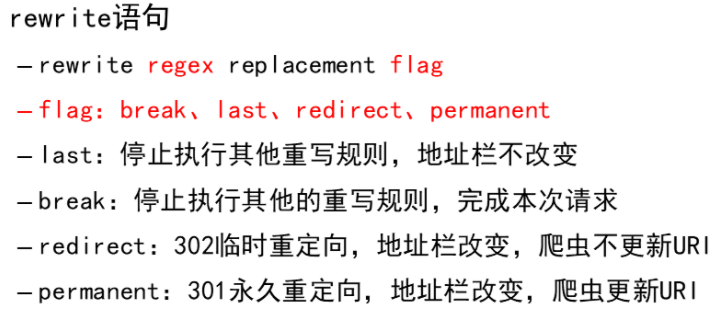

# Nginx

[toc]

## Nginx环境初始化

```shell
]# yum -y install gcc make pcre-devel openssl-devel
]# useradd nginx
]# ./configure --prefix=/usr/local/nginx --user=nginx --group=nginx --with-http_ssl_module
]# make && make install
```

## 用户认证

```shell
location / {
            root   html;
            index  index.html index.htm;
            auth_basic "请输入用户名和密码";
            auth_basic_user_file /usr/local/nginx/pass;
        }

]# htpasswd -c /usr/local/nginx/pass admin	#创建认证用户
New password:
Re-type new password:
Adding password for user admin

#使用用户名和密码访问nginx网页
]# curl http://www.aa.com -u admin:123456
aa
```

## 虚拟主机


## SSL加密

```shell
    server {
        listen       443 ssl;
        server_name  www.cc.com;

        ssl_certificate      cert.pem;	#文件默认路径在conf下
        ssl_certificate_key  cert.key;	#文件默认路径在conf下

        ssl_session_cache    shared:SSL:1m;
        ssl_session_timeout  5m;

        ssl_ciphers  HIGH:!aNULL:!MD5;
        ssl_prefer_server_ciphers  on;

        location / {
            root   cc;
            index  index.html index.htm;
        }
    }


]# openssl genrsa > cert.key 2048
]# openssl req -new -x509 -key cert.key > cert.pem	#-x509：生成自签名的证书
]# curl -k https://www.cc.com
cc

```


## Nginx自动启动配置

### 配置为service服务

```shell
[root@centos7 ~]# vim /usr/lib/systemd/system/nginx.service
[Unit]
Description=The Nginx HTTP Server	#描述信息
After=network.target remote-fs.target nss-lookup.target
#指定启动nginx之前需要其他的其他服务，如network.target等
[Service]
Type=forking	#Type为服务的类型，仅启动一个主进程的服务为simple，需要启动若干子进程的服务为forking
ExecStart=/usr/local/nginx/sbin/nginx	#设置执行systemctl start nginx后需要启动的具体命令.
ExecReload=/usr/local/nginx/sbin/nginx -s reload
#设置执行systemctl reload nginx后需要执行的具体命令.
ExecStop=/bin/kill -s QUIT ${MAINPID}
#设置执行systemctl stop nginx后需要执行的具体命令.
[Install]
WantedBy=multi-user.target
```

### 加入开机自启动项目

```shell
echo "/usr/local/nginx/sbin/nginx" >> rc.d/rc.local
```

## Apache

​		动态网站运行过程中，php脚本需要对网站目录有读写权限，而php-fpm默认启动用户为apache。 php程序是由php-fpm处理的，php-fpm以apache身份运行。为了让php-fpm程序能对html目录进行读写操作，需要为他授予权限。

```shell
]# ps aux | grep php-fpm
root       476  0.0  0.7 329944 10224 ?        Ss   08:58   0:00 php-fpm: master process (/etc/php-fpm.conf)
apache     648  0.0  2.5 361384 36956 ?        S    08:58   0:06 php-fpm: pool www
apache     649  0.0  3.0 368556 44244 ?        S    08:58   0:07 php-fpm: pool www
apache     650  0.0  0.9 337828 13328 ?        S    08:58   0:06 php-fpm: pool www
apache     651  0.0  2.3 359100 34564 ?        S    08:58   0:07 php-fpm: pool www
apache     652  0.0  3.1 370380 46088 ?        S    08:58   0:06 php-fpm: pool www
apache     902  0.0  2.5 361888 37008 ?        S    09:22   0:07 php-fpm: pool www
apache    2349  0.0  3.0 369384 44644 ?        S    13:07   0:02 php-fpm: pool www

```

## Rewrite




```shell
    server {
        listen 80;
        server_name www.bb.com;

         location / {
            root   bb;
            index  index.html index.htm;
            rewrite ^/(.*) http://www.aa.com/$1 permanent;
        }

    }

]# curl -L http://www.bb.com/bb.html
this has been changed to aa

```


## Nginx http调度

### 算法

> 轮询：默认算法，逐一循环调度
>
> weight：指定轮询几率，权重值和访问率成正比
>
> ip_hash：根据客户端IP分配固定的后端服务器

### 配置模板


## Nginx TCP/UDP调度

> 模块：--with-stream参数开启4层代理模块

```shell
stream {
            upstream backend {
               server 192.168.2.100:22;     #后端SSH服务器的IP和端口
               server 192.168.2.200:22;
}
            server {
                listen 12345;                #Nginx监听的端口
                 proxy_pass backend;
             }
}
```


## Nginx状态页面

> 模块：--with-http_stub_status_module

```shell
]# vim /usr/local/nginx/conf/nginx.conf
...
location /status {			# status自定义的网页路径
	stub_status on;			
	allow 192.168.4.0/24;	# 允许访问该网页的网段
	deny all;				# 拒绝谁访问该状态页面
}
```

## Nginx页面压缩处理

```shell
# 将服务器响应内容压缩后传输给客户端，可以节约服务器网络带宽
]# vim /usr/local/nginx/conf/nginx.conf
http {
.. ..
gzip on;                            //开启压缩
gzip_min_length 1000;                //小文件不压缩
gzip_comp_level 4;                //压缩比率
gzip_types text/plain text/css application/json application/x-javascript text/xml application/xml application/xml+rss text/javascript;
                                    //对特定文件压缩，类型参考mime.types
.. ..
}
```

## Nginx服务器内存缓存

```shell
# 如果需要处理大量静态文件，可以将文件缓存在内存，下次访问会更快
http { 
open_file_cache  max=2000  inactive=20s;
        open_file_cache_valid    60s;
        open_file_cache_min_uses 5;
        open_file_cache_errors   off;
//设置服务器最大缓存2000个文件句柄，关闭20秒内无请求的文件句柄
//文件句柄的有效时间是60秒，60秒后过期
//只有访问次数超过5次会被缓存
} 
```

## Nginx隐藏版本号

```shell
# 请求头部信息中会显示Nginx的版本号
]# curl -I http://192.168.4.11/    # -I 只显示头部
HTTP/1.1 200 OK
Server: nginx/1.12.2
Date: Fri, 10 Dec 2021 07:51:08 GMT
Content-Type: text/html
Content-Length: 612
Last-Modified: Fri, 10 Dec 2021 07:46:16 GMT
Connection: keep-alive
ETag: "61b305c8-264"
Accept-Ranges: bytes

# 隐藏版本信息
]# vim /usr/local/nginx/conf/nginx.conf
17 http {
18     server_tokens off;
... ...
再次访问不存在的路径，版本号消失
```


## 防止DOS,DDOS攻击

- 调整前

```shell
# 压力测试，每批次发送100个请求给web服务器，一共发200个
]# yum install -y httpd-tools
]# ab -c 100 -n 200 http://192.168.4.11/ 
... ...
Benchmarking 192.168.4.11 (be patient)
Completed 100 requests
Completed 200 requests
Finished 200 requests    # 发送200个请求完成
... ... 
Complete requests:      200   # 完成了200个请求
Failed requests:        0     # 0个失败
... ...
```

- 调整方法

```shell
# This is used to limit the request processing rate per a defined key, in particular, the processing rate of requests coming from a single IP address.
# 配置nginx连接共享内存为10M，每秒钟只接收一个请求，最多有5个请求排队，多余的拒绝
]# vim /usr/local/nginx/conf/nginx.conf
 17 http {
 18     limit_req_zone $binary_remote_addr zone=one:10m rate=1r/s;   # 添加
... ...
 37     server {
 38         listen       80;
 39         server_name  localhost;
 40         limit_req zone=one burst=5;  # 添加
[root@node1 ~]# /usr/local/nginx/sbin/nginx -s reload
```


- 验证

```shell
]# ab -c 100 -n 200 http://192.168.4.11/ 
... ...
Benchmarking 192.168.4.11 (be patient)
Completed 100 requests
Completed 200 requests
Finished 200 requests
... ...
Complete requests:      200
Failed requests:        194   # 失败了194个
... ...
```

## 拒绝某些类型的请求

- 用户使用HTTP协议访问服务器，一定是通过某种方法访问的。
- 最常用的HTTP方法
  - GET：在浏览器中输入网址、在页面中点击超链接、搜索表单。
  - POST：常用于登陆、提交数据的表单
- 其他HTTP方法不常用，如：
  - HEAD：获得报文首部。HEAD 方法和 GET 方法一样，只是不返回报文主体部分。
  - PUT：传输文件。要求在请求报文的主体中包含文件内容，然后保存到请求 URI 指定的位置。
  - DELETE：删除文件。DELETE 方法按请求 URI 删除指定的资源。

```shell
# 使用GET和HEAD方法访问nginx。两种方法都可以访问
[root@zzgrhel8 ~]# curl -i -X GET http://192.168.4.11/
[root@zzgrhel8 ~]# curl -i -X HEAD http://192.168.4.11/


# 配置nginx只接受GET和POST方法
[root@node1 ~]# vim /usr/local/nginx/conf/nginx.conf
... ...
 37     server {
 38         listen       80;
 39         if ($request_method !~ ^(GET|POST)$ ) {
 40             return 444;
 41         }
... ...
# $request_method是内置变量，表示请求方法。~表示正则匹配，!表示取反。^表示开头，$表示结尾，|表示或

[root@node1 ~]# /usr/local/nginx/sbin/nginx -s reload

# 使用GET和HEAD方法访问nginx。只有GET可以工作
[root@zzgrhel8 ~]# curl -i -X GET http://192.168.4.11/
[root@zzgrhel8 ~]# curl -i -X HEAD http://192.168.4.11/
```

## 防止缓冲区溢出

- 缓冲区溢出定义：程序企图在预分配的缓冲区之外写数据。
- 漏洞危害：用于更改程序执行流，控制函数返回值，执行任意代码。

```shell
# 配置nginx缓冲区大小，防止缓冲区溢出
[root@node1 ~]# vim /usr/local/nginx/conf/nginx.conf
... ...
 17 http {
 18     client_body_buffer_size     1k;
 19     client_header_buffer_size   1k;
 20     client_max_body_size        1k;
 21     large_client_header_buffers 2 1k;
... ...
[root@node1 ~]# /usr/local/nginx/sbin/nginx -s reload
```

## 优化Nginx并发

```shell
worker_processes  2;                    //与CPU核心数量一致
worker_connections 65535;        //每个worker最大并发连接数

# 注意还需要调整Linux内核参数中的最大文件数
]# ulimit -a	#查看所有属性值
core file size          (blocks, -c) 0
data seg size           (kbytes, -d) unlimited
scheduling priority             (-e) 0
file size               (blocks, -f) unlimited
pending signals                 (-i) 3802
max locked memory       (kbytes, -l) 64
max memory size         (kbytes, -m) unlimited
open files                      (-n) 1024	#需要调整该选项
pipe size            (512 bytes, -p) 8
POSIX message queues     (bytes, -q) 819200
real-time priority              (-r) 0
stack size              (kbytes, -s) 8192
cpu time               (seconds, -t) unlimited
max user processes              (-u) 3802
virtual memory          (kbytes, -v) unlimited
file locks                      (-x) unlimited

]# ulimit -Hn 100000                //设置硬限制（临时规则）
]# ulimit -Sn 100000                //设置软限制（临时规则）
]# vim /etc/security/limits.conf
#用户或组    硬限制或软限制    需要限制的项目   限制的值
*               soft    nofile            100000
*               hard    nofile            100000
```

## 解决414请求URI头部过长问题

```shell
http {
client_header_buffer_size    1k;        //默认请求包头信息的缓存    
large_client_header_buffers  4 4k;        //大请求包头部信息的缓存个数与容量
.. ..
}
```

## 客户端浏览器缓存数据

```shell
location ~* \.(jpg|jpeg|gif|png|css|js|ico|xml)$ {
                root bb;
                expires        30d;	#定义客户端缓存时间为30天
}
```

