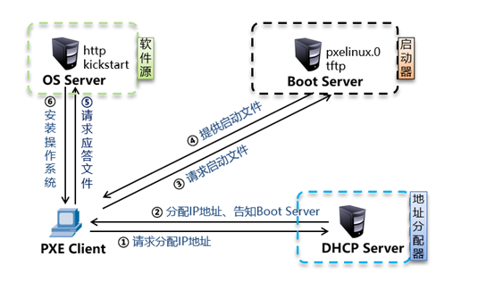

# pxe

[toc]



## DHCP

```shell
]# yum  -y   install   dhcp
]# vim   /etc/dhcp/dhcpd.conf
#末行模式下  :r   /usr/share/doc/dhcp*/dhcpd.conf.example
subnet 192.168.4.0 netmask 255.255.255.0 {	#分配网段
  range 192.168.4.10 192.168.4.20;	#分配IP地址范围
  option domain-name-servers 8.8.8.8;	#分配IP地址范围
  option routers 192.168.4.254;	#分配的网关地址
  default-lease-time 600;
  max-lease-time 7200;
  next-server 192.168.4.5;	#下一个服务器的IP地址
  filename "pxelinux.0";	#指明网卡引导文件名称
}

```


## TFTP

```shell
#部署pxelinux.0文件
]# yum -y install tftp-server
]# yum provides */pxelinux.0
]# rpm -ql syslinux | grep pxelinux.0
/usr/share/syslinux/gpxelinux.0
/usr/share/syslinux/pxelinux.0
]# cp /usr/share/syslinux/pxelinux.0 /var/lib/tftpboot/

#部署菜单文件
]# mkdir /var/lib/tftpboot/pxelinux.cfg
]# cp /mydvd/isolinux/isolinux.cfg /var/lib/tftpboot/pxelinux.cfg/default

#部署图形模块(vesamenu.c32)与背景图片（splash.png)
]# cp /mydvd/isolinux/vesamenu.c32 /mydvd/isolinux/splash.png /var/lib/tftpboot/

#部署启动内核(vmlinuz)与驱动程序（initrd.img）
]# cp /mydvd/isolinux/vmlinuz /mydvd/isolinux/initrd.img /var/lib/tftpboot/

]# ls /var/lib/tftpboot/
initrd.img  pxelinux.cfg  vesamenu.c32
pxelinux.0  splash.png    vmlinuz

#修改菜单文件内容
]# vim /var/lib/tftpboot/pxelinux.cfg/default
1 default  vesamenu.c32       #默认加载运行图形模块
2 timeout 600                       #读秒时间60秒，1/10秒
此处省略一万字……..
10 menu background  splash.png            #背景图片
11 menu title  NSD   PXE    Server       #菜单界面的标题
此处省略一万字……..
61 label  linux
62   menu label  ^Install  CentOS 7    #界面显示内容
63   menu  default           #读秒结束后默认的选项
64   kernel  vmlinuz          #加载内核
65   append  initrd=initrd.img    #加载驱动程序
...以下全部删除

]# systemctl restart tftp

```


## FTP/HTTP

```
]# yum -y install vsftpd
]# systemctl restart vsftpd
]# mkdir /var/ftp/centos
]# mount /dev/cdrom  /var/ftp/centos
```


## Kickstart

```shell
]# yum -y install  system-config-kickstart
# system-config-kickstart程序需要Yum仓库的支持才能显示软件包的选择，必须要求Yum仓库的标识为[development]
]# vim   /etc/yum.repos.d/mydvd.repo 
[development]
name=centos7
baseurl=file:///mydvd          
enabled=1
gpgcheck=0
]# system-config-kickstart 
#将生成的ks.cfg文件拷贝到/var/ftp目录下

#修改菜单文件，指定应答文件获取方式
]#vim   /var/lib/tftpboot/pxelinux.cfg/default
...
append initrd=initrd.img   ks=ftp://192.168.4.7/ks.cfg
```

