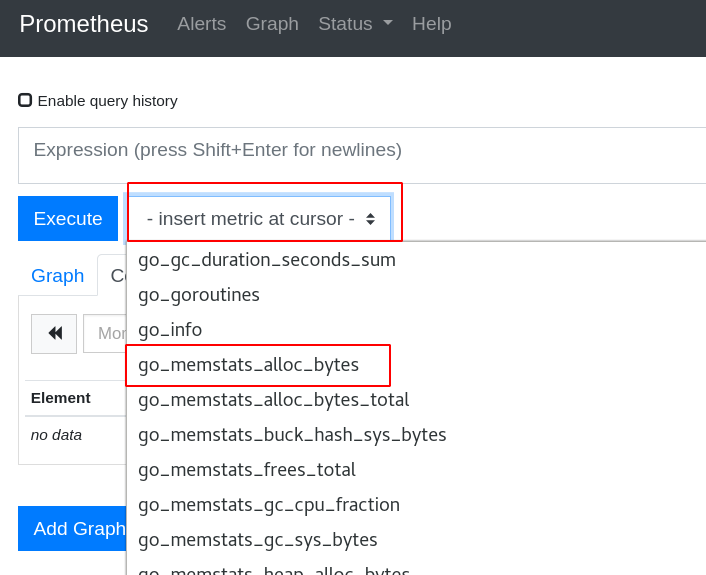
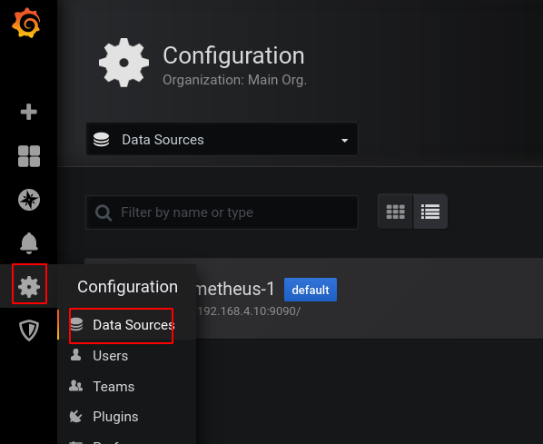

# Prometheus

[toc]


- 和zabbix一样也是一款监控软件，也是一个时序数据库。
- 主要用在容器监控方面，也可以用于常规的主机监控。
- 使用google公司开发的go语言编写。
- Prometheus是一个框架，可以与其他组件完美结合。


## 部署Prometheus服务器

```shell
# prometheus是经过编译后的go语言程序，相当于绿色软件，解压即用
]# mv prometheus-2.17.2.linux-386 /usr/local/prometheus

# 修改配置文件
]# vim /usr/local/prometheus/prometheus.yml
29     - targets: ['服务器IP:9090']

# 注意：prometheus主机的时间需要与真机时间一致，如果不一致，修改时间

# 检查语法
]# /usr/local/prometheus/promtool check config /usr/local/prometheus/prometheus.yml 
Checking /usr/local/prometheus/prometheus.yml
  SUCCESS: 0 rule files found
  
# 创建服务文件
]# vim /usr/lib/systemd/system/prometheus.service
[Unit]
Description=Prometheus Monitoring System
After=network.target

[Service]
ExecStart=/usr/local/prometheus/prometheus \
  --config.file=/usr/local/prometheus/prometheus.yml \
  --storage.tsdb.path=/usr/local/prometheus/data/

[Install]
WantedBy=multi-user.target

# 启服务
]# systemctl daemon-reload 
]# systemctl enable prometheus.service --now
]# ss -tlnp | grep :9090
LISTEN     0      128         :::9090
```

## 查看监控页面

- 访问http://服务器IP:9090


- 被监控的对象称为targets


- 查看监控图像





- 查看监控项的图形信息


## 添加被监控端

- 监控方式：
  - 拉取：pull。监控端联系被监控端，采集数据
  - 推送：push。被监控端主动把数据发给监控端。在prometheus中，push的方式需要额外的组件pushgateway
- 被监控端根据自身运行的服务，可以运行不同的exporter（被监控端安装的、可以与Prometheus通信，实现数据传递的软件）
- exporter列表：https://prometheus.io/docs/instrumenting/exporters/

### 部署通用的监控exporter

- node-exporter用于监控硬件和系统的常用指标
- exporter运行于被监控端，以服务的形式存在。每个不同用途的exporter所使用的端口号都不一样。

```shell
# 部署
]# scp node_exporter-1.0.0-rc.0.linux-amd64.tar.gz 192.168.4.11:/root/

]# tar xf node_exporter-1.0.0-rc.0.linux-amd64.tar.gz 
[root@node1 ~]# mv node_exporter-1.0.0-rc.0.linux-amd64 /usr/local/node_exporter

]# vim /usr/lib/systemd/system/node_exporter.service
[Unit]
Description=node_exporter
After=network.target

[Service]
Type=simple
ExecStart=/usr/local/node_exporter/node_exporter

[Install]
WantedBy=multi-user.target

[root@node1 ~]# systemctl daemon-reload 
[root@node1 ~]# systemctl enable node_exporter.service --now
[root@node1 ~]# ss -tlnp | grep :9100
LISTEN     0      128         :::9100
```

- 在Prometheus服务器上添加监控节点

```shell
# 在配置文件中追加以下内容。特别注意缩进
]# vim /usr/local/prometheus/prometheus.yml 
  - job_name: 'node1'
    static_configs:
    - targets: ['被监控机器的IP:9100']
]# systemctl restart prometheus.service
```

# Grafana

- grafana是一款开源的、跨平台的、基于web的可视化工具
- 展示方式：客户端图表、面板插件
- 数据源可以来自于各种源，如prometheus

## 部署

- 装包、启服务

```shell
# Grafana是一个rpm包，从官网下载后，可以使用yum安装
]# yum install -y grafana-6.7.3-1.x86_64.rpm
]# systemctl enable grafana-server.service --now
```

- 修改配置，对接prometheus

访问http://GrafanaIP:3000。初始用户名和密码都是admin。第一次登陆时，要求改密码初始用户名和密码都是admin。第一次登陆时，要求改密码


对接数据的步骤：

1. 添加数据源
2. 为数据展示选择展示方式(dashboard仪表盘)
3. 查看结果


选择展示方式。导入模板文件，展示不同主题风格




查看结果：


## 监控mariadb数据库

```shell
# 要求被监控机器上需要安装mariadb-server
]# yum install -y mariadb-server
]# systemctl enable mariadb --now
```

被监控设备安装mysql exporter

```shell
# mysql exporter需要访问数据库，所以需要在数据库中为exporter创建授权用户
]# mysql
MariaDB [(none)]> grant all on *.* to jerry@'localhost' identified by '123';    # 创建用户jerry，密码是123
MariaDB [(none)]> exit
```

```shell
# 配置mysql exporter
# 拷贝mysql_exporter到被监控机器
]# mv mysqld_exporter-0.12.1.linux-amd64 /usr/local/mysqld_exporter

# 编写用于连接mysql服务的配置文件
]# vim /usr/local/mysqld_exporter/.my.cnf
[client]
host=127.0.0.1
port=3306
user=jerry
password=123

# 创建service文件
]# vim /usr/lib/systemd/system/mysqld_exporter.service
[Unit]
Description=node_exporter
After=network.target

[Service]
ExecStart=/usr/local/mysqld_exporter/mysqld_exporter \
--config.my-cnf=/usr/local/mysqld_exporter/.my.cnf

[Install]
WantedBy=multi-user.target

# 启服务
]# systemctl daemon-reload
]# systemctl enable mysqld_exporter.service --now
]# ss -tlnp | grep :9104
LISTEN     0      128         :::9104
```

服务器配置Prometheus监控mysql

```shell
# 修改配置文件，追加以下内容：
]# vim /usr/local/prometheus/prometheus.yml 
  - job_name: 'mysql'
    static_configs:
    - targets: ['被监控设备IP:9104']
]# systemctl restart prometheus.service
```

Grafana中导入mysql模板展示mysql exporter数据


