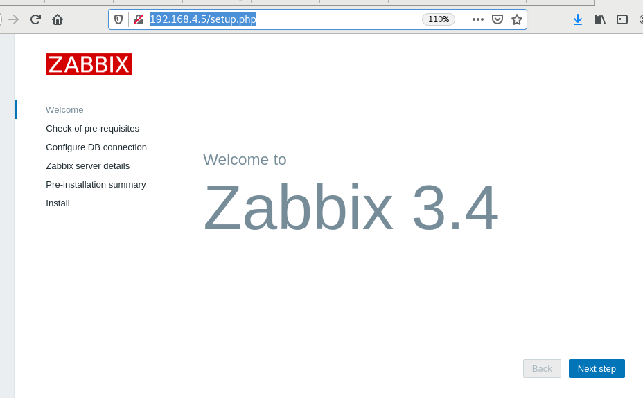

# Zabbix

- 实施监控的实现：
  - 数据采集：使用agent（可安装软件的系统上）、SNMP（简单网络管理协议，用于网络设备的数据采集）
  - 数据存储：使用mysql数据库
  - 数据展示：通过web页面

- zabbix通过在远程主机上安装agent进行数据采集，存储到mysql数据库，通过web页面进行展示。

[toc]

## 环境准备

### Nginx

```shell
]# yum install -y gcc pcre-devel openssl-devel # Nginx依赖包
]# ./configure --with-http_ssl_module    # 配置nginx支持https
]# make && make install
]# vim /usr/local/nginx/conf/nginx.conf
 34     fastcgi_buffers 8 16k;     #缓存php生成的页面内容，8个16k
 35     fastcgi_buffer_size 32k;   #缓存php生产的头部信息，32k
 36     fastcgi_connect_timeout 300;  #连接PHP的超时时间，300秒
 37     fastcgi_send_timeout 300;     #发送请求的超时时间，300秒
 38     fastcgi_read_timeout 300;     #读取请求的超时时间，300秒
 70         location ~ \.php$ {
 71             root           html;
 72             fastcgi_pass   127.0.0.1:9000;
 73             fastcgi_index  index.php;
 74         #    fastcgi_param  SCRIPT_FILENAME  /script    s$fastcgi_script_name;
 75             include        fastcgi.conf;  # 注意改成fastcgi.conf
 76         }
 ]# echo '/usr/local/nginx/sbin/nginx' >> /etc/rc.d/rc.local # 写入到rc.local中的命令，开机时自动执行
 ]# chmod +x /etc/rc.d/rc.local #修改文件权限为可执行
```

### 数据库和PHP动态网站支持

```shell
]# yum install -y php php-fpm php-mysql mariadb-server mariadb-devel
# 配置nginx支持php。配置php可以连接mysql
]# systemctl enable mariadb --now # 端口80
]# systemctl enable php-fpm --now # 端口9000
```


## Zabbix部署

### 依赖包

```shell
]# yum install -y net-snmp-devel libcurl-devel autoconf libevent-devel
```

### 编译安装

```shell
]# ./configure --enable-server --enable-agent --with-mysql=/usr/bin/mysql_config  --with-net-snmp --with-libcurl
# --enable-server: 安装服务器端
# --enable-agent: 安装被控端
# --with-mysql: 指定mysql数据库配置程序
# --with-net-snmp: 配置可以通过snmp收集数据
# --with-libcurl: 启用curl库，以便zabbix可以通过curl连接web服务
# --enable-proxy: 启动proxy代理，不必安装
```


### 数据库初始化

```mysql
# 1. 创建zabbix存储数据的数据库。创建名为zabbix的数据库，使用的字符集是utf8
[root@zabbixserver ~]# mysql
MariaDB [(none)]> create database zabbix default charset utf8;

# 2. 创建名为zabbix的用户，密码也是zabbix，可以对zabbix数据库拥有全部权限。zabbix@'%'格式是：zabbix@客户端地址
# 在mysql中，%表示0到多个任意字符
MariaDB [(none)]> grant all on zabbix.* to zabbix@'%' identified by 'zabbix';
# 授权zabbix用户可以在本机登陆
MariaDB [(none)]> grant all on zabbix.* to zabbix@'localhost' identified by 'zabbix';
MariaDB [(none)]> exit

# 3. 导入zabbix表结构，3个sql文件按顺序导入
[root@zabbixserver ~]# cd lnmp_soft/zabbix-3.4.4/database/mysql/
[root@zabbixserver mysql]# ls
data.sql  images.sql  schema.sql
# -u指定用户名，-p指定密码，第3个zabbix是数据库
[root@zabbixserver mysql]# mysql -uzabbix -pzabbix zabbix < schema.sql 
[root@zabbixserver mysql]# mysql -uzabbix -pzabbix zabbix < images.sql 
[root@zabbixserver mysql]# mysql -uzabbix -pzabbix zabbix < data.sql
```


### 配置service和conf

#### Server端

```shell
]# vim /usr/local/etc/zabbix_server.conf
 12 # ListenPort=10051    # 不用改，了解端口号
 38 LogFile=/tmp/zabbix_server.log   # 不用改，日志文件位置
 85 DBHost=localhost      # 数据库服务器地址
 95 DBName=zabbix         # 不用改，数据库名
111 DBUser=zabbix         # 不用改，连接数据库的用户
119 DBPassword=zabbix     # 连接数据库的密码

]# useradd -s /sbin/nologin zabbix #创建用于运行zabbix的用户

]# vim /usr/lib/systemd/system/zabbix_server.service
[Unit]
Description=zabbix server
After=network.target remote-fs.target nss-lookup.target

[Service]
Type=forking
PIDFile=/tmp/zabbix_server.pid
ExecStart=/usr/local/sbin/zabbix_server
ExecStop=/bin/kill $MAINPID

[Install]
WantedBy=multi-user.target

]# systemctl daemon-reload
]# systemctl enable zabbix_server.service
]# systemctl start zabbix_server.service
]# ss -tlnp | grep :10051
LISTEN     0      128          *:10051

```

```shell
Server端的agent配置
]# vim /usr/local/etc/zabbix_agentd.conf
 30 LogFile=/tmp/zabbix_agentd.log   # 不用改，日志位置
 93 Server=127.0.0.1,192.168.4.5     # 指定接受哪些服务器监控
101 # ListenPort=10050               # 不用改，指定端口号
134 ServerActive=127.0.0.1,192.168.4.5  # 主动汇报信息给哪些服务器
145 Hostname=zabbixserver           # 本机的主机名
280 UnsafeUserParameters=1           # 允许用户自定义监控项

]# vim /usr/lib/systemd/system/zabbix_agentd.service
[Unit]
Description=zabbix agent
After=network.target remote-fs.target nss-lookup.target

[Service]
Type=forking
PIDFile=/tmp/zabbix_agentd.pid
ExecStart=/usr/local/sbin/zabbix_agentd
ExecStop=/bin/kill $MAINPID

[Install]
WantedBy=multi-user.target

]# systemctl daemon-reload
]# systemctl start zabbix_agentd.service
]# systemctl enable zabbix_agentd.service
]# ss -tlnp | grep :10050
LISTEN     0      128          *:10050
```


#### Agent端

### 通过web初始化zabbix

```shell
]# cp -r lnmp_soft/zabbix-3.4.4/frontends/php/* /usr/local/nginx/html/
]# chown -R apache:apache /usr/local/nginx/html/
# nginx运行期间，调用php-fpm服务，php-fpm需要向web目录中修改文件。php-fpm的运行用户是apache，所以apache用户需要对该目录有写权限
# http访问zabbix的serverip/index.php，首次访问，将会自动跳转到安装页面：http://zabbix的serverip/setup.php
```



