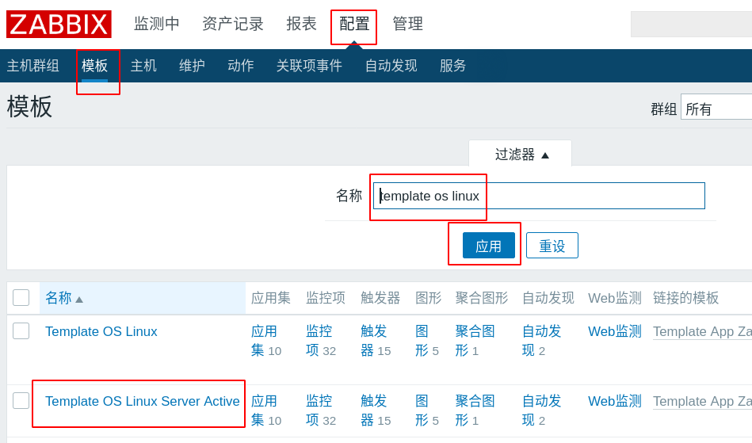

# Zabbix

[toc]

- *实施监控的实现：*
  - *数据采集：使用agent（可安装软件的系统上）、SNMP（简单网络管理协议，用于网络设备的数据采集）*
  - *数据存储：使用mysql数据库*
  - *数据展示：通过web页面*

- *zabbix通过在远程主机上安装agent进行数据采集，存储到mysql数据库，通过web页面进行展示。*

[toc]

## 环境准备

### Nginx

```shell
]# yum install -y gcc pcre-devel openssl-devel # Nginx依赖包
]# ./configure --with-http_ssl_module    # 配置nginx支持https
]# make && make install
]# vim /usr/local/nginx/conf/nginx.conf
 34     fastcgi_buffers 8 16k;     #缓存php生成的页面内容，8个16k
 35     fastcgi_buffer_size 32k;   #缓存php生产的头部信息，32k
 36     fastcgi_connect_timeout 300;  #连接PHP的超时时间，300秒
 37     fastcgi_send_timeout 300;     #发送请求的超时时间，300秒
 38     fastcgi_read_timeout 300;     #读取请求的超时时间，300秒
 70         location ~ \.php$ {
 71             root           html;
 72             fastcgi_pass   127.0.0.1:9000;
 73             fastcgi_index  index.php;
 74         #    fastcgi_param  SCRIPT_FILENAME  /script    s$fastcgi_script_name;
 75             include        fastcgi.conf;  # 注意改成fastcgi.conf
 76         }
 ]# echo '/usr/local/nginx/sbin/nginx' >> /etc/rc.d/rc.local # 写入到rc.local中的命令，开机时自动执行
 ]# chmod +x /etc/rc.d/rc.local #修改文件权限为可执行
```

### 数据库和PHP动态网站支持

```shell
]# yum install -y php php-fpm php-mysql mariadb-server mariadb-devel
# 配置nginx支持php。配置php可以连接mysql
]# systemctl enable mariadb --now # 端口80
]# systemctl enable php-fpm --now # 端口9000
```


## Zabbix部署

### 依赖包

```shell
]# yum install -y net-snmp-devel libcurl-devel autoconf libevent-devel
```

### 编译安装

```shell
]# ./configure --enable-server --enable-agent --with-mysql=/usr/bin/mysql_config  --with-net-snmp --with-libcurl
# --enable-server: 安装服务器端
# --enable-agent: 安装被控端
# --with-mysql: 指定mysql数据库配置程序
# --with-net-snmp: 配置可以通过snmp收集数据
# --with-libcurl: 启用curl库，以便zabbix可以通过curl连接web服务
# --enable-proxy: 启动proxy代理，不必安装
```


### 数据库初始化

```mysql
# 1. 创建zabbix存储数据的数据库。创建名为zabbix的数据库，使用的字符集是utf8
[root@zabbixserver ~]# mysql
MariaDB [(none)]> create database zabbix default charset utf8;

# 2. 创建名为zabbix的用户，密码也是zabbix，可以对zabbix数据库拥有全部权限。zabbix@'%'格式是：zabbix@客户端地址
# 在mysql中，%表示0到多个任意字符
MariaDB [(none)]> grant all on zabbix.* to zabbix@'%' identified by 'zabbix';
# 授权zabbix用户可以在本机登陆
MariaDB [(none)]> grant all on zabbix.* to zabbix@'localhost' identified by 'zabbix';
MariaDB [(none)]> exit

# 3. 导入zabbix表结构，3个sql文件按顺序导入
[root@zabbixserver ~]# cd lnmp_soft/zabbix-3.4.4/database/mysql/
[root@zabbixserver mysql]# ls
data.sql  images.sql  schema.sql
# -u指定用户名，-p指定密码，第3个zabbix是数据库
[root@zabbixserver mysql]# mysql -uzabbix -pzabbix zabbix < schema.sql 
[root@zabbixserver mysql]# mysql -uzabbix -pzabbix zabbix < images.sql 
[root@zabbixserver mysql]# mysql -uzabbix -pzabbix zabbix < data.sql
```


### 配置service和conf

#### Server端

```shell
]# vim /usr/local/etc/zabbix_server.conf
 12 # ListenPort=10051    # 不用改，了解端口号
 38 LogFile=/tmp/zabbix_server.log   # 不用改，日志文件位置
 85 DBHost=localhost      # 数据库服务器地址
 95 DBName=zabbix         # 不用改，数据库名
111 DBUser=zabbix         # 不用改，连接数据库的用户
119 DBPassword=zabbix     # 连接数据库的密码

]# useradd -s /sbin/nologin zabbix #创建用于运行zabbix的用户

]# vim /usr/lib/systemd/system/zabbix_server.service
[Unit]
Description=zabbix server
After=network.target remote-fs.target nss-lookup.target

[Service]
Type=forking
PIDFile=/tmp/zabbix_server.pid
ExecStart=/usr/local/sbin/zabbix_server
ExecStop=/bin/kill $MAINPID

[Install]
WantedBy=multi-user.target

]# systemctl daemon-reload
]# systemctl enable zabbix_server.service
]# systemctl start zabbix_server.service
]# ss -tlnp | grep :10051
LISTEN     0      128          *:10051

```

```shell
Server端的agent配置
]# vim /usr/local/etc/zabbix_agentd.conf
 30 LogFile=/tmp/zabbix_agentd.log   # 不用改，日志位置
 93 Server=127.0.0.1,192.168.4.5     # 指定接受哪些服务器监控
101 # ListenPort=10050               # 不用改，指定端口号
134 ServerActive=127.0.0.1,192.168.4.5  # 主动汇报信息给哪些服务器
145 Hostname=zabbixserver           # 本机的主机名
280 UnsafeUserParameters=1           # 允许用户自定义监控项

]# vim /usr/lib/systemd/system/zabbix_agentd.service
[Unit]
Description=zabbix agent
After=network.target remote-fs.target nss-lookup.target

[Service]
Type=forking
PIDFile=/tmp/zabbix_agentd.pid
ExecStart=/usr/local/sbin/zabbix_agentd
ExecStop=/bin/kill $MAINPID

[Install]
WantedBy=multi-user.target

]# systemctl daemon-reload
]# systemctl start zabbix_agentd.service
]# systemctl enable zabbix_agentd.service
]# ss -tlnp | grep :10050
LISTEN     0      128          *:10050
```


#### Agent端

```shell
# 监控端(zabbix server)和被控端使用的软件是同一个，只是启用不同的功能
[root@zabbixserver ~]# scp lnmp_soft/zabbix-3.4.4.tar.gz 192.168.4.100:/root

# 安装编译agent需要的依赖环境
[root@web1 ~]# yum install -y gcc pcre-devel autoconf

# 编译agent
[root@web1 ~]# tar xf zabbix-3.4.4.tar.gz 
[root@web1 ~]# cd zabbix-3.4.4/
[root@web1 zabbix-3.4.4]# ./configure --enable-agent
[root@web1 zabbix-3.4.4]# make && make install

# 修改配置文件
[root@web1 ~]# vim /usr/local/etc/zabbix_agentd.conf
 30 LogFile=/tmp/zabbix_agentd.log   # 日志位置，不用改
 69 EnableRemoteCommands=1    # 允许监控端远程执行命令
 93 Server=127.0.0.1,192.168.4.5   # 允许自己和监控端进行数据采集
134 ServerActive=127.0.0.1,192.168.4.5  # 允许自己和监控端主动监控
145 Hostname=web1             # 自己的主机名
280 UnsafeUserParameters=1    # 允许用户自定义监控项

# 配置服务
[root@zabbixserver ~]# scp /usr/lib/systemd/system/zabbix_agentd.service 192.168.4.100:/usr/lib/systemd/system/
[root@web1 ~]# useradd -s /sbin/nologin zabbix
[root@web1 ~]# systemctl daemon-reload 
[root@web1 ~]# systemctl start zabbix_agentd.service 
[root@web1 ~]# systemctl enable zabbix_agentd.service 
[root@web1 ~]# ss -tlnp | grep :10050
LISTEN     0      128          *:10050
```


### 通过web初始化zabbix

```shell
]# cp -r lnmp_soft/zabbix-3.4.4/frontends/php/* /usr/local/nginx/html/
]# chown -R apache:apache /usr/local/nginx/html/
# nginx运行期间，调用php-fpm服务，php-fpm需要向web目录中修改文件。php-fpm的运行用户是apache，所以apache用户需要对该目录有写权限
# http访问zabbix的serverip/index.php，首次访问，将会自动跳转到安装页面：http://zabbix的serverip/setup.php
```


- 根据上面红色报错，解决zabbix web依赖的内容

  

```shell
# 安装依赖的软件包
[root@zabbixserver ~]# yum install -y php-gd php-xml php-bcmath php-mbstring
# 修改php.ini文件
[root@zabbixserver ~]# vim /etc/php.ini
 672 post_max_size = 16M
 384 max_execution_time = 300
 394 max_input_time = 300
 878 date.timezone = Asia/Shanghai
[root@zabbixserver ~]# systemctl restart php-fpm
# 刷新web页
```


连接数据库的密码，也是zabbix


默认的登陆用户是admin，密码是zabbix。

## 常用监控指标

- CPU idle time：CPU空闲时间。不宜过低。
- Processor load(1 min average per core) / Processor load(5 min average per core) / Processor load(15 min average per core)：每核心1分钟、5分钟、15分钟的平均负载。这个值不应长期大于1。
- Free disk sapce on /：根分区剩余的空间
- Free disk sapce on /(percentage)：根分区剩余的空间百分比
- Available memory：可用内存
- Incoming network traffic on eth0：eth0网卡进入的流量
- Outgoing network traffic on eth0：eth0网卡外出的流量
- Maximum number of processes：系统最多运行的进程数
- Number of logged in users：已登陆的用户数

## 自定义监控项

1. 在被控端创建key。被控端被监控的内容叫作key，可以理解为它就是一个变量名，具体的名字自己决定。
2. 在web页面中创建监控项。监控项对应key值。
3. 监控项存在应用集中。应用集就是相似监控项的集合。
4. 应用集存在模板中。一个模板可以包含多个应用集。


### 被控端创建key

- 创建key的语法

```shell
UserParameter=自定义key值,命令
# 命令的执行结果，是key的value
```

- 在web1上声明自定义监控项所包含的配置文件。系统将会到`/usr/local/etc/zabbix_agentd.conf.d/`查找自定义监控项

```shell
]# vim /usr/local/etc/zabbix_agentd.conf
264 Include=/usr/local/etc/zabbix_agentd.conf.d/
#取消该行的屏蔽
```

- 创建自定义配置文件。文件名自定义

```shell
]# vim /usr/local/etc/zabbix_agentd.conf.d/count.line.passwd
UserParameter=count.line.passwd,sed -n '$=' /etc/passwd
# 该用例用于统计agent机器上的用户数量
```

- 验证

```shell
]# systemctl restart zabbix_agentd.service
# 重启agent设备的zabbix agent服务
]# zabbix_get -s 127.0.0.1 -k count.line.passwd
# agent本机验证
]# zabbix_get -s 192.168.4.100 -k count.line.passwd
# server主机验证
# -s指定获取哪台主机的值
# -k指定key
```

### 创建模板

创建名为count.line.passwd的模板。该模板属于名为count-passwd的组，该组不存在则自动创建。


### 创建应用集

创建名为`count_line_passwd`的应用集


### 应用集中创建监控项

创建名为`count_line_passwd_item`的监控项


### 应用模板到主机


## 配置告警

- 默认情况下，监控项不会自动发送告警消息
- 需要配置触发器与告警，并且通过通知方式发送信息给联系人
- 触发器：设置条件，当条件达到时，将会执行某个动作
- 动作：触发器条件达到之后要采取的行为，比如发邮件或执行命令

### Example: 用户数超35后，发送告警邮件

- 当web1的用户数超过35时，认为这是一个问题(Problem)
- 当出现问题时，将会执行动作。
- 执行的动作是给管理员发邮件。
- 给管理员发邮件，还要配置邮件服务器的地址，以及管理员的email地址

#### Example:操作步骤

创建触发器规则


创建名为`password_line_gt_35`的触发器


点击添加后，出现下图:


添加表达式之后的结果如下：


表达式语法：

```shell
{<server>:<key>.<function>(<parameter>)}<operator><constant>
{<主机>:<key>.<函数>(<参数>)}<操作符><常量>
```

例：

```shell
{count.line.passwd:count.line.passwd.last()}>35
# 前一个count.line.passwd是模板
# count.line.passwd是在被控端上定义的key
# last是函数，表示最近的一次取值
# > 是操作符
# 35 是常量
# 以上表达式的含义是：应用count.line.passwd模板的主机，它的count.line.passwd最近一次取值大于35，则状态为“问题”，即Problem
```

创建邮件类型的报警媒介


为用户关联邮箱


创建动作：当出现Problem状态时，给admin发邮件


点击“新的”之后，如下图：


验证

```shell
# 配置zabbix服务器成为邮件服务器
[root@zabbixserver ~]# yum install -y postfix mailx
[root@zabbixserver ~]# systemctl enable postfix --now
[root@zabbixserver ~]# ss -tlnp | grep :25
LISTEN     0      100    127.0.0.1:25

# 在web1上创建用户
[root@web1 ~]# for user in user{1..20}
> do
> useradd $user
> done
[root@web1 ~]# zabbix_get -s 127.0.0.1 -k count.line.passwd
41
```


## 自动发现

- 当被监控的设备非常多的时候，手工添加将会变得非常不方便
- 可以使用自动发现功能，实现添加主机、添加到主机组、 链接模板
- 自动发现流程：
  - 创建自动发现规则
  - 创建动作，当主机被发现之后，执行什么操作
  - 通过动作，添加主机，将模板应用到发现的主机

### 配置自动发现

- 创建自动发现规则


- 创建动作


## 主动监控

- 默认zabbix使用的是被动监控，主被动监控都是针对被监控主机而言的。
- 被动监控：Server向Agent发起请求，索取监控数据。此种模式常用
- 主动监控：Agent向Server发起连接，向Server汇报


### 修改配置文件，只使用主动监控

```shell
]# vim /usr/local/etc/zabbix_agentd.conf
 93 # Server=127.0.0.1,192.168.4.5   # 因为采用主动监控，所以不接受其他主机的查询
118 StartAgents=0   # 不接受被动检查，也不开启任何端口
134 ServerActive=192.168.4.5   # 只向server汇报
183 RefreshActiveChecks=120    # 120秒检查一次配置
264 Include=/usr/local/etc/zabbix_agentd.conf.d/
280 UnsafeUserParameters=1

# 重启服务
[root@web2 ~]# systemctl restart zabbix_agentd.service 
[root@web2 ~]# ss -tlnp | grep :10050    # 端口号消失
```

### 创建主动监控的模板

可以基于现有的模板，克隆之后修改

1. 克隆现有模板


2. 修改克隆的模板，将监控项改为主动监控




克隆的模板有3项不支持主动，把它们禁用


添加使用主动监控的主机


下图中，注意主机名应该与被监控的主机的名字相同


查看最新数据


## 拓扑图和聚合图形

### 拓扑图

- 在zabbix中可以创建拓扑图，反映拓扑结构


添加元素：

- 图标：可以是一个装饰图形，也可以对应具体的设备
- 形状：长方形、圆形
- 链接：连线，多个设备之间才能使用链接

添加交换机图标


添加链接：圈中两台设备，点链接边上的添加


添加2台web服务器


### 聚合图形

- 将常用的页面放到一个统一页面中查看


点击更改之后，添加新望出现在该单元格的数据。


使用同样的方法，点击更他的“更改”


## 监控Nginx示例-自定义监控进阶

### stub_status模块

```shell
# 编译nginx，支持stub_status模块
]# ./configure --with-http_stub_status_module

# 修改配置文件，启用stub_status
]# vim /usr/local/nginx/conf/nginx.conf
 47         location /status {
 48             stub_status on;
 49         }
 
# 访问监控页面
]# curl http://192.168.4.100/status
Active connections: 1 
server accepts handled requests
          1        1        1 
Reading: 0 Writing: 1 Waiting: 0 
# Active connections：当前客户端与nginx之间的连接数。它等于下面Reading / Writing / Waiting之和
# accepts：自nginx启动之后，客户端访问的总量
# handled：自nginx启动之后，处理过的客户端连接总数。
# requests：自nginx启动之后，处理过的客户端请求总数。
# Reading：正在读取HTTP请求头部的连接总数。
# Writing：正在向客户端发送响应的连接总数。
# Waiting：空闲连接。

# 使用工具向服务器发起多个请求
]# yum install -y httpd-tools
# 一共发1000个请求，每次并发数100
]# ab -n 1000 -c 100 http://192.168.4.100/status
]# curl http://192.168.4.100/status
Active connections: 1 
server accepts handled requests
 1040 1040 1004 
Reading: 0 Writing: 1 Waiting: 0
```

### 撰写脚本，获取各项数据

```shell
]# vim /usr/local/bin/nginx_status.sh
#!/bin/bash

case $1 in
active)
    curl -s http://192.168.4.100/status | awk '/Active/{print $NF}';;
waiting)
    curl -s http://192.168.4.100/status | awk '/Waiting/{print $NF}';;
accepts)
    curl -s http://192.168.4.100/status | awk 'NR==3{print $1}';;
esac

]# chmod +x /usr/local/bin/nginx_status.sh
]# nginx_status.sh active
1
]# nginx_status.sh accepts
1047
]# nginx_status.sh waiting
0
```


### 创建key用于zabbix获取各项数据

```shell
# key的语法格式
UserParameter=key[*],<command> $1
# key[*]中的*是参数，将会传给后面的位置变量$1

# 创建声明key的文件
]# vim /usr/local/etc/zabbix_agentd.conf.d/nginx.status
UserParameter=nginx.status[*],/usr/local/bin/nginx_status.sh $1

# 测试key
[root@web1 ~]# systemctl restart zabbix_agentd.service 
[root@web1 ~]# zabbix_get -s 127.0.0.1 -k nginx.status[accepts]
1049
[root@web1 ~]# zabbix_get -s 127.0.0.1 -k nginx.status[active]
1
```

### zabbix  web页面添加监控项


