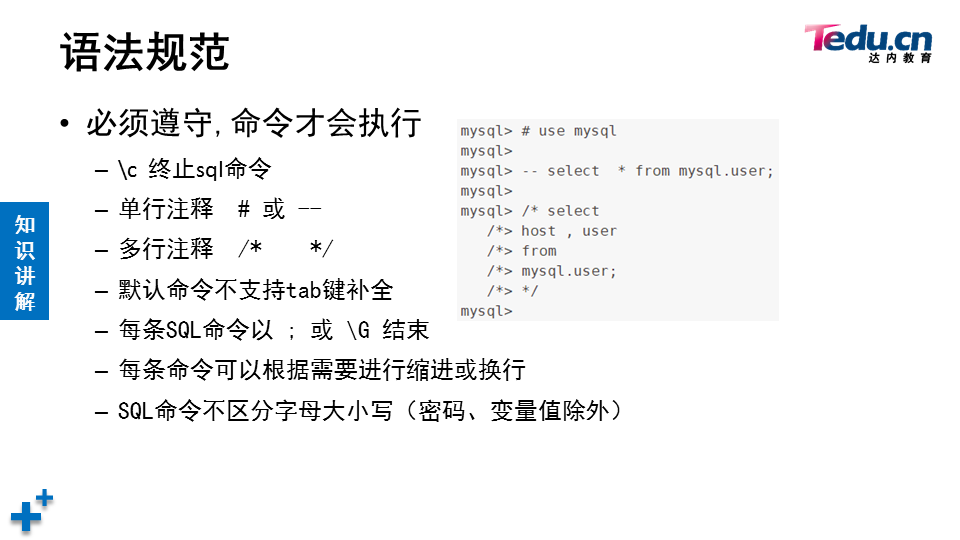

# 数据库

[toc]


关系型数据库系统

```shell
[root@localhost ~]# systemctl start mysqld
[root@localhost ~]# ls /var/lib/mysql   	# 数据库目录
auto.cnf         ib_buffer_pool  mysql               public_key.pem
ca-key.pem       ibdata1         mysql.sock          server-cert.pem
ca.pem           ib_logfile0     mysql.sock.lock     server-key.pem
client-cert.pem  ib_logfile1     performance_schema  sys
client-key.pem   ibtmp1          private_key.pem
[root@localhost ~]# systemctl enable mysqld
[root@localhost ~]# netstat -antpu | grep mysql
tcp6       0      0 :::3306                 :::*                    LISTEN      1491/mysqld
[root@localhost ~]# ls /var/log/mysqld.log  # 数据库日志
/var/log/mysqld.log
[root@localhost ~]# grep -i "password" /var/log/mysqld.log  	# 初始密码
2022-02-07T02:15:50.241310Z 1 [Note] A temporary password is generated for root@localhost: rzqi-qti8qR3
[root@localhost ~]# mysql -hlocalhost -uroot -p'rzqi-qti8qR3'	# 使用初始密码登录
```

```mysql
# 首次使用必须reset密码
mysql> show databases;
ERROR 1820 (HY000): You must reset your password using ALTER USER statement before executing this statement.
# alter user是在登录mysql后修改
mysql> alter user root@"localhost" identified by "123qqq...A";
Query OK, 0 rows affected (0.00 sec)
[root@localhost ~]# mysql -hlocalhost -uroot -p123qqq...A	# 访问本机数据库时-h可以省略

```

```mysql
mysql> select version();
+-----------+
| version() |
+-----------+
| 5.7.17    |
+-----------+
1 row in set (0.00 sec)

mysql> select user();
+----------------+
| user()         |
+----------------+
| root@localhost |
+----------------+
1 row in set (0.00 sec)

mysql> select database();
+------------+
| database() |
+------------+
| sys        |
+------------+
1 row in set (0.00 sec)

mysql> use mysql
Reading table information for completion of table and column names
You can turn off this feature to get a quicker startup with -A

Database changed
mysql> select database();
+------------+
| database() |
+------------+
| mysql      |
+------------+
1 row in set (0.00 sec)

mysql> show tables;
+---------------------------+
| Tables_in_mysql           |
+---------------------------+
| columns_priv              |
| db                        |
| engine_cost               |
...
```


## 修改密码策略&重置密码


```mysql
mysql> show variables like "%password%";
+---------------------------------------+--------+
| Variable_name                         | Value  |
+---------------------------------------+--------+
| default_password_lifetime             | 0      |
| disconnect_on_expired_password        | ON     |
| log_builtin_as_identified_by_password | OFF    |
| mysql_native_password_proxy_users     | OFF    |
| old_passwords                         | 0      |
| report_password                       |        |
| sha256_password_proxy_users           | OFF    |
| validate_password_check_user_name     | OFF    |
| validate_password_dictionary_file     |        |
| validate_password_length              | 8      |
| validate_password_mixed_case_count    | 1      |
| validate_password_number_count        | 1      |
| validate_password_policy              | MEDIUM |
| validate_password_special_char_count  | 1      |
+---------------------------------------+--------+
14 rows in set (0.00 sec)

mysql> set global validate_password_policy=0;
Query OK, 0 rows affected (0.00 sec)

mysql> show variables like "%password%";
+---------------------------------------+-------+
| Variable_name                         | Value |
+---------------------------------------+-------+
| default_password_lifetime             | 0     |
| disconnect_on_expired_password        | ON    |
| log_builtin_as_identified_by_password | OFF   |
| mysql_native_password_proxy_users     | OFF   |
| old_passwords                         | 0     |
| report_password                       |       |
| sha256_password_proxy_users           | OFF   |
| validate_password_check_user_name     | OFF   |
| validate_password_dictionary_file     |       |
| validate_password_length              | 8     |
| validate_password_mixed_case_count    | 1     |
| validate_password_number_count        | 1     |
| validate_password_policy              | LOW   |
| validate_password_special_char_count  | 1     |
+---------------------------------------+-------+
14 rows in set (0.00 sec)

mysql> set global validate_password_length=6;
Query OK, 0 rows affected (0.00 sec)

mysql> show variables like "%password%"
    -> ;
+---------------------------------------+-------+
| Variable_name                         | Value |
+---------------------------------------+-------+
| default_password_lifetime             | 0     |
| disconnect_on_expired_password        | ON    |
| log_builtin_as_identified_by_password | OFF   |
| mysql_native_password_proxy_users     | OFF   |
| old_passwords                         | 0     |
| report_password                       |       |
| sha256_password_proxy_users           | OFF   |
| validate_password_check_user_name     | OFF   |
| validate_password_dictionary_file     |       |
| validate_password_length              | 6     |
| validate_password_mixed_case_count    | 1     |
| validate_password_number_count        | 1     |
| validate_password_policy              | LOW   |
| validate_password_special_char_count  | 1     |
+---------------------------------------+-------+
14 rows in set (0.00 sec)

mysql> alter user root@"localhost" identified by "123456";
Query OK, 0 rows affected (0.00 sec)

```

```shell
# 永久配置
[root@50mysql ~]# vim /etc/my.cnf
[mysqld]
validate_password_length=6
validate_password_policy=0

[root@50mysql ~]# systemctl restart mysqld
[root@50mysql ~]# mysql -uroot -p123456
```

## 破解密码

1. 需要重启数据库，适合线下数据库服务器

```shell
[root@50mysql ~]# vim /etc/my.cnf
[mysqld]
skip-grant-tables	# 跳过授权库MySQL库启动服务 作用连接服务不需要输入密码
#validate_password_length=6
#validate_password_policy=0
[root@50mysql ~]# systemctl restart mysqld
[root@50mysql ~]# mysql  # 不输入密码就可以登陆
mysql> update  mysql.user set authentication_string=password("123qqq...A") 
where user="root" and host="localhost";  修改管理员root 本机登陆密码为  123qqq...A
mysql> flush privileges; 确保修改生效
mysql> exit; 断开连接
[root@50mysql ~]# vim /etc/my.cnf  还原修改
[mysqld]
validate_password_policy=0
validate_password_length=6
#skip-grant-tables
:wq
[root@50mysql ~]# systemctl  restart mysqld 重启服务 
[root@50mysql ~]# mysql -hlocalhost -uroot -p123qqq...A 使用恢复的密码登陆
```

2. 破解线上数据库服务器管理员root 密码

```shell
# 因为/var/lib/mysql/mysql库存放的是 数据库服务器的用户和密码，所以可以拷贝其他数据库服务器的mysql库，覆盖本机的mysql库
[root@50mysql ~]# scp -r 192.168.4.51:/var/lib/mysql/mysql /var/lib/mysql
# 查看mysql服务 父进程的pid
[root@50mysql ~]# pstree -p | grep mysqld | head -1
           |-mysqld(2711)-+-{mysqld}(2712)
# 给mysql服务的父进程发送 SIGHUP信息 (作用重新加载数据库目录下的文件 ，可以重新识别 mysql库里的用户和密码)
[root@50mysql ~]# kill -SIGHUP 2711
```

3. 修改root密码

```shell
# 1.使用alter user 修改 ：数据库管理员连接服务后 修改自己的登陆密码
# 2.mysqladmin修改 （操作系统管理员 修改本机数据库服务的登陆密码）
[root@50mysql ~]# mysqladmin -uroot -pNSD2110...a password "tarena"
# 隐藏旧密码和新密码,根据提示输入密码
[root@50mysql ~]# mysqladmin -uroot -p password
Enter password: 
New password: 
Confirm new password: 
Warning: Since password will be sent to server in plain text, use ssl connection to ensure password safety.
```

## 图形化界面

phpmyadmin

```shell
1. [root@50mysql ~]# yum -y install httpd php php-mysql
2. 解压拷贝phpmyadmin软件到/var/www/html目录
3. # 创建修改主配置文件
   [root@50mysql phpmyadmin]# cp config.sample.inc.php config.inc.php
   [root@50mysql phpmyadmin]# vim +17 config.inc.php  # 在''号里添加plj123
4. 浏览器打开http://192.168.4.50/phpmyadmin页面
```

## 语法规范



## SQL语句分类

SQL 中文意思  结构化查询语言


### select查询

```mysql
# 查询命令格式
select  字段名列表  from  库名.表名； #查看表里的所有行
select  字段名列表  from  库名.表名  where   查询条件 ； #只查看与条件匹配的行

mysql> select 5;	# 查看常量
+---+
| 5 |
+---+
| 5 |
+---+
1 row in set (0.00 sec)

mysql> select @@version;	# 查看mysql环境变量
+-----------+
| @@version |
+-----------+
| 5.7.17    |
+-----------+
1 row in set (0.00 sec)

mysql> select 3+2;	# 查看计算结果
+-----+
| 3+2 |
+-----+
|   5 |
+-----+
1 row in set (0.00 sec)

mysql> select count(*) from mysql.user;	# 查询时使用函数
+----------+
| count(*) |
+----------+
|        2 |
+----------+
1 row in set (0.00 sec)

mysql> select 5*5 as 计算结果; # 对查询结果定义表头
+--------------+
| 计算结果     |
+--------------+
|           25 |
+--------------+
1 row in set (0.00 sec)

mysql> select "里斯" as 姓名;
+--------+
| 姓名   |
+--------+
| 里斯   |
+--------+
1 row in set (0.00 sec)
```

```
导入数据库
[root@50mysql ~]# mysql -uroot -ptarena < tarena.sql
```

```
空       is  null      表头下没有数据
非空     is not null   表头下有数据
```