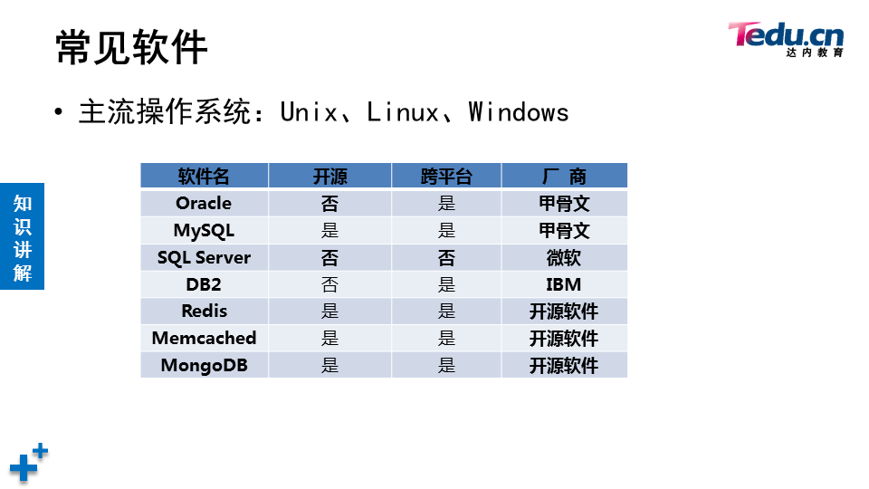
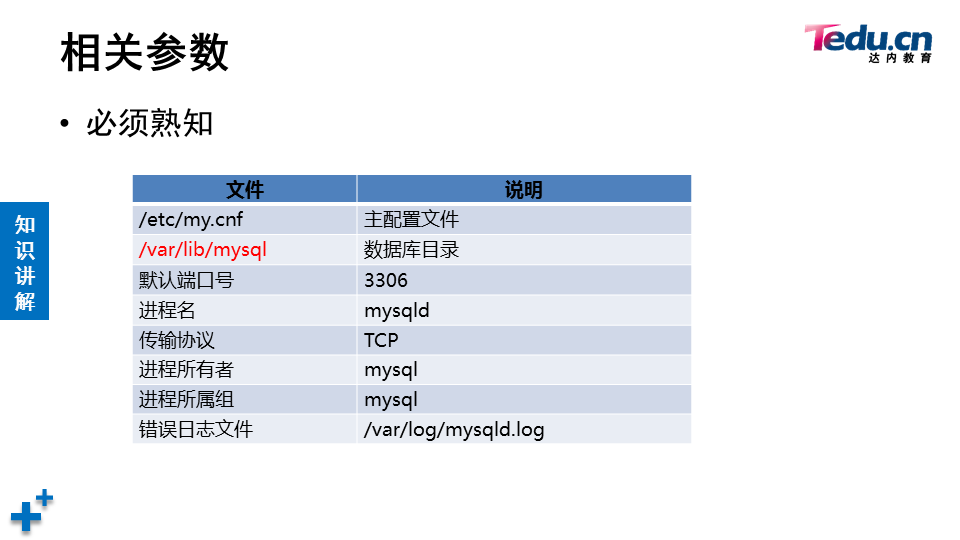
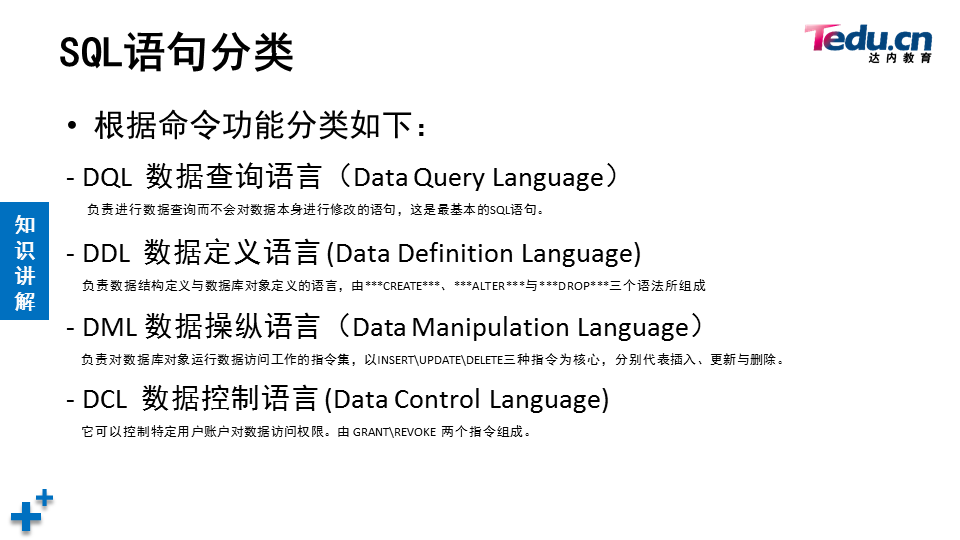
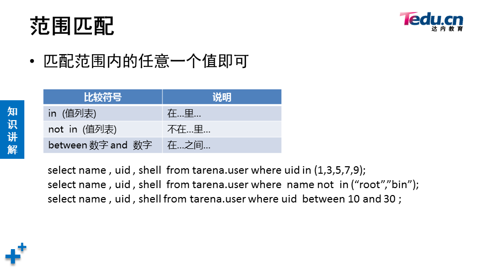
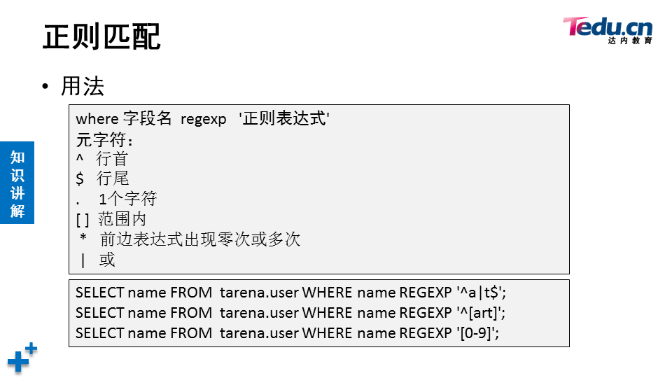

# 数据库

[toc]



关系型数据库系统

```shell
[root@localhost ~]# systemctl start mysqld
[root@localhost ~]# ls /var/lib/mysql   	# 数据库目录
auto.cnf         ib_buffer_pool  mysql               public_key.pem
ca-key.pem       ibdata1         mysql.sock          server-cert.pem
ca.pem           ib_logfile0     mysql.sock.lock     server-key.pem
client-cert.pem  ib_logfile1     performance_schema  sys
client-key.pem   ibtmp1          private_key.pem
[root@localhost ~]# systemctl enable mysqld
[root@localhost ~]# netstat -antpu | grep mysql
tcp6       0      0 :::3306                 :::*                    LISTEN      1491/mysqld
[root@localhost ~]# ls /var/log/mysqld.log  # 数据库日志
/var/log/mysqld.log
[root@localhost ~]# grep -i "password" /var/log/mysqld.log  	# 初始密码
2022-02-07T02:15:50.241310Z 1 [Note] A temporary password is generated for root@localhost: rzqi-qti8qR3
[root@localhost ~]# mysql -hlocalhost -uroot -p'rzqi-qti8qR3'	# 使用初始密码登录
```

```mysql
# 首次使用必须reset密码
mysql> show databases;
ERROR 1820 (HY000): You must reset your password using ALTER USER statement before executing this statement.
# alter user是在登录mysql后修改
mysql> alter user root@"localhost" identified by "123qqq...A";
Query OK, 0 rows affected (0.00 sec)
[root@localhost ~]# mysql -hlocalhost -uroot -p123qqq...A	# 访问本机数据库时-h可以省略

```

```mysql
mysql> select version();
+-----------+
| version() |
+-----------+
| 5.7.17    |
+-----------+
1 row in set (0.00 sec)

mysql> select user();
+----------------+
| user()         |
+----------------+
| root@localhost |
+----------------+
1 row in set (0.00 sec)

mysql> select database();
+------------+
| database() |
+------------+
| sys        |
+------------+
1 row in set (0.00 sec)

mysql> use mysql
Reading table information for completion of table and column names
You can turn off this feature to get a quicker startup with -A

Database changed
mysql> select database();
+------------+
| database() |
+------------+
| mysql      |
+------------+
1 row in set (0.00 sec)

mysql> show tables;
+---------------------------+
| Tables_in_mysql           |
+---------------------------+
| columns_priv              |
| db                        |
| engine_cost               |
...
```



## 修改密码策略&重置密码


```mysql
mysql> show variables like "%password%";
+---------------------------------------+--------+
| Variable_name                         | Value  |
+---------------------------------------+--------+
| default_password_lifetime             | 0      |
| disconnect_on_expired_password        | ON     |
| log_builtin_as_identified_by_password | OFF    |
| mysql_native_password_proxy_users     | OFF    |
| old_passwords                         | 0      |
| report_password                       |        |
| sha256_password_proxy_users           | OFF    |
| validate_password_check_user_name     | OFF    |
| validate_password_dictionary_file     |        |
| validate_password_length              | 8      |
| validate_password_mixed_case_count    | 1      |
| validate_password_number_count        | 1      |
| validate_password_policy              | MEDIUM |
| validate_password_special_char_count  | 1      |
+---------------------------------------+--------+
14 rows in set (0.00 sec)

mysql> set global validate_password_policy=0;
Query OK, 0 rows affected (0.00 sec)

mysql> show variables like "%password%";
+---------------------------------------+-------+
| Variable_name                         | Value |
+---------------------------------------+-------+
| default_password_lifetime             | 0     |
| disconnect_on_expired_password        | ON    |
| log_builtin_as_identified_by_password | OFF   |
| mysql_native_password_proxy_users     | OFF   |
| old_passwords                         | 0     |
| report_password                       |       |
| sha256_password_proxy_users           | OFF   |
| validate_password_check_user_name     | OFF   |
| validate_password_dictionary_file     |       |
| validate_password_length              | 8     |
| validate_password_mixed_case_count    | 1     |
| validate_password_number_count        | 1     |
| validate_password_policy              | LOW   |
| validate_password_special_char_count  | 1     |
+---------------------------------------+-------+
14 rows in set (0.00 sec)

mysql> set global validate_password_length=6;
Query OK, 0 rows affected (0.00 sec)

mysql> show variables like "%password%"
    -> ;
+---------------------------------------+-------+
| Variable_name                         | Value |
+---------------------------------------+-------+
| default_password_lifetime             | 0     |
| disconnect_on_expired_password        | ON    |
| log_builtin_as_identified_by_password | OFF   |
| mysql_native_password_proxy_users     | OFF   |
| old_passwords                         | 0     |
| report_password                       |       |
| sha256_password_proxy_users           | OFF   |
| validate_password_check_user_name     | OFF   |
| validate_password_dictionary_file     |       |
| validate_password_length              | 6     |
| validate_password_mixed_case_count    | 1     |
| validate_password_number_count        | 1     |
| validate_password_policy              | LOW   |
| validate_password_special_char_count  | 1     |
+---------------------------------------+-------+
14 rows in set (0.00 sec)

mysql> alter user root@"localhost" identified by "123456";
Query OK, 0 rows affected (0.00 sec)

```

```shell
# 永久配置
[root@50mysql ~]# vim /etc/my.cnf
[mysqld]
validate_password_length=6
validate_password_policy=0

[root@50mysql ~]# systemctl restart mysqld
[root@50mysql ~]# mysql -uroot -p123456
```

## 破解密码

1. 需要重启数据库，适合线下数据库服务器

```shell
[root@50mysql ~]# vim /etc/my.cnf
[mysqld]
skip-grant-tables	# 跳过授权库MySQL库启动服务 作用连接服务不需要输入密码
#validate_password_length=6
#validate_password_policy=0
[root@50mysql ~]# systemctl restart mysqld
[root@50mysql ~]# mysql  # 不输入密码就可以登陆
mysql> update  mysql.user set authentication_string=password("123qqq...A") 
where user="root" and host="localhost";  修改管理员root 本机登陆密码为  123qqq...A
mysql> flush privileges; 确保修改生效
mysql> exit; 断开连接
[root@50mysql ~]# vim /etc/my.cnf  还原修改
[mysqld]
validate_password_policy=0
validate_password_length=6
#skip-grant-tables
:wq
[root@50mysql ~]# systemctl  restart mysqld 重启服务 
[root@50mysql ~]# mysql -hlocalhost -uroot -p123qqq...A 使用恢复的密码登陆
```

2. 破解线上数据库服务器管理员root 密码

```shell
# 因为/var/lib/mysql/mysql库存放的是 数据库服务器的用户和密码，所以可以拷贝其他数据库服务器的mysql库，覆盖本机的mysql库
[root@50mysql ~]# scp -r 192.168.4.51:/var/lib/mysql/mysql /var/lib/mysql
# 查看mysql服务 父进程的pid
[root@50mysql ~]# pstree -p | grep mysqld | head -1
           |-mysqld(2711)-+-{mysqld}(2712)
# 给mysql服务的父进程发送 SIGHUP信息 (作用重新加载数据库目录下的文件 ，可以重新识别 mysql库里的用户和密码)
[root@50mysql ~]# kill -SIGHUP 2711
```

3. 修改root密码

```shell
# 1.使用alter user 修改 ：数据库管理员连接服务后 修改自己的登陆密码
# 2.mysqladmin修改 （操作系统管理员 修改本机数据库服务的登陆密码）
[root@50mysql ~]# mysqladmin -uroot -pNSD2110...a password "tarena"
# 隐藏旧密码和新密码,根据提示输入密码
[root@50mysql ~]# mysqladmin -uroot -p password
Enter password: 
New password: 
Confirm new password: 
Warning: Since password will be sent to server in plain text, use ssl connection to ensure password safety.
```

## 图形化界面

phpmyadmin

```shell
1. [root@50mysql ~]# yum -y install httpd php php-mysql
2. 解压拷贝phpmyadmin软件到/var/www/html目录
3. # 创建修改主配置文件
   [root@50mysql phpmyadmin]# cp config.sample.inc.php config.inc.php
   [root@50mysql phpmyadmin]# vim +17 config.inc.php  # 在''号里添加plj123
4. 浏览器打开http://192.168.4.50/phpmyadmin页面
```

## 语法规范


## SQL语句分类

SQL 中文意思  结构化查询语言



### 查询

- ### 查询命令格式

  1. select  字段名列表  from  库名.表名； #查看表里的所有行
  2. select  字段名列表  from  库名.表名  where   查询条件 ； #只查看与条件匹配的行

```mysql
mysql> select 5;	# 查看常量
+---+
| 5 |
+---+
| 5 |
+---+
1 row in set (0.00 sec)

mysql> select @@version;	# 查看mysql环境变量
+-----------+
| @@version |
+-----------+
| 5.7.17    |
+-----------+
1 row in set (0.00 sec)

mysql> select 3+2;	# 查看计算结果
+-----+
| 3+2 |
+-----+
|   5 |
+-----+
1 row in set (0.00 sec)

mysql> select count(*) from mysql.user;	# 查询时使用函数
+----------+
| count(*) |
+----------+
|        2 |
+----------+
1 row in set (0.00 sec)

mysql> select 5*5 as 计算结果; # 对查询结果定义表头
+--------------+
| 计算结果     |
+--------------+
|           25 |
+--------------+
1 row in set (0.00 sec)

mysql> select "里斯" as 姓名;
+--------+
| 姓名   |
+--------+
| 里斯   |
+--------+
1 row in set (0.00 sec)
```

```shell
导入数据库
[root@50mysql ~]# mysql -uroot -ptarena < tarena.sql
```

- 查询条件

| command    | descritpion | example                                                      |
| :--------- | :---------- | :----------------------------------------------------------- |
| as 或 空格 | 别名        | select name 用户名, homedir as 家目录 from tarena.user;      |
| concat()   | 拼接        | select concat(id,"*",name,"-",homedir,"--",shell) from tarena.user;<br />**任意字段为NULL返回值为NULL** |
| distinct   | 去重        | select distinct gid from tarena.user;                        |

- 数值比较

  **符号两边必须是数据类型**

| 比较符号 | 说明       |
| -------- | ---------- |
| =        | 相等       |
| >        | 大于       |
| >=       | 大于或等于 |
| <        | 小于       |
| <=       | 小于或等于 |
| !=       | 不相等     |

select * from tarena.user where uid >3;








### 建库

#### 语法

**仅可以使用数字、字母、下划线、不能纯数字**

**区分字母大小写**

**具有唯一性，不可使用指令关键字、特殊字符**

```mysql
CREATE DATABASE IF NOT EXISTS GAME;
DROP DATABASE IF EXISTS GAME;
```


### 建表

#### 语法

```mysql
create  table  库名.表名(
表头名1  数据类型, 
表头名2  数据类型，
表头名3  数据类型，
表头名4  数据类型
);

CREATE TABLE studb.stuinfo(id int,name char(10),age int,grade char(10));
INSERT INTO studb.stuinfo VALUES (1,"Tim",18,"dayi"),(2,"Jarry",25,"dayi"),(3,"Tom",33,"shuoshi"),(4,"Lily",6,"xiaoxue");
```


### 修改表

#### 语法

**mysql> ALTER TABLE 库.表 操作命令；**

| command | description                                                  |
| ------- | ------------------------------------------------------------ |
| ADD     | 添加新的表头，同时添加多个使用逗号分隔，FIRST/AFTER用于指定添加的位置 |
| MODIFY  | 修改表头的类型和约束条件，也可以修改表头的位置               |
| DROP    | 删除指定的表头，同时删除多个使用逗号分隔                     |
| CHANGE  | 修改表头名，也可以同时修改表头类型和约束条件                 |
| RENAME  | 修改表名                                                     |

```mysql
命令格式： alter  table  库名.表名   操作命令；

ALTER TABLE studb.stuinfo ADD class char(7), ADD mail char(20);
ALTER TABLE studb.stuinfo ADD 学号 int FIRST;
ALTER TABLE studb.stuinfo ADD 住址 char(50) AFTER name;
ALTER TABLE studb.stuinfo DROP grade;
ALTER TABLE studb.stuinfo modify id char(10);
# not Null Default "tim@tedu.cn" 属于约束条件的修改
ALTER TABLE studb.stuinfo MODIFY mail varchar(20) not Null Default "tim@tedu.cn";
# 调整表头的位置
ALTER TABLE studb.stuinfo MODIFY age int  AFTER name;
# 修改表头名为中文
ALTER TABLE studb.stuinfo CHANGE name 姓名 char(10);
# 修改表头名，同时修改约束条件
ALTER TABLE studb.stuinfo CHANGE 姓名 name char(20) not Null Default "Big hammer";
# 修改表名
ALTER TABLE studb.stuinfo RENAME studb.holyshit;
```

```mysql
# 表头和数据复制都复制，但原表的key不会复制给新表
# 命令格式	CREATE	TABLE 库.表 SELECT 列名 FROM 库.表 [WHERE 条件];
mysql> CREATE TABLE studb.部门表 SELECT * FROM tarena.departments;
# 仅仅复制表头，同时原表的key也会复制给新表
# 命令格式  CREATE  TABLE 库.表   LIKE  库.表;
mysql> CREATE TABLE studb.部门表2 like tarena.departments;
```


### 管理表记录

表头的标准术语：字段

对表中存储的行做管理 ，操作包括  **查看select   插入 insert into   更新 update  删除 delete**

#### 插入表记录

1. INSERT INTO 库名.表名 VALUES (值列表); //插入一行

   INSERT INTO 库名.表名 VALUES (值列表),(值列表); //插入多行

```mysql
mysql> INSERT INTO tarena.user VALUES(25,"tim","x",666,666,"test user","/home/tim","/bin/bash");
# 值的顺序必须和表中列的顺序一致，且数据类型要匹配
```

2. INSERT   INTO  库名.表名(列名列表)  VALUES (值列表);  //只插入1条记录

   NSERT   INTO  库名.表名(列名列表)  VALUES (值列表),(值列表);  //插入多条记录

```mysql
mysql> INSERT INTO tarena.user(name,uid) VALUES("john",888);
# 列和值的顺序要一致 ; 列名先后顺序不重要 ；没有赋值的列使用默认值、自增长结果赋值
```

3. 使用select 查询结果插入数据  

```mysql
mysql> INSERT INTO tarena.user (name) (SELECT name FROM tarena.user WHERE shell="/sbin/halt");
mysql> INSERT INTO tarena.user(name,password) (SELECT name,password FROM tarena.user WHERE id in (1,3));
# 注意：值的顺序必须和表中列的顺序一致，且数据类型要匹配
```

4. 使用SET命令赋值

   格式： mysql> insert into 库.表 set  字段名=值 , 字段名=值 , 字段名=值 ;

```mysql
mysql> INSERT INTO tarena.user SET name="techuichui",uid=668;
```


#### 删除表记录

1. DELETE FROM 库名.表名  WHERE 条件;  **仅删除与条件匹配的行**

```mysql
mysql> SELECT * FROM tarena.user WHERE shell is null;
mysql> DELETE FROM tarena.user WHERE shell is null;
```

2. DELETE FROM 库.表;	**清空表记录**
3. TRUNCAT TABLE 库.表； **清空表记录**

truncate 与 delete  删除记录的区别！！！

```
- TRUNCATE不支持WHERE条件
- 自增长列，TRUNCATE后从1开始；DELETE继续编号
- TRUNCATE不能回滚，DELETE可以
- 效率略高于DELETE
```


#### 更新表记录

1. UPDATE 库名.表名 SET 字段=值，字段=值 WHERE 条件;

   **仅修改与条件匹配的**

```mysql
mysql> UPDATE tarena.user SET comment="admin count", password="1" WHERE name="root";
mysql> UPDATE tarena.user SET password="x" WHERE name="xixi" or name="haha";
```

2. UPDATE 库名.表名 SET 字段=值，字段=值

   **批量修改**

```mysql
mysql> UPDATE tarena.user SET password="F";
```

## 查看修改库字符集

SHOW CREATE TABLE 库.表 \G

ALTER TABLE 库.表 DEFAULT CHARSET=字符集;

```mysql
mysql> SHOW CREATE TABLE studb.stuinfo\G
*************************** 1. row ***************************
       Table: stuinfo
Create Table: CREATE TABLE `stuinfo` (
  `学号` int(11) DEFAULT NULL,
  `name` char(20) DEFAULT NULL,
  `math` float DEFAULT NULL,
  `age` int(11) DEFAULT NULL,
  `address` char(50) DEFAULT NULL,
  `class` char(7) DEFAULT NULL,
  `mail` char(20) DEFAULT 'tim@qq.com'
) ENGINE=InnoDB DEFAULT CHARSET=latin1
1 row in set (0.00 sec)

mysql> ALTER TABLE studb.stuinfo DEFAULT CHARSET=utf8;
Query OK, 0 rows affected (0.03 sec)
Records: 0  Duplicates: 0  Warnings: 0

mysql> SHOW CREATE TABLE studb.stuinfo\G
*************************** 1. row ***************************
       Table: stuinfo
Create Table: CREATE TABLE `stuinfo` (
  `学号` int(11) DEFAULT NULL,
  `name` char(20) CHARACTER SET latin1 DEFAULT NULL,
  `math` float DEFAULT NULL,
  `age` int(11) DEFAULT NULL,
  `address` char(50) CHARACTER SET latin1 DEFAULT NULL,
  `class` char(7) CHARACTER SET latin1 DEFAULT NULL,
  `mail` char(20) CHARACTER SET latin1 DEFAULT 'tim@qq.com'
) ENGINE=InnoDB DEFAULT CHARSET=utf8
1 row in set (0.00 sec)

# 对于已经建好的表，即便修改了字符集，可能该字符也无法支持
```

```mysql
# 在创建表的时候，就指定好字符集
mysql> CREATE TABLE studb.stuinfo2(姓名 char(10),住址 char(20),职业 char(5)) DEFAULT CHARSET utf8;
```

## 数据类型

### 数值类型

### 字符串类型

#### 枚举类型

 ENUM('*value1*','*value2*',...)

枚举类型。只能有一个值的字符串，从值列'*value1*'，'*value2*'，...，NULL中或特殊 ''错误值中选出。ENUM列最多可以有65,535个截然不同的值。ENUM值在内部用整数表示。

SET('*value1*','*value2*',...)

一个设置。字符串对象可以有零个或多个值，每个值必须来自列值'*value1*'，'*value2*'，...SET列最多可以有64个成员。SET值在内部用整数表示。

```mysql
mysql> CREATE TABLE studb.stuinfo3(姓名 char(20),爱好 SET("倒塔","篮球","游戏"),性别 ENUM("男","女")) DEFAULT CHARSET utf8;
Query OK, 0 rows affected (0.29 sec)

mysql> DESC studb.stuinfo3;
+--------+---------------------------------+------+-----+---------+-------+
| Field  | Type                            | Null | Key | Default | Extra |
+--------+---------------------------------+------+-----+---------+-------+
| 姓名   | char(20)                        | YES  |     | NULL    |       |
| 爱好   | set('倒塔','篮球','游戏')       | YES  |     | NULL    |       |
| 性别   | enum('男','女')                 | YES  |     | NULL    |       |
+--------+---------------------------------+------+-----+---------+-------+
3 rows in set (0.00 sec)

mysql> INSERT INTO studb.stuinfo3 VALUES("里斯","篮球,游戏","男");
mysql> SELECT * FROM studb.stuinfo3;
+--------+---------------+--------+
| 姓名   | 爱好          | 性别   |
+--------+---------------+--------+
| 里斯   | 篮球,游戏     | 男     |
+--------+---------------+--------+
1 row in set (0.00 sec)

mysql> INSERT INTO studb.stuinfo3 VALUES("芭比口","","女");
Query OK, 1 row affected (0.04 sec)
mysql> SELECT * FROM studb.stuinfo3;
+-----------+---------------+--------+
| 姓名      | 爱好          | 性别   |
+-----------+---------------+--------+
| 里斯      | 篮球,游戏     | 男     |
| 芭比口    |               | 女     |
+-----------+---------------+--------+
2 rows in set (0.00 sec)

```


#### 字符类型

### 日期时间类型

